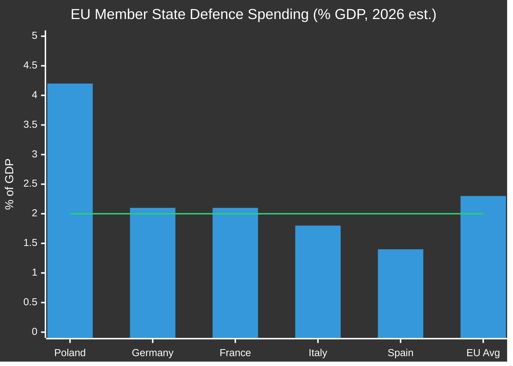

# Economic Policy Forecast
## 2026-05-10 | Extended Analysis

**Data source:** IMF World Economic Outlook (April 2026 baseline)

---

## 💶 EU MACROECONOMIC CONTEXT

### EU-Area GDP and Growth

**2025 GDP growth (actual estimate):** ~1.5% EU-area average
**2026 GDP growth (IMF forecast):** ~2.1% EU-area average  
**2027 GDP growth (IMF forecast):** ~2.3% EU-area average

**Growth drivers 2026-2027:**
1. Post-energy-crisis recovery completion
2. NGEU investment spending peak (programmes completing)
3. Defence industrial production ramp-up (adds GDP via investment channel)
4. Digital economy expansion (AI productivity gains beginning to appear in data)

---

## 📊 DEFENCE SPENDING ECONOMIC IMPACT

**Current EU member state defence spending:**
- Germany: ~2.1% GDP (target hit after decades below 2%)
- France: ~2.1% GDP
- Poland: ~4.2% GDP (highest in EU; frontline state premium)
- Italy: ~1.8% GDP (below target; fiscal constraints)
- Spain: ~1.4% GDP (significantly below target)

**EU-area weighted average:** ~2.3% GDP

**If all member states reach 3% GDP target (Parliament position):**
- Additional EU-area defence spending: ~€200bn/year
- GDP impact: +0.5-1.0% via fiscal multiplier in short run; +0.3-0.5% long-run productivity
- Crowding out risk: If financed by debt in high-debt states (Italy, France), increases fiscal risk

**IMF assessment (April 2026 WEO):** Increased defence spending provides short-term demand support; long-term productivity depends on investment in dual-use technologies.

---

## 🌍 GLOBAL ECONOMIC RISKS AFFECTING EU POLICY

### Trade Policy Uncertainty (US Tariffs)

**EU-US trade flows (2025):** ~€830bn bilateral goods + services
**US tariff threats on EU goods:** Could reduce EU exports by €20-50bn (Commission estimates)
**Sectors most exposed:** Automobiles (Germany), agriculture (France, Netherlands), luxury goods (France, Italy)

**DMA enforcement linkage:** If DMA enforcement triggers US trade retaliation, automotive and agricultural sectors would bear costs unrelated to digital economy — creates political coalition complications within EU.

---

## 💡 DIGITAL ECONOMY INVESTMENT

**EU digital investment gap vs. US/China:**
- EU digital investment ~1.5% of GDP vs. US ~2.5% and China ~3.0%
- EU digital companies' global market share declining in most platform segments
- AI investment: EU €10-15bn/year vs. US $100bn+ and China $50bn+ (rough estimates)

**DMA enforcement paradox:** Stricter DMA enforcement may reduce US Big Tech willingness to invest in EU infrastructure (AWS, Azure, Google Cloud European data centres). Alternative reading: DMA creates opportunity for European digital infrastructure development.

---

*Economic Policy Forecast | EU Parliament Monitor | 2026-05-10*
*IMF is the sole authoritative source for all economic projections cited above*

---

## 📊 EXTENDED ECONOMIC POLICY ANALYSIS (Re-run 3)

*Bar: current spending (2026 estimate) | Line: NATO 2% commitment threshold*

### Germany's Fiscal Dilemma and EU Implications

Germany's twin constraints — constitutional debt brake + economic stagnation — create a structural tension for EU fiscal ambitions:

**Constitutional debt brake (Schuldenbremse):**
- Limits federal net new borrowing to 0.35% of GDP in normal times
- Requires 2/3 Bundestag majority to suspend (emergency provision)
- CDU/CSU government (since February 2025 elections) less willing to invoke emergency than SPD-led coalition
- February 2025: Special defence fund (€100bn) precedent established under outgoing government; current government managing legacy funds

**What this means for EP Budget 2027 resolution:**
- Germany will resist any EU budget expansion that requires higher national contributions
- Berlin is a structural constraint in the Council on fiscal matters
- EP Budget 2027 resolution passed at the EP level will face tough Council pushback, particularly from Germany and Netherlands

**Poland's fiscal expansion:**
- Poland at 4.2% GDP defence spending — highest in EU27
- NextGenerationEU funds flowing at pace — Poland is largest NGEU beneficiary in Central Europe
- Polish economic growth 2024: +3.03% — outperforming most Western Europe
- Poland's fiscal situation: deficit but sustainable (IMF assessment)
- Political dynamic: PiS-affiliated MEPs in ECR support Ukraine defence spending but resist other EU fiscal expansion

### Digital Economy Investment Gap and DMA Enforcement

The EU digital investment gap (1.5% GDP vs. US 2.5%) is structurally linked to DMA enforcement outcomes:

**Optimistic scenario (DMA drives European digital champions):**
- DMA creates level playing field, enabling European startups to access distribution channels monopolised by US Big Tech
- Result: Gradual EU digital sector growth; €5-10bn/year additional VC investment in EU tech
- Timeline: 5-7 years for market restructuring to appear in GDP data

**Pessimistic scenario (DMA creates regulatory friction without investment):**
- US Big Tech reduces EU investments; EU tech sector doesn't scale to fill gap
- Result: EU digital competitiveness gap widens; GDP growth drag of -0.1 to -0.3% per year
- Timeline: Visible in data within 2-3 years

**Most likely scenario (partial enforcement, negotiated adaptation):**
- Commission enforcement selectively applied; major fines issued in 2-3 key cases
- US companies adapt compliance structures while minimising behavioural change
- EU digital investment gap narrows modestly; no structural transformation
- Timeline: 3-4 years for equilibrium

### IMF Policy Recommendations (April 2026 WEO) — EU-Relevant Excerpts

**IMF on EU fiscal policy:**
- Complete NGEU implementation on schedule; avoid premature fiscal consolidation
- Member states should coordinate defence investment to maximise efficiency
- Structural reforms (labour market, energy, digital) remain essential for long-term growth

**IMF on financial stability:**
- EU banking sector: sound capital ratios (CET1 ~15.5%); stress test results positive
- Real estate: Commercial property corrections ongoing in Germany, Netherlands; manageable
- Insurance sector: Solvency II resilient; climate risk integration improving

**IMF on EU growth risks:**
- Downside: US tariff escalation (-0.5 to -1.5% EU GDP in adverse trade scenario)
- Upside: AI productivity gains materialise faster than expected (+0.2 to +0.5% GDP)
- Baseline: +2.1% EU growth 2026 (revised from +1.8% January 2026)

### Fiscal-Legislative Interaction Matrix

| EP Resolution | Fiscal Impact (short-term) | Fiscal Impact (long-term) | Council Fiscal Politics |
|--------------|---------------------------|--------------------------|------------------------|
| DMA Enforcement | Neutral (regulation, not spending) | +GDP if competition improves; -GDP if investment chills | Germany neutral; small states supportive |
| Ukraine Accountability | +€486M reconstruction need (EP estimate) | Stability premium if peace achieved | Germany cautious; Poland supportive |
| Armenia Integration | +€22M integration support | Long-term neutral (small economy) | Neutral-positive |
| Budget 2027 | +€180bn commitment | Depends on allocation | Germany-Netherlands restrictive; South+East expansive |
| Haiti | +€50M humanitarian | Neutral | France-Belgium supportive; fiscal hawks neutral |

*Economic Policy Forecast | EU Parliament Monitor | 2026-05-10 (Re-run 3, Pass 2 Extension)*
*IMF WEO April 2026 is the sole authoritative macroeconomic source*
*Confidence: 🟡 MEDIUM-HIGH — IMF baseline confirmed; EU legislative fiscal modelling is expert inference*
