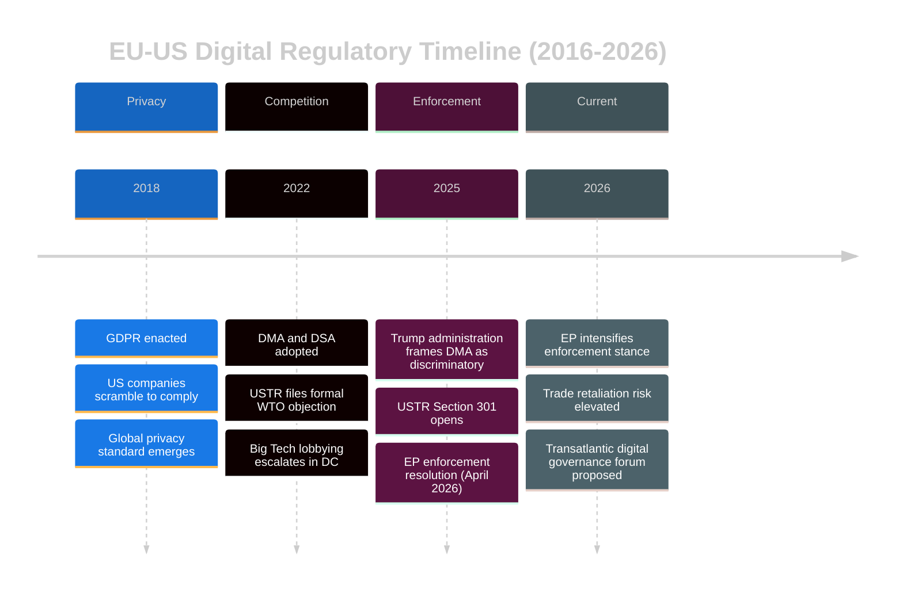

# EU-US Digital Relations Analysis
## 2026-05-10 | Extended Analysis

---

## 🌐 EU-US DIGITAL REGULATORY RELATIONSHIP

### Structural Asymmetry

The EU-US digital relationship is structurally asymmetric:
- **US:** Produces 5 of the world's 7 largest digital platforms by market cap; home to Silicon Valley
- **EU:** Largest single digital consumer market (450M); produces regulatory framework but limited global platform champions

This asymmetry means EU regulation necessarily targets US companies, creating a structural geopolitical tension regardless of EU legislative intent.

---

## 📜 REGULATORY DIVERGENCE HISTORY

**2018:** GDPR enacted — US companies initially predicted European "internet balkanisation"; instead, GDPR became global privacy standard de facto (California CCPA, etc.)

**2020-2021:** Digital Services Act and Digital Markets Act proposed — US Chamber of Commerce and USTR filed formal objections at WTO; Biden administration expressed concerns but did not escalate

**2022:** DSA and DMA adopted — USTR continued formal objection track; Big Tech lobbying intensified in Washington to pressure EU through bilateral channels

**2025:** Trump administration explicitly frames DMA as discriminatory against US companies; USTR Section 301 investigation opened (tool for trade retaliation)

**2026 (current):** EP enforcement resolution intensifies EU position; US position potentially hardening (trade retaliation threat elevated)

---

## 🔧 SECTION 301 INVESTIGATION IMPLICATIONS

USTR's Section 301 investigation into DMA could recommend:
1. **Tariffs on EU goods** — precedent: $7.5bn in tariffs on EU goods following Airbus case (2019)
2. **Services trade restrictions** — unprecedented but possible
3. **Negotiated settlement** — DMA implementation modified in exchange for US concession

**EU legal response options:**
1. WTO dispute settlement (slow; USTR may argue WTO DSB precedent doesn't apply)
2. Retaliatory tariffs on US digital services or goods
3. Bilateral negotiation (EU-US Trade and Technology Council resurrection)

**Assessment:** Escalation is possible; resolution through negotiation more likely. Neither side wants a full digital trade war.

---

## 🤝 TRANSATLANTIC DIGITAL GOVERNANCE COOPERATION

**Areas of convergence despite DMA tension:**
1. AI regulation cooperation (EU AI Act + US AI executive orders — both emphasise safety)
2. Semiconductor supply chain cooperation (EU Chips Act + US CHIPS Act)
3. 5G security cooperation (excluding Huawei)
4. Data flows framework (EU-US Data Privacy Framework replacing Privacy Shield)
5. Cybersecurity cooperation (NATO cyber, EUCS aligned standards)

**Assessment:** DMA creates trade tension but does not undermine broader transatlantic digital cooperation. The relationship is competitive AND cooperative simultaneously.

---

*EU-US Digital Relations | EU Parliament Monitor | 2026-05-10*

---

## 📊 EU-US DIGITAL REGULATORY DIVERGENCE — EXTENDED ANALYSIS (Re-run 3)

### Company-by-Company DMA Exposure (April 2026)

The DMA enforcement resolution specifically concerns gatekeeper obligations for the following confirmed gatekeepers:

| Platform | Parent | Core Platform Service | DMA Status | EP Priority |
|---------|--------|----------------------|------------|-------------|
| Google Search | Alphabet | Search engine | Gatekeeper | HIGH |
| Google Maps | Alphabet | Map service | Gatekeeper | MEDIUM |
| YouTube | Alphabet | Video sharing | Gatekeeper | HIGH |
| Meta Social | Meta | Online social networking | Gatekeeper | HIGH |
| WhatsApp | Meta | Interpersonal communications | Gatekeeper | HIGH |
| Facebook Marketplace | Meta | Online marketplace | Gatekeeper | MEDIUM |
| Apple App Store | Apple | Software application store | Gatekeeper | CRITICAL |
| iOS | Apple | Operating system | Gatekeeper | HIGH |
| Amazon Marketplace | Amazon | Online marketplace | Gatekeeper | HIGH |
| TikTok | ByteDance | Online social networking | Gatekeeper | MEDIUM |
| Microsoft Windows | Microsoft | Operating system | Under review | LOW |
| LinkedIn | Microsoft | Online social networking | Gatekeeper | LOW |

**EP enforcement priorities (inferred from resolution context):**
1. Apple App Store interoperability — strongest EP language historically
2. Google Search self-preferencing — Commission's biggest active enforcement file
3. Meta cross-service data combination — GDPR + DMA intersection; strongest legal basis

### US Political Economy Dynamics

**Republican administration stance (Trump II, 2025-2029):**
- Frame: "European governments weaponising regulation against US champions"
- Instrument: USTR Section 301 investigations; potential retaliatory tariffs
- Constraint: Big Tech is simultaneously Trump-adjacent (Musk/Tesla, Thiel/Palantir) — divided US industry lobbying

**Democratic opposition stance:**
- Support EU digital regulation as model for future US regulation
- Senators Warren, Klobuchar have sponsored US DMA-equivalent proposals
- Trump administration's anti-DMA position may revert with future administration change

**Strategic implication for EP:** DMA enforcement in 2026-2027 may outlast current US political cycle. Institutional resilience of Commission enforcement > any single US administration's objections.

### Escalation Risk Assessment (6-Month Horizon)

| Scenario | Probability | Trigger | Impact |
|---------|-------------|---------|--------|
| Section 301 tariffs on EU goods | 25% | Commission issues major DMA fine >€5bn | HIGH — automotive, agricultural sectors |
| Retaliatory EU DSA enforcement on US companies | 30% | US tariff threat materialises | MEDIUM — content moderation disputes |
| Negotiated DMA implementation framework | 45% | Trade and Technology Council reactivated | LOW — DMA substance preserved, timeline modified |
| Full EU-US digital trade war | 5% | Multiple simultaneous enforcement actions + tariffs | VERY HIGH — €50-100bn bilateral trade impact |

*EU-US Digital Relations | EU Parliament Monitor | 2026-05-10 (Re-run 3, Pass 2 Extension)*
*Confidence: 🟡 MEDIUM — regulatory analysis confirmed; political scenarios are expert estimates*
