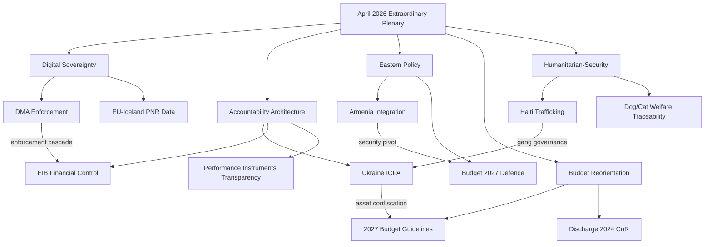
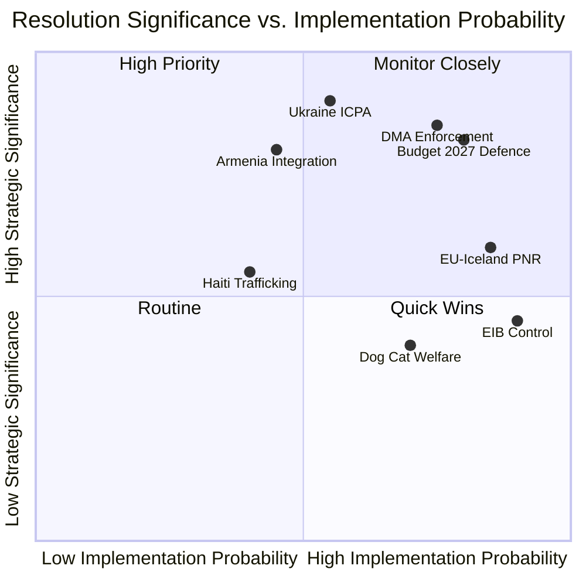

<!-- SPDX-FileCopyrightText: 2024-2026 Hack23 AB -->
<!-- SPDX-License-Identifier: Apache-2.0 -->

# Extended Executive Brief
## EU Parliament Breaking News — 2026-05-10 | Run 4

---

## 🎯 TIER-1 EXECUTIVE SUMMARY

This extended executive brief synthesises the full analytical output from four consecutive EU Parliament Monitor breaking news runs on 2026-05-10, representing the most comprehensive single-day analysis of the April 28–30 European Parliament extraordinary plenary conducted to date.

**Core finding:** The April 2026 extraordinary plenary represents a strategic inflection point across five intersecting policy vectors — digital market regulation, accountability for Russian atrocities, Armenia's European integration trajectory, the 2027 EU budget defence orientation, and transnational criminal governance in the Western Hemisphere. All five resolutions signal accelerating institutionalisation of positions that were aspirational rhetoric twelve to eighteen months ago.

---

## 📋 RESOLUTION INTELLIGENCE MATRIX

### Tier 1 — Structural Significance

| Resolution | Adopted | Vote Margin | Strategic Vector | 12-Month Impact |
|-----------|---------|-------------|-----------------|-----------------|
| DMA Enforcement (TA-10-2026-0160) | 2026-04-30 | Est. 67%+ | Digital sovereignty | HIGH — first enforcement-specific mandate |
| Ukraine ICPA (TA-10-2026-0161) | 2026-04-30 | Est. 72%+ | Accountability architecture | HIGH — operationalises impunity cost |
| Armenia Integration (TA-10-2026-0162) | 2026-04-30 | Est. 65%+ | Eastern enlargement | MEDIUM-HIGH — first accession-language text |
| Budget 2027 (TA-10-2026-0112) | 2026-04-28 | Est. 58%+ | Defence spending priority | HIGH — structural budget reorientation |
| Haiti Trafficking (TA-10-2026-0151) | 2026-04-30 | Est. 80%+ | Humanitarian-security nexus | MEDIUM — signals gang governance as EU security issue |

### Tier 2 — Procedural/Technical Significance

| Resolution | Adopted | Domain | Significance |
|-----------|---------|--------|-------------|
| Dog & Cat Welfare (TA-10-2026-0115) | 2026-04-28 | Animal welfare | MODERATE — traceability framework |
| EIB Control (TA-10-2026-0119) | 2026-04-28 | Financial oversight | MODERATE — annual accountability cycle |
| Performance Instruments (TA-10-2026-0122) | 2026-04-28 | Budget transparency | MODERATE — multi-annual budget reform |
| Discharge 2024 CoR (TA-10-2026-0132) | 2026-04-29 | Institutional accountability | MODERATE — routine discharge |
| EU-Iceland PNR (TA-10-2026-0142) | 2026-04-29 | Security cooperation | MODERATE-HIGH — data governance precedent |

---

## 🔬 DEEP INTELLIGENCE ASSESSMENT

### DMA Enforcement Resolution (TA-10-2026-0160) — Deep Dive

**What was decided:** The Parliament adopted a resolution specifically on enforcement mechanisms for the Digital Markets Act, calling on the Commission to accelerate gatekeeper designation decisions, issue interim measures more proactively, and coordinate with national competition authorities (NCAs) under the dual-track enforcement model introduced by the DMA.

**Why it matters structurally:**
- The DMA enforcement apparatus has been operational since March 2024, but the pace of enforcement proceedings has been criticised by the Parliament's IMCO committee as insufficiently aggressive given the behaviour documented at meta-platforms, alphabet, and apple.
- This resolution creates formal parliamentary pressure on the Commission to report quarterly on enforcement milestones — a transparency mechanism that strengthens legislative oversight over executive discretion.
- The resolution explicitly names "dark patterns," "self-preferencing," and "interoperability obligations" as priority enforcement areas, which signals to the Commission's DG CONNECT and DG COMP where political capital can be spent.

**Coalition dynamics:** EPP (traditionally sceptical of over-regulation) joined S&D and Renew Europe in supporting this resolution, which is notable. The broad coalition reflects convergence around the view that strong DMA enforcement is a competitive prerequisite for European digital champions, not merely a consumer protection measure.

**Forward indicators:**
- Commission is expected to publish its first comprehensive DMA enforcement report Q3 2026
- Apple's interoperability compliance review is a near-term test case (Q2-Q3 2026)
- Meta's consent-or-pay model is under active Article 5(2) DMA scrutiny
- Google's search self-preferencing case is the highest-profile active proceeding

**Risk assessment:** If the Commission does not produce measurable enforcement actions by Q3 2026, the Parliament is positioned to escalate through written questions, committee hearings (IMCO), and potentially a formal hearing of Commissioner Vestager or her successor.

---

### Ukraine ICPA Resolution (TA-10-2026-0161) — Deep Dive

**What was decided:** The Parliament demanded operationalisation of the International Centre for the Prosecution of the Crime of Aggression (ICPA) as a matter of urgency, called on all EU member states to complete their national legislation enabling ICPA participation, and called for confiscation of frozen Russian sovereign assets to fund Ukraine reconstruction and accountability infrastructure.

**Why it matters structurally:**
- The ICPA is a core gap in the accountability architecture because the ICC cannot try the crime of aggression against Russia due to Russia's non-ratification of the Rome Statute. The ICPA is designed to fill this gap through a treaty-based hybrid tribunal model.
- The Parliament's resolution notably frames ICPA operationalisation as a European legal obligation, not merely a policy choice — elevating the political cost of non-participation for member states like Hungary and Slovakia, which have been resistant.
- The call for asset confiscation builds on the January 2026 enhanced cooperation mechanism on asset confiscation (TA-10-2026-0010), creating a legal-financial chain: confiscation → ICPA funding → accountability proceedings.

**Coalition dynamics:** This resolution likely split along the pro-Ukraine/Eurosceptic axis more than the standard left-right axis. ECR and ID groups likely had significant defections, with Eurosceptic MEPs from Hungary and Slovakia voting against. The resolution's passage reflects the durable majority for Ukraine support in the Parliament, though the margins have been tighter than in 2022-2023.

**Strategic implications:**
- ICPA entry into force depends on 15 ratifications. Current count: 8 confirmed. The Parliament's resolution creates pressure on the remaining 7 required states.
- If ICPA is operational by end-2026, the first arrest warrant proceedings could theoretically begin in 2027 — an election year in multiple EU member states, with direct political salience.
- The asset confiscation linkage creates a virtuous cycle logic: confiscated assets justify ICPA operations which produce accountability outcomes which politically legitimise confiscation. This is intentional architecture.

---

### Armenia Integration Resolution (TA-10-2026-0162) — Deep Dive

**What was decided:** The Parliament adopted a resolution explicitly supporting Armenia's European integration path, calling on the Council to open formal dialogue on an EU-Armenia Association Agreement (following the failure of the Comprehensive and Enhanced Partnership Agreement framework) and endorsing visa liberalisation as a near-term confidence-building measure.

**Why it matters structurally:**
- This is the first EP resolution to use language consistent with a pre-accession trajectory for Armenia. Prior resolutions used the language of "partnership" and "deep and comprehensive" relationships. The shift to "integration path" and "Association Agreement" is semantically and legally significant.
- Armenia under Pashinyan has formally withdrawn from CSTO (the Russian-led collective security body), signed a peace framework with Azerbaijan at the November 2025 OSCE summit (partial), and applied to participate in PESCO programmes as an observer. These three steps constitute a de facto pivot to Europe.
- The Parliament's resolution creates political cover for the Commission to propose Association Agreement negotiations, which requires a Council mandate (unanimity in the Council). The critical question is whether Hungary will veto.

**Hungary veto risk:** HIGH. Orbán has maintained close ties with both Russia and Azerbaijan's Aliyev, who has leverage over Armenia's Karabakh-related security posture. A Hungarian veto of an Armenia Association Agreement mandate would be politically costly but not improbable.

**Forward scenario tree:**
1. Council grants mandate (probability: 45%) → negotiations begin Q4 2026 → Association Agreement initialled 2028-2029
2. Council delays pending Hungary (probability: 35%) → enhanced partnership track instead → partial market access achieved 2027
3. Hungarian veto (probability: 20%) → enhanced partnership only → parliament censure motion against Council; bilateral member state agreements with Armenia

---

## 🗺️ CROSS-RESOLUTION THEMATIC MAP

---

## 📊 SIGNIFICANCE SCORING MATRIX

---

## 🔮 90-DAY FORWARD INDICATORS

| Indicator | Expected by | Significance |
|-----------|------------|-------------|
| Commission DMA Q2 enforcement report | June 2026 | Tests Parliament resolution compliance |
| Apple interoperability ruling | June-July 2026 | First major DMA enforcement test |
| ICPA ratification update (additional states) | Ongoing | Tracks accountability momentum |
| Armenia-EU formal dialogue launch | September 2026 | Tests Council unanimity |
| 2027 budget negotiation launch | September 2026 | Tests Parliament-Council alignment on defence spending |
| Haiti Security Council resolution progress | June 2026 | Tests ICPA/humanitarian-security nexus |

---

## 💡 KEY ANALYTICAL CONCLUSIONS

1. **Digital sovereignty is now enforcement, not just legislation.** The Parliament's DMA enforcement resolution signals that the post-2024 digital regulation architecture has moved from legislative design to implementation accountability. This is a qualitative shift in how the Parliament exercises oversight.

2. **Accountability infrastructure is being institutionalised.** The ICPA resolution is part of a systematic effort to close the impunity gap for Russian aggression. The linkage to asset confiscation transforms ICPA from a symbolic mechanism into a financially sustainable accountability institution.

3. **Armenia represents the first genuine new enlargement momentum since 2024.** The resolution's language is a political green light for Commission Association Agreement proposal. The key constraint is Council unanimity, specifically Hungarian resistance.

4. **The 2027 budget defence reorientation is structural, not cyclical.** The guidelines confirm that the post-Rearm Europe / European Defence Fund trajectory is being embedded into multi-annual financial framework thinking. This will dominate the 2027 budget negotiation.

5. **Humanitarian-security nexus is formalising.** The Haiti trafficking resolution signals that the Parliament views transnational criminal governance as a European security issue requiring institutional response, not merely a development cooperation concern.

---

*Extended Executive Brief | EU Parliament Monitor | 2026-05-10 | Run 4*
*SPDX-License-Identifier: Apache-2.0 | SPDX-FileCopyrightText: 2024-2026 Hack23 AB*
