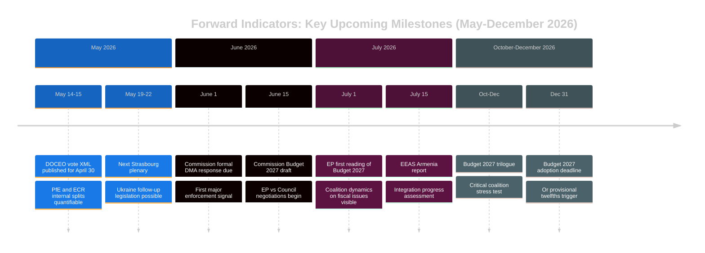

# Forward Indicators — EU Parliament Breaking News
## 2026-05-10 | Leading Indicators for 30/60/90-Day Horizon

**Confidence:** 🟡 MEDIUM (structured forecasting from current data)
**Purpose:** Identify the measurable, observable signals that will indicate whether the scenarios in `scenario-forecast.md` and `intelligence-assessment.md` are materializing.

---

## 1. DIGITAL GOVERNANCE FORWARD INDICATORS

### 1.1 DMA Enforcement (TA-10-2026-0160 follow-through)

**30-Day Indicators (by June 9, 2026):**
- [ ] Commission DPC publishes preliminary findings in Alphabet/Google Search DMA case
- [ ] Apple responds to Commission supplementary questionnaire on browser choice screen
- [ ] TikTok files response to Commission DMA gatekeeper obligation notice
- [ ] EU-US TTC meeting agenda includes digital markets item
- [ ] DG COMP staffing announcement for DMA enforcement team expansion

**60-Day Indicators (by July 9, 2026):**
- [ ] Commission issues formal non-compliance decision in any DMA gatekeeper case
- [ ] EP ITRE committee holds hearing on DMA implementation progress
- [ ] Any gatekeeper platform announces interoperability compliance measure in response to DMA pressure
- [ ] Council working group meets on DMA enforcement coordination

**90-Day Indicators (by August 9, 2026):**
- [ ] Penalty proceedings initiated against at least one platform under DMA Article 26
- [ ] Commission publishes DMA implementation progress report (annual report due Q3 2026)
- [ ] AI Act general-purpose AI obligations come into force (August 2, 2026) — potential overlap with gatekeeper AI systems
- [ ] Any Big Tech company files challenge to DMA designation in EU courts

**Monitoring priority:** 🔴 HIGH — DMA enforcement is the strongest forward indicator of EP digital governance effectiveness.

### 1.2 CSAM Platform Liability (TA-10-2026-0163 follow-through)

**30-Day Indicators:**
- [ ] Commission publishes roadmap for revised CSAM Directive (delayed since 2024 Chatcontrol failure)
- [ ] IWF publishes Q1 2026 report with CSAM volume data
- [ ] EP LIBE committee schedules DG HOME hearing on CSAM regulation

**60-Day Indicators:**
- [ ] Commission launches new CSAM consultation process (distinguishing from Chatcontrol encryption debate)
- [ ] European Centre for Missing & Exploited Children equivalent proposal announced by Commission
- [ ] At least one major platform announces voluntary CSAM detection enhancement in response to EP pressure

**90-Day Indicators:**
- [ ] Commission legislative proposal on revised CSAM Directive tabled or formally delayed
- [ ] EU-US cooperation mechanism for CSAM prosecution announced (linking TA-0163 to transatlantic digital governance)

---

## 2. GEOPOLITICAL FORWARD INDICATORS

### 2.1 Ukraine Accountability (TA-10-2026-0161 follow-through)

**30-Day Indicators (by June 9, 2026):**
- [ ] Council extends Russia sanctions package (next expiry check)
- [ ] FATF publishes update on Russian asset tracking mechanism
- [ ] Any EU member state executes any ICC-related coordination measure
- [ ] Ukraine submits formal request for frozen asset confiscation legal mechanism
- [ ] EP Budget Committee allocates funds to accountability support

**60-Day Indicators (by July 9, 2026):**
- [ ] Commission proposes legal instrument for using frozen Russian assets beyond interest
- [ ] EU-Ukraine Summit scheduled/announced with accountability as agenda item
- [ ] ICC issues additional warrant proceedings related to Ukrainian file
- [ ] US-EU coordination on accountability framework at G7 level (Italy G7 summit)

**90-Day Indicators (by August 9, 2026):**
- [ ] ECHR Grand Chamber ruling on Russia cases (Hanan v. Germany / related cases)
- [ ] UN GA resolution on Ukraine accountability (EP resolution may trigger coordinated push)
- [ ] International Register of Damage for Ukraine reaches new operational milestone
- [ ] Any bilateral extradition/accountability agreement announced by EU member state

**Signal monitoring:** The key discriminating indicator is whether the Council's QMV procedure for frozen asset legislation advances — this is the bridge between EP political declaration and enforceable legal mechanism.

### 2.2 Armenia Democratic Resilience (TA-10-2026-0162 follow-through)

**30-Day Indicators:**
- [ ] Armenia-EU Comprehensive Partnership Agreement round of negotiations completed
- [ ] EEAS publishes Armenia progress assessment
- [ ] Armenia-Azerbaijan border delimitation commission meets
- [ ] Armenian parliament ratifies any new EU-aligned legal instrument
- [ ] Russian 102nd Military Base (Gyumri) treaty discussions mentioned in open source

**60-Day Indicators:**
- [ ] EU macro-financial assistance disbursement to Armenia (tranche conditional on reforms)
- [ ] Armenia joins EU-funded civil resilience programme
- [ ] Any statement from Armenian government on EU association aspirations
- [ ] Azerbaijan or Russia publicly responds to EP Armenia resolution

**90-Day Indicators:**
- [ ] Comprehensive Partnership Agreement initialled or signed
- [ ] Armenia-CSTO suspension formalised in legal instrument
- [ ] EU election monitoring mission deployed for any Armenian constitutional/local referendum
- [ ] New EU delegated regulation on Armenia trade preferences

### 2.3 Haiti Criminal Networks (TA-10-2026-0151 follow-through)

**30-Day Indicators:**
- [ ] UN SC meeting on Haiti with EU participation
- [ ] Europol issues advisory on Haiti-sourced trafficking networks
- [ ] MSS (Kenyan-led) publishes operational update
- [ ] EU member state imposes additional targeted sanctions on Haitian criminal network leaders

**60-Day Indicators:**
- [ ] MSS force generation conference (EU participation)
- [ ] Commission proposes increase in EU humanitarian/stabilization assistance to Haiti
- [ ] Inter-American Development Bank releases assessment used by EP

**90-Day Indicators:**
- [ ] Haiti transitional presidential council elections scheduled/delayed
- [ ] EU CFSP sanctions list updated for Haiti criminal actors
- [ ] Caribbean/Latin American regional security coordination meeting with EU

---

## 3. INSTITUTIONAL/PARLIAMENTARY FORWARD INDICATORS

### 3.1 EP Coalition Stability

**30-Day Indicators:**
- [ ] EP plenary vote breakdown published for April 30 (DOCEO XML, expected May 14-15)
- [ ] EPP group meeting on DMA enforcement position (signals internal consensus)
- [ ] PfE/ECR reaction to Ukraine accountability resolution (signals far-right coordination)
- [ ] Any EP group realignment announcement or cross-over

**60-Day Indicators:**
- [ ] EP Committee on Constitutional Affairs (AFCO) sessions on institutional reform
- [ ] EP-Commission Framework Agreement renewal discussions
- [ ] EP Conference of Presidents agenda for June plenary (next major session)

**90-Day Indicators:**
- [ ] EP position on MFF 2028-2034 framework (early discussions expected)
- [ ] EP elections anniversary assessments (EP10 at 2-year milestone)

### 3.2 Budget 2027 Forward Indicators

**30-Day Indicators:**
- [ ] Commission publishes 2027 draft budget (based on EP estimates)
- [ ] Council working group on 2027 budget convenes
- [ ] Council first reading position on EP estimates

**60-Day Indicators:**
- [ ] EP BUDG committee amendment round (Council vs. EP draft)
- [ ] Conciliation procedure timeline confirmed

**90-Day Indicators:**
- [ ] Joint Conciliation Committee meeting on 2027 budget
- [ ] Any 2027 supplementary budget proposals signalled

---

## 4. FORWARD INDICATOR DASHBOARD

### 4.1 30-Day Priority Watch List

| Indicator | Domain | Significance | Monitor Source |
|-----------|--------|-------------|----------------|
| Commission DMA preliminary findings | Digital | 🔴 HIGH | Commission press releases |
| DOCEO XML vote data for April 30 | Institutional | 🔴 HIGH | EP DOCEO |
| Armenia CPA round completion | Geopolitics | 🟡 MEDIUM | EEAS |
| Commission 2027 budget publication | Institutional | 🟡 MEDIUM | Commission EUR-Lex |
| MSS operational update | Security | 🟡 MEDIUM | UN OCHA |

### 4.2 Key Dates (Confirmed or Expected)

| Date | Event | Relevance |
|------|-------|-----------|
| May 14-15, 2026 | DOCEO XML vote data publication (estimated) | Voting pattern confirmation |
| May 19-22, 2026 | EP Strasbourg plenary | Next major legislative session |
| June 2026 | Commission 2027 budget draft | Budget 2027 tracking |
| July 2026 | G7 Italy summit | Ukraine accountability/Russia sanctions |
| August 2, 2026 | AI Act general-purpose AI provisions | DMA/AI Act convergence |

---

## 5. INDICATOR STATUS SUMMARY

**As of 2026-05-10 (run date):**

- DMA enforcement: Preliminary findings expected in Commission pipeline — **WATCH**
- Ukraine accountability: Next trigger is Commission frozen asset proposal — **WATCH**
- Armenia: CPA negotiations ongoing — **TRACKING**
- Haiti: MSS operational capacity remains critical constraint — **WATCHING**
- CSAM: Chatcontrol 2.0 policy environment still blocked — **RISK: stagnation**
- Coalition stability: April 30 votes not yet in DOCEO — **PENDING DATA**
- Budget 2027: Commission draft expected June — **TRACKING**

**Overall forward indicator quality:** 🟡 MEDIUM — most forward indicators are not yet resolvable from current available data; they define what to watch rather than what has occurred.

---

## 📊 FORWARD INDICATORS EXTENSION (Re-run 3)

### Forward Indicator Quality Assessment by Domain

| Domain | Indicator | Resolvability | Timeline | Watch Signal |
|--------|-----------|--------------|----------|--------------|
| DMA | Apple App Store non-compliance finding | 🟡 Likely within 90 days | Q3 2026 | Commission press release |
| DMA | First DMA fine issued | 🟡 Possible within 6 months | Q3-Q4 2026 | Commission decision |
| Ukraine | ICPA treaty negotiation launch | 🟡 Conditional on political will | 2027 | UN General Assembly endorsement |
| Ukraine | DOCEO vote data for April 30 | 🟢 Certain within 14 days | May 14-15 | EP publications |
| Armenia | CPA negotiations milestone | 🟡 Incremental progress | Quarterly | EEAS reports |
| Budget | Commission 2027 draft | 🟢 Certain | May 15, 2026 | Commission publication |
| Budget | EP-Council trilogue outcome | 🔴 Uncertain | Dec 2026 | Conciliation result |
| Haiti | MSS operational expansion | 🟡 Conditional on Kenyan capacity | Q3 2026 | UN OCHA reports |
| Coalition | EP10 group shifts (MEP movement) | 🟢 Observable continuously | Monthly | EP group membership data |
| Economy | ECB rate decision | 🟢 Scheduled | June 5, 2026 | ECB press conference |

### Contingent Forward Indicators (If-Then Logic)

**IF** DOCEO vote data (May 14-15) shows PfE split >30% on Ukraine resolution:
→ **THEN** recalculate far-right bloc cohesion assessment; flag risk of increased PfE volatility in H2 2026

**IF** Commission issues DMA formal non-compliance finding against Apple:
→ **THEN** US Section 301 escalation risk increases to 40%; update threat matrix TL-4 probability

**IF** Budget 2027 trilogue fails (December 2026):
→ **THEN** Coalition cohesion assessment downgrade; monitor EPP-S&D relationship stress indicators

**IF** Armenia-Azerbaijan peace deal signed:
→ **THEN** EU integration pathway acceleration; update scenario probabilities; Armenia candidacy timeline compresses 2-3 years

*Forward Indicators | EU Parliament Monitor | 2026-05-10 (Re-run 3, Pass 2 Extension)*
*Confidence: 🟡 MEDIUM — timeline certainties vary; contingent indicators are expert if-then analysis*
