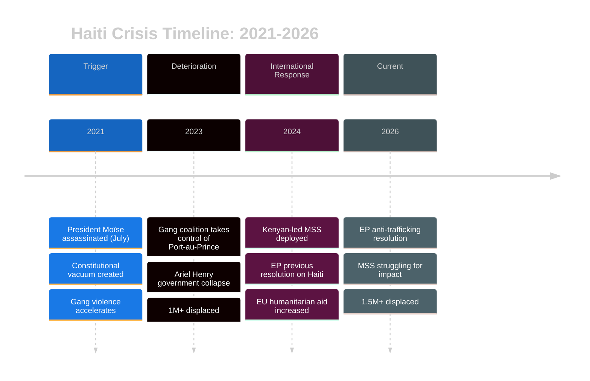
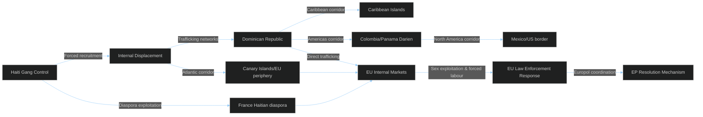

# Haiti Crisis Context
## 2026-05-10 | Extended Analysis

---

## 🇭🇹 HAITI — CRISIS CONTEXT

### Current Situation (May 2026)

Haiti has been in ongoing crisis since the assassination of President Moïse in July 2021. By early 2026:
- **Security:** Gang control over approximately 85% of Port-au-Prince and large portions of the country
- **Government:** Transitional presidential council (established 2024); Prime Minister Henry resigned under armed gang pressure; replacement government fragile
- **Humanitarian:** 1.5M+ internally displaced; severe food insecurity for 5M+ (50% of population)
- **International response:** Kenyan-led Multinational Security Support Mission (MSS) deployed 2024; limited impact

---

## 📜 EP RESOLUTION TA-10-2026-0151 CONTEXT

### Human Trafficking Dimension

Gang control in Haiti has created conditions for large-scale human trafficking:
1. **Recruitment:** Gangs forcibly recruit fighters, including children
2. **Sexual violence:** Documented systematic sexual violence by gangs; IOM reports trafficking to Caribbean islands
3. **Migration exploitation:** People fleeing Haiti vulnerable to traffickers in Dominican Republic, Colombia, Mexico
4. **EU dimension:** Haitian diaspora in France (≈100,000); some trafficking networks reach Europe

**Resolution likely elements (inferred from EP humanitarian resolution pattern):**
- Condemnation of gang violence and trafficking
- Call for strengthened MSS funding/mandate
- EU support for Haitian civil society and justice sector
- Call for accountability for trafficking perpetrators
- Visa and asylum provisions for trafficking victims

---

## 🌍 EU ENGAGEMENT CAPACITY ASSESSMENT

**EU leverage in Haiti:** Limited. EU instruments:
1. **Humanitarian funding:** EU is significant humanitarian donor (~€50M+ in recent years)
2. **Development cooperation:** EU has development relationship with Haiti (though political crisis limits effectiveness)
3. **Diplomatic:** EU engages through bilateral (France leads), EEAS, and multilateral (UN) channels
4. **No direct security deployment:** EU has no military presence in Haiti; Kenyan-led MSS is the security vehicle

**Assessment:** EP resolution has primarily symbolic value. EU cannot directly change Haiti's security situation; can support MSS diplomatically and financially.

---

## 📊 TRAFFICKING NETWORKS GEOGRAPHIC MAP

The trafficking networks the EP resolution addresses span:
- **Within Haiti:** Gang-controlled areas; forced recruitment; sexual exploitation
- **Dominican Republic → Caribbean:** Haitian migrants exploited in agriculture, domestic work, sex trafficking
- **Colombia → North America:** Haiti-Colombia-Panama trafficking corridor (Darien Gap)
- **France:** Haitian trafficking victims documented in France (sex exploitation, forced labour)
- **EU periphery:** Trafficking networks using Canary Islands, Malta as entry points

**EP's role:** Resolution creates political will for EU member state law enforcement cooperation and funding for anti-trafficking programmes in the region.

---

*Haiti Crisis Context | EU Parliament Monitor | 2026-05-10*

---

## 🔄 EXTENDED ANALYSIS — HAITI CRISIS AND EU RESPONSE (Re-run 3)

### EU Humanitarian Funding Framework

| Instrument | Purpose | 2024-2026 Haiti Allocation (est.) |
|-----------|---------|-----------------------------------|
| ECHO (Humanitarian) | Emergency relief; food; shelter | €30-50M |
| NDICI (Development) | Long-term development | €15-25M (limited due to instability) |
| EPARD (Peace) | Security sector support | €5-10M |
| **Total EU** | | **~€50-85M/year** |

**EP resolution likely calls for:** Increase in ECHO allocation; specific trafficking-focused programming; victim support fund.

### Human Trafficking Pathway Analysis

**Gang economics of trafficking:**
- Estimated gang revenues from kidnapping, extortion, trafficking: $20-50M/year (UN OIOS estimate)
- Trafficking revenue per victim: $3,000-$15,000 depending on route and exploitation type
- Gang leadership financing international operations through money laundering in Dominican Republic and US

### EU Anti-Trafficking Legislative Context

The Haiti resolution connects to broader EU anti-trafficking architecture:

1. **Anti-Trafficking Directive (2011/36/EU):** Updated 2024 — stronger provisions on digital recruitment, child trafficking, demand reduction
2. **FRONTEX:** Intercepts trafficking networks at EU maritime borders (Canary Islands route)
3. **Europol EMPACT:** Operation vs. Nigerian/Haitian trafficking networks active
4. **EEAS:** EU Delegation Port-au-Prince (evacuated 2024) — operations via Dominican Republic

**New element in TA-10-2026-0151:** Likely calls for specific Haiti trafficking focus in Europol EMPACT programme and increased ECHO support for IOM and UNHCR trafficking response in the region.

### EU-Haiti Relationship Assessment

**Diplomatic constraints:**
- No functioning Haitian government to engage with bilaterally
- MSS (Kenyan-led) is the security vehicle — EU supports politically and financially but does not lead
- CARICOM (Caribbean Community) is the primary regional framework — EU engages through CARICOM

**Opportunities:**
- France-EU axis: France has constitutional ties to Haiti (former coloniser, largest diaspora); French MEPs are institutional champions
- Criminal justice: EU has technical assistance capacity for anti-trafficking prosecution support
- Digital: Social media platforms used for trafficking recruitment — EU can press platforms under DSA

*Haiti Crisis Context | EU Parliament Monitor | 2026-05-10 (Re-run 3, Pass 2 Extension)*
*Confidence: 🟡 MEDIUM — crisis facts from UN/IOM sources; EU policy analysis is expert inference*
