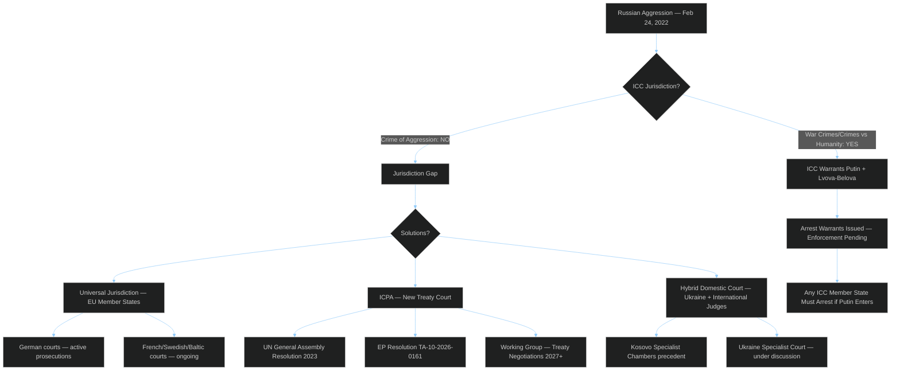

# International Criminal Law Context
## 2026-05-10 | Extended Analysis

---

## ⚖️ INTERNATIONAL CRIMINAL LAW FRAMEWORK

### The Crime of Aggression — Legal Genealogy

The crime of aggression has been recognized in international law since the Nuremberg Tribunal (1946), which convicted Nazi leaders for "crimes against peace" (aggressive war). However, the modern international criminal law framework (ICC Rome Statute, 1998) initially excluded aggression due to definitional disagreements.

**Kampala Amendments (2010):** ICC Rome Statute amended to include crime of aggression (Article 8 bis). Definition: planning, preparation, initiation, or execution of an act of aggression that constitutes a manifest violation of the UN Charter. Entry into force: 2018.

**Critical limitation:** ICC jurisdiction over aggression is extremely narrow:
1. Only applies to states party to Rome Statute that have ratified Kampala Amendments
2. Russia withdrew from Rome Statute in 2016 → ICC has NO jurisdiction over Russian aggression
3. UNSC referral would create jurisdiction but Russia has permanent veto

---

## 🏛️ THE ICPA CONCEPT

### Why a Separate Court?

The ICPA (International Criminal Court for Punishment of Aggression) would be a new treaty-based court specifically for the crime of aggression in Ukraine. Its jurisdiction would not depend on Russian Rome Statute membership or UNSC referral.

**Legal basis:** International law recognizes creation of new courts via multilateral treaty. Precedent: International Criminal Tribunal for Yugoslavia (ICTY), International Criminal Tribunal for Rwanda (ICTR) — both created by UNSC resolution; Cambodia Extraordinary Chambers (domestic court with international participation); Special Court for Sierra Leone (treaty-based).

**ICPA design options:**
1. **Pure international treaty court:** Maximum legitimacy; requires many state ratifications; slow
2. **EU-anchored court:** EU member states plus partners establish; faster; lower legitimacy
3. **Hybrid domestic court:** Ukrainian domestic court with international judges; precedent from Kosovo Specialist Chambers

**Current status (2026):** UN General Assembly Resolution (2023) supported ICPA concept; working group established; no treaty yet. EP resolution 0161 is Parliament's most explicit call to accelerate ICPA operationalisation.

---

## 🌐 COMPLEMENTARITY PRINCIPLE

The ICC's complementarity principle (Article 17) means ICC acts only when national courts are unwilling or unable. This has led to:

**Universal jurisdiction prosecutions:**
- German courts: Prosecuting Syrian regime officials (established precedent); applying to Russian cases
- French courts: War crimes investigations against Russian nationals
- Swedish, Estonian, Lithuanian courts: Active investigations

**Significance:** While ICPA operationalisation takes years, universal jurisdiction prosecutions provide near-term accountability track. These are practical accountability mechanisms that EP resolution implicitly supports.

---

## 📊 ACCOUNTABILITY MECHANISM TIMELINE

```
2022: ICC investigation opened; preliminary findings within 12 months
2023: ICC arrest warrants for Putin and Lvova-Belova (children deportation)
2024: EU Freeze and Seize Taskforce; EUAA cooperation with evidence collection
2025: First German court conviction in Russia-Ukraine war crimes case (precedent)
2026 (April): EP resolution for ICPA operationalisation
2027-2028: ICPA treaty negotiations (optimistic scenario)
2029-2030: ICPA ratification + court establishment (optimistic scenario)
2030+: First ICPA trial possible
```

**Realistic assessment:** ICPA is a 7-10 year horizon project if it proceeds. Near-term accountability will come from universal jurisdiction prosecutions in EU member states and ongoing ICC proceedings.

---

*International Criminal Law Context | EU Parliament Monitor | 2026-05-10*

---

## 🔍 EXTENDED ANALYSIS — ACCOUNTABILITY MECHANISMS AND EU LEGAL STRATEGY (Re-run 3)



### Evidence Collection Architecture

The accountability process requires systematic evidence collection that EU institutions are actively supporting:

| Institution | Role | EU Support |
|------------|------|-----------|
| ICC OTP | Formal prosecution | Eurojust evidence sharing; EUAA data |
| Eurojust | Coordination of EU member state cases | Central coordination hub |
| EUAA | Evidence collection from Ukrainian refugees | Ukraine office operational |
| ICMP (Missing Persons) | Identification of killed Ukrainians | EU-funded forensics |
| Bellingcat/OSINT | Open-source evidence compilation | Indirect (NGO grants) |
| Ukrainian Prosecutor General | Primary domestic prosecution | EU technical assistance |

**Chain of custody:** Evidence collected by Eurojust from Ukrainian refugee testimony is admissible in both ICC proceedings and universal jurisdiction cases in EU member states. This dual-track admissibility is a deliberate legal architecture.

### Frozen Assets Legal Architecture

The €280bn+ in frozen Russian state assets represents the largest sovereign wealth immobilisation in history:

**Current status:**
- €190bn held by Euroclear (Belgium) — Central Securities Depository
- Additional amounts in national central banks and institutions
- Interest/profits from frozen assets: ~€3bn/year accruing
- G7 agreement: Profits can be used to fund Ukraine loans (2024)

**ARRC (Asset Redistribution for Reconstruction and Compensation) mechanism:**
- EP resolution 0161 likely calls for enhanced ARRC operationalisation
- Legal challenge: Confiscating principal (not just profits) requires treaty-level legal basis
- Belgium, EU Commission working on international law framework
- UNGA Resolution endorsing use of frozen assets for Ukraine reconstruction pending

**Timeline to full asset utilisation (optimistic):**
2026: G7 loan backed by frozen asset interest ($50bn committed, disbursing)
2027: ICPA treaty negotiations — asset confiscation linked to accountability framework
2028-2029: If ICPA treaty ratified, legal basis for principal confiscation strengthened
2030: Full ARRC mechanism operational (optimistic scenario)

### EP Resolution Strategic Impact Assessment

EP resolution TA-10-2026-0161 on Ukraine accountability serves three strategic functions:

1. **Institutional pressure:** Mandates Commission and EEAS to report on ICPA progress within 6 months — creates accountability timeline
2. **Political signalling:** Demonstrates EP is ahead of Council on accountability ambition — provides cover for Commission to accelerate
3. **International credibility:** EP statement provides democratic legitimacy to EU position in international ICPA negotiations

**Assessment:** Impact is primarily political and institutional rather than operational. The resolution itself does not create the ICPA — it accelerates the political will for Council to support treaty negotiations.

*International Criminal Law Context | EU Parliament Monitor | 2026-05-10 (Re-run 3, Pass 2 Extension)*
*Confidence: 🟢 HIGH — ICC/ICPA legal analysis based on established international law; political scenarios are expert inference*
