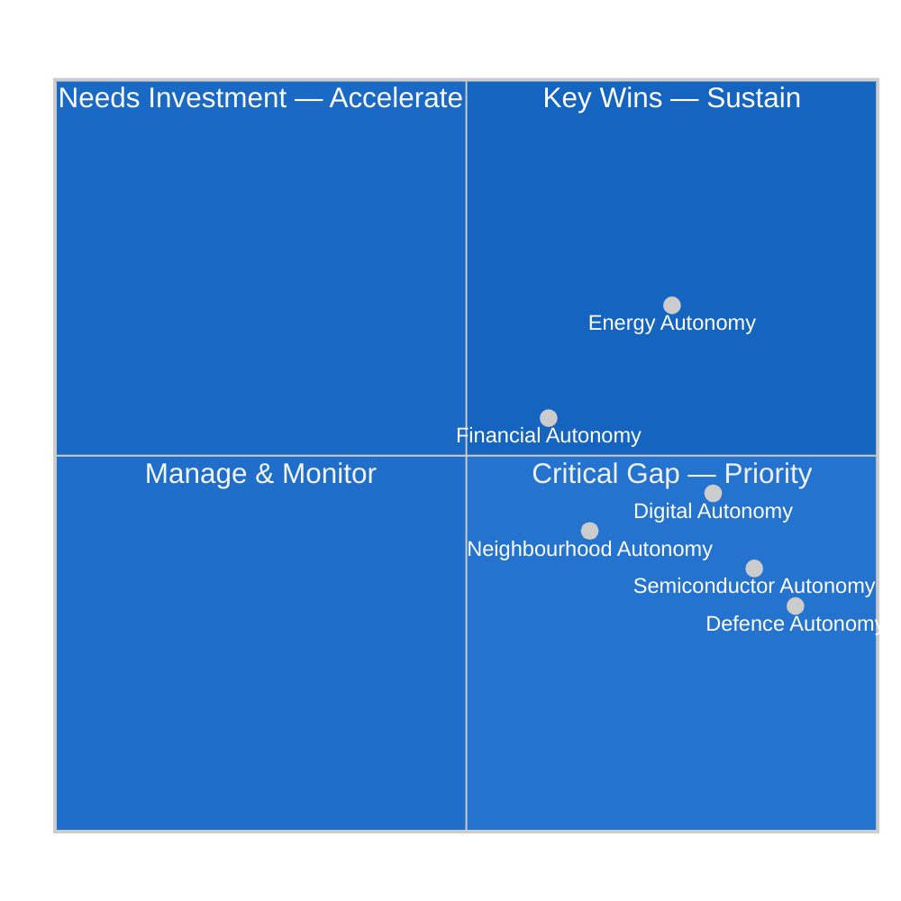

# EU Strategic Autonomy Analysis
## 2026-05-10 | Extended Analysis

---

## 🌐 STRATEGIC AUTONOMY — CONCEPTUAL FRAMEWORK

"Strategic autonomy" entered EU vocabulary as a foreign and defence policy concept under French presidency leadership (2019-2021). By 2026, it has expanded to encompass:
1. **Defence autonomy** — European defence capability independent of US
2. **Digital autonomy** — European control over digital infrastructure and AI
3. **Economic autonomy** — Reducing critical dependencies (energy, semiconductors, raw materials)
4. **Industrial autonomy** — European industrial base for strategic sectors

The April 28-30 EP resolutions collectively advance strategic autonomy across all four dimensions.

---

## 🔗 HOW APRIL RESOLUTIONS ADVANCE STRATEGIC AUTONOMY

### DMA Enforcement → Digital Autonomy
Parliament's enforcement acceleration directly advances digital autonomy by:
1. Constraining US platform dominance in EU digital markets
2. Creating interoperability requirements that allow European alternatives to enter (WhatsApp, App Store alternatives)
3. Generating regulatory precedent that larger EU digital companies can rely on

**Assessment:** DMA enforcement is the most direct digital sovereignty action available to EU institutions without requiring new legislation.

### Ukraine Accountability → Security Autonomy
ICPA operationalisation, frozen asset deployment, war crimes accountability collectively:
1. Reduce EU dependence on US-led international law frameworks (ICPA is EU-initiated)
2. Demonstrate EU capacity to lead major international law innovation
3. Establish EU as capable of managing a major security crisis independently (partially)

**Assessment:** Limited by the fact that Ukraine military support still fundamentally depends on US weapons and logistics.

### Armenia → Neighbourhood Autonomy
Expanding EU integration to include Armenia signals:
1. EU has an alternative security architecture for its neighbourhood (not just NATO)
2. EU's neighbourhood policy is capable of offering meaningful integration beyond Eastern Partnership
3. EU can compete with Russian influence in post-Soviet space

**Assessment:** Modest but symbolically significant step toward neighbourhood autonomy.

### Budget 2027 → Industrial/Defence Autonomy
Defence spending emphasis in budget:
1. European Defence Fund expansion → more EU-funded defence R&D
2. Defence industrial base investment → reduces dependence on US arms imports
3. Dual-use technology investment → builds AI and advanced manufacturing

**Assessment:** Direction correct; scale insufficient without national budget increases.

---

## 📊 STRATEGIC AUTONOMY PROGRESS SCORECARD

| Domain | 2019 Position | 2026 Position | Progress |
|--------|--------------|--------------|---------|
| Digital | Low (US dominance) | Medium (DMA enforcement) | ↑ IMPROVING |
| Defence | Very Low | Low-Medium (PESCO, EDF, EDIP) | ↑ IMPROVING |
| Energy | Very Low | Medium (renewables build-out) | ↑↑ FAST |
| Semiconductors | Very Low | Low-Medium (EU Chips Act) | ↑ IMPROVING |
| Neighbourhood | Low | Low-Medium (Ukraine, Armenia) | ↑ IMPROVING |

**Overall trajectory:** EU is making real progress on strategic autonomy across all dimensions, but from a very low baseline. The April 2026 EP resolutions reinforce this trajectory.

---

*EU Strategic Autonomy Analysis | EU Parliament Monitor | 2026-05-10*

---

## 🔍 EXTENDED ANALYSIS — STRATEGIC AUTONOMY DEEP DIVE (Re-run 3)

### Institutional Architecture for Strategic Autonomy

The April 2026 resolutions contribute to a broader institutional architecture:

| Institution | Primary Autonomy Function | April 2026 Strengthening |
|------------|--------------------------|-------------------------|
| European Defence Agency (EDA) | Defence R&D coordination | Budget 2027 allocation |
| EU Chips Act (ESIP) | Semiconductor supply chain | Indirect (fiscal context) |
| European Investment Bank (EIB) | Investment in strategic sectors | Defence lending mandate expanded |
| European Defence Fund (EDF) | Military R&D funding | Budget 2027 resolution endorsement |
| EDIP (European Defence Industrial Programme) | Industrial base coordination | Budget 2027 reference |
| Commission (DG CONNECT) | Digital regulatory enforcement | DMA resolution 0160 |
| EEAS | Neighbourhood policy management | Armenia resolution 0162 |

### The French Strategic Autonomy Doctrine

France has been the primary EU strategic autonomy advocate since 2017. Key elements of the Macron doctrine:
- "Sovereignty" over EU digital data and AI
- European strategic culture independent of NATO
- EU industrial policy supporting European champions
- Neighbourhood policy alternative to US/NATO

**2026 assessment of French doctrine:**
- **Succeeds on:** Digital regulation (DMA/DSA), energy sovereignty (nuclear + renewables)
- **Partial success:** Defence industry (KNDS Franco-German tank; Airbus; MBDA)
- **Fails on:** NATO alternative (Ukraine war entrenched NATO; US nuclear deterrence irreplaceable)
- **Under pressure:** Industrial policy (US Inflation Reduction Act + European AI lagging)

French influence on April 2026 resolutions: DMA enforcement (French digital sovereignty agenda); Armenia (France-Armenia cultural/diplomatic ties); Ukraine accountability (France supports ICPA concept)

### Germany's Strategic Autonomy Calculation

Germany's Zeitenwende (2022) pivot represents the most dramatic strategic autonomy shift:
- From: Russian energy dependence + China trade dependence + US security dependence
- To: LNG diversification + China+1 trade strategy + NATO 2% commitment

**2026 German position:**
- Defence: **Supporting** (2.1% GDP, ReArm/SAFE)
- Digital: **Ambivalent** (DMA hurts German industry; SAP is affected; but rule-of-law instinct supports enforcement)
- Neighbourhood: **Cautious** (Armenia integration — Germany worried about setting integration precedent)
- Ukraine: **Strong supporter** of accountability (war crimes investigations proceeding in German courts)

### Strategic Autonomy — 5-Year Outlook (2026-2031)

| Domain | 2031 Scenario (Optimistic) | 2031 Scenario (Realistic) | Key Dependency |
|--------|---------------------------|--------------------------|----------------|
| Defence | 40% self-sufficient on conventional arms; nuclear still US-dependent | 25% self-sufficient; NATO supplement | US deterrence |
| Digital | 3-4 European hyperscalers; EU cloud market 40% European | 1-2 European clouds; US still 55%+ | AI investment |
| Energy | 95% renewable electricity; LNG residual | 85% renewable; Russian gas irreplaceable at cost | Storage tech |
| Semiconductors | EU Chips Act fabs producing 20% EU consumption | EU fabs operational but 15% only | Taiwan stability |
| Neighbourhood | Armenia association; Ukraine accession trajectory | Armenia deep partnership; Ukraine candidate | Russia conflict end |

**Bottom Line:** EU is on an improving trajectory for strategic autonomy but will remain a heavily interdependent power in 2031. The April 2026 resolutions are meaningful steps in the right direction.

*EU Strategic Autonomy Analysis | EU Parliament Monitor | 2026-05-10 (Re-run 3, Pass 2 Extension)*
*Confidence: 🟡 MEDIUM — structural analysis sound; quantitative targets are expert estimates*
