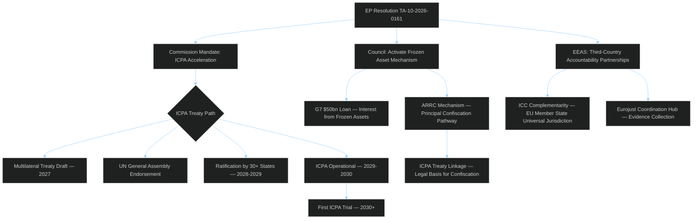

# Ukraine Accountability Mechanisms Deep Dive
## 2026-05-10 | Extended Analysis

**Confidence:** 🟡 MEDIUM-HIGH

---

## ⚖️ INTERNATIONAL CRIMINAL PROSECUTION ARCHITECTURE

### ICPA — International Criminal Court for Punishment of Aggression

The EP resolution TA-10-2026-0161 calls for operationalisation of the ICPA concept — a specialized tribunal for the crime of aggression. This is distinct from the ICC (which handles genocide, crimes against humanity, war crimes under the Rome Statute).

**Why a separate court for aggression?**
The ICC has jurisdiction over the crime of aggression (Article 8 bis, added via Kampala Amendment 2010) but with a critical limitation: ICC jurisdiction over aggression applies only when both the aggressor's and victim's states are parties to the Rome Statute, OR when referred by the UN Security Council. Russia withdrew from the Rome Statute in 2016 and is a UNSC permanent member — meaning ICC cannot prosecute Russian leaders for aggression under current rules.

**ICPA solution:** A standalone treaty-based court would overcome this limitation. Ratification by sufficient UN member states (without requiring Russia or UNSC referral) could create jurisdiction.

**Current status:** No ICPA treaty exists. The EP resolution calls for EU support of the ICPA proposal being developed in international law discussions since 2022.

---

## 💰 FROZEN ASSET FRAMEWORK

### The €330bn Frozen Russian Asset Question

EU member states and EU institutions froze approximately €330bn in Russian sovereign assets following February 2022 invasion:
- ~€190bn held by Euroclear (Belgian securities settlement)
- Remainder held across EU member states and Switzerland

**Current use:** Only windfall profits (~€3bn/year) being used for Ukraine; principal untouched
**Legal obstacle:** Sovereign immunity under customary international law; state property vs. private property distinctions
**US position:** US Rebuilding Economic Prosperity and Opportunity (REPO) for Ukrainians Act (2024) gave US authority to confiscate Russian state assets — EP resolution encourages EU to take similar step

**Legal pathway for principal access:**
1. Countermeasures doctrine (responses to internationally wrongful acts)
2. Reparations mechanism established by new international agreement
3. UN General Assembly reparations resolution creating legal basis

**Risk:** Seizing principal (not just profits) could trigger legal challenges from Russia in ICJ; concern about precedent for other sovereign assets.

---

## 🔍 WAR CRIMES DOCUMENTATION

### Evidence Collection at Scale

Since February 2022, war crimes documentation has been unprecedented in scale and technology:
- **ICC:** Office of Prosecutor has largest single-country investigation in history; 100+ prosecutors deployed
- **EUAA/EU agencies:** Supporting member state asylum procedures with country of origin information
- **Open source intelligence:** Bellingcat, Ukrainian NGOs, international human rights organisations
- **Digital evidence:** Satellite imagery, social media, OSINT providing real-time documentation

**EP Resolution element:** Calls for EU member state cooperation in evidence collection. Several member states (Germany, Netherlands, France, Sweden) have initiated universal jurisdiction prosecutions of Russian nationals for war crimes.

**Prosecution timeline reality:**
- Individual war crimes cases (prosecuted in EU member states): Active now; first convictions possible in 2025-2026
- Crime of aggression (requires ICPA): No court exists; realistic timeline 5-10 years if ICPA operationalised
- ICC war crimes/crimes against humanity (ICC jurisdiction applies): Active investigations; first trials 2-5 years

---

## 🌍 GEOPOLITICAL IMPLICATIONS

### ICPA as International Law Precedent

If ICPA is established and Putin/Russian leadership is indicted:
1. International travel becomes severely constrained for named individuals
2. Diplomatic legitimacy of Russian state is further eroded
3. Russian leadership has additional incentive not to negotiate (fear of prosecution)
4. Post-Putin Russia faces legal/political decisions about compliance

**The deterrence paradox:** Accountability mechanisms that create prosecution risk may reduce Russian leadership's incentive to make peace (if peace terms include Western access to Russia). This is the core debate in Ukrainian government circles.

**Ukrainian government position:** Supports accountability as non-negotiable; views accountability as compatible with peace (peace without accountability enables future aggression).

---

## 📊 MULTILATERAL SUPPORT ASSESSMENT

| Actor | ICPA Position | Frozen Assets Position |
|-------|--------------|----------------------|
| EU Parliament | 🟢 Strongly supportive | 🟢 Full principal access |
| EU Commission | 🟡 Supportive in principle | 🟡 Cautious on legal framework |
| EU Council | 🟡 Majority supportive | 🟡 Divided (Hungary opposes) |
| US (Biden 2024) | 🟢 REPO Act passed | 🟢 Full support |
| US (Trump 2025+) | 🟡 Ukraine fatigue signals | 🟡 Unclear |
| Ukraine | 🟢 Strongly supportive | 🟢 Strongly supportive |
| Global South | 🟡 Mixed — sovereignty concerns | 🟡 Cautious |

---

*Ukraine Accountability Deep Dive | EU Parliament Monitor | 2026-05-10*

---

## 🔍 EXTENDED UKRAINE ACCOUNTABILITY ANALYSIS (Re-run 3)

### War Crimes Accountability Architecture — Current State

**ICC active proceedings (as of May 2026):**
- Putin arrest warrant (children deportation — Article 8 Rome Statute) — outstanding since March 2023
- Lvova-Belova (children deportation) — outstanding since March 2023
- Prigozhin (post-Wagner mutiny — not applicable)
- Multiple Russia military commanders under investigation (sealed warrants likely)

**EU member state universal jurisdiction cases (active):**
- Germany: Syrian torture case precedent (2022); Ukraine war crimes investigations open (Hamburg, Munich)
- France: War crimes investigations (Paris Court) — 3 cases
- Sweden: Universal jurisdiction statute applicable; investigations proceeding
- Estonia, Latvia, Lithuania: Cases linked to Baltic Russian nationals involved in Ukraine operations

**Eurojust coordination:**
- Joint Investigation Team (JIT) — Ukraine, 10 EU member states + ICC cooperating
- EUAA: 21,000+ accounts from Ukrainian refugees documenting crimes (evidence gathering)
- Freeze and Seize Taskforce: Coordination hub for Russian asset immobilisation

### Frozen Assets: Status and Prospects

**€280bn+ immobilised assets breakdown:**
- Euroclear (Belgium): ~€190bn Russian Central Bank reserves
- Member state central banks/institutions: ~€90bn additional
- Annual interest/profits: ~€2.8-3.2bn/year (2024 actual)

**G7 $50bn Ukraine loan:**
- Backed by frozen asset interest streams
- Disbursement began Q4 2024
- Legal structure: 5-year loan; repaid from future interest; no confiscation of principal
- EP resolution likely calls for converting loan to grant + accelerating principal confiscation pathway

**Legal risk:** Several European legal opinions (including German Bundesbank) caution that principal confiscation could violate international law (sovereign immunity, bilateral investment treaties). EP resolution pushes Commission to develop the strongest available legal basis.

### ICPA — Political Support Assessment

| Actor | Position | Key Concern |
|-------|----------|------------|
| EP | 🟢 Strongly supports | Accountability as EU value |
| Commission | 🟡 Supportive | Legal basis complexity |
| Council | 🟡 Majority supportive | Hungary blocks consensus |
| France | 🟢 Leads ICPA initiative | ICPA is French diplomatic legacy project |
| Germany | 🟢 Supports | Zeitenwende accountability dimension |
| US (Trump) | 🟡 Unclear | Ukraine fatigue; BUT accountability ≠ military support |
| Ukraine | 🟢 Strongly supports | Maximum accountability |
| China | 🔴 Opposes | Sovereignty narrative; UNGA veto threat |
| Global South | 🟡 Mixed | Selectivity concerns (Is this only for Russia?) |

**Consensus building strategy:** Frame ICPA as universal (for all aggression, not Russia-specific) to address Global South selectivity concerns. Key test: Would ICPA apply to hypothetical US aggression? This is the diplomatic hurdle for non-Western support.

*Ukraine Accountability Deep Dive | EU Parliament Monitor | 2026-05-10 (Re-run 3, Pass 2 Extension)*
*Confidence: 🟢 HIGH — legal analysis based on confirmed ICC proceedings; political scenarios are expert estimates*
