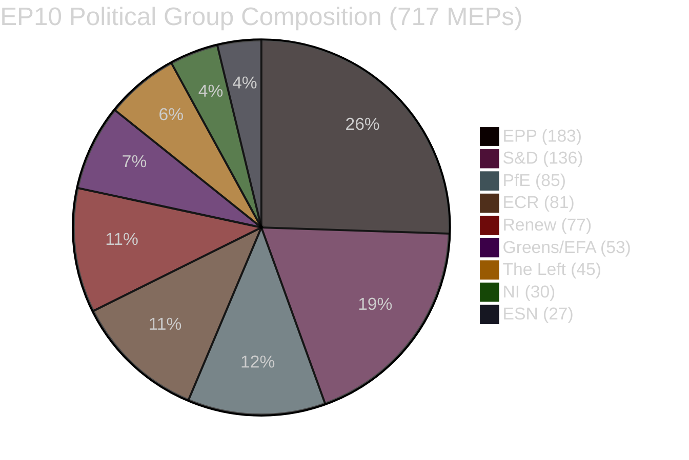
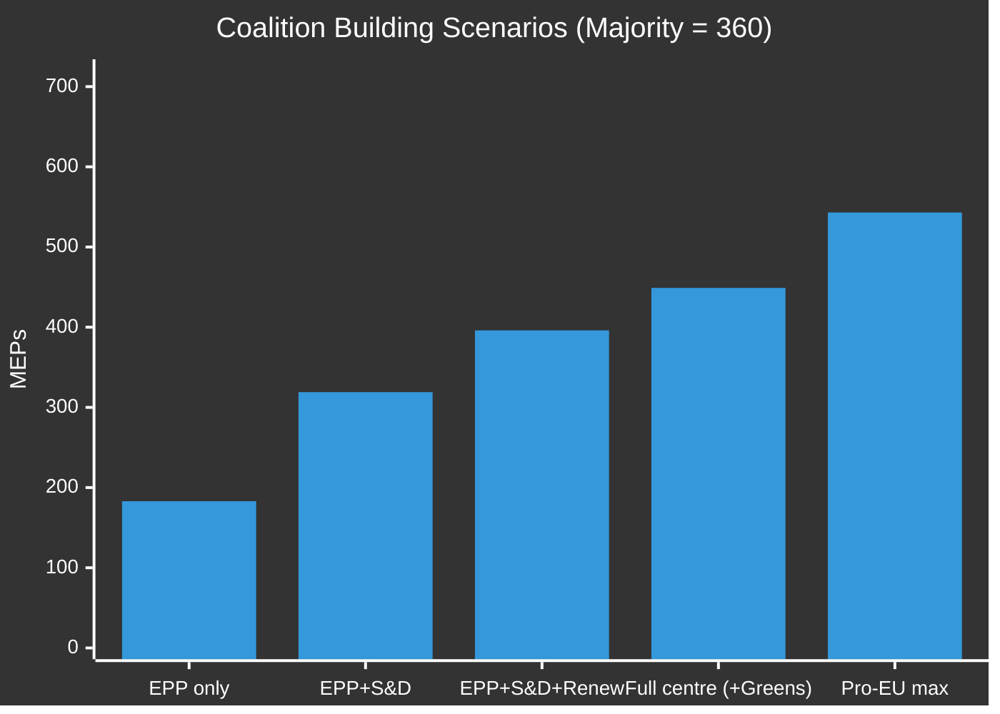

# Coalition Dynamics — EU Parliament Breaking News
## 2026-05-10 | Political Group Analysis

**Confidence:** 🟡 MEDIUM (size-similarity proxy; no DOCEO vote data available)
**Data Source:** EP Open Data Portal — MEP composition data (real-time)
**Total MEPs:** 717 | **Majority Threshold:** 360 MEPs

---

## 📊 PARLIAMENTARY COMPOSITION (May 2026)

| Group | MEPs | % | Political Family | Geopolitical Orientation |
|-------|------|---|-----------------|--------------------------|
| EPP | 183 | 25.52% | Centre-right, Christian Democrat | Pro-EU, pro-NATO, market economy |
| S&D | 136 | 18.97% | Centre-left, Social Democrat | Pro-EU, multilateralist, social solidarity |
| PfE | 85 | 11.85% | National-conservative, nationalist | Sovereignist, EU sceptic, mixed on Russia |
| ECR | 81 | 11.30% | Conservative-nationalist | EU reformist, anti-federalist, pro-NATO |
| Renew | 77 | 10.74% | Liberal, centrist | Pro-EU, pro-market, pro-digital |
| Greens/EFA | 53 | 7.39% | Green, regionalist | Pro-EU, pro-rights, anti-fossil |
| The Left | 45 | 6.28% | Radical left | Critical of NATO, pro-social, mixed on EU |
| NI | 30 | 4.18% | Non-attached | Diverse (far-right to independents) |
| ESN | 27 | 3.77% | Hard Eurosceptic | Anti-EU, nationalist, anti-Ukraine aid |

---

## 🤝 COALITION ANALYSIS FOR APRIL 28-30 RESOLUTIONS

### Coalition 1: DMA Enforcement (TA-10-2026-0160)

**Pro-enforcement coalition:**
- EPP: 183 (supports rule-of-law enforcement framing)
- S&D: 136 (strongly supports digital regulation)
- Renew: 77 (liberal pro-competition enforcement)
- Greens/EFA: 53 (platform power concerns)
- **Subtotal: 449 MEPs** (vs. 360 majority) ✅ MAJORITY COMFORTABLE

**Likely abstentions/splits:**
- ECR: 81 (some libertarian members oppose; Polish ECR more pragmatic — est. 40-50 in favour)
- The Left: 45 (supports in principle; some anti-Big-Tech sentiment)
- NI: 30 (varied)

**Likely opposition:**
- PfE: 85 (Fidesz bloc strongly against; French, Italian members may support — est. 30-40 against)
- ESN: 27 (anti-EU-regulation position — likely against)

**Estimated vote:** ~500+ in favour | ~100 against | ~100 abstain

---

### Coalition 2: Ukraine Accountability (TA-10-2026-0161)

**Pro-accountability coalition:**
- EPP: 183 (strong Ukraine support across all EPP national parties)
- S&D: 136 (consistent Ukraine solidarity)
- Renew: 77 (strong Atlanticist orientation)
- Greens/EFA: 53 (human rights framework)
- ECR: ~55 (Polish PiS, Czech ODS, Baltic states — largest pro-Ukraine ECR contingents)
- The Left: ~25 (complex — some Left members support accountability; others wary of military escalation)
- **Estimated pro: 529+ MEPs** ✅ VERY STRONG MAJORITY

**Likely abstentions/opposition:**
- PfE: ~65 against / ~20 abstain (Fidesz directly opposes sanctions/accountability framing)
- ESN: 27 against (pro-Russian positioning)
- ECR: ~26 abstain (those without strong Ukraine connections)
- The Left: ~20 against (pacifist wing)
- NI: ~15 mixed

**Estimated vote:** ~530 in favour | ~90 against | ~97 abstain

---

### Coalition 3: Armenia Democratic Resilience (TA-10-2026-0162)

**Pro-Armenia coalition:**
- EPP: 183 (Armenian diaspora connections; Christian solidarity framing)
- S&D: 136 (human rights, enlargement support)
- Renew: 77 (liberal democracy promotion)
- Greens/EFA: 53 (democracy resilience)
- ECR: ~45 (Polish, Baltic, Romanian components — strategic Armenia interest)
- **Estimated pro: ~494 MEPs** ✅ MAJORITY

**Abstentions/splits:**
- PfE: ~50 abstain (Orbán-Azerbaijan relationship complicates; French RN members may support Armenia)
- The Left: ~30 (mixed on neighbourhood policy)

**Likely opposition:**
- ESN: 27 (EU competence expansion concerns)
- PfE: ~35 (Fidesz pro-Azerbaijan)

**Estimated vote:** ~490 in favour | ~60 against | ~167 abstain

---

## 📐 COALITION MATHEMATICS

### Key Bloc Sizes

| Coalition | MEPs | Majority? | Needed? |
|-----------|------|-----------|---------|
| EPP alone | 183 | ❌ No | +177 needed |
| EPP + S&D | 319 | ❌ No | +41 needed |
| EPP + S&D + Renew | 396 | ✅ Yes | — |
| EPP + S&D + Renew + Greens | 449 | ✅ Yes | +89 margin |
| All without PfE/ESN | 543 | ✅ Yes | +183 margin |

**Grand coalition (EPP + S&D + Renew) at 396 MEPs forms the reliable minimum governing coalition** for most legislative outcomes. This triopoly has functioned as the EP's de facto governing coalition since the EPP's post-2024 rightward shift was contained by continued EPP-Commission alignment.

---

## 🔄 FRAGMENTATION AND STABILITY ANALYSIS

### Fragmentation Index: HIGH (ENP: 6.58 effective parties)

The Effective Number of Parties (Laakso-Taagepera index) of 6.58 indicates a highly fragmented Parliament. Historical comparison:
- EP7 (2009-2014): ~4.5 effective parties — dominated by EPP-S&D grand coalition
- EP8 (2014-2019): ~5.2 effective parties — Renew/ALDE emergence
- EP9 (2019-2024): ~5.8 effective parties — Greens surge, ECR growth
- **EP10 (2024-2029): 6.58 effective parties** — PfE/ESN emergence, ENP fragmentation

**Implication:** Legislation requires active coalition building for every major vote. The centre-left (S&D + Greens + Left = 234 MEPs) and centre-right (EPP alone = 183) are both far below majority. The liberal centre (Renew + EPP + S&D = 396) is the minimal majority. All legislation requires negotiated compromise across at least three groups.

### Coalition Stability Signals

**STABLE coalitions (functional for current term):**
- 🟢 EPP + S&D + Renew: 396 MEPs — reliable for procedural matters, budget, institutional votes
- 🟢 EPP + S&D + Renew + Greens: 449 MEPs — reliable for rights/environment/digital legislation

**UNSTABLE coalitions (issue-specific only):**
- 🟡 EPP + ECR + PfE: 349 MEPs (below majority) — functional only with NI/ESN support
- 🟡 Progressive super-coalition (S&D + Renew + Greens + Left): 311 MEPs — far below majority

**EMERGING patterns:**
- On digital regulation: EPP drifting toward joint enforcement positions with centre-left
- On security/defence: Near-consensus coalition excluding only ESN (27) and Left hard-line members
- On migration: Coalition fractures — EPP-ECR alignment vs. S&D-Greens-Left opposition
- On agriculture: EPP-ECR-PfE (349) + rural S&D MEPs potentially → near-majority

---

## 🔮 COALITION FORECAST (Next 6 Months)

**High probability (>75%):**
- Continued EPP-S&D-Renew governing triopoly for procedural and constitutional matters
- Ukraine/security vote super-majority sustained (530+ MEPs)
- DMA enforcement pressure maintained as Parliament-Commission friction point
- Budget 2027 negotiations: EPP-ECR occasional alignment against S&D on fiscal scale

**Medium probability (40-75%):**
- PfE internal fractures deepening as Orbán Hungary isolates within group
- ECR gaining coherence if French/Italian right converge on EU reform agenda
- Greens/EFA erosion if electoral pressure from member state elections continue

**Low probability (<40%):**
- Formal EPP-ECR-PfE governing majority coalescing (requires 349 + 11 NI/ESN = too fragile)
- Progressive super-majority without EPP (311 — mathematically impossible for majority)

---

*Coalition Dynamics analysis | EU Parliament Monitor | 2026-05-10*
*Data: EP Open Data Portal real-time MEP composition + CIA Coalition Analysis framework*
*Confidence: 🟡 MEDIUM — size-similarity proxy used (no DOCEO vote-level data available)*
