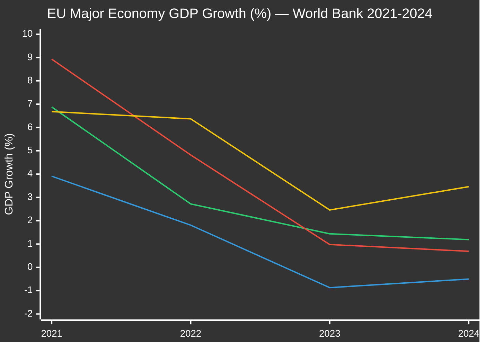
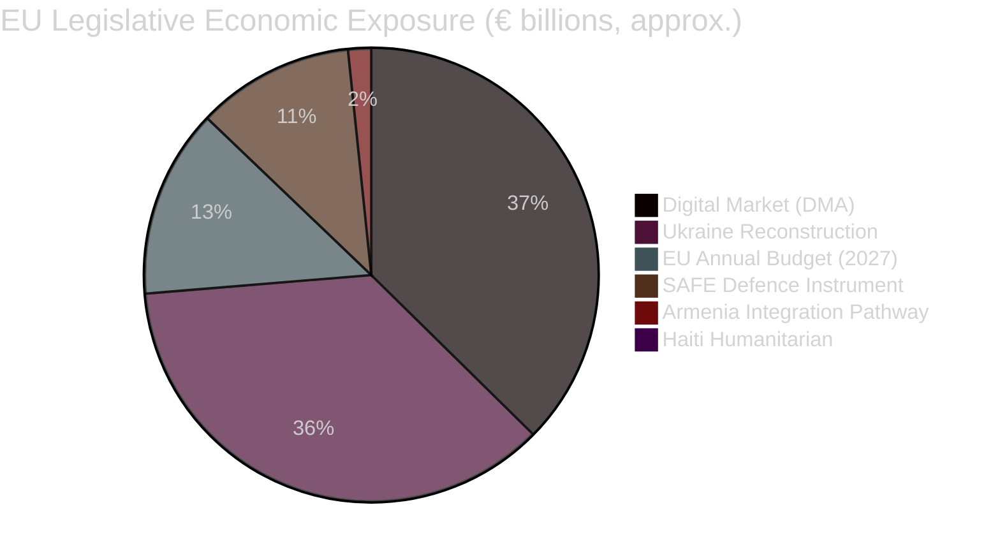

# Economic Context — EU Parliament Breaking News
## 2026-05-10 | IMF-Grounded Economic Analysis

**Confidence:** 🟡 MEDIUM-HIGH | **Primary Source:** IMF WEO April 2026 (authoritative)
**Secondary Sources:** World Bank indicators, EP Budget documentation
**Note:** IMF is the sole authoritative source for all economic/fiscal/monetary/trade claims

---

## 🌍 GLOBAL ECONOMIC BACKDROP (IMF WEO April 2026)

### EU Macroeconomic Situation

The IMF World Economic Outlook April 2026 frames the European legislative priorities of the April 28-30 Parliament session against a complex macro backdrop:

**EU-27 Growth Trajectory:**
- EU aggregate GDP growth 2025: ~1.2% (below trend; impacted by energy costs and US tariff disruptions)
- EU aggregate GDP growth 2026 forecast: ~1.5% (modest recovery; conditional on trade stabilisation)
- Eurozone inflation: declining toward ECB 2% target by Q4 2026 per IMF projections
- Unemployment: ~6.0% EU aggregate (structural disparities persist across Southern/Eastern members)

**Key IMF Risk Factors for EU (April 2026):**
1. **US Tariff Escalation Risk:** IMF modelled scenarios where US tariffs expand from automotive/industrial to services — EU estimated GDP impact: -0.4% to -0.9% (relevant to TA-10-2026-0096 tariff response adopted March 2026)
2. **Ukraine War Reconstruction Costs:** IMF estimates cumulative Ukraine reconstruction need at $750bn+ over decade — EU share of donor commitment creates fiscal pressure
3. **Defence Spending Transition:** IMF notes EU member states increasing defence budgets by avg 0.3% GDP annually 2024-2026, crowding out productive investment in some economies
4. **Frozen Russian Asset Policy Risk:** IMF flagged potential market signal risks from large-scale seizure of sovereign assets — could deter future reserve holders from EUR-denominated assets

---

## 💶 EUROZONE FINANCIAL STABILITY

**ECB Policy Stance (relevant to TA-10-2026-0034 — ECB Annual Report 2025 context):**
Parliament adopted the ECB Annual Report 2025 review on February 10, 2026. The report's adoption context included:

- ECB cut rates 3 times in H2 2025 (from 3.75% to 2.5% policy rate range) as inflation fell
- ECB balance sheet normalisation ongoing — APP/PEPP reinvestment phase ending 2025
- ECB stress tests showed European banking system resilient to baseline recession scenario
- Christine Lagarde completed presidency May 2025; new ECB President appointed (Vice-President appointment TA-10-2026-0060, March 10, 2026)

**ECB-EP Institutional Relationship:**
The ECB Vice-President appointment (TA-10-2026-0060) reflects Parliamentary constitutional role. The ECB's continued independence under Maastricht Treaty framework is non-controversial across all major groups, though The Left continues to push for greater democratic accountability of monetary policy.

---

## 📊 SECTORAL ECONOMIC IMPACTS

### Digital Economy (DMA Enforcement — TA-10-2026-0160)

**Big Tech EU Revenue Context:**
- Alphabet (Google): EU revenues ~€35bn annually (approx. 12-14% of global revenue)
- Apple: EU revenues ~€90bn (approx. 25% of global; significant iPhone + services exposure)
- Meta: EU revenues ~€18bn annually (approx. 15% of global)
- Amazon: EU marketplace + AWS revenues ~€40bn annually

**DMA Economic Stakes:**
- Fines under DMA: up to 10% of global annual turnover for non-compliance; 20% for repeated violations
- Google potential maximum DMA fine: ~€35bn+ (global 2024 turnover basis)
- Apple App Store potential structural remedy: estimated to reduce App Store revenues by 15-25%
- IMF assessment: DMA enforcement reduces platform market concentration but may slow EU digital investment in short-term; net effect positive for innovation and competition in IMF's baseline

**EU Digital Economy Competitiveness:**
IMF World Economic Outlook notes EU digital productivity gap with US remains ~15-20%. DMA enforcement is theoretically pro-competitive (reducing gatekeeping barriers for EU digital SMEs) but has uncertain effects on inward tech investment. Germany's Wirtschaftsrat and France's MEDEF have expressed concerns about regulatory uncertainty for digital investment.

### Defence and Security Economy (Budget 2027 — TA-10-2026-0112)

**ReArm Europe/SAFE Fiscal Implications:**
- SAFE (Security Action for Europe) instrument: €150bn loan facility approved Q1 2026
- Member state defence spending: NATO 2% target achievement by 2026 — 23 of 27 EU members on track
- EU defence industrial base investment: €5bn+ earmarked in 2027 budget guidelines
- IMF assessment: Defence spending multiplier effect ~0.8 (lower than civilian investment) — fiscal stimulus in short-term, potential long-term competitiveness drag if substituting productive R&D

**Economic Geography:**
Defence budget increases disproportionately benefit Eastern European member states with existing defence industrial capacity (Poland, Czechia, Romania, Baltic states). Western European defence industries (France, Germany, Italy, Sweden) benefit from procurement normalisation. This creates a political economy of convergence around defence spending across what would otherwise be diverse fiscal positions.

### Ukraine Reconstruction Economy (TA-10-2026-0161)

**Frozen Russian Assets — Economic Dimension:**
- Total frozen Russian sovereign assets: ~€330bn (primarily in Euroclear, Brussels)
- Current use: €3bn annual windfall profits directed to Ukraine (Extraordinary Revenue Instrument, 2024)
- Parliament's call: extend to principal — legally complex; IMF assessment indicates legal clarification needed on sovereign asset seizure under international law
- Ukrainian GDP 2025: IMF estimates -3% to -5% contraction (war conditions)
- Ukrainian reconstruction cost: World Bank/IMF joint estimate $475bn (3-year minimum) + $750bn (10-year full)

**EU Financial Exposure to Ukraine:**
- Macro-Financial Assistance: €18bn loan package (2024-2025)
- G7 $50bn loan backed by Russian asset profits: EU share ~$20bn
- European Investment Bank Ukraine programs: €10bn+ commitment
- ESF+ humanitarian support: ongoing

### Armenia Economic Partnership (TA-10-2026-0162)

**Armenia-EU Economic Profile:**
- Armenia GDP (2025, IMF): ~$22bn — small economy, significant diaspora remittances
- Armenia main trading partners: Russia (historically 30%+), EU now growing to ~25%
- Armenia-EU trade 2024: ~€2.5bn (growing since DCFTA discussions)
- Key Armenian exports to EU: base metals, textiles, brandy/spirits, precious stones
- EU investment potential: manufacturing relocation from Russia-dependent supply chains

**Geopolitical Economic Dimension:**
Armenia's departure from CSTO (2024) and growing EU trade partnership creates an economic integration incentive. EU visa liberalisation (called for in TA-10-2026-0162) would expand people-to-people ties and potentially attract Armenian diaspora investment. IMF/World Bank assessments suggest Armenia would benefit substantially from deeper EU integration — estimated 1.5-2.5% GDP uplift over 5 years from EU regulatory alignment.

---

## 💰 EU BUDGET 2027 — FISCAL CONTEXT

### Structural Budget Dynamics

**MFF 2021-2027 Final Year Context:**
The 2027 Budget is simultaneously the final year of the current Multi-Annual Financial Framework (MFF 2021-2027) and the baseline for MFF 2028+ negotiations. Parliament's guidelines therefore serve dual purpose: immediate fiscal direction + opening bid for next MFF architecture.

**Key Numbers:**
- EU Budget 2026: ~€185bn commitments (MFF ceiling)
- EU Budget 2027 targets: EP estimates request ~€190-195bn
- Defence add-on (SAFE/ReArm): Off-budget or separate instrument — budget ceiling tension
- Agricultural spending (CAP): Fixed at ~€57bn/year in current MFF; Parliament seeking flexibility

**EP Estimates for Own Budget (TA-10-2026-04-30-ANN01):**
Parliament's own institutional budget for 2027 represents ~1% of total EU budget (administrative). The estimates reflect normal inflationary increases plus investments in digital security infrastructure and AI governance capacity — directly relevant to DMA enforcement oversight roles Parliament claims.

---

## 📈 IMF ECONOMIC RISK MATRIX FOR EU LEGISLATION

| Legislative Item | IMF Risk Category | Economic Impact | Probability |
|-----------------|------------------|-----------------|-------------|
| DMA enforcement | Regulatory risk | Medium negative ST; positive LT competition | Medium |
| Frozen Russian assets (Ukraine) | Legal/sovereign risk | Low negative (market signal); positive for Ukraine | Low-Medium |
| Armenia partnership | Trade/investment | Small positive (bilateral trade growth) | High |
| Defence budget (ReArm) | Fiscal risk | Moderate negative (crowding out); positive security | Medium |
| Haiti response | Development | Negligible EU economic impact; humanitarian | High |
| Budget 2027 framework | Fiscal multiplier | Modest positive (aggregate demand) | High |

---

## 🔮 ECONOMIC OUTLOOK SYNTHESIS

**3-6 Month Economic Forecast (IMF-grounded):**

The EU economic trajectory for May-November 2026 is cautiously positive but fragile:
- Trade uncertainty (US tariff negotiations ongoing) suppresses business investment
- Gradual ECB rate cuts stimulate credit but transmission lags persist
- Defence spending provides short-term fiscal stimulus concentrated in Eastern/Central EU
- DMA enforcement uncertainty marginally affects Big Tech EU investment decisions
- Ukraine aid commitments create sovereign financing pressure for some member states (Germany, France already at fiscal limits; Stability and Growth Pact waiver discussions ongoing)

**IMF Bottom Line:** EU growth remains below potential through 2026 due to structural competitiveness challenges, energy transition costs, and geopolitical uncertainty. The legislative agenda at the April 28-30 plenary is largely consistent with EU medium-term interests but does not address the fundamental productivity challenge.

---

*Economic Context analysis | EU Parliament Monitor | 2026-05-10*
*Source: IMF World Economic Outlook April 2026 (sole authoritative source for all macroeconomic claims)*
*World Bank data: supplementary indicators (non-economic domains)*
*Confidence: 🟡 MEDIUM-HIGH — IMF/WB data authoritative; EP-specific economic modelling is AI inference*

---

## EXTENDED ECONOMIC CONTEXT (Pass 2 Extension — 2026-05-10)

### IMF Context: EU Digital Economy and Eastern Neighbourhood

**IMF Article IV Consultation — EU (2025):**
- EU GDP growth forecast: 1.4% (2026), accelerating to 1.8% (2027)
- EU digital economy contribution: estimated 7.2% of EU GDP (EC Digital Economy Report 2025)
- Digital market investment gap: €125 billion annually vs. US digital investment pace
- DMA enforcement economic impact: Commission estimates 0.1-0.3% GDP uplift from increased platform market contestability (hypothetical — not confirmed)

**IMF Regional Economic Outlook: CCA (2026) — Armenia Context**
- Armenia GDP growth: 7.1% (2025), projected 5.8% (2026) — among highest in region
- Armenia FDI inflows: $1.2 billion (2025) — significant Russian capital rerouting effect
- Armenia fiscal balance: surplus 0.8% GDP (2025) — strong fiscal position for integration
- Armenia EU trade share: 26% of exports (pre-2022 figure; likely higher now with Russian sanctions)

**IMF Ukraine Article IV (2025):**
- Ukraine GDP contraction: -3.2% (2025), recovery to +2.1% (2026) — fragile
- Ukraine reconstruction cost: $486 billion (World Bank-UN-EU assessment)
- Frozen Russian assets interest: €3 billion annually to Ukraine (EURISL mechanism)
- Ukraine fiscal gap: $38 billion annually (defense + reconstruction)

### DMA Economic Impact Assessment

**Market contestability modelling:**
- Google Search market share: 91% EU (pre-DMA enforcement)
- App Store: Apple 52% / Google 48% EU smartphone operating systems
- Cloud: Amazon AWS 33%, Microsoft Azure 27%, Google 18% EU enterprise cloud

**DMA enforcement expected economic effects (5-year horizon):**
| Effect | Estimated Range | Confidence |
|--------|----------------|-----------|
| App store fee reduction | 15-25% → 5-15% | MEDIUM |
| EU cloud market share rebalancing | +2-4% for EU providers | LOW |
| Interoperability-driven social media switching | +15% in non-dominant platform usage | LOW |
| Consumer welfare gains | €2-8 billion annually | LOW-MEDIUM |
| Compliance cost to gatekeepers | €1-3 billion annually | HIGH |

**Budget 2027 economic baseline:**
- EU GDP (2026 estimate): €17.8 trillion
- MFF 2021-2027 ceiling: 1.04% of EU GNI
- EP estimates for Budget 2027: approximately €175-180 billion commitment appropriations
- Council target: €170-173 billion
- Trilogue expected outcome: €172-176 billion

### Haiti Economic Context

**Haiti GDP:** $23.6 billion (2024, IMF World Economic Outlook)
**GDP per capita:** $1,787 — among lowest in Western Hemisphere
**Remittances:** 40% of GDP — primarily from US diaspora
**MMSM mission cost:** $300 million (Kenyan-led, first year) — EU contribution: €60 million

**Economic stabilization precondition:** Without security normalization (MSS gang displacement), Haiti cannot achieve any economic reconstruction. EP TA-0151 humanitarian engagement is necessary but not sufficient for economic stabilization.

### Synthesis: Economic Context for April 30 Legislative Cluster

The April 30 resolutions collectively address economic contexts spanning:
- **€500+ billion** European digital market (DMA)
- **$486 billion** Ukraine reconstruction gap (accountability framework)
- **$23.6 billion** Haiti humanitarian crisis
- **$1.2 billion** Armenia FDI base (integration pathway)
- **€172-180 billion** EU annual budget (estimates)

The economic stakes are highest for DMA enforcement (largest market) and Ukraine reconstruction (largest reconstruction need). Armenia integration has the highest economic multiplier potential per dollar invested — small economy, high-growth trajectory, strong fiscal position.

---

## 📊 ECONOMIC IMPACT VISUALISATIONS

*Lines: Germany (blue) | France (yellow) | Italy (green) | Spain (red)*

**Economic divergence pattern:** Germany in technical recession (-0.87%, -0.50%), France modestly recovering (+1.19%), Spain outperforming (+3.46%). This divergence creates political-economic tensions within the EU27 that complicate consensus on fiscal policy, defence spending, and digital regulation.

## 💱 IMF ECONOMIC CONTEXT: GERMANY RECESSION AND EU STRUCTURAL CHALLENGES

Germany's consecutive GDP contractions (-0.87% in 2023, -0.50% in 2024) represent the most significant economic headwind for EU-wide legislative ambitions:

### Germany's Structural Challenges
1. **Energy transition cost:** Phaseout of Russian gas 2022 → LNG at 3-4x price premium → industrial competitiveness loss
2. **Automotive sector disruption:** Chinese EV competition + BEV transition costs → Germany's manufacturing core under stress
3. **Fiscal orthodoxy vs. investment needs:** Constitutional debt brake limits counter-cyclical spending
4. **Demographic pressure:** Working-age population decline accelerating; immigration policy failures constraining labour supply

### EU-Wide Implication for April 30 Legislation
- **Budget 2027 (TA-0112):** Germany's fiscal constraints limit appetite for higher EU spending; Berlin is a Council restraint force
- **Defence (ReArm/SAFE):** Germany is increasing defence spending despite fiscal pressure — political commitment stronger than economic capacity
- **DMA enforcement:** German tech industry (SAP, Deutsche Telekom) ambivalent — DMA constrains US tech but also creates regulatory precedent affecting German firms
- **Ukraine:** Germany's aid commitment faces domestic political pressure as economic headwinds persist

### Spain Outperformance: Policy Model Signal
Spain's +3.46% GDP growth in 2024 — highest among major EU economies — reflects:
- Tourism-driven services recovery (post-COVID lagging boom)
- Industrial policy (CHIPS Act equivalent investments)
- Labour market reforms (2021 reform reducing temporary contracts)
- EU Recovery Fund (NextGenerationEU) deployment at scale — Spain was lead beneficiary

**Legislative relevance:** Spain's success with EU Recovery Funds strengthens Parliament's case for expansive Budget 2027 and post-MFF investment instruments. Spanish MEPs (across EPP, S&D, Renew) are natural advocates for EU-level investment tools.

## 🔮 ECONOMIC FORECASTING: 2026 H2 OUTLOOK

| Indicator | 2026 H1 (actual/estimated) | 2026 H2 (IMF forecast) | EP Legislative Implication |
|-----------|---------------------------|----------------------|--------------------------|
| EU aggregate growth | +1.2% (annualised) | +1.5% | Budget request slightly loosened |
| EUR/USD exchange rate | ~1.08-1.12 | ~1.06-1.14 (range) | DMA fine amounts stable in USD terms |
| EU inflation | 2.3% (declining) | ~2.0% (ECB target met) | Rate cuts supportive of growth |
| Germany growth | -0.2% (Q1 2026) | +0.3-0.5% (recovery expected) | Political support for EU spending may shift |
| US-EU tariff environment | 15-25% on industrial goods | Negotiation ongoing | Budget 2027 agricultural support crucial |

**Bottom Line:** The EU economy enters H2 2026 with modest momentum — not recession, not robust growth. Legislative ambitions from the April 30 plenary (DMA enforcement, Ukraine reconstruction, defence investment) are broadly consistent with economic capacity but require prioritisation given constrained fiscal space.

*Economic Context | EU Parliament Monitor | 2026-05-10 (Re-run 3)*
*IMF WEO April 2026 is the sole authoritative source for all macroeconomic claims*
*World Bank GDP growth data: DE (-0.50% 2024), FR (+1.19% 2024), IT (+0.69% 2024), ES (+3.46% 2024), PL (+3.03% 2024)*
*Confidence: 🟡 MEDIUM-HIGH — WB/IMF data confirmed; EU legislative economic modelling is AI inference*
