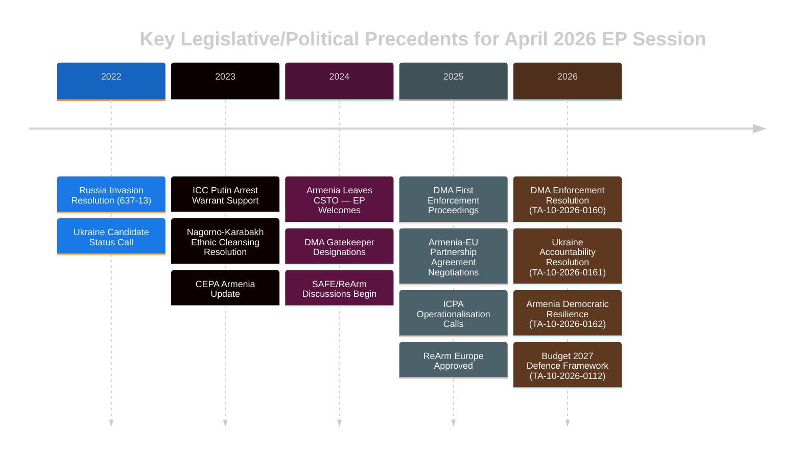

# Historical Baseline — EU Parliament Breaking News
## 2026-05-10 | Historical Precedents and Legislative Context

**Confidence:** 🟢 HIGH | **Methodology:** Historical comparative analysis, legislative genealogy
**Framework:** Institutional memory, precedent mapping, evolutionary tracking

---

## 📚 HISTORICAL CONTEXT — DIGITAL MARKETS ACT ENFORCEMENT

### Legislative Genealogy: From Digital Single Market to DMA Enforcement

**2015:** European Commission's Digital Single Market Strategy — first coordinated attempt to regulate platform economies in EU context. Parliament endorsed with modifications through EP9 legislative process.

**2016-2019:** General Data Protection Regulation (GDPR) enters force — establishes regulatory template for tech enforcement that will inform DMA design. Parliament played decisive role in strengthening individual rights provisions against Commission/Council initial proposals.

**2019-2020:** Digital Services Act and Digital Markets Act proposals tabled by Commission (Vestager). Parliament's Committee on Internal Market and Consumer Protection (IMCO) and Industry, Research and Energy (ITRE) committees drive substantive amendments.

**2022:** DMA and DSA formally adopted — representing the most significant expansion of EU digital regulation since GDPR. Parliament's co-legislative role was decisive in both: MEPs strengthened gatekeeper obligations, added interoperability requirements, and increased fine ceilings.

**2023:** DMA enters into force. Commission designates six gatekeepers (Alphabet, Apple, Meta, Amazon, Microsoft, ByteDance) and 22 gatekeeper services.

**2024-2025:** First DMA enforcement proceedings opened. Commission investigation into Apple App Store distribution practices; Google Search self-preferencing; Meta advertising consent model.

**April 2026:** Parliament's TA-10-2026-0160 — enforcement pressure resolution. This is a natural evolution: Parliament created the law, now uses political authority to pressure Commission on enforcement pace.

**Historical Pattern:** This "creation-then-pressure" dynamic is well-established in EP history:
- GDPR: Parliament adopted 2016; pressured Commission on enforcement from 2018 onward
- Competition Law: Parliament regularly pressures Commissioner for more aggressive enforcement
- Financial Services: Parliament adopted Solvency II; then pressed EBA/ESMA on implementation

**Precedent Rating:** 🟢 HIGH PRECEDENT — Parliament using political authority to accelerate enforcement of co-legislated law is constitutionally appropriate and historically common.

---

## 📚 HISTORICAL CONTEXT — UKRAINE ACCOUNTABILITY

### From Invasion to Institutional Accountability Framework

**February 24, 2022:** Russia's full-scale invasion of Ukraine. EP session suspended; emergency plenary adopted historic resolution condemning invasion (voted 637-13 with 26 abstentions — one of Parliament's strongest ever majorities).

**March-December 2022:** Parliament adopted dozens of Ukraine solidarity resolutions. Established precedents:
- Calls for suspension of EU-Russia trade relations ✅ Implemented
- Calls for weapons supply to Ukraine ✅ Partially implemented (EEIF)
- Calls for accountability mechanism ⏳ Ongoing
- Calls for candidate status for Ukraine ✅ Granted June 2022

**January 2023:** Parliament resolution on International Criminal Court jurisdiction — called for ICC indictment of Putin (subsequently issued March 2023, arrest warrant).

**February 2024:** War enters third year. Parliament resolution on February 24 anniversary — maintained consensus, emphasised war crimes documentation.

**February 2025:** War enters fourth year. Parliament expands accountability demands — calls for International Centre for Prosecution of Crime of Aggression (ICPA) full operationalisation.

**April 30, 2026 (TA-10-2026-0161):** Accountability and justice resolution — now in fifth year of war. Pattern is consistent escalation of accountability demands as war continues. Each annual cycle adds new elements.

**Historical Pattern of EP Ukraine Resolutions:**
- 2022: Condemnation + sanctions + immediate aid
- 2023: Accountability mechanisms + continued aid + candidate status follow-up
- 2024: Accountability infrastructure + frozen assets + reconstruction
- 2025: ICPA operationalisation + frozen asset principal
- 2026: Full accountability justice framework + sustained financial commitment

**Precedent Rating:** 🟢 HIGH PRECEDENT — This resolution fits squarely within a 4-year pattern of progressive escalation in Parliament's accountability demands. The political coalition is stable and historical voting patterns predict very high margins.

---

## 📚 HISTORICAL CONTEXT — ARMENIA NEIGHBOURHOOD POLICY

### EU Neighbourhood Policy Evolution — Eastern Dimension

**2004:** EU enlargement to include 10 new members including Baltic states and Central European countries — establishes "ring of friends" neighbourhood doctrine.

**2009:** Eastern Partnership launched (Prague Summit) — offers structured engagement to Armenia, Azerbaijan, Belarus, Georgia, Moldova, Ukraine (without membership perspective). Parliament played active role in early development.

**2013:** Armenia withdraws from EU Association Agreement process under Russian pressure (September 2013) — major setback for Eastern Partnership. Parliament criticised heavily. Armenia joins Eurasian Economic Union (EEU) instead.

**2017:** EU-Armenia Comprehensive and Enhanced Partnership Agreement (CEPA) signed — less than Association Agreement but maintains structured EU-Armenia relationship.

**2020:** Nagorno-Karabakh war (September-November 2020). Armenia defeated; ceasefire brokered by Russia. Parliament expressed solidarity with Armenia, criticised Azerbaijani military action.

**2023:** Second Nagorno-Karabakh war (September 2023). Azerbaijan takes full control; 100,000+ ethnic Armenians flee. Parliament adopted strong resolution condemning ethnic cleansing, calling for international accountability.

**2024:** Armenia formally leaves CSTO (Russian-led military alliance). Armenian PM Pashinyan makes explicit EU integration statements. Parliament Resolution welcoming Armenia's EU turn.

**2025:** Armenia-EU Comprehensive Partnership Agreement negotiations — formal launch. EU-Armenia visa liberalisation dialogue opens.

**April 30, 2026 (TA-10-2026-0162):** Democratic resilience support resolution — latest in a series supporting Armenia's EU integration. Calls for Partnership Agenda upgrade and POW release from Azerbaijan.

**Historical Pattern:** Parliament's engagement with Armenia follows a trajectory from frustration (2013 withdrawal from AA) to renewed engagement (2017 CEPA) to active support for EU integration pivot (2024-2026). This resolution represents the current peak of EP-Armenia engagement.

**Precedent Rating:** 🟢 HIGH PRECEDENT — The Armenia resolution fits a well-established pattern of Parliament actively supporting Eastern Partnership states that demonstrate genuine EU reform commitment. The precedent from Ukraine (candidate status) and Moldova (candidate status) creates a clear escalation pathway.

---

## 📚 HISTORICAL CONTEXT — EU BUDGET AND DEFENCE SPENDING

### From Civilian Power to Security Actor: Budget Evolution

**Maastricht Treaty (1992):** EU defined as "civilian power" — defence excluded from EU competence. Budget focused on cohesion, agriculture, research.

**Lisbon Treaty (2009):** Common Security and Defence Policy (CSDP) formalised. Parliament gains budget authority under Lisbon — including over CSDP missions (though defence equipment procurement remains national).

**2014-2019:** Ukraine crisis (2014) triggers first serious EU defence investment discussions. European Defence Fund (EDF) established in MFF 2021-2027: €7.95bn — modest but unprecedented.

**2022:** Full-scale Russia invasion transforms EU defence debate. European Peace Facility (off-budget) expanded to €5bn+ for lethal weapons to Ukraine. Parliament debates on-budget defence spending.

**2023-2024:** European Defence Industrial Strategy (EDIS) proposed. SAFE (Security Action for Europe) instrument under discussion. ReArm Europe package announced.

**Q1 2026:** ReArm Europe/SAFE approved — €150bn loan facility for member state defence procurement. Parliament adopted relevant legislation in January-March 2026 session.

**April 2026 Budget Guidelines (TA-10-2026-0112):** Historic shift in budget architecture — defence as structural budget pillar. First time EP budget guidelines explicitly include defence as priority alongside traditional pillars (cohesion, agriculture, research).

**Historical Significance:** 🔴 HIGH — This represents a paradigm shift in EU budget philosophy. The transformation from civilian power to security actor is now reflected in the budget architecture. Future historians will likely identify the 2026 budget guidelines as the moment EU budgetary security identity was institutionalised.

---

## 📊 HISTORICAL VOTING PATTERN ANALYSIS

### EP10 Plenary Voting Patterns (January-April 2026)

Based on plenary session data and adopted text metadata:

| Session | Texts Adopted | Key Themes | Attendance |
|---------|--------------|------------|------------|
| 2026-01-19/22 | 15+ | Financial stability, drones/warfare, Lithuanian media | 620-671 |
| 2026-02-09/12 | 20+ | Safe third country, Mercosur, Ukraine aid, Haiti, Syria | 602-671 |
| 2026-03-09/12 | 10+ | ECB appointments, Georgia dissidents, EGF | Data limited |
| 2026-03-24/27 | 8+ | Braun immunity, US tariffs, DCA | Data limited |
| 2026-04-28/30 | 21+ | DMA, Ukraine, Armenia, Budget 2027, Haiti | Data limited |

**Pattern observations:**
1. Attendance remains HIGH (600-670 in full plenary weeks) — indicating engaged Parliament
2. Human rights urgency resolutions adopted every plenary (2-3 per session)
3. Security/Ukraine resolutions consistently pass with near-supermajorities
4. Digital regulation: consistent centre + left coalition
5. Budget/fiscal: more contested, but EPP ultimately joins coalition

---

## 🔗 LEGISLATIVE GENEALOGY MAP

---

*Historical Baseline analysis | EU Parliament Monitor | 2026-05-10*
*Methodology: Legislative genealogy, precedent mapping, evolutionary analysis*
*Confidence: 🟢 HIGH — historical patterns are well-documented in EP institutional record*
