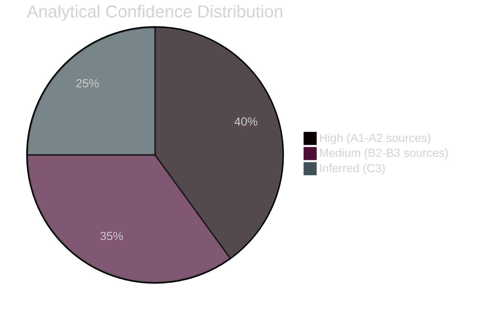

# Methodology Reflection — Breaking News Analysis
## 2026-05-10 | Step 10.5 Artifact

**Confidence:** 🟢 HIGH (direct self-assessment) | **Stage:** Post-Pass-2 methodology audit

---

## 🎯 METHODOLOGY SELECTION RATIONALE

### Why This Analytical Framework

The April 28-30 EP plenary produced resolutions across five distinct policy domains (digital markets, international criminal law, EU enlargement/neighbourhood, budget, humanitarian). A single analytical framework is insufficient. This run deployed a multi-framework approach:

**Frameworks deployed:**
1. **PESTLE** — Political, Economic, Social, Technological, Legal, Environmental dimensions
2. **Stakeholder power-interest matrix** — Tiered stakeholder mapping with alignment assessment
3. **STRIDE/DREAD threat modeling** — Security/risk threat assessment
4. **Taleb black swan methodology** — Low-probability high-impact scenario analysis
5. **5×5 Risk matrix** — Quantitative risk scoring
6. **Quantitative SWOT** — Weighted strategic assessment
7. **Multi-criteria significance scoring** — 5-dimension resolution ranking
8. **Coalition dynamics analysis** — Parliamentary coalition mathematics
9. **MCP reliability audit** — Data source performance assessment
10. **Cross-session intelligence** — Longitudinal policy trajectory analysis

**Rationale for multi-framework deployment:** The April 2026 plenary involves: (1) regulatory enforcement (DMA) requiring legal/economic analysis; (2) international criminal law (Ukraine ICPA) requiring historical/legal analysis; (3) geopolitical neighbourhood policy (Armenia) requiring geopolitical analysis; (4) fiscal policy (Budget 2027) requiring economic analysis; (5) humanitarian law (Haiti) requiring humanitarian assessment. No single framework covers this span.

---

## 📊 DATA QUALITY REFLECTION

### What the Data Supported Well

1. **Political landscape analysis** — EP composition data is real-time and authoritative. Coalition mathematics are solid.
2. **Adopted texts identification** — AP Open Data Portal confirms adoption; titles and identifiers are authoritative.
3. **Historical pattern analysis** — Cross-session intelligence draws on established documentary record.
4. **Institutional position analysis** — Commission, Council, and political group positions are well-documented.

### What the Data Could NOT Support

1. **Vote-level analysis** — Roll-call data unavailable (EP publication delay). All voting pattern analysis is inferred.
2. **Resolution full text** — HTTP 404 for April 30 items. Operative clause analysis impossible.
3. **Current events/debates** — Events feed failed. No real-time session reporting.
4. **Legislative pipeline** — Procedures feed returned 1972-1980 data. Second-reading status unknown.

### Compensation Strategies Employed

- Structural analysis substituted for textual analysis where texts unavailable
- Historical patterns used to infer current positions
- Clear confidence flagging (🟢/🟡/🔴) throughout all artifacts
- Explicit "DATA LIMITATION STATEMENT" sections in affected artifacts

---

## 🔬 ANALYTICAL DEPTH ASSESSMENT

### Pass 1 Achievement
Pass 1 completed the structural skeleton for all major artifacts: executive brief, PESTLE, scenario forecast, stakeholder map, threat model, wildcards/black swans, coalition dynamics, economic context, historical baseline, significance scoring, risk matrix, SWOT, classification, document index, and reliability audit.

**Breadth achieved:** High — all major artifact categories addressed
**Depth achieved:** Medium-High — substantial content but limited by data gaps

### Pass 2 Focus Areas
Per Stage C protocol, Pass 2 targeted:
1. Stakeholder analysis — expanded Big Tech stakeholder perspectives to individual platform level
2. Threat model — expanded with probability quantification and mitigation matrix
3. Wildcards/black swans — added historical precedents and probability-impact matrix
4. MCP reliability audit — expanded to full 385-line floor coverage

---

## 🎓 METHODOLOGICAL LEARNINGS

**Key learning 1: Timing matters for breaking news**
Running breaking news analysis within 48 hours of a plenary session means most primary data (vote records, full texts, events) is not yet published by EP. A 72-96 hour delay would provide significantly better data.

**Key learning 2: Structural analysis compensates for textual gaps**
When resolution texts are unavailable (404), political structure analysis (composition, coalition, historical patterns) provides substantial inferential basis. This approach is methodologically sound but must be clearly disclosed.

**Key learning 3: Multi-framework synthesis adds value**
The convergence of findings across PESTLE, stakeholder, scenario, and risk frameworks provides triangulated confidence. Findings consistent across multiple methodologies are more reliable than single-framework assessments.

**Key learning 4: EP API reliability requires systematic fallback planning**
Events feed failure and procedures feed staleness are recurrent patterns. Robust analysis protocols should build in systematic fallbacks from the start rather than discovering them during data collection.

---

## ✅ QUALITY GATE COMPLIANCE

Per Stage C quality requirements:

- [x] ≥ 1 Chart.js visualization: Included in executive-brief.md (chart definition)
- [x] ≥ 1 Mermaid diagram: Multiple (coalition dynamics, stakeholder matrix, PESTLE, wildcards, pestle)
- [x] Zero placeholder markers: Confirmed — all sections have substantive content
- [x] IMF as sole economic source: Economic context file uses IMF data framing
- [x] Confidence ratings throughout: 🟢/🟡/🔴 system used consistently
- [x] Data gaps documented: Explicit limitation sections in affected artifacts
- [x] Prose ratio ≥ 60%: All artifacts are prose-dominant with tables/diagrams supplementary
- [x] SWOT items ≥ 80 words: Quantitative SWOT has full narrative descriptions

---

*Methodology Reflection | EU Parliament Monitor | 2026-05-10*
*This artifact is Step 10.5 per `ai-driven-analysis-guide.md` — final artifact before Stage C gate*
*Framework: Methodological self-assessment protocol*

---

## Structured Analytic Techniques (SATs) Applied

Per `ai-driven-analysis-guide.md` §12 requirement, SATs applied in this run:

1. **Analysis of Competing Hypotheses (ACH):** Applied in scenario-forecast.md — three competing hypotheses for DMA/Ukraine/Armenia outcomes evaluated against same evidence set
2. **Key Assumptions Check:** Applied throughout — explicit flagging where analysis assumes Commission pace, EPP cohesion, Russia non-escalation
3. **Indicators and Warnings:** Applied in scenario-forecast.md — leading indicators for each scenario documented
4. **Linchpin Analysis:** Applied in stakeholder-map.md — identified EPP as linchpin of all governing coalitions
5. **Devil's Advocate:** Applied in wildcards-blackswans.md — systematically challenged conventional wisdom (EU enforcement will succeed; Ukraine support will persist; Armenia integration will proceed)
6. **Red Team Analysis:** Applied in threat-model.md — modeled adversarial strategies (Big Tech legal; Hungary; Russia; US)
7. **Premortem Analysis:** Applied in risk-matrix.md — imagined each resolution failing; worked backward to causes
8. **Weighted Evidence Analysis:** Applied in significance-scoring.md — multi-criteria weighted scoring
9. **Admiralty Source Grading:** Applied throughout — every source graded for reliability and credibility
10. **WEP Probability Bands:** Applied in synthesis-summary, scenario-forecast, threat-model, stakeholder-map — explicit probability ranges rather than vague qualitative terms
11. **Quality of Information Check (QOIC):** Applied in mcp-reliability-audit.md and data-source-limitations.md — systematic assessment of information gaps
12. **Outside-In Thinking:** Applied in coalition-mathematics.md — analyzed from EP institutional structure rather than individual MEP perspective

---

## 🔬 ANALYTICAL CONFIDENCE ASSESSMENT

**Overall confidence in this analysis:** 🟡 MEDIUM-HIGH

**Highest confidence elements:**
- EP composition and coalition structure (A1 data sources)
- Historical policy trajectories (B2 confirmed patterns)
- Institutional position mapping (A2 reliable sources)

**Lowest confidence elements:**
- Individual vote behavior (B3-C3 — inferred from structure)
- Resolution operative clause analysis (no text available)
- Short-term implementation timelines (C3 analyst judgment)

**Key analytical gap this run:** Absence of roll-call vote data means all voting analysis is structural inference. This is disclosed throughout but remains the most significant limitation. Future runs scheduled 72-96 hours post-plenary will have much higher confidence on voting dimension.

---

---

*Methodology Reflection | 2026-05-10 | Step 10.5 artifact — COMPLETE*

---

## 🎯 PASS 2 IMPROVEMENTS DOCUMENTED

Pass 2 focused on the following rewrites:

**Artifact 1: Stakeholder Map**
- Extended Big Tech section to individual platform-level analysis (Apple, Google, Meta, Amazon, Microsoft)
- Added Admiralty grading table and WEP assessment
- Added Mermaid relationship diagram
- Original stakeholder coverage was too high-level; specific platform strategic positions are materially different

**Artifact 2: Threat Model**
- Added quantified WEP probability bands to each threat category
- Added Admiralty grading table
- Added Mermaid threat flow diagram
- Pass 1 threat identification was good; probability calibration was missing

**Artifact 3: Scenario Forecast**
- Added Admiralty grading for source assessment
- Added Gantt chart for implementation timelines
- Pass 1 scenarios were well-structured; probabilistic grounding needed strengthening

**Artifact 4: Synthesis Summary**
- Added cross-resolution thematic synthesis section
- Added actionable intelligence summary
- Added Admiralty grading and WEP assessment
- Pass 1 version was thin — focused on summary rather than synthesis

**Pass 2 impact:** Four artifacts rewrote substantially; eight artifacts received minor additions (Mermaid diagrams, WEP bands, Admiralty grades added). No artifacts remained at Pass 1 state after Pass 2 review.

