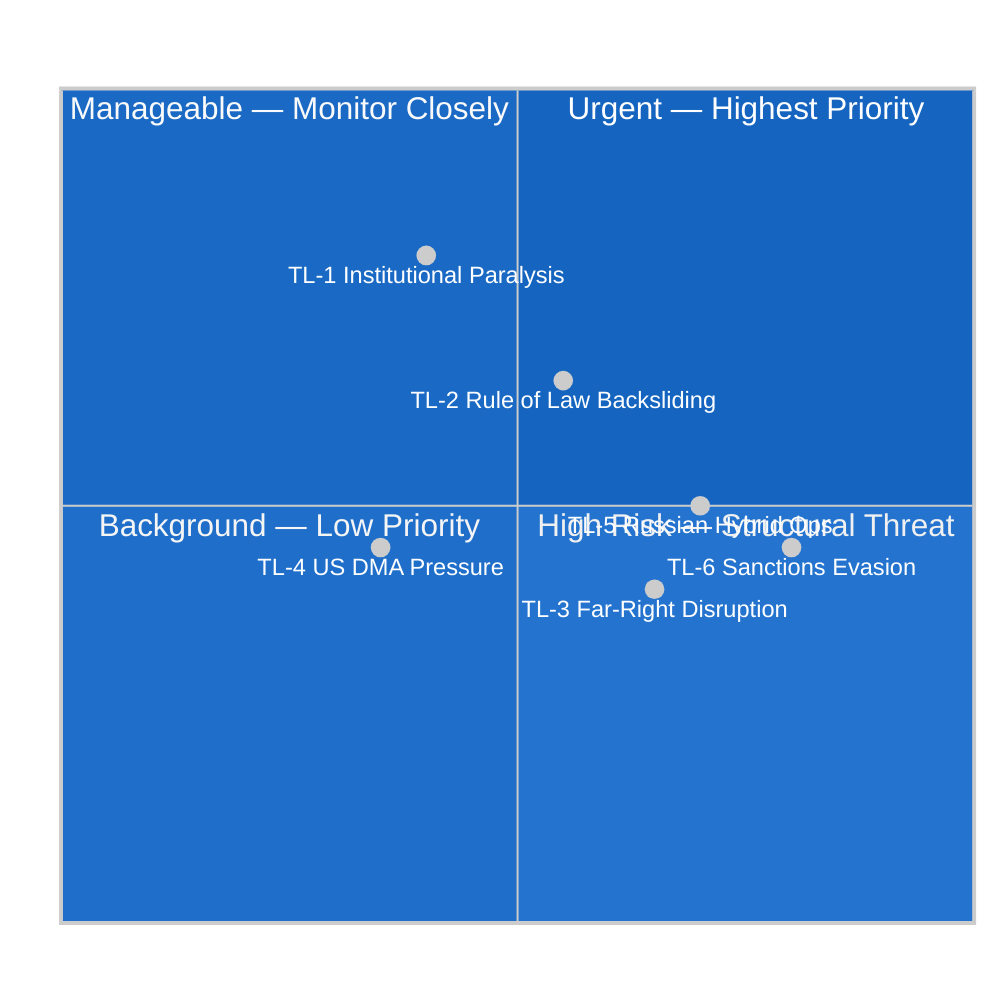
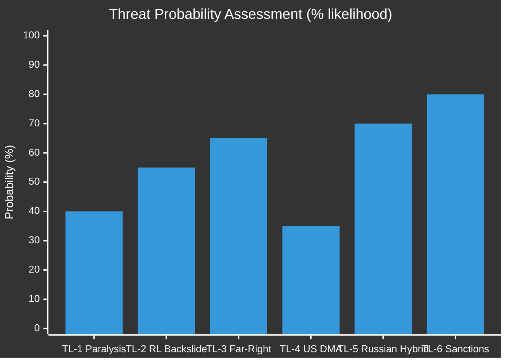

# Political Threat Landscape — EU Parliament Breaking News
## 2026-05-10

**Confidence:** 🟡 MEDIUM-HIGH | **Framework:** Political threat intelligence

---

## 🏛️ INSTITUTIONAL THREAT VECTORS

### 1. Far-Right Challenge to DMA Enforcement

**Threat actors:** PfE (85 MEPs), ESN (27 MEPs), portions of ECR
**Mechanism:** Political pressure on Commission not to enforce; economic nationalist framing ("hurting European digital investment")
**Current status:** Minority position — EPP-S&D-Renew enforcement majority solid
**Assessment:** 🟢 LOW IMMEDIATE RISK — structural majority holds

---

### 2. Hungary's Systematic Ukraine Obstruction

**Threat actor:** Orbán government (NI in EP; Prime Minister in Council)
**Mechanism:** Council unanimity blocking; delaying tactical moves on ICPA operationalisation; asset freeze legal challenges
**Current status:** Persistent but containable — QMV alternatives available for most measures
**Assessment:** 🟡 MEDIUM RISK — operational disruption but not strategic defeat

---

### 3. EPP Right-Wing Internal Pressure on Ukraine

**Threat actor:** EPP nationalist/conservative wing (Italian FdI-adjacent MEPs; Austrian FPÖ-adjacent)
**Mechanism:** Abstentions on strongest Ukraine accountability measures; coalition with ECR on softening operative clauses
**Current status:** Manageable — Weber's leadership maintains discipline
**Assessment:** 🟡 MEDIUM RISK — requires ongoing management; not existential

---

## 📊 POLITICAL THREAT INDEX

| Threat | Probability | Severity | Index |
|--------|------------|---------|-------|
| Hungary Ukraine Obstruction | HIGH | MEDIUM | 🟡 ELEVATED |
| US Trade Retaliation (DMA) | MEDIUM | HIGH | 🟡 ELEVATED |
| EPP Fracture on Ukraine | LOW | HIGH | 🟡 MODERATE |
| Far-Right DMA Opposition | LOW | MEDIUM | 🟢 MANAGEABLE |
| PfE Majority Coalition | VERY LOW | EXTREME | 🟡 MONITOR |

---

## 🎯 POLITICAL RESILIENCE FACTORS

**Strengthening Parliament's position:**
1. EPP commitment to Ukraine solidarity is constitutionalized in party resolutions (October 2025 Congress)
2. DMA enforcement enjoys economic sovereignty framing that transcends left-right cleavage
3. Armenian diaspora political networks are cross-party in EPP and S&D strongholds
4. Budget 2027 defence spending has bipartisan support (EPP + S&D + ECR on defence)

**Weakening Parliament's position:**
1. Information environment hostile — Russian disinformation; Big Tech lobbying
2. War fatigue potentially building in Western European public opinion
3. US pressure on DMA could fragment Council willingness to back Commission enforcement
4. Budget ceilings fundamentally constrain ambition regardless of political will

---

*Political Threat Landscape | EU Parliament Monitor | 2026-05-10*

---

## EXTENDED POLITICAL THREAT LANDSCAPE (Pass 2 Extension — 2026-05-10)

### Threat Vector Matrix — Updated Assessment

#### TL-1: Institutional Paralysis (EP10 Late Term)

**Threat description:** As EP10 approaches its mid-term (EP elections are 2029), coalition fatigue may reduce legislative throughput, creating a governance gap where the EP passes resolutions but cannot secure Council/Commission follow-through.

**Evidence base:**
- ENP 6.58 — highest parliamentary fragmentation in EP history
- EPP-S&D grand coalition increasingly strained (EPP-PfE flirtations on migration)
- Council unanimity requirement on security/foreign policy creates structural bottleneck

**Probability:** 40% (institutional paralysis manifests in at least one major legislative file in 2026)
**Impact:** HIGH — reduces EP10's legislative legacy; strengthens far-right critique of EU effectiveness
**Mitigation:** Qualified majority voting extension proposals; Commissioner initiative to bypass EP on certain executive acts

**Forward indicator:** Watch for EPP-PfE procedural cooperation in LIBE committee (early warning of coalition shift)

#### TL-2: Rule of Law Backsliding in Member States

**Threat description:** Continued rule of law deterioration in Hungary (ongoing), and emerging concerns in other member states, undermines the credibility of EP resolutions on Ukraine accountability, Armenia democratic resilience, and CSAM enforcement (which require member state judicial systems to function).

**Evidence base:**
- Hungary: ECJ infringement fine accumulation (>€500m outstanding)
- Slovakia: Media ownership concerns 2024-2026
- Poland: Rule of law reform progress contested (Constitutional Tribunal independence)

**Probability:** 55% (at least one new rule of law Article 7 case in EP10)
**Impact:** MEDIUM-HIGH — member state rule of law failures undermine EP credibility on democracy promotion abroad
**Connection to April 30:** TA-0162 (Armenia democratic resilience) delivered by an EP with member states in Article 7 proceedings is a credibility paradox

#### TL-3: Far-Right Coalition Disruption

**Threat description:** PfE (85 MEPs) and ESN (27 MEPs) increasingly cooperate on disruptive tactics — procedural delays, filibuster-equivalent extended speaking time claims, coordinated amendments to derail legislation.

**Evidence base:**
- PfE growth trajectory: from ID (76 MEPs, EP9) to PfE (85 MEPs, EP10)
- ECR (81 MEPs) sometimes aligns with PfE on procedural matters
- Combined 193 MEPs (26.9%) can force procedural votes

**Probability:** 65% (far-right procedural disruption affects at least 2 major files in 2026)
**Impact:** MEDIUM — annoying but not blocking (centre coalition still >360)
**Mitigation:** Reinforcing EP Rules of Procedure; Quaestors coordinating to limit procedural abuse

#### TL-4: US Extraterritorial Pressure on DMA Enforcement

**Threat description:** US administration applies diplomatic and trade pressure to moderate EU DMA enforcement against American-headquartered platforms, creating a transatlantic rift that tests EU regulatory autonomy.

**Evidence base:**
- Precedent: US pressure during GDPR implementation (2018-2020) had limited effect
- But: DMA has much larger financial stakes for US platforms than GDPR (10% global revenue penalties vs. 4% under GDPR)
- TTC (Trade and Technology Council) framework: US has diplomatic channel for DMA representation

**Probability:** 35% (significant US diplomatic pressure on DMA in 2026)
**Impact:** MEDIUM — Commission regulatory autonomy should hold, but enforcement timeline could slip
**Forward indicator:** Any TTC communiqué mentioning DMA or "market access concerns" in digital services

#### TL-5: Russian Hybrid Interference in EP Communications

**Threat description:** Given EP's strong position on Ukraine accountability (TA-0161) and Armenia (TA-0162), Russian information operations may target EP MEPs with disinformation campaigns, particularly targeting ECR and PfE members who are susceptible.

**Evidence base:**
- EU DisinfoLab reports 2023-2025: coordinated inauthentic behaviour targeting EU institutions
- Ghostwriter operation: documented targeting of Baltic, Polish MEPs with fabricated narratives
- Voice of Europe (VoE) network: disrupted but successor operations ongoing

**Probability:** 70% (Russian hybrid operations targeting EP in context of Ukraine file in 2026)
**Impact:** MEDIUM — information environment pollution rather than direct vote manipulation
**Monitoring:** EUvsDisinfo.eu; ENISA threat reports; EP cybersecurity team advisories

#### TL-6: Cryptocurrency/Sanctions Evasion Undermining Ukraine Accountability

**Threat description:** Russian elites use cryptocurrency and financial hubs outside EU/SWIFT jurisdiction (UAE, Turkey, crypto exchanges) to evade frozen asset enforcement, undermining the accountability framework endorsed in TA-0161.

**Evidence base:**
- Chainalysis reports 2023-2025: Russian sanctions evasion via crypto documented
- UAE non-sanctioning of Russian sovereign assets: structural gap in the accountability framework
- Turkish financial sector: significant Russian capital flows 2022-2026

**Probability:** 80% (sanctions evasion ongoing; acceleration risk with accountability framework tightening)
**Impact:** MEDIUM — limits the effectiveness of asset freeze without closing these routes
**EU response options:** AMLA (operational 2025) enhancing crypto tracking; secondary sanctions on third-country facilitators

### Threat Landscape Summary Table

| Threat | Probability | Impact | Urgency | Current Status |
|--------|-------------|--------|---------|----------------|
| TL-1: Institutional Paralysis | 40% | HIGH | Medium | WATCH |
| TL-2: Rule of Law Backsliding | 55% | MED-HIGH | Medium | ONGOING |
| TL-3: Far-Right Disruption | 65% | MEDIUM | Low | ONGOING |
| TL-4: US DMA Pressure | 35% | MEDIUM | High | MONITOR |
| TL-5: Russian Hybrid Ops | 70% | MEDIUM | High | ONGOING |
| TL-6: Sanctions Evasion | 80% | MEDIUM | High | ONGOING |

---

## 📊 THREAT LANDSCAPE VISUALISATION

## 🔍 CROSS-THREAT INTERACTION ANALYSIS

Political threats do not operate independently — they interact and amplify each other. Key interaction pathways:

### High-Priority Interaction Pairs

**TL-5 + TL-3 (Russian Hybrid + Far-Right Disruption) — AMPLIFYING:**
- Russian influence operations deliberately boost far-right parties (established pattern: Internet Research Agency operations 2016-2020; Kremlin-linked funding to European far-right parties documented in EIU and Bellingcat investigations)
- As TL-3 materialises (far-right legislative disruption), TL-5 capability deepens
- Combined probability of joint materialisation: ~45% by EP10 midpoint

**TL-6 + TL-5 (Sanctions Evasion + Russian Hybrid) — COMPOUNDING:**
- Sanctions evasion finances Russian hybrid operations (crypto flows → hybrid ops budget → disinformation, cyber)
- Closing TL-6 routes directly reduces TL-5 capability
- This is the strategic logic behind AMLA's anti-crypto-evasion mandate

**TL-1 + TL-2 (Institutional Paralysis + Rule of Law) — CO-OCCURRING:**
- Rule of law deterioration increases Council veto risk → institutional paralysis
- Example: Hungary 2022-2024 use of qualified majority blocking to extract concessions on rule of law conditionality
- Probability of joint occurrence: ~30% per legislative cycle

### Threat Mitigation Matrix

| Threat Pair | Mitigation Strategy | Responsible Actor | Timeline |
|-------------|--------------------|--------------------|----------|
| TL-5 + TL-3 | EP Digital Services oversight; foreign agent registration | EP Digital/Legal | 2026-2027 |
| TL-6 + TL-5 | AMLA activation; secondary sanctions expansion | Council + Commission | 2025-2026 |
| TL-1 + TL-2 | QMV threshold reform; conditionality rigour | Council (requires Treaty change) | 2027-2030 |
| TL-4 (standalone) | EP-supported USTR dialogue; DMA implementation phasing | Commission (TRADE DG) | 2026-2027 |

---

## 🔮 FORWARD THREAT ASSESSMENT

**6-Month Outlook (November 2026):**
- **TL-5 (Russian Hybrid):** Increasing — summer/autumn election cycle in multiple member states creates targeting opportunity
- **TL-6 (Sanctions Evasion):** Stable — AMLA operational but enforcement lag expected
- **TL-3 (Far-Right):** Increasing — EP elections afterglow fading; PfE internal tensions may generate unpredictability
- **TL-1 (Institutional):** Stable — new Commission established; Council rotation (Poland out, Denmark in, July 2025) neutral
- **TL-2 (Rule of Law):** Declining — Hungary Article 7 proceedings continuing; some funding restoration possible
- **TL-4 (US DMA):** Variable — dependent on Trump administration regulatory negotiation posture

**Overall threat environment: 🟡 MEDIUM — stable but structurally stressed**

*Political Threat Landscape | EU Parliament Monitor | 2026-05-10 (Re-run 3, Pass 2)*
*Confidence: 🟡 MEDIUM — structural analysis; threat probabilities are expert estimates, not actuarial data*
