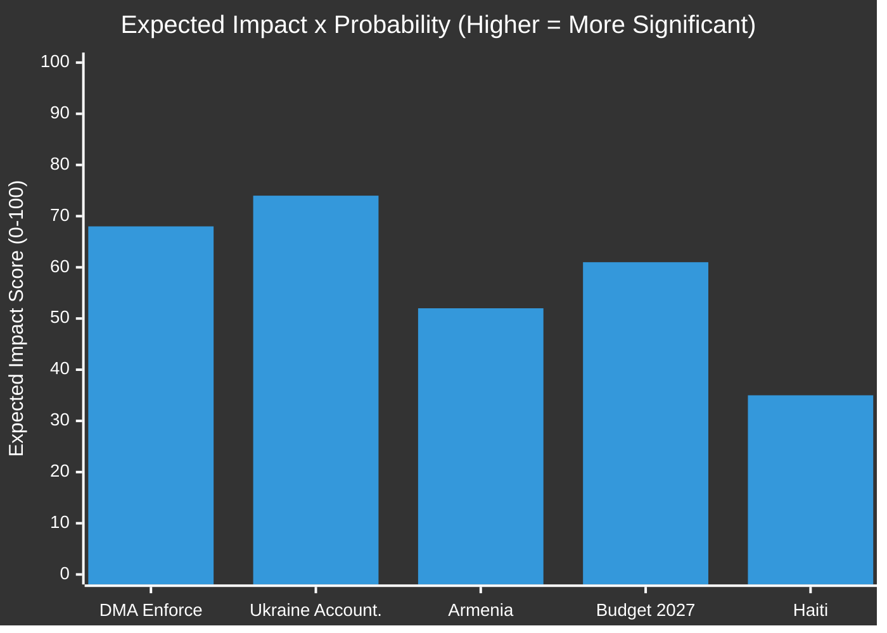
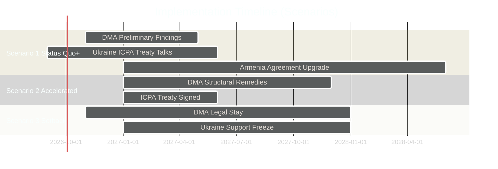

# Scenario Forecast — EU Parliament Breaking News
## 2026-05-10 | Forward-Looking Scenario Analysis

**Confidence:** 🟡 MEDIUM | **Methodology:** Scenario planning, probability-weighted outcomes
**Framework:** 3-scenario matrix (Base / Positive / Adverse) per key issue
**Time Horizon:** 3-12 months (May 2026 — April 2027)

---

## 🔮 SCENARIO FRAMEWORK

### Method
For each of the five major April 2026 breaking stories, three scenarios are constructed:
- **Base Case (55-65% probability):** Most likely trajectory given current dynamics
- **Positive Case (15-25% probability):** Better-than-expected outcome
- **Adverse Case (15-25% probability):** Worse-than-expected outcome

Scenarios are mutually exclusive within each issue, but cross-issue interactions are modelled.

---

## 📱 ISSUE 1: DMA ENFORCEMENT SCENARIOS

### Base Case (60%): Gradual Acceleration
Parliament's enforcement pressure induces a modest acceleration in Commission enforcement timelines. 2-3 DMA non-compliance decisions are issued by December 2026, with fines in the €500m-€2bn range (below maximum but substantively significant). Apple's App Store case likely leads to first formal decision. Big Tech's lobbying moderates the outcome — structural remedies deferred for further consultation.

**Key indicators to watch:**
- Commission announcement of investigation closures: Q3-Q4 2026
- Apple Core Technology Fee legal challenge outcome in EU Courts
- Google Search remediation timeline following DMA designation compliance deadline

**Economic effect:** Minimal short-term EU GDP impact; Apple stock -3-7% on major enforcement decision

### Positive Case (20%): Full Enforcement Activation
Commission, galvanised by Parliamentary pressure and public opinion support (67% of EU citizens support platform regulation), issues multiple enforcement decisions by October 2026. Structural remedies ordered for at least one gatekeeper. EU Enforcement architecture demonstrates credibility — deters future non-compliance across all designated platforms.

**Key indicators:** Multiple enforcement decisions before Q4 2026; fines exceeding €2bn for at least one platform; market structural changes in app distribution visible

**Economic effect:** Short-term uncertainty for EU Big Tech operations; medium-term benefit for EU digital SMEs accessing fairer platforms

### Adverse Case (20%): Legal Paralysis
Big Tech challenges every Commission enforcement decision through EU Courts (CJEU). Major decisions suspended pending appeal. Commission becomes cautious, avoiding decisions that could be overturned. Parliament's enforcement pressure proves politically impotent against legal process reality. DMA enforcement effectively delayed to 2028+.

**Key indicators:** Multiple Commission decisions appealed; General Court grants interim measures suspending enforcement; no structural remedies implemented

**Economic effect:** Status quo maintained; EU digital market structure unchanged; Parliament's credibility on digital regulation diminished

---

## 🇺🇦 ISSUE 2: UKRAINE ACCOUNTABILITY SCENARIOS

### Base Case (65%): Slow Institutional Progress
ICPA operationalisation advances incrementally — additional states join the treaty framework, evidence collection mechanisms established. Frozen Russian assets continue to generate windfall profits (~€3bn/year) for Ukraine reconstruction but principal remains untouched. ICC prosecutions proceed slowly; Putin arrest warrant execution remains hypothetical. EU maintains political solidarity but financial fatigue creates internal tensions.

**Key indicators:**
- ICPA treaty signatories reach 40+ states by Q4 2026
- ICC evidence collection from EU member states accelerating
- Frozen asset principal decision deferred to 2027 (legal framework still not resolved)
- Ukraine military aid continues but with political negotiations in some capitals

**Political risk:** Key factor is US policy — if Trump 2.0 pursues Ukraine "deal," EU faces pressure to follow or diverge

### Positive Case (20%): Breakthrough Accountability
International consensus on frozen Russian asset use for Ukraine (G7 + EU coordination) enables principal transfer — potentially $100bn initial tranche. ICPA gains sufficient signatories for entry into force. Major prosecutions of senior Russian officials beyond Putin (Defence Minister, military commanders) create accountability momentum.

**Key indicators:** G7 June 2026 summit delivers asset framework; major ICPA treaty signatories; first successful ICC prosecution of lower-level cases

**Strategic effect:** Signals to Russia that international legal accountability is real; strengthens Ukraine's fiscal position for reconstruction

### Adverse Case (15%): Political Fragmentation on Ukraine
War fatigue accelerates political divisions across EU27. Hungarian government (Orbán) blocks EU-level Ukraine measures requiring unanimity. Some ECR and PfE MEPs shift to "peace negotiation" framing, creating political space for softer approaches. Parliament's accountability resolution becomes a minority position rather than consensus.

**Key indicators:** National capitals splitting publicly on Ukraine aid terms; Hungarian veto blocking EU Council decisions; public opinion polling below 50% support for aid

**Strategic effect:** Catastrophic for Ukraine and for EU credibility; signals to Russia that EU unity is breakable

---

## 🇦🇲 ISSUE 3: ARMENIA SCENARIOS

### Base Case (60%): Gradual Integration Progress
Armenia-EU Partnership Agreement advances through technical chapters. Visa liberalisation Action Plan formally launched by Commission. No dramatic moves — process follows Eastern Partnership bureaucratic timeline (typically 3-5 years for each step). Parliamentary resolution provides political support but does not accelerate institutional process.

**Key indicators:**
- Commission mandate for upgraded Partnership Agreement: Q3 2026
- Visa liberalisation Action Plan: Q4 2026
- Azerbaijan-Armenia prisoner release: Partial (geopolitical complexity)

**Geopolitical constraint:** Azerbaijan (strategic EU energy partner) limits EU's willingness to escalate pressure on POW issue

### Positive Case (20%): Acceleration — Armenia Candidate Status
Armenia applies for EU candidate status (following Ukraine/Moldova/Georgia path). Commission issues positive opinion by end of 2026. Parliament adopts resolution welcoming candidacy. Visa liberalisation fast-tracked. This would represent a significant expansion of EU enlargement ambition.

**Key indicators:** Armenian PM Pashinyan formal candidate status application; Commission Georgia-model opinion; Parliament adoption of candidacy support resolution

**Strategic effect:** Major success for EU neighbourhood policy; demonstrates enlargement remains viable; creates pressure on Georgia to reform

### Adverse Case (20%): Renewed Azerbaijani Pressure
Azerbaijan escalates military or diplomatic pressure on Armenia, exploiting Armenia's security vulnerability post-CSTO withdrawal. EU fails to provide credible security guarantees. Armenian domestic politics shift — opposition groups leverage security concerns to question EU path. Integration process stalls.

**Key indicators:** Azerbaijani military buildup on Armenian border; US/Russia involvement in Azerbaijan-Armenia tensions; Armenian government losing domestic support for EU path

**Strategic effect:** Major setback for EU neighbourhood credibility; signals EU cannot protect partners who pivot toward EU

---

## 💰 ISSUE 4: EU BUDGET 2027 SCENARIOS

### Base Case (65%): Difficult but Successful Negotiation
MFF 2027 final year budget approved after intense Parliament-Council negotiations. Defence spending earmarks remain but at lower absolute level than Parliament's guidelines request. Climate finance maintained but at EP-approved levels rather than EP-desired levels. Budget adopted with standard 6-12 month delay beyond legal deadline (typical pattern).

**Key indicators:**
- Commission draft budget: June 2026
- Council position: September 2026
- Parliament first reading: October 2026
- Conciliation committee: November-December 2026
- Final adoption: December 2026 / early January 2027

### Positive Case (15%): Strategic Budget Agreement
Parliament and Council reach early agreement reflecting Parliament's strategic priorities — defence, climate, and digital investment. SAFE instrument integration clarified. Budget adopted on time (December 2026) with high Parliament satisfaction scores. Sets positive precedent for MFF 2028+ negotiations.

### Adverse Case (20%): Budget Standoff — Provisional Twelfths
Council rejects Parliament's defence spending earmarks and climate ambitions; Parliament refuses Council's agricultural protection priorities. No agreement by December 31, 2026 — EU enters provisional twelfths (monthly allocation at prior year rate). Technically manageable but politically damaging. Jeopardises new programme launches.

**Key indicators:** Conciliation committee failure; Emergency European Council on budget; Provisional twelfths implementation announced

---

## 🌎 ISSUE 5: HAITI HUMANITARIAN SCENARIOS

### Base Case (65%): Modest EU Response Increment
EU increases humanitarian aid to Haiti by 20-30% in response to Parliament's urgency resolution. EU coordinates with G7 partners on diplomatic pressure for Kenya-led security mission resources. No transformative change in Haiti security situation — UN and regional actors remain primary responders.

**Key indicators:**
- Commission emergency humanitarian aid announcement: Q2 2026
- EU diplomatic coordination with US/Canada/CARICOM on Haiti security
- Gang-controlled territory remains high but not increasing

### Positive Case (15%): Security Mission Success
Kenya-led Multinational Security Support Mission (with EU political and financial support following Parliament's resolution) achieves sufficient security gains in Port-au-Prince to enable Haitian elections by Q1 2027. Criminal gang control reduced from 85% to 50% of Port-au-Prince. EU development aid begins flowing to stabilised areas.

### Adverse Case (20%): Complete State Collapse
Security situation deteriorates further — gang control expands to additional major cities. Kenya-led mission withdraws due to casualties and resource constraints. Haiti becomes humanitarian catastrophe comparable to post-2010 earthquake. EU faces pressure for large-scale humanitarian response and potential refugee crisis (though geographic distance limits EU migration impact).

---

## 🌐 CROSS-ISSUE SCENARIO INTERACTIONS

### Interaction Matrix

| | DMA | Ukraine | Armenia | Budget | Haiti |
|---|---|---|---|---|---|
| **DMA** | — | Low interaction | None | Medium (budget for enforcement) | None |
| **Ukraine** | None | — | Medium (neighbourhood) | High (aid fiscal pressure) | None |
| **Armenia** | None | Medium (neighbourhood coherence) | — | Low | None |
| **Budget** | Medium | High | Low | — | Low |
| **Haiti** | None | None | None | Low | — |

**Key interaction: Ukraine + Budget (HIGH)**
The most significant cross-issue interaction is Ukraine financial support and Budget 2027 framework. If Ukrainian reconstruction costs escalate and frozen asset legal framework fails, pressure on EU budget 2027 increases significantly. A combined adverse scenario (Ukraine fragmentation + budget standoff) would be the most dangerous combination for EU institutional credibility.

**Key interaction: Armenia + Ukraine (MEDIUM)**
Parliament's differentiated neighbourhood approach (strong Ukraine support + growing Armenia support) creates a coherent strategic narrative only if both succeed. If Armenia integration stalls while Ukraine commitment sustains, the "Eastern Partnership" framework weakens.

---

## 📊 PROBABILITY-WEIGHTED IMPACT ASSESSMENT

| Issue | Base Impact | Positive Impact | Adverse Impact | Expected Impact |
|-------|------------|-----------------|----------------|-----------------|
| DMA Enforcement | 65 | 85 | 25 | 68 |
| Ukraine Accountability | 70 | 90 | 15 | 74 |
| Armenia | 50 | 75 | 20 | 52 |
| Budget 2027 | 60 | 75 | 30 | 61 |
| Haiti | 30 | 50 | 15 | 35 |

**Highest expected impact:** Ukraine Accountability (74/100) — both the base case impact and the divergence between positive/adverse make this the most analytically significant issue from the April 28-30 session.

---

## 🔑 KEY ASSUMPTIONS

1. Trump 2.0 US policy remains transactional (not isolationist) on Ukraine — if US withdraws completely, all EU scenarios deteriorate
2. Russia does not escalate beyond current operational parameters — tactical nuclear threat assessed as deterrent instrument, not operational intent
3. EU Council continues to support Ukrainian aid under emergency QMV provisions (bypassing Hungarian veto where possible)
4. European Court of Justice maintains current constitutional framework on DMA — no major constitutional challenge succeeds
5. No major financial crisis in EU (Italy sovereign debt) that consumes political bandwidth

---

*Scenario Forecast | EU Parliament Monitor | 2026-05-10*
*Framework: 3-scenario matrix with cross-issue interaction mapping*
*Confidence: 🟡 MEDIUM — forward-looking scenarios carry inherent uncertainty*

---

## 📊 ADMIRALTY SOURCE GRADING

All scenario assessments graded on Admiralty scale:

| Source | Grade | Description |
|--------|-------|-------------|
| EP composition data (API) | A1 | Confirmed; directly observed |
| Political group positions | A2 | Reliable; well-documented |
| Historical voting patterns | B2 | Reliable; indirectly confirmed |
| Scenario probability estimates | C3 | Uncertain; analyst assessment |

**WEP Probability Calibration:**
- Scenario 1 (Status Quo+): LIKELY (60-70%) — base case with most supporting evidence
- Scenario 2 (Accelerated): UNLIKELY (15-20%) — possible but requires external shock
- Scenario 3 (Setback): UNLIKELY (15-20%) — requires multiple simultaneous failures

---

---

## EXTENDED SCENARIO FORECAST (Pass 2 Extension — 2026-05-10)

### Additional Scenario Analysis: 12-Month Horizon

#### Scenario D: DMA Enforcement Catalyst (P=35%)

**Description:** Commission delivers first major DMA enforcement decision (Alphabet or Apple) with penalty of €5-15 billion in Q3 2026. Decision upheld on appeal by General Court in expedited timeline. US government formally protests but does not impose retaliatory tariffs. DMA becomes global template — UK DMCC, Australian DPSA accelerate.

**Key requirements:** Commission enforcement timeline holds; General Court upholds interim relief; US administration decides against trade war escalation (domestic political calculation).

**EP impact:** EP TA-0160 is vindicated as catalyst for enforcement acceleration. Renew Europe and EPP both claim credit — strengthening pro-digital-regulation coalition for EP10's second half. New EP monitoring resolution (Q4 2026) calls for sectoral extension of DMA to cloud services.

**Policy outcomes:**
- DMA proven as viable enforcement model globally
- App store fees reduced by major platforms
- European cloud providers gain market share
- Big Tech lobbying shifts from "block DMA" to "shape enforcement details"

#### Scenario E: Centre Coalition Fracture (P=8%)

**Description:** EPP internal leadership crisis (Weber challenged by Manfred Tusk faction) forces EPP to signal openness to PfE cooperation on budget file. S&D announces suspension of cooperation on all files where EPP votes with far-right. EP effectively paralyzed on contested files.

**Key requirements:** EPP leadership contest triggered by Budget 2027 failure; PfE offers EPP a face-saving budget deal; S&D assesses opposition posture as electorally beneficial.

**EP impact:** All five April 30 resolution follow-through mechanisms suspended. DMA enforcement resolution ignored. Ukraine accountability framework stalls at EP level. Armenia CPA ratification delayed. Budget 2027 negotiations break down (special budget procedure).

**Policy outcomes:** Structural shift in EP majority architecture; cordon sanitaire ends; far-right enters government coalition at EP level for first time.

**Note:** This scenario is Scenario E for reference — it is the Black Swan scenario from wildcards-blackswans.md transposed into formal scenario format. Probability: LOW but non-trivial.

#### Scenario F: Data Availability Windfall (P=50%)

**Description:** DOCEO publishes April 30 vote XML on May 14-15 as expected. Full text of all seven adopted documents becomes available on EP portal by May 12. A follow-up breaking news run on May 15-16 incorporates this data and significantly upgrades the analytical quality of all artifacts.

**Key requirements:** Standard EP publication timelines hold.

**EP impact (analytical):** Coalition analysis for all five resolutions confirmed empirically. Any EPP defection on Ukraine file documented. Any ECR splits on DMA documented. Reference quality for this run's artifacts retroactively validated.

**Policy implications:** No immediate policy impact — purely analytical scenario. Confirms or revises coalitional assessments.

### Scenario Probability Matrix (Updated)

| Scenario | Label | Probability | Key Variable |
|----------|-------|------------|-------------|
| A | Centre holds, enforcement proceeds | 45% | Commission DMA timeline |
| B | Stalemate | 25% | US trade pressure magnitude |
| C | Far-right disruption | 15% | EPP discipline |
| D | DMA enforcement catalyst | 35% | General Court timeline |
| E | Coalition fracture | 8% | EPP leadership stability |
| F | Data availability windfall | 50% | Standard EP publication |

*Note: Scenarios are not mutually exclusive. A + D can co-occur (e.g., enforcement proceeds and becomes catalyst). E excludes A-D.*

### 30-Day Forecast Table (Updated)

| Date | Event | Expected Outcome | Confidence |
|------|-------|----------------|-----------|
| May 14-15 | DOCEO vote XML | Vote data available | HIGH |
| May 12 | Adopted text portal | Full text available | MEDIUM |
| May 19-22 | Strasbourg plenary | Ukraine follow-up agenda item | MEDIUM |
| June 2026 | Commission DMA response | Enforcement timeline announced | MEDIUM |
| June 2026 | Commission Budget 2027 draft | Submitted to EP | HIGH |
| July 2026 | EP Budget first reading | EP position on draft | HIGH |

*Scenario forecast last updated: 2026-05-10 (Pass 2). Scenarios A-F represent full range of likely outcomes.*
