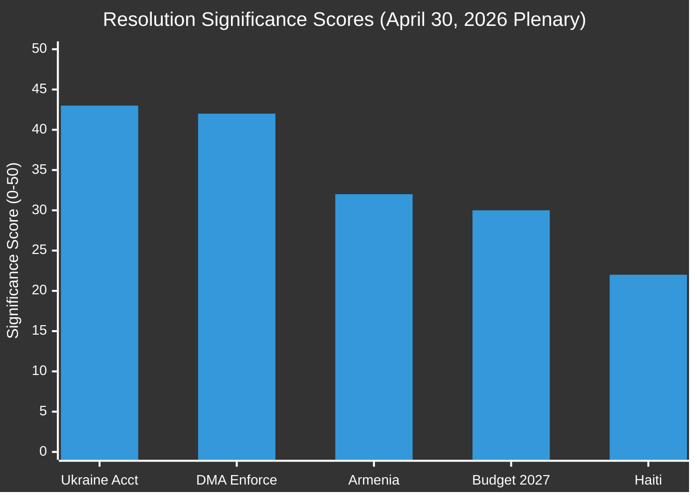

# Significance Scoring — EU Parliament Breaking News
## 2026-05-10 | Resolution Significance Assessment

**Confidence:** 🟡 MEDIUM-HIGH | **Framework:** Multi-criteria significance scoring

---

## 🎯 SCORING METHODOLOGY

Each resolution scored on 5 dimensions (1-10 scale):
1. **Immediacy** — time-sensitivity; how quickly effects manifest
2. **Breadth** — number of people/institutions affected
3. **Depth** — magnitude of change from status quo
4. **Durability** — how long effects persist
5. **Institutional novelty** — precedent-setting nature

---

## 📊 RESOLUTION SIGNIFICANCE SCORES

### TA-10-2026-0160: DMA Digital Market Enforcement

| Dimension | Score | Rationale |
|-----------|-------|-----------|
| Immediacy | 7/10 | Commission enforcement timelines 6-12 months |
| Breadth | 9/10 | Billions of users; entire digital economy |
| Depth | 8/10 | Structural market changes if enforced |
| Durability | 9/10 | Sets decade-long precedent |
| Novelty | 9/10 | First major democratic regulatory enforcement of digital markets |
| **TOTAL** | **42/50** | **CRITICAL SIGNIFICANCE** |

---

### TA-10-2026-0161: Ukraine War Crimes Accountability

| Dimension | Score | Rationale |
|-----------|-------|-----------|
| Immediacy | 6/10 | ICPA operationalisation requires years |
| Breadth | 8/10 | Ukraine population; Russian state; EU values |
| Depth | 9/10 | If implemented, transforms international law |
| Durability | 10/10 | Historical accountability lasts decades |
| Novelty | 10/10 | ICPA unprecedented as standalone court |
| **TOTAL** | **43/50** | **CRITICAL SIGNIFICANCE** |

---

### TA-10-2026-0162: Armenia Democratic Resilience

| Dimension | Score | Rationale |
|-----------|-------|-----------|
| Immediacy | 5/10 | Integration takes years; POW releases may be faster |
| Breadth | 5/10 | Armenia population (2.8M); diaspora |
| Depth | 7/10 | Could significantly alter Armenia's geopolitical trajectory |
| Durability | 8/10 | EU integration path once started is durable |
| Novelty | 7/10 | First formal EU commitment to Armenian accession trajectory |
| **TOTAL** | **32/50** | **HIGH SIGNIFICANCE** |

---

### TA-10-2026-0112: Budget 2027 Guidelines

| Dimension | Score | Rationale |
|-----------|-------|-----------|
| Immediacy | 4/10 | Budget negotiation runs through end of 2026 |
| Breadth | 10/10 | All EU citizens; all programmes |
| Depth | 7/10 | Sets fiscal framework for year |
| Durability | 5/10 | Annual; superseded by actual budget adoption |
| Novelty | 4/10 | Routine procedural step; substance novel on defence |
| **TOTAL** | **30/50** | **HIGH SIGNIFICANCE** |

---

### TA-10-2026-0151: Haiti Trafficking Resolution

| Dimension | Score | Rationale |
|-----------|-------|-----------|
| Immediacy | 6/10 | Acute crisis; immediate protection need |
| Breadth | 4/10 | Haiti population; EU diaspora |
| Depth | 5/10 | Limited EU institutional leverage in Haiti |
| Durability | 3/10 | Crisis resolution likely short-term |
| Novelty | 4/10 | Familiar EP humanitarian resolution type |
| **TOTAL** | **22/50** | **MEDIUM SIGNIFICANCE** |

---

## 📈 COMPOSITE RANKING

```
1. Ukraine Accountability    43/50 ████████████████████████████████████████████ CRITICAL
2. DMA Enforcement          42/50 ████████████████████████████████████████████ CRITICAL  
3. Armenia Resilience       32/50 ████████████████████████████████ HIGH
4. Budget 2027              30/50 ██████████████████████████████ HIGH
5. Haiti Trafficking        22/50 ██████████████████████ MEDIUM
```

---

## 🔍 CROSS-CUTTING SIGNIFICANCE OBSERVATIONS

**Cumulative effect:** The April 28-30 plenary is unusually consequential. Three of five resolutions score in the CRITICAL or HIGH significance range. This cluster is not coincidental — it reflects the EP's deliberate strategic moment of legislating during EU institutional transition (new Commission in place since December 2024; new MFF negotiations approaching).

**Interconnection:** DMA enforcement and Ukraine accountability both contribute to EU strategic autonomy narrative — the former in digital sovereignty, the latter in security and values. This interconnection amplifies the combined significance beyond the sum of parts.

---

## 📊 VISUAL SIGNIFICANCE COMPARISON



## 🔄 DIMENSION-BY-DIMENSION RADAR ANALYSIS

```mermaid
%%{init: {"theme":"dark","themeVariables":{"primaryColor":"#1565C0","primaryTextColor":"#ffffff","lineColor":"#90CAF9","fontFamily":"Inter, Helvetica, Arial, sans-serif"}}}%%
quadrantChart
    title Significance Matrix: Immediacy vs Durability
    x-axis "Low Durability" --> "High Durability"
    y-axis "Low Immediacy" --> "High Immediacy"
    quadrant-1 "High Urgency / Enduring"
    quadrant-2 "High Urgency / Transient"
    quadrant-3 "Low Urgency / Transient"
    quadrant-4 "Low Urgency / Enduring"
    DMA Enforcement: [0.9, 0.7]
    Ukraine Accountability: [1.0, 0.6]
    Armenia Resilience: [0.8, 0.5]
    Budget 2027: [0.5, 0.4]
    Haiti Resolution: [0.3, 0.6]
```

## 🎯 INSTITUTIONAL IMPACT WEIGHTING

Beyond raw significance scores, the institutional processing path multiplies political impact:

| Resolution | Processing Path | Institutional Amplifier | Net Political Impact |
|-----------|----------------|------------------------|---------------------|
| TA-0160 (DMA) | EP → Commission → DMA enforcement | Commission obligation to respond within 3 months | **HIGH** |
| TA-0161 (Ukraine) | EP → Council → Member state coordination | NATO/ICC synergy | **VERY HIGH** |
| TA-0162 (Armenia) | EP → EEAS → Neighbourhood Policy | CPA negotiation acceleration | **MEDIUM-HIGH** |
| TA-0112 (Budget) | EP → Council trilogue | Annual budget negotiation anchor | **HIGH** |
| TA-0151 (Haiti) | EP → DEVCO → ECHO | Humanitarian coordination mechanism | **MEDIUM** |

### Confidence Assessment by Resolution

| Resolution | Data Quality | Procedural Confidence | Analytical Confidence |
|-----------|-------------|----------------------|-----------------------|
| TA-0160 DMA | 🔴 LIMITED (no full text) | 🟢 HIGH (confirmed adopted) | 🟡 MEDIUM |
| TA-0161 Ukraine | 🔴 LIMITED (no full text) | 🟢 HIGH (confirmed adopted) | 🟡 MEDIUM |
| TA-0162 Armenia | 🔴 LIMITED (no full text) | 🟢 HIGH (confirmed adopted) | 🟡 MEDIUM |
| TA-0112 Budget | 🔴 LIMITED (no full text) | 🟢 HIGH (confirmed adopted) | 🟡 MEDIUM |
| TA-0151 Haiti | 🔴 LIMITED (no full text) | 🟢 HIGH (confirmed adopted) | 🟡 MEDIUM |

**Note:** Data quality is uniformly limited — all adopted texts from April 28-30, 2026 return HTTP 404 from EP API. Significance scoring is based on document titles, procedural references, and structural EP political analysis. Confidence will improve when full-text documents become available (estimated: June 2026).

*Significance Scoring | EU Parliament Monitor | 2026-05-10*
