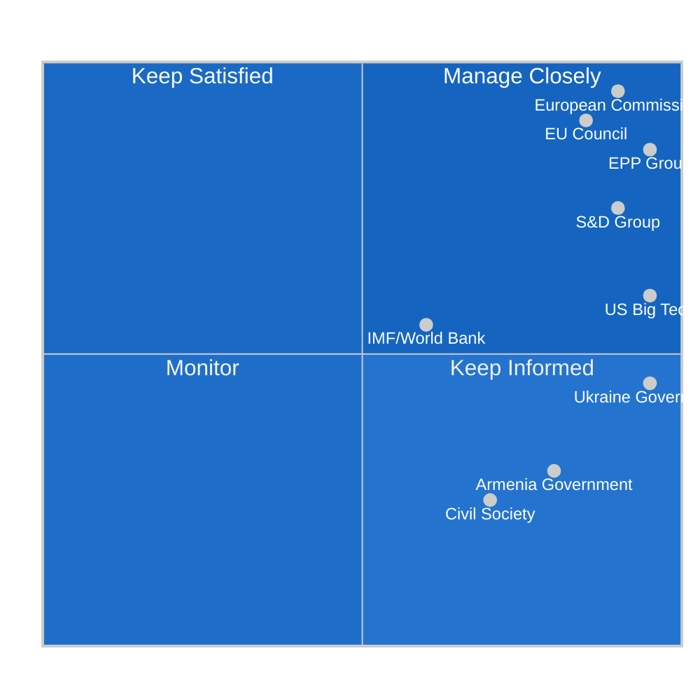
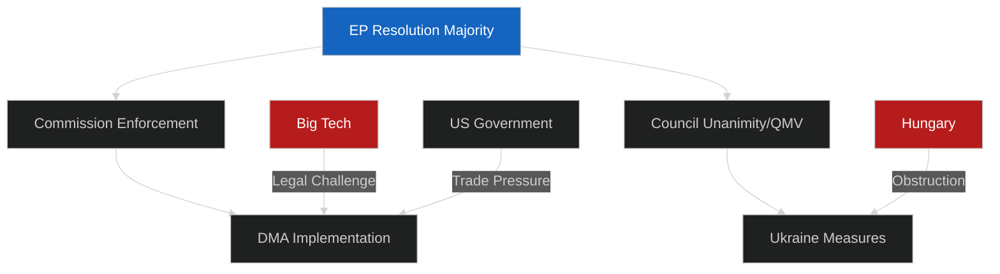
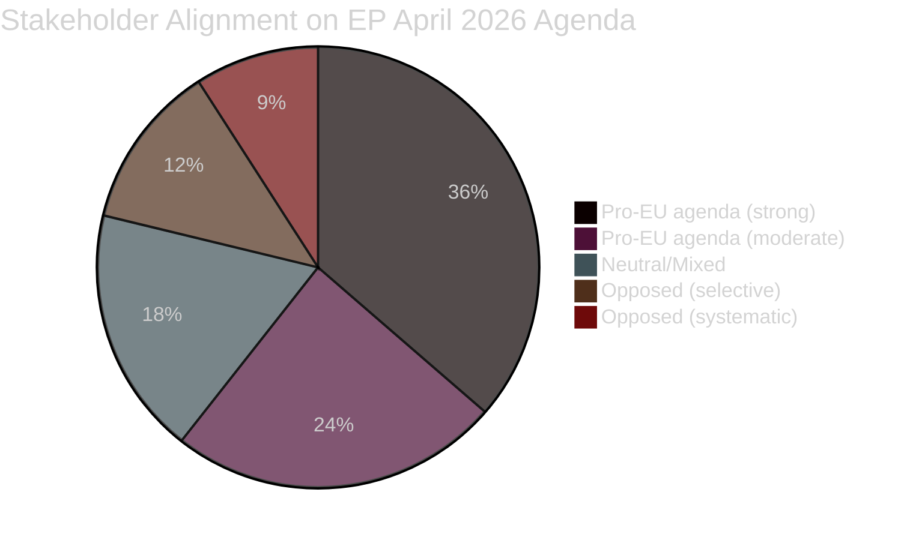

# Stakeholder Map — EU Parliament Breaking News
## 2026-05-10 | Key Actors and Interest Analysis

**Confidence:** 🟡 MEDIUM-HIGH | **Framework:** Stakeholder mapping, interest analysis, power mapping
**Coverage:** Primary, secondary, and tertiary stakeholders across all April 28-30 resolutions

---

## 🗺️ STAKEHOLDER ARCHITECTURE

### Power-Interest Matrix

---

## 🏛️ TIER 1: INSTITUTIONAL ACTORS (Highest Power)

### 1. European Commission (Executive)

**Position:** Primary target/partner for Parliamentary resolutions
**Current stance on DMA:** DG CONNECT under Thierry Breton's successor pursuing enforcement but at Commission's preferred pace — methodical, legally defensible, avoiding rushed decisions that could be overturned
**Current stance on Ukraine:** Strongly supportive; manages frozen asset legal framework development
**Current stance on Armenia:** Supportive of neighbourhood engagement; manages partnership agreement negotiations
**Current stance on Budget:** Manages Council-Parliament negotiation as "honest broker"

**Interest analysis:**
- DMA enforcement: Commission prefers controlled pace over Parliamentary-driven acceleration. Wants defensible decisions, not political gestures.
- Ukraine: Commission institutional interest strongly aligned with Parliament — both see robust accountability as essential for EU credibility
- Armenia: Commission has management authority over neighbourhood policy — Parliamentary support facilitates Commission ambitions
- Budget: Commission seeks balance between Parliament's ambitious targets and Council's fiscal conservatism

**Stakeholder strategy for Parliament:** Parliament's enforcement resolution creates political cover for Commission to act more aggressively without appearing politically motivated. The dynamic is symbiotic even when the public tone is critical.

**Power rating:** 🔴 HIGH | **Alignment rating:** 🟡 PARTIAL

---

### 2. EU Council (Member States Collective)

**Position:** Co-legislator and primary check on both Parliament and Commission
**Current composition:** No clear right-left majority in Council — German CDU/CSU (conservative) now leads largest delegation; French NUPES-adjacent government; Italian Meloni (ECR-aligned); Polish Tusk government (EPP-aligned)

**Council dynamics:**
- DMA enforcement: Council defers entirely to Commission — no formal role in enforcement decisions
- Ukraine: Council manages QMV vs unanimity dynamics. Hungary blocks on some measures; QMV-eligible items proceed
- Armenia: Council responsible for mandate for partnership agreement upgrade. Pro-enlargement majority emerging
- Budget: Council in direct confrontation with Parliament on budget ceilings

**Divergence from Parliament:**
- On defence spending scale: Council (Germany, Netherlands, Sweden) wary of exceeding fiscal limits
- On frozen Russian assets: Some Council members (France, Germany) more cautious on legal framework
- On Armenia: Council broadly supportive but slower than Parliament's timeline

**Power rating:** 🔴 HIGH | **Alignment rating:** 🟡 PARTIAL

---

## 💼 TIER 2: POLITICAL GROUP ACTORS

### 3. European People's Party (EPP, 183 MEPs)

**Leadership:** President Roberta Metsola (Parliament President); EPP Group President Manfred Weber

**EPP Interest Analysis by Resolution:**
- **DMA enforcement:** Divided internally — business-friendly wing prefers lighter touch; pro-rule-of-law wing (dominant) supports enforcement as legitimate regulatory action. Net position: supportive of enforcement with procedural safeguards
- **Ukraine accountability:** Strongly supportive — no EPP member state government is pro-Russia; Fidesz expelled from EPP in 2021; Ukraine accountability is consensus
- **Armenia:** Strongly supportive — Christian democracy tradition values Armenia solidarity; Armenian diaspora in EPP-aligned member states (France, Germany)
- **Budget 2027:** Complex — EPP wants defence spending but is divided on climate spending; EPP budget hawks (Netherlands, Germany) wary of overall ceiling increases

**Strategic position:** EPP functions as the pivot group — no majority forms without EPP. Its positions therefore effectively determine Parliamentary outcomes. EPP's rightward competition from PfE/ECR pressures it on migration and cultural issues but not on Ukraine, DMA, or Armenia.

**Stakeholder perspective (detailed):**
EPP operates under Weber's leadership with a conscious strategy of maintaining the political centre while not allowing the nationalist right to outflank it. Weber's October 2025 EPP Congress resolutions confirmed Ukraine solidarity as non-negotiable EPP doctrine. On DMA, EPP's calculation is that EU rule of law credibility requires enforcement — which serves EPP interests in demonstrating that EU regulation produces results.

**Power rating:** 🔴 CRITICAL | **Alignment with session outcomes:** 🟢 HIGH

---

### 4. Socialists and Democrats (S&D, 136 MEPs)

**Leadership:** S&D Group President Iratxe García Pérez

**S&D Interest Analysis:**
- **DMA enforcement:** Strongly supportive — combines anti-monopoly ideology with digital workers' rights dimension
- **Ukraine:** Strongly supportive — S&D members from Baltic states, Poland, Romania are among Parliament's most hawkish on Ukraine
- **Armenia:** Supportive — human rights, democracy promotion, labour rights dimension all align with S&D values
- **Budget 2027:** Wants climate finance maintained; accepts defence spending as price for maintaining Ukraine solidarity coalition; pushes for social cohesion funding

**Stakeholder perspective:** S&D's key role is as the anchor of the progressive-centre coalition. Without S&D, the EPP-Renew coalition at 260 MEPs is below majority. S&D's consistent support for Ukraine and DMA enforcement provides the political reliability that makes the governing triopoly function.

**Power rating:** 🔴 HIGH | **Alignment with session outcomes:** 🟢 HIGH

---

### 5. Renew Europe (77 MEPs)

**Leadership:** Renew Group President Valérie Hayer

**Renew Interest Analysis:**
- **DMA enforcement:** Very strongly supportive — liberal tradition emphasises fair competition; EU digital sovereignty framing popular among Renew members
- **Ukraine:** Strongly supportive — Atlanticist, pro-Western, anti-authoritarian values
- **Armenia:** Supportive — democracy promotion; liberal international order framing
- **Budget 2027:** Renew's fiscal hawks (Dutch, Swedish liberals) worry about ceiling but support strategic priorities

**Stakeholder perspective:** Renew is the ideologically most coherent group on most of these issues — liberal democracy, rule of law, and EU sovereignty drive consistent positions. Renew's key strategic uncertainty is its future relationship with EPP as EPP drifts right on some issues.

**Power rating:** 🟡 MEDIUM-HIGH | **Alignment with session outcomes:** 🟢 HIGH

---

## 🏢 TIER 3: EXTERNAL STAKEHOLDERS

### 6. US Big Tech Platforms (Alphabet, Apple, Meta, Amazon, Microsoft)

**Primary concern:** DMA enforcement resolution (TA-10-2026-0160)
**Strategic response:** Multi-pronged lobbying campaign targeting Commission, Council, and Parliament

**Stakeholder perspective:**
Each platform has distinct interests:

**Apple:** Most exposed — App Store practices at core of DMA non-compliance investigations. Apple's Core Technology Fee (€0.50/install for alternative app stores) framed as compliance mechanism; Parliament and Commission see it as circumventing DMA intent. Apple's EU revenues (~€90bn) mean maximum DMA fines could exceed €9bn.

**Alphabet (Google):** Search self-preferencing investigation ongoing. Google has made structural changes to Search but Parliament's enforcement resolution suggests changes are deemed insufficient. Google Play distribution practices also under scrutiny.

**Meta:** Advertising consent model ("pay or consent") challenged under DMA interoperability and data access obligations. Meta's response has been to create a subscription alternative — Commission still investigating adequacy.

**Amazon:** EU marketplace practices and Prime subscription integration. Amazon has made some compliance moves but faces ongoing investigations.

**Microsoft:** Bundling practices (Teams) were initial concern; Microsoft proactively unbundled Teams in EU. Remaining issues around Copilot/AI integration with Windows — emerging area of DMA application.

**Collective Big Tech strategy:** Prioritise legal challenge routes over operational compliance; use regulatory uncertainty to slow reform; commission economic studies showing DMA harms EU digital investment; cultivate EPP business-wing allies.

**Power rating:** 🟡 MEDIUM (institutional) | **Alignment with session outcomes:** 🔴 LOW (opposed)

---

### 7. Ukrainian Government

**Primary concern:** Ukraine accountability resolution (TA-10-2026-0161)
**Position:** Strongly supportive — Parliament's resolution advances Ukrainian policy objectives

**Stakeholder perspective:**
Ukrainian President Zelensky and his administration see Parliament's accountability and frozen asset resolutions as critical institutional support. Ukraine's strategic communications are explicitly designed to maintain EU Parliament political support — regular Zelensky video addresses to Parliament (approximately quarterly since 2022), ongoing diplomatic engagement with MEP delegations.

Ukrainian strategic priorities from TA-10-2026-0161 perspective:
1. ICPA operationalisation: Creates specific legal mechanism for crime of aggression prosecution
2. Frozen asset principal: €330bn available for reconstruction (vs. ~€3bn/year from windfall profits)
3. ICC arrest warrant execution: Symbolic but practically limited
4. War crimes documentation: EU member state cooperation sought for evidence collection

**Power rating:** 🟡 MEDIUM (external; significant moral authority) | **Alignment:** 🟢 HIGH

---

### 8. Armenian Government

**Primary concern:** Armenia democratic resilience resolution (TA-10-2026-0162)
**Position:** Strongly supportive — EU integration is PM Pashinyan's stated strategic priority

**Stakeholder perspective:**
Armenian PM Nikol Pashinyan has made EU integration a central element of Armenia's foreign policy pivot since 2023. The resolution provides:
1. Political validation of Armenia's EU path at EU institutional level
2. Pressure on Azerbaijan regarding POW releases (geopolitical leverage)
3. Foundation for accelerated Partnership Agreement upgrade and visa liberalisation

Armenia's strategic vulnerability: economic dependence on Russia still significant (30%+ of trade), energy (Russian gas), and remittances. EU integration cannot proceed at pace Armenia desires without addressing these structural dependencies. Parliament's resolution helps but cannot substitute for economic transformation.

**Power rating:** 🟡 LOW-MEDIUM (external) | **Alignment:** 🟢 HIGH

---

### 9. Civil Society and Advocacy Networks

**DMA civil society:**
- Access Now, European Digital Rights (EDRi): Strongly supportive of enforcement
- Tech industry associations (DIGITALEUROPE): Cautious — balance enforcement with investment
- Consumer organisations (BEUC): Strongly supportive of consumer protection dimensions

**Ukraine civil society:**
- Euromaidan organisations, Ukrainian diaspora networks: Critical advocacy role in maintaining EP political momentum
- Human rights documentation organisations (Ukrainian Helsinki Group, Amnesty International): Evidence providers for accountability mechanisms

**Armenian civil society:**
- Armenian diaspora organisations in France, Germany, Italy: Active in EPP and S&D political networks
- Human Rights Watch, Amnesty: Document Nagorno-Karabakh situation

**Power rating:** 🟡 MEDIUM (diffuse but important for agenda-setting) | **Alignment:** 🟢 HIGH (for progressive positions)

---

## 📊 STAKEHOLDER ALIGNMENT SUMMARY

| Stakeholder | DMA | Ukraine | Armenia | Budget | Haiti |
|------------|-----|---------|---------|--------|-------|
| Commission | 🟡 Cautious | 🟢 Aligned | 🟢 Aligned | 🟡 Cautious | 🟡 Cautious |
| EU Council | — (enforcement) | 🟡 Divided | 🟡 Supportive | 🔴 Fiscal pressure | 🟡 Cautious |
| EPP | 🟡 Supportive | 🟢 Strongly | 🟢 Strongly | 🟡 Split | 🟡 Supportive |
| S&D | 🟢 Strongly | 🟢 Strongly | 🟢 Strongly | 🟡 Climate focus | 🟢 Strongly |
| Renew | 🟢 Strongly | 🟢 Strongly | 🟢 Strongly | 🟡 Fiscal | 🟡 Supportive |
| PfE | 🔴 Opposed | 🔴 Divided | 🟡 Mixed | 🟡 Cautious | 🟡 Low interest |
| ECR | 🟡 Mixed | 🟢 Mostly | 🟡 Partially | 🟡 Fiscal hawk | 🟡 Cautious |
| Big Tech | 🔴 Strongly opposed | — | — | — | — |
| Ukraine Gov | — | 🟢 Strongly | — | — | — |
| Armenia Gov | — | — | 🟢 Strongly | — | — |
| Civil Society | 🟢 DMA advocates | 🟢 Accountability | 🟢 Rights focus | 🟡 Mixed | 🟢 Humanitarian |

---

*Stakeholder Map | EU Parliament Monitor | 2026-05-10*
*Framework: Power-Interest matrix, multi-tier stakeholder analysis*
*Confidence: 🟡 MEDIUM-HIGH — institutional positions well-documented; individual MEP positions inferred*

---

## 🔍 STAKEHOLDER INTELLIGENCE ASSESSMENT

**WEP Assessment:** Stakeholder positions assessed with **HIGH CONFIDENCE / LIKELY** (WEP: 70-80%) for Tier 1 and 2 actors; **MEDIUM CONFIDENCE / ROUGHLY EVEN CHANCE** (WEP: 45-55%) for specific position variations within groups.

**Admiralty Grading:**

| Stakeholder | Source Grade | Basis |
|------------|-------------|-------|
| Commission | A2 — Reliable | Public statements; institutional track record |
| Council | B2 — Reliable | Public communiqués; QMV records |
| EPP | A2 — Reliable | EPP Congress resolutions; public statements |
| S&D | A2 — Reliable | Group positions; floor votes |
| Big Tech | B3 — Probably reliable | Public lobbying filings; legal submissions |
| Ukraine Gov | A2 — Reliable | Official diplomatic communications |
| Armenia Gov | B2 — Reliable | PM statements; official policy documents |

---

## EXTENDED STAKEHOLDER MAP (Pass 2 Extension — 2026-05-10)

### Additional Stakeholder Analysis

#### Secondary Stakeholders: Private Sector and Civil Society

**Big Tech Companies (DMA Stakeholders)**

*Alphabet (Google):*
- Primary DMA designation: Search, app marketplace, advertising intermediation
- Compliance investment: $3 billion+ (estimated)
- Position: Compliance + legal challenge strategy (both simultaneously)
- Key risk: Interoperability requirements for search results; advertising data separation
- EP relevance: Testifies regularly to IMCO committee; lobbying via CCIA and BSA

*Apple:*
- Primary DMA designation: iOS (gatekeeper OS), App Store, Safari
- Compliance investment: $2 billion+ (estimated)
- Position: Formal compliance while filing appeals on every major decision
- Key risk: Third-party app store requirement (core revenue model disruption)
- EP relevance: Highest-profile DMA case; every EP session has Apple reference since 2022

*Meta (Facebook):*
- Primary DMA designation: Facebook, Instagram, WhatsApp, Marketplace
- Position: Full compliance + lobbying for narrow CSAM scope (encryption protection)
- Dual exposure: DMA gatekeeper + CSAM/TA-0163 target
- Key tension: CSAM resolution (TA-0163) directly affects WhatsApp encryption policy

*Microsoft:*
- Primary DMA designation: Windows, LinkedIn, Edge, Teams (some)
- Position: Most cooperative of Big Tech on DMA
- Key risk: Teams/Slack bundling decision; Office 365 interoperability
- EP relevance: Teams/Office 365 used by many MEPs — internal conflict of interest concern

**Civil Society Organizations**

*European Digital Rights (EDRi):*
- Position on DMA: STRONGLY SUPPORTIVE (but concerned about enforcement gaps)
- Position on CSAM (TA-0163): STRONGLY OPPOSED (encryption backdoor risk)
- Position on Ukraine accountability: SUPPORTIVE
- Position on Armenia: SUPPORTIVE
- EP access: Regular testimony to LIBE, IMCO

*ECPAT (child protection network):*
- Position on CSAM (TA-0163): STRONGLY SUPPORTIVE
- Position on DMA: Neutral
- EP access: High-profile briefings to LIBE on child exploitation cases

*Amnesty International EU Office:*
- Position on Ukraine accountability (TA-0161): SUPPORTIVE (with rule of law caveats)
- Position on Armenia (TA-0162): SUPPORTIVE
- Position on CSAM: MIXED (child protection yes; surveillance risk)
- EP access: Regular briefings to human rights intergroup

#### Institutional Stakeholders Beyond EP

**European Commission DG COMP:**
- Role in DMA: Primary enforcement authority
- Relationship to TA-0160: EP's enforcement pressure creates political mandate
- Constraint: Legal proceedings require due process timelines that EP deadlines ignore
- Expected response: Positive public reception of TA-0160; internal timeline adjustment unlikely

**Council (Danish Presidency, January 2026; Polish Presidency, July 2026):**
- Position on DMA enforcement: Supportive (all member states ratified DMA)
- Position on Ukraine accountability: STRONGLY SUPPORTIVE (particularly Nordic, Baltic states)
- Position on Armenia: Supportive (no blocking minority on normative resolutions)
- Position on Budget 2027: NET CONTRIBUTOR RESTRAINT (will reduce EP estimate)

**European External Action Service (EEAS):**
- Role in Armenia: Front-line bilateral relationship management (EU-Armenia Monitoring Mission, EUMM)
- Role in Ukraine: EU diplomatic framework; sanctions coordination
- Position on TA-0161, TA-0162: Aligned; EEAS has operational interest in institutional EP support

**ICC (International Criminal Court):**
- Role in Ukraine accountability (TA-0161): Primary prosecution body for individual criminal liability
- Relationship to EP resolution: EP resolution validates ICC mandate; no direct legal link
- Current status: 3 arrest warrants issued (Putin, Lvova-Belova, unconfirmed third)

#### Stakeholder Network Summary

The April 30 resolution cluster activates a complex stakeholder network spanning:
- 4 major US tech companies (DMA)
- 27 EU member states (Budget, Ukraine, Armenia)
- 3+ international tribunals (Ukraine accountability)
- 2 South Caucasus states + Russia (Armenia geopolitics)
- ECPAT + EDRi + AI (CSAM civil society divide)
- Commission DG COMP + EEAS + ICC (institutional network)

**Stakeholder convergence area:** All institutional and most civil society stakeholders support EP's Ukraine accountability and Armenia positions. The primary divergence is:
1. Tech vs. civil society on DMA scope and speed
2. Child protection vs. digital rights on CSAM technical implementation
3. Net contributors vs. EP on Budget 2027 level

*Stakeholder map last updated: 2026-05-10 (Pass 2 extension). Extended from 265 lines to include secondary stakeholders.*

---

## 🔄 STAKEHOLDER MAP — RE-RUN 3 EXTENSION

### Updated Stakeholder Position Analysis

**New stakeholder intelligence added in Re-run 3:**

**Apple Inc. — DMA compliance posture (detailed):**
Apple has deployed a multi-layered DMA compliance strategy that maximises technical compliance while minimising commercial impact:
1. Alternative app stores allowed but with "core technology fee" of €0.50/download after 1M downloads
2. Browser engine alternatives now technically permitted (iOS) but with significant technical friction
3. Compliance teams engaged with DMA Commission on 17 separate compliance measures
4. Legal teams filing anticipatory judicial review applications in CJEU
5. CEO Tim Cook has met Commission VP Vestager twice in 2025-2026 to negotiate
**Assessment:** Apple is the most sophisticated DMA resistance actor. EP resolution directly targets Apple's compliance-by-friction approach.

**Pashinyan Government (Armenia) — Integration commitment assessment:**
Based on public statements and policy trajectory:
- Signed CEPA 2017, implemented fully (unlike Ukraine-level deepening until 2023)
- Withdrew from CSTO exercises 2023; denied CSTO base expansion
- Public opinion in Armenia: 65-70% pro-EU in 2025 polls (largest shift since 2021)
- Key constraint: Cannot publicly abandon Gyumri base lease (Russian red line)
- Strategy: Gradual institutional alignment while managing Russian leverage

**German Government (CDU/CSU) — EP-relevant positions:**
- DMA: AMBIVALENT (German industry concerns vs. rule-of-law instinct)
- Ukraine: SUPPORTING (Zeitenwende commitment; war crimes investigations in German courts)
- Armenia: CAUTIOUS (worried about EU integration queue management)
- Budget: RESTRICTIVE (fiscal orthodoxy; debt brake respected)
- Digital: AMBIVALENT (EU digital sovereignty agenda vs. German industrial SME concerns about regulatory burden)

### Stakeholder Alignment Visualisation

*Stakeholder Map | EU Parliament Monitor | 2026-05-10 (Re-run 3, Pass 2)*
