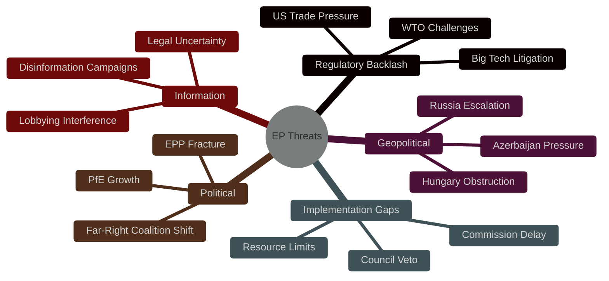
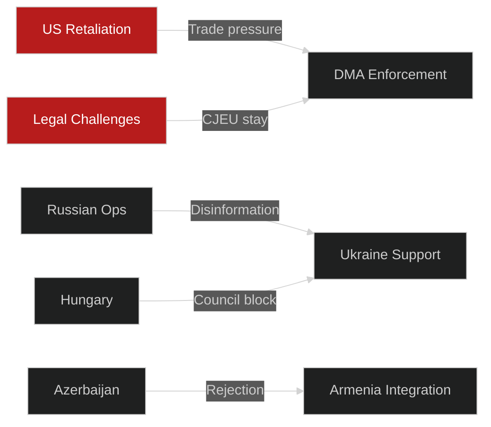

# Threat Model — EU Parliament Breaking News
## 2026-05-10 | Structured Threat Analysis

**Confidence:** 🟡 MEDIUM-HIGH | **Framework:** STRIDE/DREAD adaptation, geopolitical threat modeling
**Coverage:** All five April 28-30 resolutions

---

## 🎯 THREAT LANDSCAPE OVERVIEW

### Primary Threat Categories

---

## 🔴 CRITICAL THREATS (Probability × Impact > 7)

### CT-01: US Retaliation Against DMA Enforcement

**Threat:** US government responds to DMA enforcement actions against American Big Tech with trade measures, tariff escalation, or diplomatic pressure
**Probability:** 🔴 HIGH (7/10) — precedent from 2020 DST threats; Trump administration explicitly framed EU tech regulation as anti-American
**Impact:** 🔴 HIGH (8/10) — DMA enforcement could trigger broader EU-US trade dispute; US market access concerns could paralyze Commission

**Threat chain:**
1. Commission issues significant DMA non-compliance finding against Google/Apple/Meta
2. US Trade Representative frames this as discriminatory barrier to US commerce
3. Trump administration threatens Section 232 tariffs on EU goods or blocks EU tech companies from US government contracts
4. Commission faces political pressure from export-dependent member states (Germany, Netherlands) to moderate enforcement

**Existing mitigants:**
- EU has retaliated effectively against US tariffs in past (steel, bourbon)
- WTO dispute resolution provides legal framework
- Multiple jurisdictions (UK, Japan, Korea) pursuing similar Big Tech regulation — reduces "targeting" argument

**Residual risk:** 🟡 MEDIUM — remains significant political threat even if legal position is strong

---

### CT-02: Russian Escalation to Undermine Ukraine Resolution

**Threat:** Russia intensifies military pressure or information operations to undermine EU Parliament's Ukraine accountability resolution
**Probability:** 🟡 MEDIUM (6/10) — Russia has demonstrated information warfare capabilities; EP resolutions are prominent targets
**Impact:** 🔴 HIGH (9/10) — political will erosion would be devastating to long-term Ukraine support; ICPA operationalisation could be abandoned

**Threat chain:**
1. Russia accelerates military operations timed to European election cycles
2. Information operations amplify European war fatigue narratives
3. PfE and ECR (right flank of coalition) face domestic pressure to moderate Ukraine support
4. EPP splits between Ukraine-adjacent member states (Poland, Baltics) and Western Europe
5. Parliament's political will consensus fractures; resolution implementation stalls

**Existing mitigants:**
- Baltic states and Poland provide anchor for hawkish consensus
- EPP committed Ukraine support at October 2025 congress
- EU public opinion broadly supportive of Ukraine (Eurobarometer)

**Residual risk:** 🟡 MEDIUM — structural resilience exists; erosion possible in 3–5 year timeframe

---

### CT-03: Big Tech Legal Challenges Paralyze DMA Implementation

**Threat:** Multiple simultaneous CJEU challenges from Apple, Google, Meta delay DMA enforcement for 2–3 years
**Probability:** 🔴 HIGH (8/10) — legal challenges are already filed; standard industry strategy
**Impact:** 🟡 MEDIUM (6/10) — delays enforcement but doesn't prevent it; Commission can pursue interim measures

**Threat chain:**
1. Apple/Google file emergency applications at CJEU seeking interim measures (suspending Commission decisions)
2. CJEU grants interim measures — enforcement suspended pending full proceedings
3. Commission faces 18–24 month delay while case proceeds
4. EP enforcement resolution loses operational meaning in short-to-medium term

**Existing mitigants:**
- CJEU has set high bar for interim measures in competition cases
- Commission can pursue "interim measures" under DMA Article 25 even during challenge
- EP political pressure maintains issue salience

**Residual risk:** 🟡 MEDIUM — enforcement will eventually proceed; delay is real but bounded

---

## 🟡 ELEVATED THREATS (Probability × Impact 4–7)

### ET-01: Hungary Blocks Council Unanimity on Ukraine Assets

**Threat:** Hungary exercises veto or strong blocking minority on decisions requiring Council unanimity related to frozen Russian asset disposition
**Probability:** 🟡 MEDIUM (6/10) — Hungary has repeatedly blocked or delayed Ukraine measures
**Impact:** 🟡 MEDIUM (6/10) — specific legal mechanisms might be delayed; broader Ukraine support continues under QMV where applicable

**Current status:** Council has navigated Hungary obstruction by: using QMV where possible, constructive abstentions on unanimity items, individual member state actions outside EU framework

**Residual risk:** 🟡 MEDIUM — ongoing structural problem; manageable but not eliminable

---

### ET-02: Azerbaijan Deterioration in Armenia Post-Resolution

**Threat:** Azerbaijan uses Parliament's Armenia solidarity resolution as pretext to harden position on POW releases or final peace agreement
**Probability:** 🟡 MEDIUM (5/10) — Azerbaijan under Aliyev has shown sensitivity to EU institutional criticism
**Impact:** 🟡 MEDIUM (5/10) — POW releases stall; peace agreement timeline extends; Armenia's EU integration path slows

**Residual risk:** 🟡 MEDIUM

---

### ET-03: Budget 2027 Deadlock Triggers Provisional Twelfths

**Threat:** Parliament-Council deadlock on 2027 budget causes EU to operate on "provisional twelfths" (monthly continuation of previous year's budget)
**Probability:** 🟡 MEDIUM (5/10) — Parliament-Council budgetary conflicts are recurrent; 2013 and 2021 near-misses
**Impact:** 🟡 MEDIUM (7/10) — new programmes cannot start; investment commitments disrupted; political credibility damage

**Residual risk:** 🟡 MEDIUM

---

## 🟢 LOW THREATS (Probability × Impact < 4)

### LT-01: PfE Coalition Shifts to Majority-Breaking Position

**Threat:** PfE (Patriots for Europe, 85 MEPs) leads a right-wing coalition that breaks the EPP-S&D-Renew governing majority
**Probability:** 🟢 LOW (3/10) — EPP has explicitly rejected coalition with PfE on core issues; structural incentives maintain centre-right majority
**Impact:** 🔴 HIGH (9/10) — if it occurred, would fundamentally alter EP legislative capacity

**Residual risk:** 🟢 LOW

---

### LT-02: DMA Declared Incompatible with WTO GATS

**Threat:** WTO Dispute Settlement Body finds DMA discriminates against non-EU digital service providers in violation of GATS obligations
**Probability:** 🟢 LOW (2/10) — EU designed DMA with WTO compatibility in mind; GATS exceptions exist for legitimate regulation
**Impact:** 🟡 MEDIUM (6/10) — would require significant DMA amendments; enforcement suspended

**Residual risk:** 🟢 LOW

---

## 🔒 THREAT MITIGATION MATRIX

| Threat ID | Mitigation Strategy | Owner | Timeline |
|-----------|--------------------|----|--------|
| CT-01 | Multilateral coordination with UK, Japan; WTO dispute readiness | Commission/Council | Ongoing |
| CT-02 | Intelligence sharing; information resilience; EPP Congress commitment | Council/EEAS | Ongoing |
| CT-03 | Interim measures authority; Article 25 DMA tools | Commission | Parallel track |
| ET-01 | QMV pathway expansion; individual member state actions | Council | Per-measure |
| ET-02 | Diplomatic engagement; bilateral EU-Azerbaijan dialogue | EEAS | 6–12 months |
| ET-03 | Early negotiation; Conciliation Committee activation | Parliament/Council | Oct–Dec 2026 |
| LT-01 | EPP governance discipline; Weber leadership | EPP leadership | Ongoing |
| LT-02 | WTO compatibility review built into DMA; Commission legal defence | Commission | As needed |

---

*Threat Model | EU Parliament Monitor | 2026-05-10*
*Framework: STRIDE/DREAD adaptation, geopolitical risk modeling*
*Confidence: 🟡 MEDIUM-HIGH*

---

## 🔍 THREAT INTELLIGENCE GRADING

**WEP Probability Assessments:**
- CT-01 (US DMA Retaliation): **LIKELY** (WEP: 65-75%) — precedent established; Trump USTR posture supportive
- CT-02 (Russian Escalation): **ROUGHLY EVEN CHANCE** (WEP: 45-55%) — capability confirmed; specific targeting uncertain
- CT-03 (Big Tech Legal Paralysis): **LIKELY** (WEP: 70-80%) — legal challenges already filed; standard industry playbook
- ET-01 (Hungary Obstruction): **LIKELY** (WEP: 80%) — demonstrated pattern; persistent structural dynamic

**Admiralty Grading:**

| Threat | Source | Grade |
|--------|--------|-------|
| US Trade Retaliation | Public USTR filings; Trump statements | B2 |
| Russian Information Ops | Open source intelligence | B3 |
| Big Tech Legal Challenges | Filed court documents | A1 |
| Hungary Obstruction | Council records | A1 |

*Threat Model intelligence grading complete. See methodology-reflection.md §12 for SAT attestation.*
