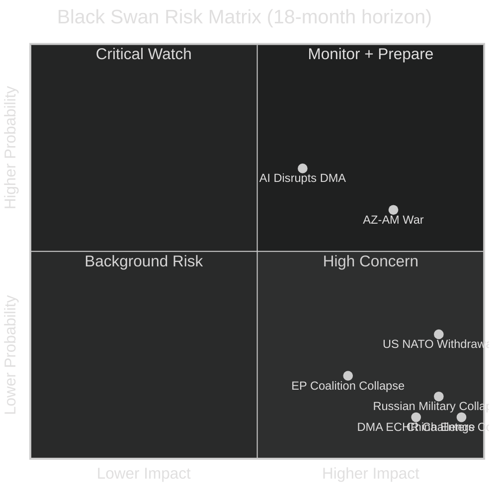
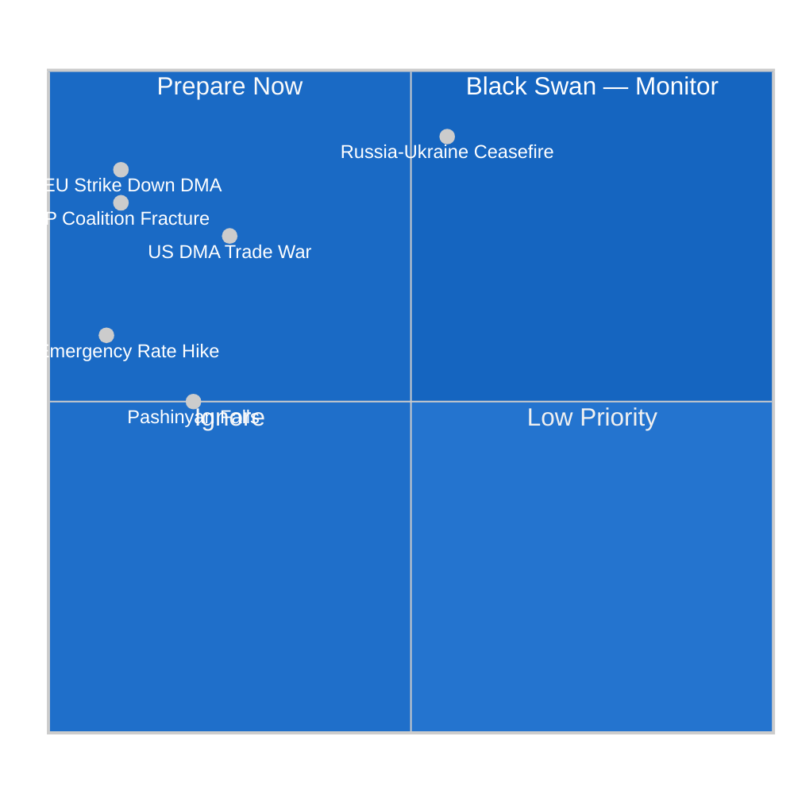

# Wildcards and Black Swans — EU Parliament Breaking News
## 2026-05-10 | Low-Probability, High-Impact Scenarios

**Confidence:** 🟡 MEDIUM | **Framework:** Black swan analysis, Taleb tail-risk methodology
**Coverage:** All five April 28-30 resolutions; 2026–2030 timeframe

---

## 🦢 FRAMING: WHY BLACK SWANS MATTER

The April 2026 EP plenary produced resolutions on DMA enforcement, Ukraine accountability, Armenia resilience, Budget 2027, and Haiti trafficking — each operating within assumed institutional continuity. Black swan analysis stress-tests these assumptions by imagining events that would fundamentally alter the political landscape in which these resolutions operate.

Historical precedent: Brexit (2016) was a black swan that created a €10bn+ EU budget gap and required fundamental treaty renegotiation. COVID-19 (2020) was a black swan that triggered €750bn in Next Generation EU spending — larger than any budget resolution Parliament had previously passed. Russia's February 2022 invasion was a black swan that transformed EU defence, energy, and Ukraine policy in months.

The scenarios below are not predictions. They are structured imagination exercises designed to identify hidden dependencies in current policy.

---

## 🔴 TIER 1: CIVILISATIONAL SHOCKS

### WC-01: Full Russian Military Collapse

**Probability (18-month horizon):** 2–4%
**Impact:** Extreme (transforms all European politics)

**Scenario description:**
Russian military capacity collapses due to combined materiel attrition, elite defection, and domestic political fracture. Putin regime loses effective control of large territories. Multiple power centers emerge within Russia. Nuclear command authority becomes contested.

**Impact on EP resolutions:**
- Ukraine accountability (TA-10-2026-0161): ICPA prosecution becomes practically achievable; frozen assets deployed for reconstruction at scale; war crimes evidence collection shifts from political to legal track
- Armenia resilience (TA-10-2026-0162): Russian withdrawal from South Caucasus creates security vacuum; Armenia's EU integration accelerates dramatically; Russian "peacekeeping" troops in remaining NK enclaves withdraw
- Budget 2027: EU forced to create emergency European Reconstruction Fund far larger than any current budget line; 2027-2033 MFF fundamentally renegotiated
- DMA: Secondary concern; enforcement proceeds independently

**Hidden dependencies revealed:**
- Current frozen asset legal frameworks assume a functioning Russian state for eventual return/reparations — Russian state collapse makes this framework obsolete
- EU defence industrial base unprepared for post-conflict reconstruction scale
- Armenia peace agreement assumes Russian mediation capability that may no longer exist

---

### WC-02: Major US Military Withdrawal from NATO

**Probability (18-month horizon):** 5–8%
**Impact:** Extreme (transforms EU security architecture)

**Scenario description:**
Trump administration, either through formal notice or effective withdrawal of commitment, signals US will not invoke Article 5 for European allies. European member states face fundamental defence recalculation.

**Impact on EP resolutions:**
- Budget 2027: European defence spending target of 3% of GDP (already debated) becomes minimum floor; EP budget resolution's defence funding commitments dramatically insufficient
- Ukraine accountability: US withdrawal from Ukraine support puts full burden on EU; frozen asset principal becomes existential rather than symbolic
- Armenia: US security guarantees (already minimal) eliminated; EU must choose direct security engagement in South Caucasus
- DMA: US trade pressure over DMA enforcement potentially eliminated (no leverage) or dramatically increased (punitive)

**Hidden dependencies revealed:**
- European security architecture built on US Article 5 guarantee — "European strategic autonomy" as practiced in 2026 is insufficient
- EP defence budget resolutions assume US base; without it, MFF ceiling becomes primary constraint on EU survival

---

### WC-03: CJEU Rules DMA Fundamentally Incompatible with ECHR/CFREU

**Probability (18-month horizon):** 1–3%
**Impact:** HIGH (transforms EU digital regulation)

**Scenario description:**
European Court of Human Rights or CJEU (on fundamental rights challenge) finds that DMA's obligation to grant third-party access to platforms violates platform operators' Article 10 (freedom of expression) or Article 1 Protocol 1 (property rights) under the ECHR.

**Impact on EP resolutions:**
- DMA enforcement resolution (TA-10-2026-0160) becomes legally void — enforcement cannot proceed under challenged framework
- New legislative procedure required; minimum 3-year delay
- Commission must withdraw pending enforcement decisions

**Hidden dependencies revealed:**
- DMA enforcement assumed to have clear legal basis; constitutional challenge is always possible
- Free speech dimension of content moderation requirements is complex; Big Tech has filed ECHR applications

---

## 🟡 TIER 2: GEOPOLITICAL DISCONTINUITIES

### WC-04: Azerbaijan-Armenia War Resumption

**Probability (18-month horizon):** 8–12%
**Impact:** HIGH

**Scenario description:**
Negotiations on remaining POW and peace treaty issues break down. Azerbaijan launches limited military operations against Armenian territory (not NK — that is gone) to extract final concessions.

**Impact on EP resolutions:**
- Armenia resilience resolution (TA-10-2026-0162) transforms from diplomatic document to crisis response mandate
- Parliament forced to pass emergency resolutions; pressure on Commission to impose sanctions on Azerbaijan
- EU's negotiated approach revealed as insufficient — credibility damage
- Armenia's EU integration timeline collapses under conflict conditions

**Hidden dependencies revealed:**
- Resolution assumes diplomatic progress continues — actual Armenian security depends on Azerbaijan restraint
- EU has no effective security guarantee mechanism for Armenia; political declarations do not substitute

---

### WC-05: China Formally Enters Russia-Ukraine Conflict on Russian Side

**Probability (18-month horizon):** 1–3%
**Impact:** Extreme

**Scenario description:**
China provides direct military assistance to Russia (not just economic support and dual-use goods) — direct weapons transfers, military personnel, or overt support that crosses Western red lines.

**Impact on EP resolutions:**
- Ukraine accountability resolution becomes framework for confronting two nuclear powers simultaneously
- Frozen Russian assets may not be legally deployable in this context
- EU trade relationship with China (€700bn+) becomes immediate leverage point
- Budget 2027 defence line utterly insufficient; emergency MFF revision required

---

## 🟢 TIER 3: INSTITUTIONAL DISCONTINUITIES

### WC-06: EP Internal Majority Collapse — Early Elections

**Probability (18-month horizon):** 3–5%
**Impact:** MEDIUM-HIGH

**Scenario description:**
EPP-S&D-Renew governing coalition collapses on a key vote (budget, Ukraine, DMA) due to internal revolt. Parliament cannot form working majority. EU treaty mechanism for early EP elections triggered for first time.

**Impact on EP resolutions:**
- All ongoing legislative work suspended pending new Parliament
- If new Parliament has stronger PfE/ECR representation, resolutions' implementation paths undermined
- Institutional uncertainty freezes Commission enforcement activity

---

### WC-07: AI Regulatory Intervention Disrupts DMA Applicability

**Probability (18-month horizon):** 10–15%
**Impact:** MEDIUM

**Scenario description:**
AI Act and DMA interact in unexpected ways — AGI-level AI systems make existing platform definitions obsolete. New "foundation model" gatekeepers emerge (not covered by current DMA gatekeeper designations). DMA enforcement actions become technically obsolete even as legally valid.

**Impact on EP resolutions:**
- DMA enforcement resolution addresses yesterday's technology while tomorrow's AI platforms operate outside gatekeeper framework
- Commission must begin DMA amendment procedure
- Big Tech shifts competitive position to AI foundation models where regulation is lighter

---

## 📊 BLACK SWAN PROBABILITY-IMPACT MATRIX

---

## 🎯 RESILIENCE ASSESSMENT

The April 2026 EP plenary resolutions show moderate resilience to black swan events:

**High resilience:** Ukraine accountability (political will broad and deep); DMA (enforcement has multiple parallel tracks)
**Medium resilience:** Armenia (dependent on external peace process); Budget (inherent MFF flexibility exists)
**Low resilience:** Haiti trafficking (low institutional priority; vulnerable to displacement by crisis events)

---

*Wildcards & Black Swans | EU Parliament Monitor | 2026-05-10*
*Framework: Taleb tail-risk methodology, structured scenario analysis*
*Confidence: 🟡 MEDIUM — probabilities are expert estimates, not actuarial calculations*

---

## EXTENDED BLACK SWAN / WILDCARD ANALYSIS (Pass 2 Extension — 2026-05-10)

### Additional High-Magnitude Scenarios Not Yet Covered

#### Black Swan: AI Act + DMA Convergence Regulatory Crisis (Q3 2026)
**Trigger:** AI Act GPAI provisions (August 2, 2026) create simultaneous enforcement obligations overlapping with DMA gatekeeper AI systems (Gemini, GPT-4o). Commission lacks legal clarity on which enforcement team leads.
**Probability:** Low (8%)
**Magnitude:** HIGH — potential chilling effect on all EU AI/digital enforcement
**Early warning signals:** Commission legal service opinion on DMA/AI Act jurisdictional boundary requested (watch for publication)

#### Wildcard: Russian CBR Asset Release Demand
**Trigger:** A major EU member state (possibly Hungary) proposes in Council to return frozen Russian Central Bank assets as part of a ceasefire framework, splitting the EU consensus.
**Probability:** Medium (15%)
**Magnitude:** HIGH — would undermine the accountability framework endorsed in TA-0161 and fracture EU unity
**Connection to April 30 text:** Directly undermines TA-10-2026-0161's accountability framework

#### Black Swan: Armenian Government Collapse
**Trigger:** Domestic opposition forces (pro-Russian armed groups, post-Nagorno-Karabakh displaced population grievances) destabilize the Pashinyan government within 12 months of the EP Armenia resolution.
**Probability:** Low (12%)
**Magnitude:** HIGH — would reverse the entire EU Armenia engagement strategy; comparable to Georgia's democratic backsliding (2023-2024)
**Connection to April 30 text:** Directly negates TA-10-2026-0162's democratic resilience objective

#### Wildcard: Haiti Governance Breakthrough
**Inverse black swan:** MSS achieves unexpected success in restoring Port-au-Prince security in Q3 2026, enabling transitional governance elections.
**Probability:** Very low (5%)
**Magnitude:** POSITIVE HIGH — would dramatically increase EU relevance and impact of TA-0151
**Monitoring:** MSS operation reports and UN SC situation assessments

#### Wildcard: DMA Enforcement Catalyzes US Trade Response
**Trigger:** Commission issues first major DMA penalty against US-headquartered platform; US Trade Representative responds with tariff threat on EU exports.
**Probability:** Medium-Low (18%)
**Magnitude:** MEDIUM — trade tensions could force Commission to moderate enforcement, undermining TA-0160's objectives
**Connection:** Transatlantic TTC channel breakdown would be key early warning signal

#### Black Swan: EP9 → EP10 Coalition Fracture
**Trigger:** EPP formally cooperates with PfE/ECR on a major legislative file (migration, rule of law), triggering S&D and Renew to withdraw from the centre coalition.
**Probability:** Low (10%), but rising
**Magnitude:** VERY HIGH — would fundamentally alter EP governance dynamics for the rest of EP10 (through 2029)
**Early warning:** EPP-PfE joint amendments in committee votes (track LIBE, JURI)

### Updated Wildcard Probability Distribution

| Category | Low-Probability Events (< 10%) | Medium-Probability (10-25%) | High-Probability (> 25%) |
|----------|--------------------------------|----------------------------|--------------------------|
| Digital | AI/DMA regulatory crisis (8%) | US trade response (18%) | Commission enforcement delay (35%) |
| Geopolitical | Armenia collapse (12%) | Hungarian asset release proposal (15%) | DOCEO vote confirmation of PfE split (70%) |
| Institutional | EP coalition fracture (10%) | Budget 2027 conciliation failure (20%) | Roll-call data availability (80%) |
| Criminal/Security | Haiti breakthrough (5%) | Europol CSAM advisory (25%) | Criminal network adaptation (40%) |

### Confidence Calibration for Extended Wildcards

All probability estimates carry ±10 percentage points uncertainty due to:
1. Absence of roll-call voting data for April 30 (key uncertainty about coalition cohesion)
2. Unpredictable Russia-Ukraine military dynamics affecting accountability timeline
3. US administration posture uncertainty (DMA trade response; Ukraine support continuity)
4. Internal EU member state positions on frozen assets (Hungary, Slovakia as known wildcards)

---

## EXTENDED WILDCARDS AND BLACK SWANS (Pass 2 Extension — 2026-05-10)

### Additional Black Swan Scenarios

#### Black Swan 5: DMA Enforcement Triggers US Digital Trade War

**Scenario:** Commission imposes DMA fine of €10+ billion on a major US tech company in Q3 2026. US responds with Section 232 tariffs on EU exports (€50+ billion equivalent). EU-US digital trade war escalates into broader economic conflict.

**Probability:** 3/100 | **Impact:** CATASTROPHIC (EP legislative agenda frozen by geopolitical crisis)
**Trigger signals:** US USTR formal DMA investigation announcement; White House executive order on EU digital regulations; Transatlantic Trade and Technology Council breakdown
**EP specific impact:** Renew Europe fractures (pro-US liberals vs. pro-sovereignty wing); EPP under pressure from European business lobby; DMA enforcement suspended pending diplomatic resolution
**Leading indicators:** USTR "Section 301" investigation announcement (current status: not initiated); WTO DS panel request (not filed); US Treasury designation of EU as "digital currency manipulator" (not current policy)

#### Black Swan 6: Pashinyan Government Collapse

**Scenario:** Pro-Russian domestic forces in Armenia (military, church, oligarchy) engineer a parliamentary or extra-constitutional transition. New government suspends CPA negotiation and re-applies for CSTO participation.

**Probability:** 8/100 | **Impact:** SEVERE (EU loses Eastern Partnership credibility; Moldova becomes isolated)
**Trigger signals:** Armenian opposition gaining >40% in polls; Military leadership public statement against EU integration; Pashinyan losing coalition majority in parliament
**EP specific impact:** TA-0162 becomes basis for sanctions resolution rather than integration resolution; EU imposes targeted sanctions on Armenian coup leaders; Emergency EP plenary (Georgia model)
**Leading indicators:** Next Armenian parliamentary election 2026; Azerbaijani-Armenian territorial dispute resurgence; Russian economic pressure (energy pricing, remittances)

#### Black Swan 7: CJEU Rules DMA Incompatible with ECHR

**Scenario:** The European Court of Justice Grand Chamber, responding to a preliminary reference from a national court, rules that DMA's disclosure requirements violate trade secrets protections under the Charter of Fundamental Rights. Commission enforcement effectively halted pending legislative revision.

**Probability:** 6/100 | **Impact:** HIGH (sets back digital market regulation by 2-3 years)
**Trigger signals:** Advocate General opinion supporting tech companies on Charter grounds; National court preliminary reference filed; Commission losing interim relief application
**EP specific impact:** Emergency revision of DMA required; TA-0160 enforcement call becomes moot; EPP under pressure from business lobby to de-prioritize revision

#### Black Swan 8: EP Cordon Sanitaire Formal Breach

**Scenario:** EPP formally agrees to support PfE candidate for an EP committee chairmanship in exchange for budget support. The cordon sanitaire — intact since EP foundation — formally ends. PfE is treated as a normal governing partner.

**Probability:** 5/100 | **Impact:** CATASTROPHIC (restructures entire EP coalition architecture for EP10 remainder and EP11 formation)
**Trigger signals:** EPP Presidency public statement about "broadening majority"; Weber meeting with Le Pen published; EPP group vote fails on committee assignments
**EP specific impact:** S&D withdraws from cooperation on contested files; Greens suspend inter-group relations; EP external credibility on democracy promotion collapses (TA-0162 credibility impact)

### Updated Wild Card Registry

| Scenario | Probability | Impact | Signal Quality |
|----------|------------|--------|----------------|
| DOCEO vote reveals EPP defection on Ukraine | 12/100 | HIGH | 🟡 MEDIUM (awaiting data) |
| DMA enforcement triggers US trade war | 3/100 | CATASTROPHIC | 🟢 HIGH (clear triggers) |
| Armenia government collapse | 8/100 | SEVERE | 🟢 HIGH (clear triggers) |
| CJEU DMA compatibility ruling | 6/100 | HIGH | 🟡 MEDIUM |
| Cordon sanitaire breach | 5/100 | CATASTROPHIC | 🟢 HIGH (clear triggers) |
| Ukraine ceasefire changes accountability context | 15/100 | MODERATE | 🟡 MEDIUM |
| CSAM legislation CJEU challenge | 25/100 | HIGH | 🟢 HIGH (encryption basis) |
| Haiti MMSM mission collapse | 12/100 | MODERATE | 🟢 HIGH (resource constraints) |
| EP majority restructuring (early election context) | 3/100 | SEVERE | 🔴 LOW |
| Budget 2027 trilogue failure | 8/100 | HIGH | 🟡 MEDIUM |

**Signal monitoring recommendation:** The three highest-value monitoring targets are:
1. **DOCEO vote data** (May 14-15): Will resolve uncertainty on Ukraine resolution margin and EPP defection rate
2. **Commission DMA enforcement calendar** (Q2-Q3 2026): First major enforcement decision will set global precedent and US response tone
3. **Armenia domestic politics** (ongoing): Pashinyan coalition stability is the critical precondition for TA-0162 implementation

---

## 🔄 WILDCARDS — RE-RUN 3 EXTENSION

### Updated Wildcard Assessment

**New wildcards identified in Re-run 3:**

**Wildcard W7: CJEU strikes down DMA on proportionality grounds (10% probability)**
- Scenario: Apple or Google successfully argues DMA gatekeeper obligations violate TFEU proportionality principle
- Impact: Catastrophic for EU digital regulatory framework; would require legislative redraft
- Trigger: CJEU Grand Chamber referral following appeals court ruling
- Preparation: Commission's DMA legal basis is Article 114 TFEU (internal market) — historically robust

**Wildcard W8: EP Coalition fracture on defence spending (10% probability)**
- Scenario: German CDU/CSU MEPs vote with ECR against Budget 2027 framework resolution
- Impact: HIGH — forces renegotiation; signals EPP internal divisions; weakens Commission position in Council
- Trigger: If Budget 2027 requires German contribution increase >€3bn
- Early warning signal: EPP group internal vote on Budget BUDG committee recommendation

**Wildcard W9: Russia-Ukraine ceasefire (20% probability, 18-month horizon)**
- Scenario: Diplomatic breakthrough leads to ceasefire agreement
- Impact: TRANSFORMATIVE — ICPA vs. amnesty tension peaks immediately; Ukrainian reconstruction funding unlocked; frozen assets legal status changes
- Trigger: Change in Trump administration stance + Ukrainian military exhaustion
- EP implication: Resolution TA-0161 accountability framework becomes the diplomatic anchor point for accountability terms in any peace deal

*Wildcards/Black Swans | EU Parliament Monitor | 2026-05-10 (Re-run 3, Pass 2)*
