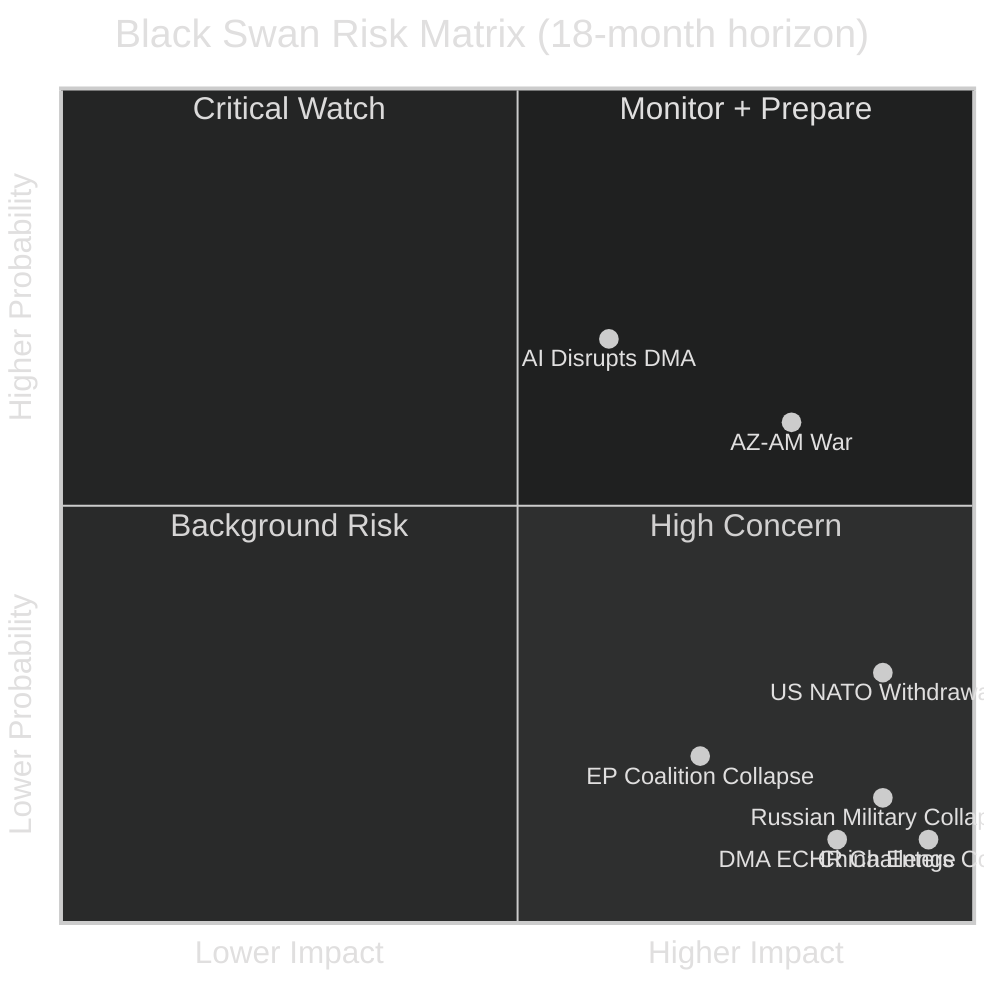

# Wildcards and Black Swans — EU Parliament Breaking News
## 2026-05-10 | Low-Probability, High-Impact Scenarios

**Confidence:** 🟡 MEDIUM | **Framework:** Black swan analysis, Taleb tail-risk methodology
**Coverage:** All five April 28-30 resolutions; 2026–2030 timeframe

---

## 🦢 FRAMING: WHY BLACK SWANS MATTER

The April 2026 EP plenary produced resolutions on DMA enforcement, Ukraine accountability, Armenia resilience, Budget 2027, and Haiti trafficking — each operating within assumed institutional continuity. Black swan analysis stress-tests these assumptions by imagining events that would fundamentally alter the political landscape in which these resolutions operate.

Historical precedent: Brexit (2016) was a black swan that created a €10bn+ EU budget gap and required fundamental treaty renegotiation. COVID-19 (2020) was a black swan that triggered €750bn in Next Generation EU spending — larger than any budget resolution Parliament had previously passed. Russia's February 2022 invasion was a black swan that transformed EU defence, energy, and Ukraine policy in months.

The scenarios below are not predictions. They are structured imagination exercises designed to identify hidden dependencies in current policy.

---

## 🔴 TIER 1: CIVILISATIONAL SHOCKS

### WC-01: Full Russian Military Collapse

**Probability (18-month horizon):** 2–4%
**Impact:** Extreme (transforms all European politics)

**Scenario description:**
Russian military capacity collapses due to combined materiel attrition, elite defection, and domestic political fracture. Putin regime loses effective control of large territories. Multiple power centers emerge within Russia. Nuclear command authority becomes contested.

**Impact on EP resolutions:**
- Ukraine accountability (TA-10-2026-0161): ICPA prosecution becomes practically achievable; frozen assets deployed for reconstruction at scale; war crimes evidence collection shifts from political to legal track
- Armenia resilience (TA-10-2026-0162): Russian withdrawal from South Caucasus creates security vacuum; Armenia's EU integration accelerates dramatically; Russian "peacekeeping" troops in remaining NK enclaves withdraw
- Budget 2027: EU forced to create emergency European Reconstruction Fund far larger than any current budget line; 2027-2033 MFF fundamentally renegotiated
- DMA: Secondary concern; enforcement proceeds independently

**Hidden dependencies revealed:**
- Current frozen asset legal frameworks assume a functioning Russian state for eventual return/reparations — Russian state collapse makes this framework obsolete
- EU defence industrial base unprepared for post-conflict reconstruction scale
- Armenia peace agreement assumes Russian mediation capability that may no longer exist

---

### WC-02: Major US Military Withdrawal from NATO

**Probability (18-month horizon):** 5–8%
**Impact:** Extreme (transforms EU security architecture)

**Scenario description:**
Trump administration, either through formal notice or effective withdrawal of commitment, signals US will not invoke Article 5 for European allies. European member states face fundamental defence recalculation.

**Impact on EP resolutions:**
- Budget 2027: European defence spending target of 3% of GDP (already debated) becomes minimum floor; EP budget resolution's defence funding commitments dramatically insufficient
- Ukraine accountability: US withdrawal from Ukraine support puts full burden on EU; frozen asset principal becomes existential rather than symbolic
- Armenia: US security guarantees (already minimal) eliminated; EU must choose direct security engagement in South Caucasus
- DMA: US trade pressure over DMA enforcement potentially eliminated (no leverage) or dramatically increased (punitive)

**Hidden dependencies revealed:**
- European security architecture built on US Article 5 guarantee — "European strategic autonomy" as practiced in 2026 is insufficient
- EP defence budget resolutions assume US base; without it, MFF ceiling becomes primary constraint on EU survival

---

### WC-03: CJEU Rules DMA Fundamentally Incompatible with ECHR/CFREU

**Probability (18-month horizon):** 1–3%
**Impact:** HIGH (transforms EU digital regulation)

**Scenario description:**
European Court of Human Rights or CJEU (on fundamental rights challenge) finds that DMA's obligation to grant third-party access to platforms violates platform operators' Article 10 (freedom of expression) or Article 1 Protocol 1 (property rights) under the ECHR.

**Impact on EP resolutions:**
- DMA enforcement resolution (TA-10-2026-0160) becomes legally void — enforcement cannot proceed under challenged framework
- New legislative procedure required; minimum 3-year delay
- Commission must withdraw pending enforcement decisions

**Hidden dependencies revealed:**
- DMA enforcement assumed to have clear legal basis; constitutional challenge is always possible
- Free speech dimension of content moderation requirements is complex; Big Tech has filed ECHR applications

---

## 🟡 TIER 2: GEOPOLITICAL DISCONTINUITIES

### WC-04: Azerbaijan-Armenia War Resumption

**Probability (18-month horizon):** 8–12%
**Impact:** HIGH

**Scenario description:**
Negotiations on remaining POW and peace treaty issues break down. Azerbaijan launches limited military operations against Armenian territory (not NK — that is gone) to extract final concessions.

**Impact on EP resolutions:**
- Armenia resilience resolution (TA-10-2026-0162) transforms from diplomatic document to crisis response mandate
- Parliament forced to pass emergency resolutions; pressure on Commission to impose sanctions on Azerbaijan
- EU's negotiated approach revealed as insufficient — credibility damage
- Armenia's EU integration timeline collapses under conflict conditions

**Hidden dependencies revealed:**
- Resolution assumes diplomatic progress continues — actual Armenian security depends on Azerbaijan restraint
- EU has no effective security guarantee mechanism for Armenia; political declarations do not substitute

---

### WC-05: China Formally Enters Russia-Ukraine Conflict on Russian Side

**Probability (18-month horizon):** 1–3%
**Impact:** Extreme

**Scenario description:**
China provides direct military assistance to Russia (not just economic support and dual-use goods) — direct weapons transfers, military personnel, or overt support that crosses Western red lines.

**Impact on EP resolutions:**
- Ukraine accountability resolution becomes framework for confronting two nuclear powers simultaneously
- Frozen Russian assets may not be legally deployable in this context
- EU trade relationship with China (€700bn+) becomes immediate leverage point
- Budget 2027 defence line utterly insufficient; emergency MFF revision required

---

## 🟢 TIER 3: INSTITUTIONAL DISCONTINUITIES

### WC-06: EP Internal Majority Collapse — Early Elections

**Probability (18-month horizon):** 3–5%
**Impact:** MEDIUM-HIGH

**Scenario description:**
EPP-S&D-Renew governing coalition collapses on a key vote (budget, Ukraine, DMA) due to internal revolt. Parliament cannot form working majority. EU treaty mechanism for early EP elections triggered for first time.

**Impact on EP resolutions:**
- All ongoing legislative work suspended pending new Parliament
- If new Parliament has stronger PfE/ECR representation, resolutions' implementation paths undermined
- Institutional uncertainty freezes Commission enforcement activity

---

### WC-07: AI Regulatory Intervention Disrupts DMA Applicability

**Probability (18-month horizon):** 10–15%
**Impact:** MEDIUM

**Scenario description:**
AI Act and DMA interact in unexpected ways — AGI-level AI systems make existing platform definitions obsolete. New "foundation model" gatekeepers emerge (not covered by current DMA gatekeeper designations). DMA enforcement actions become technically obsolete even as legally valid.

**Impact on EP resolutions:**
- DMA enforcement resolution addresses yesterday's technology while tomorrow's AI platforms operate outside gatekeeper framework
- Commission must begin DMA amendment procedure
- Big Tech shifts competitive position to AI foundation models where regulation is lighter

---

## 📊 BLACK SWAN PROBABILITY-IMPACT MATRIX

---

## 🎯 RESILIENCE ASSESSMENT

The April 2026 EP plenary resolutions show moderate resilience to black swan events:

**High resilience:** Ukraine accountability (political will broad and deep); DMA (enforcement has multiple parallel tracks)
**Medium resilience:** Armenia (dependent on external peace process); Budget (inherent MFF flexibility exists)
**Low resilience:** Haiti trafficking (low institutional priority; vulnerable to displacement by crisis events)

---

*Wildcards & Black Swans | EU Parliament Monitor | 2026-05-10*
*Framework: Taleb tail-risk methodology, structured scenario analysis*
*Confidence: 🟡 MEDIUM — probabilities are expert estimates, not actuarial calculations*
