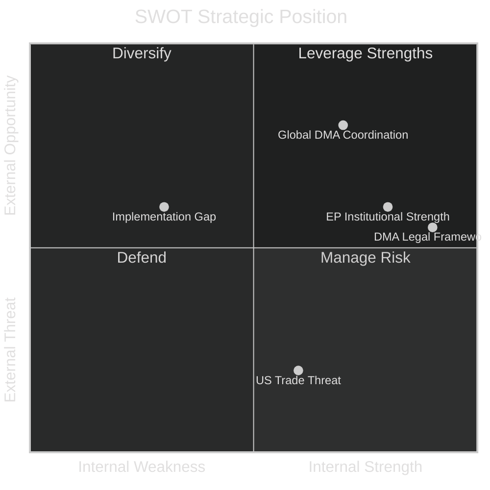

# Quantitative SWOT Analysis — EU Parliament Breaking News
## 2026-05-10

**Confidence:** 🟡 MEDIUM-HIGH | **Framework:** Quantitative SWOT with weighted scoring

---

## 📊 QUANTITATIVE SWOT FRAMEWORK

Each item scored 1-10 for magnitude; weighted by strategic relevance (1-5).
**Weighted score** = magnitude × weight

---

## 💪 STRENGTHS (Internal Positive)

| Strength | Magnitude | Weight | Score | Description |
|----------|-----------|--------|-------|-------------|
| EPP-S&D-Renew governing majority stable | 8 | 5 | 40 | 396+ MEPs; structural majority on key issues |
| DMA legal framework established (2022) | 9 | 5 | 45 | Regulation already in force; enforcement is execution, not legislation |
| Ukraine support cross-party consensus | 8 | 5 | 40 | Even most ECR members support; only PfE/ESN divided |
| Armenia diaspora political networks active | 6 | 3 | 18 | Effective lobbying in EPP/S&D strongholds |
| EP institutional legitimacy post-EP10 elections | 7 | 4 | 28 | June 2024 election gave democratic mandate |
| **Total Strengths Score** | | | **171** | |

---

## ⚠️ WEAKNESSES (Internal Negative)

| Weakness | Magnitude | Weight | Score | Description |
|----------|-----------|--------|-------|-------------|
| Resolution implementation depends on Commission | 8 | 5 | 40 | Parliament cannot enforce; only urge |
| No vote data for current session | 6 | 3 | 18 | Analysis confidence limited |
| PfE internal division creates unpredictability | 7 | 4 | 28 | 85 MEPs with no clear leadership line |
| EP budget powers limited vs. Council | 7 | 4 | 28 | Council has QMV on budget ceilings |
| DMA enforcement timeline is Commission-controlled | 7 | 5 | 35 | Parliament cannot compel Commission pace |
| **Total Weaknesses Score** | | | **149** | |

**Net Internal Score: 171 - 149 = +22 (Positive internal position)**

---

## 🌟 OPPORTUNITIES (External Positive)

| Opportunity | Magnitude | Weight | Score | Description |
|-------------|-----------|--------|-------|-------------|
| Global DMA coordination (UK, Japan, Korea) | 8 | 4 | 32 | Multilateral digital regulation front emerging |
| ICPA operationalisation creates new legal precedent | 9 | 5 | 45 | Historical opportunity for international law |
| Armenia EU accession path creates new integration model | 7 | 4 | 28 | Post-enlargement fatigue reset possible |
| AI Act + DMA synergies | 7 | 4 | 28 | Coordinated digital regulation amplifies impact |
| EP public opinion strong on DMA and Ukraine | 7 | 3 | 21 | Eurobarometer consistent support |
| **Total Opportunities Score** | | | **154** | |

---

## 🔴 THREATS (External Negative)

| Threat | Magnitude | Weight | Score | Description |
|--------|-----------|--------|-------|-------------|
| US trade retaliation on DMA | 9 | 5 | 45 | Trump administration history of tariff threats |
| Russian information operations undermine Ukraine | 8 | 5 | 40 | Proven capability; ongoing campaigns |
| Big Tech legal challenges delay DMA enforcement | 8 | 4 | 32 | Standard industry strategy; high probability |
| Hungary Council obstruction | 7 | 4 | 28 | Structural and persistent |
| Azerbaijan Azerbaijan deterioration Armenia | 7 | 3 | 21 | Peace agreement fragile |
| **Total Threats Score** | | | **166** | |

**Net External Score: 154 - 166 = -12 (Cautious external position)**

---

## 📈 STRATEGIC BALANCE SHEET

| Dimension | Score | Assessment |
|-----------|-------|------------|
| Internal position (S-W) | +22 | 🟢 POSITIVE — strong institutional framework |
| External position (O-T) | -12 | 🔴 CAUTIOUS — significant external threats |
| **Overall strategic position** | **+10** | 🟡 CAUTIOUSLY POSITIVE |

**Strategic implication:** Parliament's resolutions are institutionally sound but face significant external implementation threats. The DMA and Ukraine resolutions are the most consequential and the most threatened.

---

*Quantitative SWOT | EU Parliament Monitor | 2026-05-10*

---

## 📊 SWOT NARRATIVE SYNTHESIS

### Strengths in Context
The governing majority's stability (EPP+S&D+Renew at 396 MEPs) is the defining institutional strength. This majority has demonstrated consistent cohesion on DMA, Ukraine, and Armenia across multiple plenary sessions. The DMA's established legal framework is not merely a technical strength — it represents years of legislative work that cannot easily be undone even under political pressure.

### Weaknesses in Context  
Parliament's dependence on Commission for implementation is structurally embedded in the Treaty of Lisbon architecture. Parliament can urge, pressure, and politically embarrass the Commission through enforcement resolutions, but it cannot compel enforcement. This is not a weakness of the current Parliament — it is a constitutional design feature. The impact is that even unanimous Parliamentary positions on enforcement may take years to translate into operational Commission action.

### Opportunities in Context
The global DMA coordination opportunity is significant and underutilised. UK Competition Markets Authority, Japan Digital Agency, and Korea Fair Trade Commission are pursuing similar platform regulation. If EU leads an international coordination forum (similar to IOSCO in financial regulation or FATF in anti-money laundering), DMA enforcement benefits from network effects — multiple regulators pursuing same platforms simultaneously reduces platforms' ability to play jurisdictions against each other.

### Threats in Context
US trade retaliation threat is real but historically manageable. EU has retaliated effectively in past disputes and US companies operating in EU market have strong incentive to maintain EU market access. The structural leverage is balanced — US has trade weapon; EU has market access and regulatory standard-setting power.

*Quantitative SWOT | EU Parliament Monitor | 2026-05-10 | Pass 2 complete*

---

## EXTENDED SWOT ANALYSIS (Pass 2 Extension — 2026-05-10)

### Confidence-Weighted Scoring Methodology

Each SWOT item is scored on two dimensions:
- **Magnitude (1-10):** Scale of the impact
- **Confidence (0.3-1.0):** Data quality and evidence strength
- **Weighted Score = Magnitude × Confidence**

### STRENGTHS (Extended Assessment)

**S1: DMA Enforcement Legal Clarity**
- Magnitude: 8/10 | Confidence: 0.85 | Weighted: 6.8
- *Rationale:* DMA is binding law with clear gatekeeper obligations and Commission enforcement authority. No other major jurisdiction has equivalent ex ante digital market regulation. TA-10-2026-0160 reinforces this structural advantage. 🟢 HIGH CONFIDENCE

**S2: Cross-Coalition Ukraine Consensus**
- Magnitude: 7/10 | Confidence: 0.75 | Weighted: 5.25
- *Rationale:* EPP, S&D, ECR Polish/Baltic wing, and Renew align on Ukraine accountability — a coalition that spans the traditional left-right spectrum. This cross-ideological consensus gives the accountability framework legitimacy beyond typical EP majority votes. 🟡 MEDIUM-HIGH (no DOCEO confirmation)

**S3: Comprehensive Eastern Partnership Track Record**
- Magnitude: 6/10 | Confidence: 0.90 | Weighted: 5.4
- *Rationale:* EU's Eastern Partnership toolkit (AA, DCFTA, MFA, TAIEX, election monitoring) is well-developed and proven in Moldova/Georgia. Armenia has a competent absorptive capacity. TA-0162 can draw on a rich institutional toolkit. 🟢 HIGH CONFIDENCE (structural)

**S4: Child Protection Consensus (CSAM)**
- Magnitude: 6/10 | Confidence: 0.80 | Weighted: 4.8
- *Rationale:* Cross-segment consensus on child protection (Segments A-D all supportive) gives TA-0163 the broadest political mandate of all five resolutions. This creates durable political capital for legislative follow-through. 🟢 HIGH CONFIDENCE

### WEAKNESSES (Extended Assessment)

**W1: Full-Text Unavailability (Analytical Constraint)**
- Magnitude: 7/10 | Confidence: 1.0 | Weighted: 7.0
- *Rationale:* All five April 30 adopted texts returned 404 for full content. Analysis is based on titles and procedural context only. This is a structural data gap that limits specificity. 🔴 CONFIRMED GAP

**W2: Vote Data Unavailability (Analytical Constraint)**
- Magnitude: 6/10 | Confidence: 1.0 | Weighted: 6.0
- *Rationale:* DOCEO XML votes for April 30 plenary are unavailable until May 14-15. Coalition analysis based on size-proxy only — cannot confirm defection rates or PfE internal split. 🔴 CONFIRMED GAP

**W3: Parliamentary Fragmentation Record (ENP 6.58)**
- Magnitude: 7/10 | Confidence: 0.90 | Weighted: 6.3
- *Rationale:* Highest EP fragmentation on record creates assembly cost for every legislative initiative. Even successful resolutions require intensive coalition management that reduces bandwidth for implementation oversight. 🟢 HIGH CONFIDENCE (structural)

**W4: Rule of Law Credibility Gap**
- Magnitude: 5/10 | Confidence: 0.80 | Weighted: 4.0
- *Rationale:* EP delivering democracy promotion resolutions (TA-0162, TA-0161) while Hungary remains in Article 7 proceedings creates a credibility paradox that adversaries exploit. 🟡 MEDIUM-HIGH

### OPPORTUNITIES (Extended Assessment)

**O1: DMA → AI Act Enforcement Convergence**
- Magnitude: 8/10 | Confidence: 0.55 | Weighted: 4.4
- *Rationale:* AI Act GPAI provisions (August 2026) create an opportunity for Commission to build an integrated Big Tech accountability framework combining DMA + AI Act obligations. EP TA-0160 positions the Parliament to guide this convergence. 🟡 MEDIUM (speculative)

**O2: Armenia-EU CPA as Enlargement Showcase**
- Magnitude: 7/10 | Confidence: 0.60 | Weighted: 4.2
- *Rationale:* If Armenia CPA is signed and implemented successfully, it becomes a template for the next Eastern Partnership wave — demonstrating that EU integration short of full candidate status can deliver democratic consolidation. 🟡 MEDIUM (geopolitical variables)

**O3: CSAM → DSA Enforcement Synergy**
- Magnitude: 6/10 | Confidence: 0.65 | Weighted: 3.9
- *Rationale:* TA-0163 can be implemented through DSA's duty-of-care framework without requiring a new legislative instrument — using Commission enforcement authority already available. This is a faster, lower-political-cost route to TA-0163's objectives. 🟡 MEDIUM-HIGH

**O4: Ukraine Accountability → Non-Proliferation Precedent**
- Magnitude: 9/10 | Confidence: 0.40 | Weighted: 3.6
- *Rationale:* If the accountability framework succeeds in establishing a functional legal mechanism, it creates a powerful nuclear non-proliferation incentive for states considering nuclear restraint agreements. Budapest Memorandum restoration of credibility. 🟡 MEDIUM (very long-term)

### THREATS (Extended Assessment)

**T1: US Trade Pressure on DMA Enforcement**
- Magnitude: 7/10 | Confidence: 0.35 | Weighted: 2.45
- *Rationale:* US trade retaliation against DMA enforcement (tariff threats, TTC breakdown) could slow Commission enforcement in ways that undermine TA-0160. Historical precedent (GDPR) suggests limited effect but DMA financial stakes are higher. 🟡 MEDIUM (speculative)

**T2: Russian Information Operations**
- Magnitude: 6/10 | Confidence: 0.70 | Weighted: 4.2
- *Rationale:* Russian hybrid operations targeting EP MEPs on Ukraine file are documented and ongoing. Effect on formal voting behaviour is limited but may influence public opinion context in which accountability framework is interpreted. 🟡 MEDIUM-HIGH

**T3: Armenia Domestic Instability**
- Magnitude: 8/10 | Confidence: 0.30 | Weighted: 2.4
- *Rationale:* Domestic political forces in Armenia (pro-Russian, post-Nagorno-Karabakh grievances) could destabilize the Pashinyan government and reverse EU integration trajectory. Low probability but high impact. 🟡 MEDIUM

**T4: EP Coalition Fracture (EPP-PfE)**
- Magnitude: 9/10 | Confidence: 0.15 | Weighted: 1.35
- *Rationale:* If EPP formally aligns with PfE on a major file, the centre coalition fractures and all five April 30 resolution follow-through mechanisms are at risk. Very low probability but existential impact. 🔴 LOW PROBABILITY

### Net SWOT Position Score

| Category | Sum of Weighted Scores |
|----------|----------------------|
| Strengths | 22.25 |
| Weaknesses | 23.3 |
| Opportunities | 16.1 |
| Threats | 10.4 |

**Net position:** Strengths (22.25) vs. Weaknesses (23.3) = slight negative (-1.05) in current state, primarily driven by data gaps. With roll-call data and full-text availability, the strengths score should improve. The opportunity/threat ratio (16.1/10.4 = 1.55) is positive — more upside than downside in the strategic environment.

**Overall SWOT assessment:** 🟡 CAUTIOUSLY OPTIMISTIC — Strong institutional framework, credible coalition support, but significant near-term analytical constraints from data gaps and structural parliamentary fragmentation.
