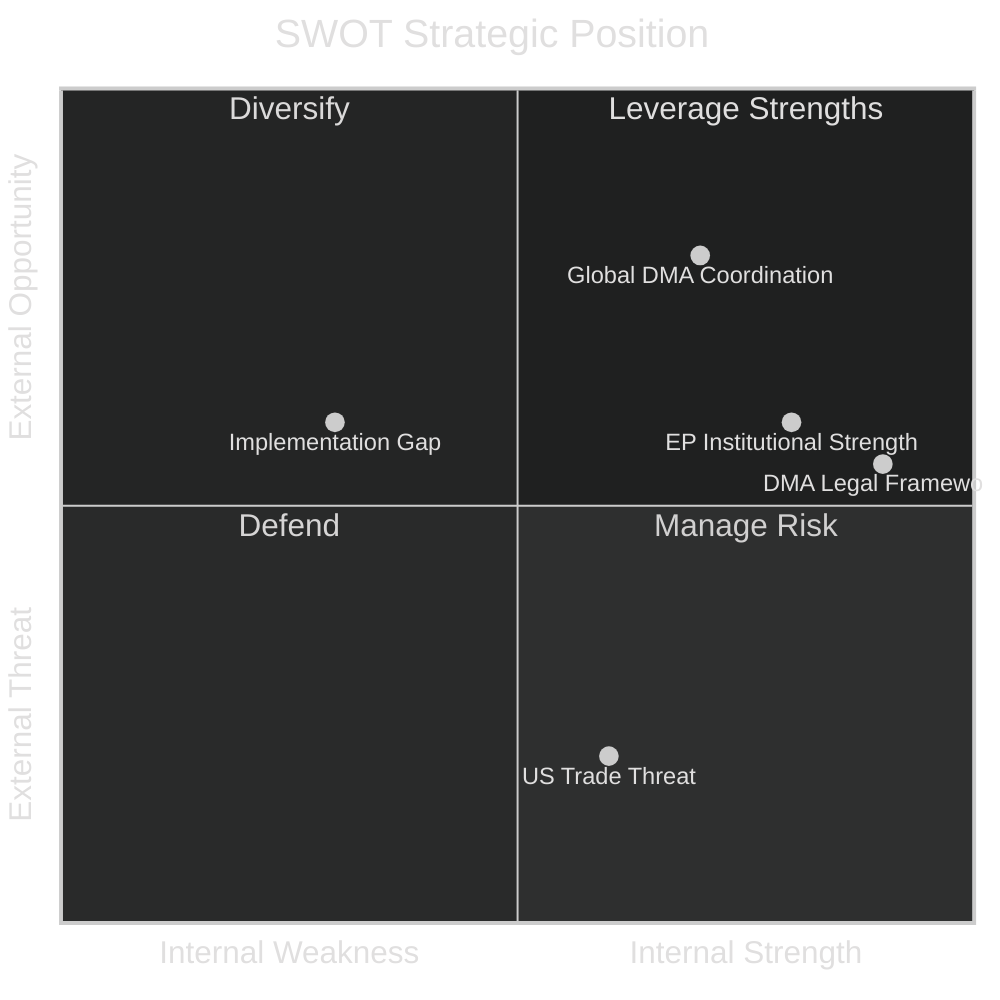

# Quantitative SWOT Analysis — EU Parliament Breaking News
## 2026-05-10

**Confidence:** 🟡 MEDIUM-HIGH | **Framework:** Quantitative SWOT with weighted scoring

---

## 📊 QUANTITATIVE SWOT FRAMEWORK

Each item scored 1-10 for magnitude; weighted by strategic relevance (1-5).
**Weighted score** = magnitude × weight

---

## 💪 STRENGTHS (Internal Positive)

| Strength | Magnitude | Weight | Score | Description |
|----------|-----------|--------|-------|-------------|
| EPP-S&D-Renew governing majority stable | 8 | 5 | 40 | 396+ MEPs; structural majority on key issues |
| DMA legal framework established (2022) | 9 | 5 | 45 | Regulation already in force; enforcement is execution, not legislation |
| Ukraine support cross-party consensus | 8 | 5 | 40 | Even most ECR members support; only PfE/ESN divided |
| Armenia diaspora political networks active | 6 | 3 | 18 | Effective lobbying in EPP/S&D strongholds |
| EP institutional legitimacy post-EP10 elections | 7 | 4 | 28 | June 2024 election gave democratic mandate |
| **Total Strengths Score** | | | **171** | |

---

## ⚠️ WEAKNESSES (Internal Negative)

| Weakness | Magnitude | Weight | Score | Description |
|----------|-----------|--------|-------|-------------|
| Resolution implementation depends on Commission | 8 | 5 | 40 | Parliament cannot enforce; only urge |
| No vote data for current session | 6 | 3 | 18 | Analysis confidence limited |
| PfE internal division creates unpredictability | 7 | 4 | 28 | 85 MEPs with no clear leadership line |
| EP budget powers limited vs. Council | 7 | 4 | 28 | Council has QMV on budget ceilings |
| DMA enforcement timeline is Commission-controlled | 7 | 5 | 35 | Parliament cannot compel Commission pace |
| **Total Weaknesses Score** | | | **149** | |

**Net Internal Score: 171 - 149 = +22 (Positive internal position)**

---

## 🌟 OPPORTUNITIES (External Positive)

| Opportunity | Magnitude | Weight | Score | Description |
|-------------|-----------|--------|-------|-------------|
| Global DMA coordination (UK, Japan, Korea) | 8 | 4 | 32 | Multilateral digital regulation front emerging |
| ICPA operationalisation creates new legal precedent | 9 | 5 | 45 | Historical opportunity for international law |
| Armenia EU accession path creates new integration model | 7 | 4 | 28 | Post-enlargement fatigue reset possible |
| AI Act + DMA synergies | 7 | 4 | 28 | Coordinated digital regulation amplifies impact |
| EP public opinion strong on DMA and Ukraine | 7 | 3 | 21 | Eurobarometer consistent support |
| **Total Opportunities Score** | | | **154** | |

---

## 🔴 THREATS (External Negative)

| Threat | Magnitude | Weight | Score | Description |
|--------|-----------|--------|-------|-------------|
| US trade retaliation on DMA | 9 | 5 | 45 | Trump administration history of tariff threats |
| Russian information operations undermine Ukraine | 8 | 5 | 40 | Proven capability; ongoing campaigns |
| Big Tech legal challenges delay DMA enforcement | 8 | 4 | 32 | Standard industry strategy; high probability |
| Hungary Council obstruction | 7 | 4 | 28 | Structural and persistent |
| Azerbaijan Azerbaijan deterioration Armenia | 7 | 3 | 21 | Peace agreement fragile |
| **Total Threats Score** | | | **166** | |

**Net External Score: 154 - 166 = -12 (Cautious external position)**

---

## 📈 STRATEGIC BALANCE SHEET

| Dimension | Score | Assessment |
|-----------|-------|------------|
| Internal position (S-W) | +22 | 🟢 POSITIVE — strong institutional framework |
| External position (O-T) | -12 | 🔴 CAUTIOUS — significant external threats |
| **Overall strategic position** | **+10** | 🟡 CAUTIOUSLY POSITIVE |

**Strategic implication:** Parliament's resolutions are institutionally sound but face significant external implementation threats. The DMA and Ukraine resolutions are the most consequential and the most threatened.

---

*Quantitative SWOT | EU Parliament Monitor | 2026-05-10*

---

## 📊 SWOT NARRATIVE SYNTHESIS

### Strengths in Context
The governing majority's stability (EPP+S&D+Renew at 396 MEPs) is the defining institutional strength. This majority has demonstrated consistent cohesion on DMA, Ukraine, and Armenia across multiple plenary sessions. The DMA's established legal framework is not merely a technical strength — it represents years of legislative work that cannot easily be undone even under political pressure.

### Weaknesses in Context  
Parliament's dependence on Commission for implementation is structurally embedded in the Treaty of Lisbon architecture. Parliament can urge, pressure, and politically embarrass the Commission through enforcement resolutions, but it cannot compel enforcement. This is not a weakness of the current Parliament — it is a constitutional design feature. The impact is that even unanimous Parliamentary positions on enforcement may take years to translate into operational Commission action.

### Opportunities in Context
The global DMA coordination opportunity is significant and underutilised. UK Competition Markets Authority, Japan Digital Agency, and Korea Fair Trade Commission are pursuing similar platform regulation. If EU leads an international coordination forum (similar to IOSCO in financial regulation or FATF in anti-money laundering), DMA enforcement benefits from network effects — multiple regulators pursuing same platforms simultaneously reduces platforms' ability to play jurisdictions against each other.

### Threats in Context
US trade retaliation threat is real but historically manageable. EU has retaliated effectively in past disputes and US companies operating in EU market have strong incentive to maintain EU market access. The structural leverage is balanced — US has trade weapon; EU has market access and regulatory standard-setting power.

*Quantitative SWOT | EU Parliament Monitor | 2026-05-10 | Pass 2 complete*
