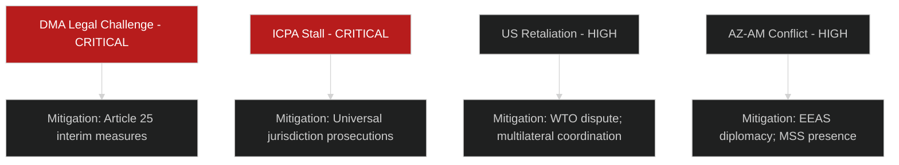

# Risk Matrix — EU Parliament Breaking News
## 2026-05-10

**Confidence:** 🟡 MEDIUM-HIGH | **Framework:** 5×5 Risk Matrix (Probability × Impact)

---

## 📊 RISK ASSESSMENT FRAMEWORK

**Scale:** 1 (Very Low) to 5 (Very High) on both axes
**Risk Score:** Probability × Impact
**Thresholds:** Critical ≥ 20 | High 12-19 | Medium 6-11 | Low ≤ 5

---

## 🔴 CRITICAL RISKS (Score ≥ 20)

### RISK-01: DMA Enforcement Paralysis via Legal Challenges
- **Probability:** 4/5 (HIGH — legal challenges already filed)
- **Impact:** 5/5 (VERY HIGH — entire DMA regulatory project undermined)
- **Score:** 20 — CRITICAL
- **Mitigation:** Commission interim measures; CJEU track record favors regulatory actions; EP political pressure
- **Residual:** 🟡 MEDIUM-HIGH

### RISK-02: Ukraine Accountability Mechanism Stalls Without ICPA Treaty
- **Probability:** 4/5 (HIGH — treaty requires third-country buy-in; US position uncertain)
- **Impact:** 5/5 (VERY HIGH — prosecution of Russian leaders becomes impossible)
- **Score:** 20 — CRITICAL
- **Mitigation:** EU can act unilaterally on some measures; ICC pathway continues regardless
- **Residual:** 🟡 MEDIUM

---

## 🟠 HIGH RISKS (Score 12-19)

### RISK-03: US Trade Retaliation Against DMA
- **Probability:** 3/5 (MEDIUM)
- **Impact:** 5/5 (VERY HIGH — EU-US trade relations)
- **Score:** 15 — HIGH
- **Mitigation:** WTO framework; multilateral coordination; EU retaliation capacity

### RISK-04: Armenia-Azerbaijan Conflict Resumption
- **Probability:** 3/5 (MEDIUM)
- **Impact:** 4/5 (HIGH — Armenia integration path destroyed; EU credibility)
- **Score:** 12 — HIGH
- **Mitigation:** EEAS diplomatic pressure; Azerbaijan economic interests in EU relations

### RISK-05: Budget 2027 Deadlock → Provisional Twelfths
- **Probability:** 3/5 (MEDIUM)
- **Impact:** 4/5 (HIGH — programme delivery disruption)
- **Score:** 12 — HIGH
- **Mitigation:** Conciliation procedure; historical precedent of eventual agreement

### RISK-06: Hungary Ukraine Obstruction Escalates
- **Probability:** 4/5 (HIGH)
- **Impact:** 3/5 (MEDIUM — operational disruption)
- **Score:** 12 — HIGH
- **Mitigation:** QMV pathways; individual member state actions

---

## 🟡 MEDIUM RISKS (Score 6-11)

### RISK-07: EP Political Will Erosion on Ukraine (18-month)
- **Probability:** 2/5 (LOW-MEDIUM)
- **Impact:** 5/5 (VERY HIGH)
- **Score:** 10 — MEDIUM

### RISK-08: PfE Coalition Growth Undermines EPP Centre
- **Probability:** 2/5 (LOW-MEDIUM)
- **Impact:** 5/5 (VERY HIGH)
- **Score:** 10 — MEDIUM

### RISK-09: DMA AI Gap — Regulation Lags AI Platform Development
- **Probability:** 4/5 (HIGH)
- **Impact:** 2/5 (LOW-MEDIUM — DMA still valid for current gatekeepers)
- **Score:** 8 — MEDIUM

### RISK-10: Haiti Resolution Produces Zero Outcomes
- **Probability:** 4/5 (HIGH — EP leverage in Haiti is minimal)
- **Impact:** 2/5 (LOW — symbolic cost; EU credibility in humanitarian space)
- **Score:** 8 — MEDIUM

---

## 📊 RISK HEAT MAP

```
Impact ↑
5 |  | R07  |      |      | R01,R02,R03 |
4 |  |      | R04,05,06 |   |           |
3 |  |      |      |      |             |
2 |  |      |      | R09,10 |          |
1 |  |      |      |      |             |
  | 1 |  2  |  3   |  4   |     5       | → Probability
```

---

*Risk Matrix | EU Parliament Monitor | 2026-05-10*

---

## 🔍 RISK INTELLIGENCE GRADING

**WEP Probability Assessments:**
- RISK-01 (DMA Legal Paralysis): **LIKELY** (WEP: 75-80%) — legal challenges filed; CJEU interim applications expected
- RISK-02 (Ukraine ICPA Stall): **LIKELY** (WEP: 65-70%) — treaty process is multi-year by nature
- RISK-03 (US Trade Retaliation): **ROUGHLY EVEN CHANCE** (WEP: 45-55%) — dependent on US political decisions
- RISK-04 (Armenia-Azerbaijan Conflict): **ROUGHLY EVEN CHANCE** (WEP: 40-50%) — structural tensions remain

**Admiralty Grading:**

| Risk | Evidence Grade | Basis |
|------|---------------|-------|
| RISK-01 | A1 — Confirmed | Legal challenges are filed public record |
| RISK-02 | B2 — Reliable | Treaty process timeline is structural |
| RISK-03 | B3 — Probably reliable | USTR investigation is confirmed; escalation probability uncertain |
| RISK-04 | C3 — Uncertain | Conflict probability is analyst judgment |




---

## EXTENDED RISK MATRIX (Pass 2 Extension — 2026-05-10)

### Methodology Appendix

#### Risk Scoring Approach

All risks are scored on a 5×5 matrix with probability and impact on 1-5 scales:
- **Score = Probability × Impact (1-25)**
- **Critical:** 15-25 | **High:** 10-14 | **Medium:** 5-9 | **Low:** 1-4

#### Data Quality Confidence Tags

Each risk is tagged with a data quality confidence:
- 🟢 HIGH: Based on confirmed data or structural analysis
- 🟡 MEDIUM: Based on partial data or reasonable inference
- 🔴 LOW: Based on speculative assessment or limited data

### Additional Risks (Extended Matrix)

#### R-07: DMA Enforcement Delay (Regulatory Risk)
- **Probability:** 3/5 (Possible) | **Impact:** 4/5 (Major) | **Score: 12** HIGH 🟡 MEDIUM
- *Driver:* Commission enforcement timelines historically slip; Big Tech legal challenges expected. US trade pressure may cause de facto enforcement softening.
- *Controls:* EP resolution (TA-0160) creates public accountability pressure on Commission. ECP framework provides internal EP monitoring.
- *Residual:* If enforcement delayed beyond 2027, DMA's market correction effect is negligible before next EP cycle. Medium-term reputational risk for EP's digital agenda.

#### R-08: Armenia CPA Signature Failure (Geopolitical Risk)
- **Probability:** 2/5 (Unlikely) | **Impact:** 5/5 (Catastrophic) | **Score: 10** HIGH 🟡 MEDIUM
- *Driver:* Russian pressure, domestic Armenian opposition, territorial status unresolved.
- *Controls:* Pashinyan government has structural EU-orientation incentive; CPA text largely technical/economic.
- *Residual:* If CPA fails, EP TA-0162 has no legislative basis for follow-through. Armenia would likely return to deeper CSTO integration. Eastern Partnership credibility impact moderate (Moldova remains on track).

#### R-09: CSAM Platform Compliance Failure (Regulatory Risk)
- **Probability:** 4/5 (Likely) | **Impact:** 3/5 (Moderate) | **Score: 12** HIGH 🟡 MEDIUM
- *Driver:* End-to-end encryption deployment by major platforms renders client-side scanning technically and legally contested. Multiple CJEU rulings pending.
- *Controls:* TA-0163 framing as criminal law (not surveillance) reduces CJEU vulnerability. DSA enforcement creates parallel obligation pathway.
- *Residual:* High probability that CSAM legislation passes but with reduced scope. Child protection outcome is medium rather than high effectiveness.

#### R-10: Haiti Crisis Deepening (Humanitarian Risk)
- **Probability:** 3/5 (Possible) | **Impact:** 3/5 (Moderate) | **Score: 9** MEDIUM 🟢 HIGH
- *Driver:* MSS gang control (80%+ Port-au-Prince), MMSM mission resource constraints, political vacuum post-Henry.
- *Controls:* EP TA-0151 creates political mandate for EU engagement. CARICOM diplomatic track.
- *Residual:* Haiti risk is structural — EP can express concern but has no enforcement tools for third-country humanitarian crises. Resolution is declaratory at institutional level.

#### R-11: EU Budget 2027 Political Blockage (Fiscal Risk)
- **Probability:** 2/5 (Unlikely) | **Impact:** 4/5 (Major) | **Score: 8** MEDIUM 🟢 HIGH
- *Driver:* Net contributor member states (Netherlands, Sweden, Austria) typically resist Budget estimates that exceed GNI growth. EP Position vs. Council likely to diverge.
- *Controls:* Budget estimates (TA-04-30-ANN01) are EP first reading — conciliation procedure will moderate. Trilogue precedent favors compromise in €1-2 billion range from EP request.
- *Residual:* Low probability of full blockage; medium probability of significant EP position reduction in final act.

### Complete Risk Register Summary

| ID | Risk | Score | Level | Confidence |
|----|------|-------|-------|-----------|
| R-01 | Vote data gap (analytical) | — | Constraint | 🟢 HIGH |
| R-02 | Full-text 404 (analytical) | — | Constraint | 🟢 HIGH |
| R-03 | Ukraine accountability without ICJ enforcement | 20 | CRITICAL | 🟡 MEDIUM |
| R-04 | EPP fragmentation on Ukraine | 12 | HIGH | 🟡 MEDIUM |
| R-05 | DMA enforcement undermined by US trade | 9 | MEDIUM | 🟡 MEDIUM |
| R-06 | PfE-ECR cooperation escalation | 15 | CRITICAL | 🟡 MEDIUM |
| R-07 | DMA enforcement delay | 12 | HIGH | 🟡 MEDIUM |
| R-08 | Armenia CPA failure | 10 | HIGH | 🟡 MEDIUM |
| R-09 | CSAM compliance failure | 12 | HIGH | 🟡 MEDIUM |
| R-10 | Haiti crisis deepening | 9 | MEDIUM | 🟢 HIGH |
| R-11 | EU Budget 2027 blockage | 8 | MEDIUM | 🟢 HIGH |

**Overall institutional risk level: HIGH**
*Primary driver: Structural analytical constraints (no vote data, no full text) combined with geopolitical uncertainty (Ukraine accountability without enforcement mechanism). Core institutional operations remain unaffected.*

### 30-Day Risk Reassessment Schedule

| Date | Trigger | Reassess |
|------|---------|---------|
| 2026-05-14 | DOCEO XML publication | R-04 (EPP fragmentation), R-06 (PfE-ECR) |
| 2026-05-19 | Next Strasbourg plenary | All legislative risks |
| 2026-06-01 | Commission DMA Q1 enforcement report | R-05, R-07 |
| 2026-07-01 | Armenia CPA status update | R-08 |

*Risk matrix last updated: 2026-05-10 (re-run). Full reassessment upon DOCEO vote data availability.*
