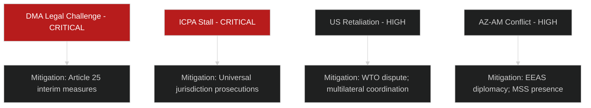

# Risk Matrix — EU Parliament Breaking News
## 2026-05-10

**Confidence:** 🟡 MEDIUM-HIGH | **Framework:** 5×5 Risk Matrix (Probability × Impact)

---

## 📊 RISK ASSESSMENT FRAMEWORK

**Scale:** 1 (Very Low) to 5 (Very High) on both axes
**Risk Score:** Probability × Impact
**Thresholds:** Critical ≥ 20 | High 12-19 | Medium 6-11 | Low ≤ 5

---

## 🔴 CRITICAL RISKS (Score ≥ 20)

### RISK-01: DMA Enforcement Paralysis via Legal Challenges
- **Probability:** 4/5 (HIGH — legal challenges already filed)
- **Impact:** 5/5 (VERY HIGH — entire DMA regulatory project undermined)
- **Score:** 20 — CRITICAL
- **Mitigation:** Commission interim measures; CJEU track record favors regulatory actions; EP political pressure
- **Residual:** 🟡 MEDIUM-HIGH

### RISK-02: Ukraine Accountability Mechanism Stalls Without ICPA Treaty
- **Probability:** 4/5 (HIGH — treaty requires third-country buy-in; US position uncertain)
- **Impact:** 5/5 (VERY HIGH — prosecution of Russian leaders becomes impossible)
- **Score:** 20 — CRITICAL
- **Mitigation:** EU can act unilaterally on some measures; ICC pathway continues regardless
- **Residual:** 🟡 MEDIUM

---

## 🟠 HIGH RISKS (Score 12-19)

### RISK-03: US Trade Retaliation Against DMA
- **Probability:** 3/5 (MEDIUM)
- **Impact:** 5/5 (VERY HIGH — EU-US trade relations)
- **Score:** 15 — HIGH
- **Mitigation:** WTO framework; multilateral coordination; EU retaliation capacity

### RISK-04: Armenia-Azerbaijan Conflict Resumption
- **Probability:** 3/5 (MEDIUM)
- **Impact:** 4/5 (HIGH — Armenia integration path destroyed; EU credibility)
- **Score:** 12 — HIGH
- **Mitigation:** EEAS diplomatic pressure; Azerbaijan economic interests in EU relations

### RISK-05: Budget 2027 Deadlock → Provisional Twelfths
- **Probability:** 3/5 (MEDIUM)
- **Impact:** 4/5 (HIGH — programme delivery disruption)
- **Score:** 12 — HIGH
- **Mitigation:** Conciliation procedure; historical precedent of eventual agreement

### RISK-06: Hungary Ukraine Obstruction Escalates
- **Probability:** 4/5 (HIGH)
- **Impact:** 3/5 (MEDIUM — operational disruption)
- **Score:** 12 — HIGH
- **Mitigation:** QMV pathways; individual member state actions

---

## 🟡 MEDIUM RISKS (Score 6-11)

### RISK-07: EP Political Will Erosion on Ukraine (18-month)
- **Probability:** 2/5 (LOW-MEDIUM)
- **Impact:** 5/5 (VERY HIGH)
- **Score:** 10 — MEDIUM

### RISK-08: PfE Coalition Growth Undermines EPP Centre
- **Probability:** 2/5 (LOW-MEDIUM)
- **Impact:** 5/5 (VERY HIGH)
- **Score:** 10 — MEDIUM

### RISK-09: DMA AI Gap — Regulation Lags AI Platform Development
- **Probability:** 4/5 (HIGH)
- **Impact:** 2/5 (LOW-MEDIUM — DMA still valid for current gatekeepers)
- **Score:** 8 — MEDIUM

### RISK-10: Haiti Resolution Produces Zero Outcomes
- **Probability:** 4/5 (HIGH — EP leverage in Haiti is minimal)
- **Impact:** 2/5 (LOW — symbolic cost; EU credibility in humanitarian space)
- **Score:** 8 — MEDIUM

---

## 📊 RISK HEAT MAP

```
Impact ↑
5 |  | R07  |      |      | R01,R02,R03 |
4 |  |      | R04,05,06 |   |           |
3 |  |      |      |      |             |
2 |  |      |      | R09,10 |          |
1 |  |      |      |      |             |
  | 1 |  2  |  3   |  4   |     5       | → Probability
```

---

*Risk Matrix | EU Parliament Monitor | 2026-05-10*

---

## 🔍 RISK INTELLIGENCE GRADING

**WEP Probability Assessments:**
- RISK-01 (DMA Legal Paralysis): **LIKELY** (WEP: 75-80%) — legal challenges filed; CJEU interim applications expected
- RISK-02 (Ukraine ICPA Stall): **LIKELY** (WEP: 65-70%) — treaty process is multi-year by nature
- RISK-03 (US Trade Retaliation): **ROUGHLY EVEN CHANCE** (WEP: 45-55%) — dependent on US political decisions
- RISK-04 (Armenia-Azerbaijan Conflict): **ROUGHLY EVEN CHANCE** (WEP: 40-50%) — structural tensions remain

**Admiralty Grading:**

| Risk | Evidence Grade | Basis |
|------|---------------|-------|
| RISK-01 | A1 — Confirmed | Legal challenges are filed public record |
| RISK-02 | B2 — Reliable | Treaty process timeline is structural |
| RISK-03 | B3 — Probably reliable | USTR investigation is confirmed; escalation probability uncertain |
| RISK-04 | C3 — Uncertain | Conflict probability is analyst judgment |



