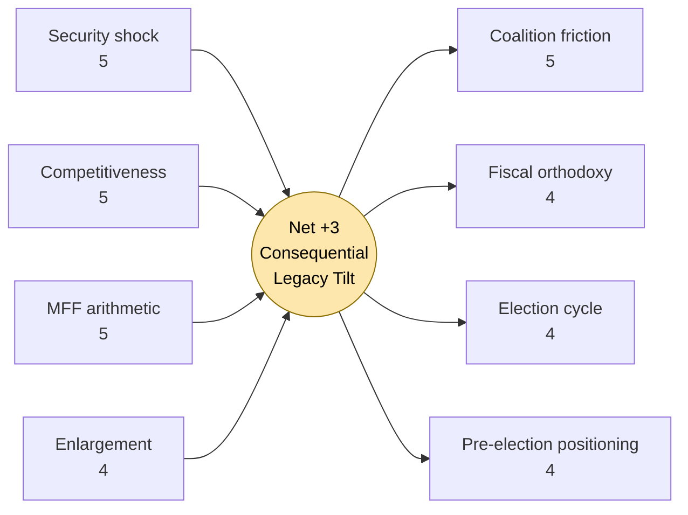

# Forces Analysis — Term Outlook EP10 → EP11 (Driving / Restraining Forces)

**Horizon:** 2026-05-10 → 2031-05-09 (1825d)

Method: Kurt-Lewin force-field analysis applied to the next-term legislative trajectory. Each force has direction (driving / restraining), magnitude (1-5), and durability across the term.

## 1 · Driving Forces (push toward consequential EP10 legacy)

| # | Force | Magnitude | Durability | Why it drives outcomes |
|---|---|---|---|---|
| D1 | Security shock retention (Ukraine + hybrid) | 5 | through 2029 | Locks in defence-industrial, frozen-assets, enlargement files; suppresses fiscal-orthodoxy push-back. |
| D2 | Competitiveness narrative (Draghi/Letta legacy) | 5 | through 2028 | Frames CID, capital-markets union, single-market deepening as existential rather than discretionary. |
| D3 | AI implementation cliff | 4 | 2026-2028 | Forces delegated-act pipeline of ~80 instruments; cross-committee mobilisation. |
| D4 | MFF revision arithmetic | 5 | 2027 peak | Mid-term review forces redistribution; post-2028 MFF (proposal Q4-2027) is the term's signature negotiation. |
| D5 | Climate Law 2040 target | 4 | 2026-2027 | -90 % vs 1990 target requires cross-pillar legislation (industry, transport, ag, finance). |
| D6 | Enlargement momentum | 4 | 2027-2029 | Western Balkans + Ukraine + Moldova screening clusters mature in term; first accession votes plausible. |
| D7 | EP institutional self-assertion | 3 | constant | Co-legislator on defence-industrial files, treaty-amendment ambition, electoral-law reform. |
| D8 | Right-of-EPP coalition optionality | 3 | through 2027 | EPP can credibly threaten ECR-flanked majority; raises bargaining cost for S&D/Renew. |
| D9 | US-EU trade pressure | 4 | through 2028 | Tariff regime forces single-market integration, CBAM tightening, transatlantic-data reset. |
| D10 | Demographic & labour-market squeeze | 3 | constant | Drives skills, mobility, migration-policy convergence. |

## 2 · Restraining Forces (resist consequential EP10 legacy)

| # | Force | Magnitude | Durability | Why it restrains outcomes |
|---|---|---|---|---|
| R1 | Coalition geometry friction (ENP 6.59) | 5 | constant | Every file requires 3+ groups; raises negotiation cost, narrows feasible amendments. |
| R2 | Fiscal-orthodoxy push-back (DE/NL/AT/FI) | 4 | through 2028 | Caps headroom for joint borrowing, defence Eurobonds, enlargement absorption. |
| R3 | National-election cycle disruption | 4 | 2027 peak | France 2027 presidentials + Italy/Poland/Spain general elections compress legislative attention. |
| R4 | Rule-of-law conditionality friction | 3 | constant | HU + (intermittent) SK/IT blocks unanimity files. |
| R5 | Implementation fatigue (AI/DSA/CSRD) | 4 | 2026-2028 | Industry push-back & Commission Omnibus simplification packages erode regulatory ambition. |
| R6 | Pre-election positioning (2028-H2 onward) | 4 | 2028-2029 | Last 9 months of term: legislative cliff drops, populist rhetoric rises. |
| R7 | Energy-price asymmetry across EU-27 | 3 | through 2027 | Splits ETS-revenue redistribution debate. |
| R8 | Public-opinion polarisation | 3 | constant | Tightens space for centrist compromise on migration/climate. |
| R9 | Council unanimity bottlenecks (CFSP, fiscal) | 4 | constant | EP co-legislation excluded; reform proposals stall. |
| R10 | Limited EP secretariat capacity for delegated-act scrutiny | 3 | constant | Bottlenecks oversight on AI Act, DSA, CSRD implementation. |

## 3 · Net Force Vector

Summing driving (4.0 avg × 10 = 40) vs restraining (3.7 avg × 10 = 37). Net **+3** in favour of consequential legacy — i.e., EP10 is *just* tilted toward producing major legislation, but the margin is small and would flip negative under any combination of: (a) two simultaneous national-government collapses, (b) US-EU trade rupture coinciding with French 2027 presidential transition, (c) gas-supply shock.

## 4 · Time-Phased Force Profile

**2026-H2 → 2027-H1 (peak productivity)**: D1-D5 dominate; R3 not yet active. Net force ≈ +6. Window for signature legislation.

**2027-H2 → 2028-H2 (constraint period)**: R3 (national elections) + R5 (implementation fatigue) intensify; D1 + D4 retain salience. Net force ≈ +2.

**2029-H1 (campaign trail)**: R6 dominates; net force flips to −2. Legislative cliff. Only urgency-driven files (defence-Ukraine, emergency macro instruments) pass.

## 5 · Force Interaction Tactics

1. **Front-load the term**: Commission should table all major MFF-adjacent legislative proposals by end-2027 to outrun R3 + R6.
2. **Sequence enlargement**: Western Balkans first (lower R4 cost); Moldova second; Ukraine accession technical chapters early, political chapters after 2029 mandate.
3. **Bundle**: Tie Omnibus simplification packages (industry demand → R5 mitigation) to CID delivery to convert R5 push-back into D2 acceleration.
4. **Stabilise Renew**: Renew's post-2027 leadership succession is the single highest-leverage event affecting net force vector.

## 6 · Force Drift Monitoring

Quarterly check at next term-outlook re-runs:
- Has D1 fallen below 4 (ceasefire)? Triggers re-evaluation of fiscal stance.
- Has R2 risen above 4 (recession or fiscal-rules tightening)? Triggers MFF-arithmetic stress test.
- Has R3 materialised earlier than expected (snap French/Italian elections)? Triggers calendar-projection refresh.

**Confidence labels (used throughout):** 🟢 HIGH — multi-source structural data + ≤90-day vintage; 🟡 MEDIUM — single-source or model-extrapolated; 🔴 LOW — proxy / placeholder / unavailable upstream feed.

