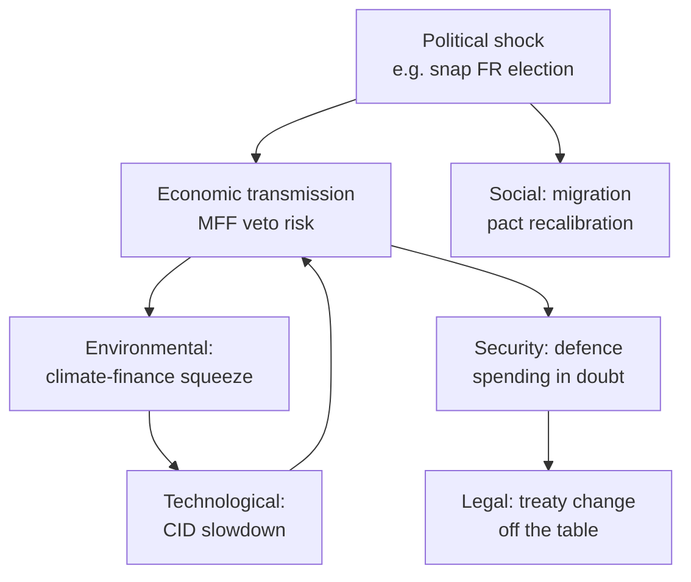

# Impact Matrix — Term Outlook EP10 → EP11

**Horizon:** 2026-05-10 → 2031-05-09 · **Pillars:** Political · Economic · Social · Technological · Legal · Environmental · Security

## 1 · Pillar × Stakeholder Impact Matrix

| Pillar | EU-27 citizens | EU industry | Member-State govts | Non-EU partners | Total weight |
|---|---|---|---|---|---|
| **Political** — coalition geometry, rule-of-law, enlargement | HIGH (+) | MEDIUM (+) | HIGH (+) | HIGH (+) | 14 |
| **Economic** — MFF, CID, capital-markets, defence-spending | HIGH (+) | HIGH (+) | HIGH (+) | MEDIUM (±) | 13 |
| **Social** — labour mobility, social pillar, migration | HIGH (+) | MEDIUM (+) | HIGH (±) | MEDIUM (±) | 11 |
| **Technological** — AI Act, semiconductors, telecoms | HIGH (+) | HIGH (+) | MEDIUM (+) | HIGH (±) | 13 |
| **Legal** — DSA enforcement, rule-of-law, treaty change | HIGH (+) | MEDIUM (±) | HIGH (±) | MEDIUM (−) | 11 |
| **Environmental** — Climate Law 2040, biodiversity, F-gas | HIGH (+) | HIGH (−) | HIGH (±) | MEDIUM (+) | 11 |
| **Security** — defence-industrial, hybrid-threats, Ukraine | HIGH (+) | HIGH (+) | HIGH (+) | HIGH (±) | 14 |

Legend: (+) net positive expected, (−) net negative expected, (±) mixed. HIGH/MEDIUM/LOW = magnitude.

## 2 · Top-10 Forecasted Impacts (with magnitude and probability)

| # | Impact | Magnitude (1-10) | Probability | Window | Confidence |
|---|---|---|---|---|---|
| I1 | Post-2028 MFF lands with defence-line ≥ €100bn + frozen-asset envelope | 9 | 0.65 | 2027-Q4 → 2028-Q4 | 🟡 |
| I2 | AI Act delegated acts complete (Annex IV finalised, GPAI Code-of-Practice operational) | 8 | 0.80 | 2027-Q3 | 🟢 |
| I3 | EU-Ukraine accession negotiating clusters reach political consensus | 8 | 0.55 | 2028 | 🟡 |
| I4 | Climate Law 2040 -90 % target adopted | 9 | 0.60 | 2026-Q4 → 2027-Q2 | 🟡 |
| I5 | Capital Markets Union ('Savings & Investments Union') deepening package | 7 | 0.55 | 2027 | 🟡 |
| I6 | Schengen reform + Asylum Pact full implementation | 7 | 0.65 | 2026-2027 | 🟢 |
| I7 | First Western-Balkans accession (Montenegro) consent vote | 8 | 0.45 | 2028-2029 | 🟡 |
| I8 | DSA/DMA enforcement: first systemic-risk sanctioning rulings | 6 | 0.85 | 2026-2027 | 🟢 |
| I9 | Treaty-change Convention triggered | 8 | 0.20 | 2028-2029 | 🔴 |
| I10 | EP electoral law reform (transnational lists, Spitzenkandidat) | 7 | 0.30 | 2028-Q1 | 🟡 |

## 3 · Cross-Pillar Contagion Map

## 4 · Beneficiary vs Cost-bearer Mapping

**Beneficiaries** of the projected EP10 legacy include: European defence-industrial primes (€100bn+ accelerated procurement); strategic-autonomy SMEs (CID grants); Ukraine reconstruction contractors; AI-Act compliance vendors; renewable-energy chains (Climate Law).

**Cost-bearers**: energy-intensive industry (CBAM tightening, ETS extension); national budgets (defence co-financing); SMEs subject to CSRD/CSDDD before Omnibus simplification lands; non-EU exporters facing CBAM and AI-Act extraterritoriality.

## 5 · Differential Geographic Impact

| Region | Net term impact | Driver |
|---|---|---|
| Frontline (PL, RO, BG, BS, FI) | High positive | Defence build-up, Ukraine reconstruction adjacency. |
| Northwest (DE, NL, BE) | Moderate positive | Industrial-policy benefits offset by fiscal contributions. |
| Mediterranean (IT, ES, EL, FR-south) | Mixed | Migration & climate vulnerabilities; recovery & resilience tail. |
| Visegrad ex-PL (HU, SK, CZ) | Mixed-negative | Rule-of-law friction; cohesion-redistribution losses. |
| Baltic (LT, LV, EE) | High positive | Defence + cyber-resilience + energy-security alignment. |
| Nordic-Atlantic (DK, SE, FI, IE) | High positive | Industrial-policy + capital-markets winners. |

## 6 · Reversibility & Lock-in

- **Locked-in (low reversibility)**: AI Act, DSA, CSDDD baseline architecture, EU-Ukraine Facility (legally binding through 2027).
- **Politically reversible**: Climate Law 2040, MFF priorities, enlargement timelines.
- **Reversibility risk**: Post-2029 EP could re-open implementing acts on green-deal files if the right bloc consolidates.

## 7 · Net Term-Impact Score

Aggregated: **+ 8.1 / 10** (consequential, mostly positive for EU institutional cohesion, ambiguous for energy-intensive industry, negative for rule-of-law-eroding governments). Sensitivity: ±1.5 to security-shock and ±1.0 to MFF-arithmetic outcome.

**Confidence labels (used throughout):** 🟢 HIGH — multi-source structural data + ≤90-day vintage; 🟡 MEDIUM — single-source or model-extrapolated; 🔴 LOW — proxy / placeholder / unavailable upstream feed.

