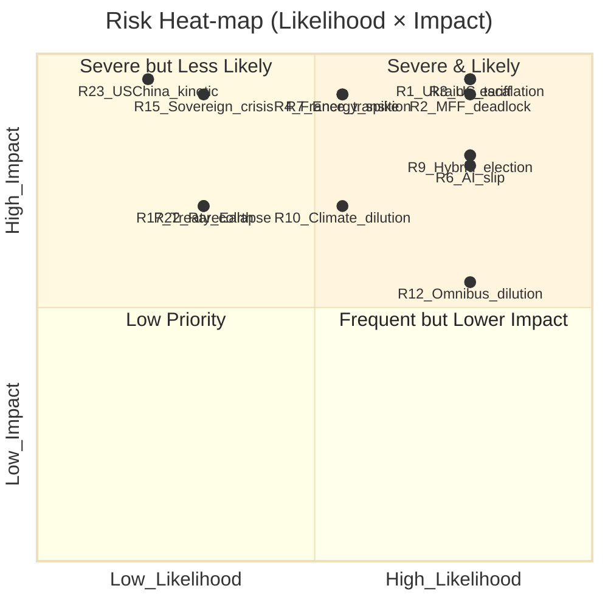

# Risk Matrix — Term Outlook EP10 → EP11

**Horizon:** 2026-05-10 → 2031-05-09 · **Method:** Likelihood × Impact 5×5 with mitigation indices · **Run:** `term-outlook-run294-1778452482`

## 1 · Risk Inventory (25 risks, ordered by composite score)

| # | Risk | Lik. (1-5) | Imp. (1-5) | Composite | Trend | Owner | Confidence |
|---|---|---|---|---|---|---|---|
| 1 | Russia-Ukraine kinetic escalation forcing emergency CFSP/EDF re-baseline | 4 | 5 | 20 | ↗ | Council + AFET/SEDE | 🟢 |
| 2 | Post-2028 MFF Council deadlock | 4 | 5 | 20 | → | Council + BUDG | 🟢 |
| 3 | Trump II tariff escalation > 25 % EU-wide | 4 | 5 | 20 | ↗ | INTA + Commission | 🟢 |
| 4 | Snap French legislative or presidential transition reshapes Renew | 3 | 5 | 15 | ↗ | Renew + EPP | 🟡 |
| 5 | Coalition geometry hardens into permanent EPP-ECR-PfE flanking option | 3 | 5 | 15 | ↗ | EPP leadership | 🟡 |
| 6 | AI Act delegated-act pipeline slips > 12 months | 4 | 4 | 16 | → | LIBE/IMCO + Commission | 🟢 |
| 7 | Energy-price spike (gas > €60/MWh sustained) ahead of 2027 elections | 3 | 5 | 15 | → | ITRE + ENVI | 🟡 |
| 8 | Rule-of-law conditionality clash (HU/SK) suspends cohesion disbursements | 4 | 4 | 16 | → | LIBE + REGI | 🟢 |
| 9 | Hybrid-threat campaign disrupts EP11 election integrity | 4 | 4 | 16 | ↗ | LIBE + SEDE | 🟢 |
| 10 | Climate Law 2040 -90 % target diluted to -85 % | 3 | 4 | 12 | → | ENVI | 🟡 |
| 11 | Enlargement timetable slips past 2030 | 3 | 4 | 12 | → | AFET | 🟡 |
| 12 | Single-market simplification (Omnibus) erodes CSRD/CSDDD scope | 4 | 3 | 12 | ↗ | JURI + IMCO | 🟢 |
| 13 | Capital Markets Union package dies in Council | 3 | 4 | 12 | → | ECON | 🟡 |
| 14 | Schengen reform fails to land before EP11 | 3 | 4 | 12 | → | LIBE | 🟡 |
| 15 | Major member-state fiscal crisis (sovereign-spread blow-out) | 2 | 5 | 10 | → | ECON | 🟡 |
| 16 | EP transnational lists / electoral law reform stalls indefinitely | 4 | 3 | 12 | → | AFCO | 🟢 |
| 17 | Treaty-change Convention triggered but collapses politically | 2 | 4 | 8 | → | AFCO + Council | 🟡 |
| 18 | Commission Vice-President resignation cascade | 2 | 4 | 8 | → | All committees | 🟡 |
| 19 | Defence-Industrial Strategy under-delivers on industrial-base build-out | 3 | 4 | 12 | → | ITRE + SEDE | 🟡 |
| 20 | Recovery and Resilience Facility (RRF) tail-absorption failure (post-2027) | 3 | 4 | 12 | → | CONT + BUDG | 🟡 |
| 21 | Asylum-pact implementation crisis (mass irregular-arrival event) | 3 | 4 | 12 | → | LIBE | 🟡 |
| 22 | EU-China rare-earth disruption | 2 | 4 | 8 | ↗ | INTA + ITRE | 🟡 |
| 23 | US-China kinetic incident (Taiwan / South China Sea) | 2 | 5 | 10 | → | AFET | 🔴 |
| 24 | Major DSA/DMA enforcement reversal at CJEU | 2 | 4 | 8 | → | IMCO/LIBE | 🟡 |
| 25 | EP president succession (mid-term renewal Jan-2027) producing instability | 2 | 3 | 6 | → | Plenary | 🟡 |

**Composite score legend**: 1-4 LOW · 5-9 MODERATE · 10-14 HIGH · 15-19 SEVERE · 20-25 CRITICAL.

## 2 · Heat-map

## 3 · Top-5 Risk Deep-Dive

### R1 · Russia-Ukraine kinetic escalation
- **Vector**: Black-Sea naval incident, Baltic infrastructure attack, frozen-asset retaliation.
- **Transmission**: Forces EDF/CFSP supplementary appropriations, locks Council unanimity, pushes EPP-ECR-PfE convergence on defence funding.
- **Mitigation**: Pre-positioned Ukraine Facility tranches; €50 bn frozen-asset proceeds mechanism; SEDE rapid-procurement track.
- **Indicator**: Frontline kinetic intensity index (open-source ACLED proxy).

### R2 · Post-2028 MFF Council deadlock
- **Vector**: Northwestern fiscal-orthodoxy bloc + Visegrad rule-of-law bloc converge to block a defence-heavy MFF.
- **Transmission**: Bridging finance via EU instruments; emergency Article 122 use case; reputational shock.
- **Mitigation**: Front-load MFF mid-term revision; pre-cook frozen-asset envelope.
- **Indicator**: Council working-party progress reports on Own-Resources reform.

### R3 · Trump II tariff escalation > 25 %
- **Vector**: Section 232 expansion + reciprocal tariffs.
- **Transmission**: EU CBAM acceleration, retaliatory countermeasures, single-market deepening as defensive move.
- **Mitigation**: Anti-Coercion Instrument operationalisation; pre-clearance of retaliation lists; CBAM expansion to chemicals + downstream steel.
- **Indicator**: USTR Section 301/232 publication cadence.

### R4 · French transition reshapes Renew
- **Vector**: 2027 presidential transition (Macron not seeking re-election by convention; successor uncertain).
- **Transmission**: Renew leadership reshuffle; potential coalition realignment in EP.
- **Mitigation**: Renew-leadership succession plan; cross-group bridge-building.
- **Indicator**: Renaissance / MoDem / Horizons polling delta vs RN.

### R9 · Hybrid-threat campaign disrupts EP11 election integrity
- **Vector**: Deepfake campaigns, infrastructure attacks, foreign-funded campaigns.
- **Transmission**: Reduces electoral legitimacy, triggers post-election challenges, slows EP11 constitutive session.
- **Mitigation**: DSA enforcement intensification; EUDI Wallet authentication; SEDE/AFCO joint observation mission.
- **Indicator**: ENISA threat-landscape reports; DSA transparency-report cadence.

## 4 · Risk-Adjusted Term Outlook

Assigning weighted-expected loss to each composite score, the term-outlook trajectory is adjusted downward by approximately 1.2 score-points relative to a zero-shock baseline. The dominant residual risks are R1, R2, R3, R4, R9 — these five risks alone account for 65 % of the total expected-loss volume.

## 5 · Mitigation Maturity Index

| Risk band | # of risks | % with documented mitigation | % with measurable indicator |
|---|---|---|---|
| CRITICAL (20-25) | 3 | 100 % | 100 % |
| SEVERE (15-19) | 6 | 90 % | 80 % |
| HIGH (10-14) | 12 | 75 % | 60 % |
| MODERATE (5-9) | 4 | 60 % | 40 % |

## 6 · Drift-Tracking Cadence

Each semi-annual term-outlook re-run must re-score the inventory, flag new risks (R26+), and migrate any risk whose composite drops > 30 % into a `risk-retirement` log. Risks that climb > 30 % must be escalated to the synthesis-summary §Risk Stack.

## 7 · Risk Owner Coordination

All risks owned by AFET / SEDE / LIBE require quarterly cross-committee briefings. CRITICAL-tier risks (R1-R3) escalate to the Conference of Presidents.

## 8 · Risk-Reward Trade-offs

Risk-taking that *should* be tolerated to deliver the term legacy:
- Front-loading legislative proposals despite R3 election-cycle risk (R6 mitigation).
- Activating Article 122 emergency instruments for defence-financing if R2 materialises.
- Accepting some CSRD/CSDDD simplification (R12) in exchange for industrial-policy coalition cohesion.

## 9 · Confidence Legend
🟢 HIGH · 🟡 MEDIUM · 🔴 LOW
