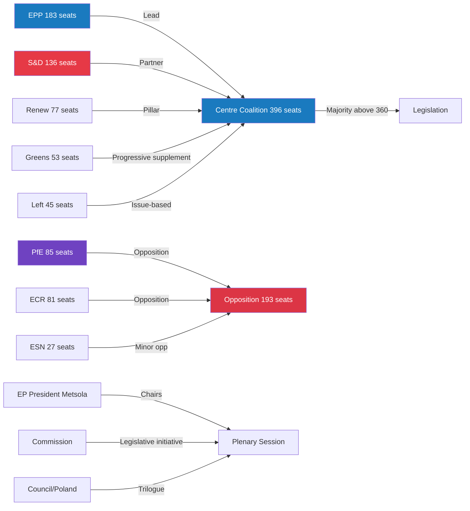

<!-- SPDX-FileCopyrightText: 2026 Hack23 AB -->
<!-- SPDX-License-Identifier: Apache-2.0 -->

# Actor Mapping — Week Ahead 18–21 May 2026

**Classification:** PUBLIC | **Confidence:** 🟡 Medium | **Generated:** 2026-05-10

---

## Actor Roster

| Actor | Type | Seats | Role | MCP Source |
|-------|------|-------|------|-----------|
| EPP (European People's Party) | Political Group | 183 | Largest group; coalition lead; agenda-setter | generate_political_landscape |
| S&D (Socialists & Democrats) | Political Group | 136 | Co-governing partner; centre-left anchor | generate_political_landscape |
| Renew Europe | Political Group | 77 | Third coalition pillar; liberal-centrist | generate_political_landscape |
| PfE (Patriots for Europe) | Political Group | 85 | Largest opposition; hard right | generate_political_landscape |
| ECR (European Conservatives) | Political Group | 81 | Right-conservative opposition | generate_political_landscape |
| Greens/EFA | Political Group | 53 | Progressive opposition; coalition-adjacent | generate_political_landscape |
| The Left (GUE/NGL) | Political Group | 45 | Hard left opposition; issue-based | generate_political_landscape |
| NI (Non-attached) | Miscellaneous | 30 | Fragmented; mixed positions | generate_political_landscape |
| ESN (Europe of Sovereign Nations) | Political Group | 27 | Hard right; sovereignty-first | generate_political_landscape |
| EP President Metsola | Institutional | — | Session chair; EPP-aligned; procedural authority | EP institutional records |
| European Commission | Institutional | — | Legislative initiator; Question Time respondent | EP records |
| Council of the EU (Polish Presidency) | Institutional | — | Trilogue counterpart; January-June 2026 | EP institutional records |
| EEAS / HR-VP | Institutional | — | Foreign affairs; security policy coordination | EP records |

---

## Influence

**Formal power ranking:**

1. **EPP** — Legislative agenda setting; EP presidency; key rapporteurships
2. **EP President Metsola** — Procedural authority; session management
3. **European Commission** — Right of legislative initiative; trilogue partner
4. **S&D** — Co-governing partner; social policy lead
5. **Renew Europe** — Swing vote capacity; digital/trade policy
6. **Council Presidency (Poland)** — Trilogue negotiating mandate

**Informal influence score (1-10):**

| Actor | Formal | Informal | Total |
|-------|--------|----------|-------|
| EPP | 10 | 9 | 19 |
| European Commission | 8 | 9 | 17 |
| EP Metsola | 9 | 8 | 17 |
| S&D | 9 | 7 | 16 |
| Renew | 7 | 7 | 14 |
| PfE | 5 | 7 | 12 |
| ECR | 5 | 6 | 11 |

---

## Alliance

**Primary alliance: Centre Coalition (EPP + S&D + Renew)**
- Combined seats: 396 | Majority threshold: 360 | Buffer: 36
- Formal basis: EP10 coalition agreement
- Durability: HIGH (structural incentives; institutional leadership stakes)

**Secondary alliance: Progressive supplement (S&D + Greens + Left)**
- Combined seats: 234 | Useful for: climate, digital rights, social policy
- Durability: MODERATE (issue-specific; not formal)

**Opposition bloc (PfE + ECR + ESN)**
- Combined seats: 193 | Cannot pass legislation alone
- Durability: LOW (competitive groups; no formal alliance)

**Ad hoc right-centre (EPP right + PfE/ECR) — potential**
- Requires: 37+ EPP defectors | Probability: Very Unlikely (< 10%)
- Durability: NONE (structurally prevented by EPP leadership)

---

## Power Brokers

Key individuals whose positions can shift outcomes:

| Actor | Power Broker Role | Why They Matter |
|-------|------------------|-----------------|
| EPP Group Chair (Weber) | Coalition discipline enforcer | Controls EPP whipping; right-flank management |
| S&D Group Chair | Social policy voice; coalition co-anchor | S&D discipline; progressive coalition bridge |
| Renew Group Chair | Swing vote manager | Critical on contested votes; defection risk |
| BUDG Committee Chair | Budget negotiation lead | 2027 MFF trajectory; fiscal policy |
| AFET Committee Chair | Foreign affairs | Ukraine resolutions; security policy |
| IMCO Committee Chair | Digital/trade policy | DMA, AI Act implementation oversight |

---

## Information

**Key information flows for session week:**

| Channel | From | To | Content |
|---------|------|----|---------|
| EP press releases | EP/Metsola | Media/Public | Session outcomes; vote results |
| Group press conferences | Political groups | Media | Narrative framing post-votes |
| MEP social media | Individual MEPs | Public/Constituents | Real-time session commentary |
| EP roll-call vote record | EP secretariat | EP transparency portal | Formal voting positions (public) |
| Council Presidency updates | Polish Presidency | EP groups | Trilogue progress; Council positions |
| Commission responses to QT | Commission | EP/Public | Policy accountability |

---

## Reader Briefing

**What this means for citizens:** The May 2026 EP session involves 717 elected MEPs representing you across 9 political groups. The governing coalition of EPP+S&D+Renew controls 396 of 720 seats — giving them a 36-seat majority buffer to pass legislation. The key power brokers are the group chairs who manage party discipline on each vote.

**Key actor to watch:** EPP's right wing — if 37+ EPP MEPs break from the coalition on any vote, the majority fails. This is the highest-impact, most-monitored actor behaviour during the session week.

---

## Actor Network Diagram

---

*Actor Mapping | EU Parliament Monitor | MCP Sources: generate_political_landscape | 2026-05-10*
