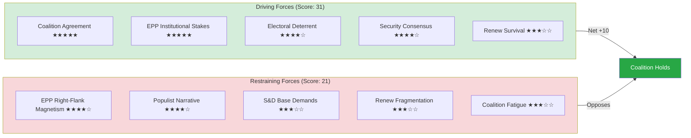

<!-- SPDX-FileCopyrightText: 2026 Hack23 AB -->
<!-- SPDX-License-Identifier: Apache-2.0 -->

# Forces Analysis — Week Ahead 18–21 May 2026

**Classification:** PUBLIC | **Confidence:** 🟡 Medium | **Generated:** 2026-05-10

---

## Issue Frame

The central issue for the May 18–21, 2026 session is whether the **EPP-S&D-Renew centre coalition** can maintain disciplined majority governance across a high-volume legislative week (53 activities, ~17 votes), while the **right-populist opposition** (PfE+ECR = 166 seats) continues to exert structural pressure on the EPP's right wing.

**Secondary issue frames:**
- EU's global positioning on trade, defence, and digital regulation
- Ukraine aid and European defence integration (ongoing)
- Budget 2027 trajectory and MFF negotiation dynamics

---

## Driving Forces

Forces pushing toward centre coalition cohesion and productive session outcomes:

| Force | Strength | Description |
|-------|----------|-------------|
| EP10 coalition agreement | ★★★★★ | Formal political agreement underpins EPP-S&D-Renew cooperation |
| EPP institutional stakes | ★★★★★ | EPP holds presidency, committee chairs — loses all if coalition breaks |
| Electoral deterrent | ★★★★☆ | Coalition breakdown signals weakness; 2029 election 3 years away |
| Broad consensus on EU security | ★★★★☆ | Russia-Ukraine environment drives cross-coalition unity |
| Renew political survival | ★★★☆☆ | Renew strengthens by governing; opposition = marginalisation |
| S&D-EPP post-war tradition | ★★★☆☆ | Long-standing European political centre tradition |
| Legislative volume (calendar) | ★★★☆☆ | Full agenda creates momentum and focus; no time for fracture |
| Metsola procedural authority | ★★★☆☆ | Strong presidential leadership maintains order |

**Total Driving Force Score: 31**

---

## Restraining Forces

Forces opposing coalition cohesion or productive outcomes:

| Force | Strength | Description |
|-------|----------|-------------|
| EPP right-flank magnetism (PfE/ECR) | ★★★★☆ | 20-30 EPP MEPs attracted to hardline positions on migration/sovereignty |
| Right-populist narrative capture | ★★★★☆ | PfE/ECR successfully frames EU governance as "establishment" problem |
| S&D progressive base demands | ★★★☆☆ | S&D members push for bolder climate/social positions; compromise fatigue |
| Renew internal fragmentation | ★★★☆☆ | National delegations hold divergent positions on key dossiers |
| IMF/economic data absence | ★★☆☆☆ | Economic debate degraded; weakens evidence-based policy arguments |
| Coalition fatigue (EP10 Year 2) | ★★★☆☆ | Second year; partners begin positioning for 2029; compromise harder |
| External crisis distraction | ★★☆☆☆ | Security concerns divert legislative focus and political energy |

**Total Restraining Force Score: 21**

---

## Net Pressure

**Net Force: +10 (Driving Forces substantially exceed Restraining Forces)**

**Assessment: 🟢 COALITION HOLDS**

The centre coalition's driving forces are significantly stronger than the restraining forces. The 36-seat majority buffer provides institutional resilience. However, the net score of +10 (vs. a theoretical maximum of +40) reflects real and persistent structural tensions that will intensify as the EP10 term progresses.

**Force Balance Diagram:**

---

## Intervention Points

Key moments where the force balance could shift during the session:

| Moment | Day | Risk Level | Intervention Option |
|--------|-----|-----------|---------------------|
| Wednesday vote block (9 votes) | May 20 | 🟡 MEDIUM | EPP leadership pre-vote whipping |
| Commission Question Time | May 20 | 🟢 LOW | Commission aligns with coalition messaging |
| External crisis signal | Any | 🟡 MEDIUM | Emergency leadership consultation |
| PfE amendment tabling | May 19-20 | 🟡 MEDIUM | JURI/IMCO committee pre-clearance |
| EPP right-flank public statement | Any | 🟡 MEDIUM | EPP group chair immediate response |

**Critical intervention:** EPP group chair engagement with right-flank MEPs before Wednesday's vote schedule is the single highest-value intervention point.

---

## Reader Briefing

**What this means for citizens:** The political forces shaping your MEPs' votes this week strongly favour stable, centrist governance — but a 25% chance of some EPP defection on at least one vote is real. If your MEP is from the EPP, they face significant pressure from both directions: the coalition demands discipline, but hard-right alternatives are actively recruiting.

**Bottom line:** Driving forces win this session. Expect legislation to pass, the coalition to hold, and the session to conclude productively — with at least one visible moment of coalition management.

---

*Forces Analysis | EU Parliament Monitor | Force Field Framework | MCP Sources: generate_political_landscape, analyze_coalition_dynamics | 2026-05-10*
