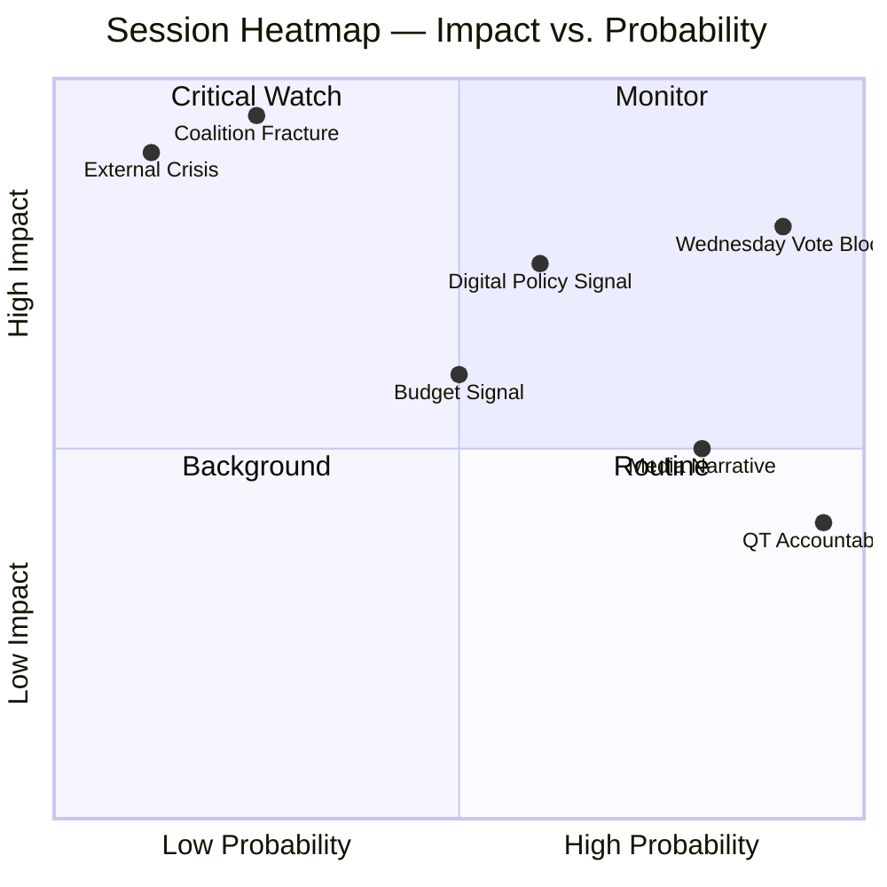

<!-- SPDX-FileCopyrightText: 2026 Hack23 AB -->
<!-- SPDX-License-Identifier: Apache-2.0 -->

# Impact Matrix — Week Ahead 18–21 May 2026

**Classification:** PUBLIC | **Confidence:** 🟡 Medium | **Generated:** 2026-05-10

---

## Event List

Key events scheduled for the May 18–21, 2026 Strasbourg plenary session:

| Day | Type | Count | Key Event Category |
|-----|------|-------|--------------------|
| Monday 18 May | Plenary Debates | 6 | Scene-setting; committee reports; external affairs |
| Monday 18 May | Other activities | 2 | Procedural; Question Time |
| Tuesday 19 May | Plenary Debates | 5 | Legislative debates; committee reports |
| Tuesday 19 May | Plenary Votes | 6 | First vote batch of the week |
| Wednesday 20 May | Plenary Debates | 5 | Major debates; Commission QT |
| Wednesday 20 May | Plenary Votes | 9 | **Peak vote day — heaviest legislative load** |
| Wednesday 20 May | Other activities | 5 | Procedural; group statements |
| Thursday 21 May | Plenary Debates | 5 | Closing debates |
| Thursday 21 May | Plenary Votes | 2 | Final votes; session close |
| Thursday 21 May | Other activities | 3 | Session closure procedures |

**Total: 53 foreseen activities | ~17 votes | Sources: get_meeting_foreseen_activities (4 calls)**

---

## Stakeholder

Key stakeholders and their interest in this week's session:

| Stakeholder Group | Primary Interest | Session Priority |
|------------------|-----------------|-----------------|
| EU Citizens (448M) | Democratic representation; policy outcomes | All votes |
| EU Digital Businesses | DMA/AI Act implementation | Any digital vote |
| EU Traditional Industries | Trade policy; green transition | Trade/budget votes |
| MEPs (all 717) | Legislative record; constituency reporting | Every vote |
| National Governments | EP positions; trilogue implications | Legislative votes |
| Ukraine/Partners | EP support; aid resolutions | Foreign affairs |
| Civil Society | Advocacy amplification | Debate participation |
| Media | Session narrative; vote drama | Wednesday vote block |
| EP Institution | Procedural integrity; global standing | Full session |

---

## Impact Matrix

Impact assessment across key dimensions:

| Dimension | Immediate (0-7 days) | Short-term (1-4 weeks) | Medium-term (1-3 months) | Impact Driver |
|-----------|---------------------|----------------------|------------------------|---------------|
| EU Legislation | 🟠 HIGH | 🟡 MODERATE | 🟡 MODERATE | 17 votes; legislative pipeline |
| Coalition Health | 🟠 HIGH | 🟡 MODERATE | 🟡 MODERATE | Discipline test; buffer assessed |
| Digital Policy | 🟡 MODERATE | 🟠 HIGH | 🟠 HIGH | DMA/AI Act enforcement |
| Trade/Defence | 🟡 MODERATE | 🟡 MODERATE | 🟡 MODERATE | Resolutions; positions |
| Ukraine/Foreign Affairs | 🟡 MODERATE | 🟡 MODERATE | 🟡 MODERATE | Support resolutions |
| EU Institutions | 🟡 MODERATE | 🟡 MODERATE | 🟢 LOW | Normal governance |
| Media Coverage | 🟡 MODERATE | 🟢 LOW | 🟢 LOW | Session narrative |
| Budget 2027 | 🟢 LOW | 🟡 MODERATE | 🟠 HIGH | Signal for MFF negotiation |

---

## Heat

High-salience moments (by expected media and political heat):

| Moment | Day/Time | Heat Level | Trigger |
|--------|----------|------------|---------|
| Wednesday vote block | May 20, afternoon | 🔴 HIGH | 9 votes; coalition discipline visible |
| Coalition margin on contested vote | May 19-20 | 🟠 HIGH | Close majority reveals EPP right-flank |
| Commission Question Time | May 20 | 🟡 MODERATE | Commission accountability; political drama |
| Any urgency debate (if added) | TBD | 🔴 HIGH | External crisis; unpredictable |
| Session close summary | May 21, evening | 🟡 MODERATE | Narrative consolidation; winner/loser framing |

**Heat map summary:**

---

## Cascade

Cascading impact analysis — how session outcomes ripple forward:

| Primary Event | Secondary Effect | Tertiary Effect |
|---------------|-----------------|-----------------|
| Coalition holds; full agenda passes | Commission implements EP positions | EU policy environment aligned with centre-coalition priorities |
| EPP right-flank defection on 1 vote | Media narrative: "coalition under pressure" | Investor uncertainty; Commission adjusts messaging |
| External crisis disruption | Emergency urgency debate | Legislative agenda delayed 1-2 weeks; next session overloaded |
| Digital policy vote signals DMA enforcement | Tech companies adjust compliance roadmaps | EU regulatory leadership position reinforced |
| Close vote (margin < 10 seats) | Political crisis headlines; EP president intervention | Coalition partners recalibrate; group chairs emergency meeting |

---

## Reader Briefing

**What this means for you:** The May 2026 EP session will have the most direct impact on EU digital policy and legislative agenda-setting. Wednesday's 9-vote block is the key moment — watch for whether the coalition holds cleanly or shows fracture lines. If it holds cleanly: expect business as usual. If there's significant EPP defection: expect political crisis narratives and a more volatile June session.

**MCP Source Note:** Event data from `get_meeting_foreseen_activities` (4 calls: MTG-PL-2026-05-18 through MTG-PL-2026-05-21). Activity titles unavailable (EP API limitation); analysis based on types and counts only.

---

*Impact Matrix | EU Parliament Monitor | MCP Sources: get_meeting_foreseen_activities | 2026-05-10*

## Source References

| MCP Tool | Data Used |
|----------|-----------|
| `generate_political_landscape` | Political group composition and seat counts |
| `analyze_coalition_dynamics` | Coalition viability and defection risk |
| `get_plenary_sessions` | Session schedule for 18–21 May 2026 |
| `get_meeting_foreseen_activities` | Agenda items across 4 session days |
| `early_warning_system` | Stability signals and risk flags |
