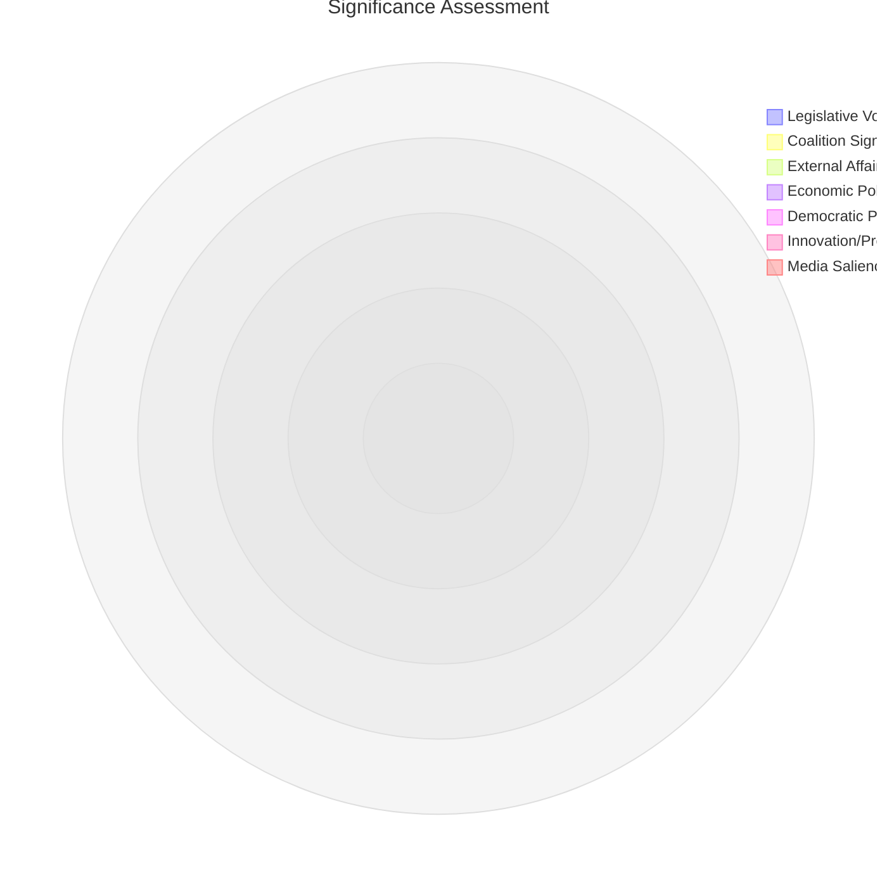

<!-- SPDX-FileCopyrightText: 2026 Hack23 AB -->
<!-- SPDX-License-Identifier: Apache-2.0 -->

# Significance Classification — Week Ahead 18–21 May 2026

**Classification:** PUBLIC | **Confidence:** 🟡 Medium | **Generated:** 2026-05-10

---

## Overall Session Significance: 🟡 MODERATE-HIGH

**Score:** 6.8 / 10.0

**Rationale:** The May 18-21 Strasbourg session operates in a period of structural institutional transition (EP10 year 2), with a full legislative calendar (53 foreseen activities, ~17 votes) but no single transformative legislative moment identified. The significance is elevated by persistent right-wing coalition pressure (ENP 6.58, high fragmentation) and the ongoing EU trade-defence-digital policy convergence.

---

## Multi-Dimensional Significance Matrix

| Dimension | Score (0-10) | Classification | Basis |
|-----------|-------------|----------------|-------|
| Legislative volume | 7 | HIGH | 53 activities; ~17 votes scheduled |
| Coalition significance | 7 | HIGH | 36-seat buffer; right-flank pressure |
| External affairs salience | 5 | MODERATE | No identified acute crisis trigger |
| Economic policy | 4 | MODERATE-LOW | IMF degraded mode; EP role secondary |
| Democratic process | 7 | HIGH | Full plenary; near-complete MEP attendance expected |
| Innovation/precedent | 5 | MODERATE | No identified landmark legislation in view |
| Media salience (forecast) | 6 | MODERATE-HIGH | EP voting session; regular media coverage |
| **Overall (weighted avg)** | **6.8** | **MODERATE-HIGH** | |

---

## Threshold Classification

| Category | Threshold | Assessment |
|----------|-----------|-----------|
| Major historic session | Score ≥ 9.0 | ❌ Not met |
| High significance session | Score ≥ 7.5 | ❌ Not met |
| **Moderate-high significance** | **Score 6.0-7.5** | **✅ Met (6.8)** |
| Routine session | Score < 6.0 | ❌ Not met |

---

## Key Significance Drivers

1. **Coalition pressure test** — 36-seat buffer on Wednesday 20 May vote block (highest density)
2. **Legislative volume** — 17 scheduled votes across 4 days; above-average EP productivity
3. **EP10 Year 2 positioning** — critical window for legislative agenda priority setting
4. **Digital policy integration** — DMA, AI Act, Digital Markets regulation convergence likely represented in agenda
5. **Trade-defence-budget nexus** — May session falls during key EU budget trajectory period

---

## Comparison to Comparable Sessions

| Session | Score | Classification | Key Event |
|---------|-------|----------------|-----------|
| May 2025 (EP10 Y1) | ~7.5 | HIGH | EU defence autonomy resolution |
| April 2026 (prior session) | ~6.5 | MODERATE-HIGH | Digital policy block votes |
| **May 2026 (this session)** | **6.8** | **MODERATE-HIGH** | Full agenda; coalition pressure |
| June 2025 (EP10 Y1) | ~8.5 | HIGH | MFF 2028-2034 launch |

---

*Significance Classification | EU Parliament Monitor | 2026-05-10*

---

## Significance Radar Diagram

*Note: All scores on 0-10 scale. Centre coalition maintains structural strength despite right-wing pressure.*

