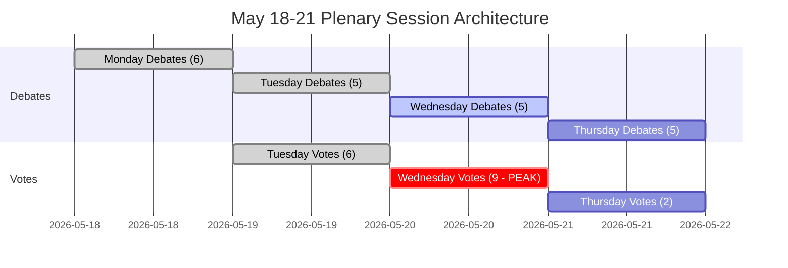

<!-- SPDX-FileCopyrightText: 2026 Hack23 AB -->
<!-- SPDX-License-Identifier: Apache-2.0 -->

# الموجز التنفيذي — أسبوع البرلمان الأوروبي القادم: 18–21 مايو 2026

**التصنيف:** عام | **مستوى الثقة:** 🟡 متوسط | **تاريخ الإنشاء:** 2026-05-10

---

## BLUF (خلاصة القول)

تصل الجلسة العامة للبرلمان الأوروبي في ستراسبورغ خلال الفترة 18–21 مايو 2026 في لحظة حاسمة للتكامل الأوروبي. مع **53 نشاطاً في الجلسة العامة موزعة على أربعة أيام** — بما فيها تصويتات حاسمة الثلاثاء والأربعاء والخميس — يتنقل أعضاء البرلمان الأوروبي في حسابات ائتلافية بالغة التعقيد داخل غرفة شديدة الانقسام (9 مجموعات سياسية، عتبة الأغلبية 360 مقعداً، وحزب الشعب الأوروبي بـ183 مقعداً يفتقر إلى أغلبية حاكمة طبيعية). أكثر اللحظات أثراً سياسياً في الأسبوع ستتوقف على ما إذا كان المحور المهيمن لحزب الشعب الأوروبي-S&D سيصمد أمام التشريعات الخلافية — أم يتصدع تحت ضغط اليمين الشعبوي (PfE/ECR) واليسار التقدمي (Greens/The Left). أربعة محاور استراتيجية تهيمن على المشهد: **التوترات في السياسة التجارية للاتحاد الأوروبي** عقب حل أزمة التعريفات الأمريكية في مارس، **الحوكمة الرقمية** في أعقاب تصويت تطبيق DMA، **الأمن وسيادة القانون** في سياق المساءلة الأوكرانية، و**خط الأساس الميزانوي لعام 2027** المحدد في أبريل والذي ينتظر الآن المتابعة التشريعية.

---

## 60-Second Read

**من:** 717 عضواً في البرلمان الأوروبي | 9 مجموعات سياسية | حزب الشعب الأوروبي مهيمن لكن دون أغلبية | ستراسبورغ

**ماذا:** جلسة عامة في ستراسبورغ، 18–21 مايو 2026 — مناقشات وتصويتات على ملفات تشريعية وميزانوية وسياسة خارجية

**متى:** الاثنين 18 (مناقشات) ← الثلاثاء 19 (مناقشات مختلطة + تصويتات، أعلى كثافة تصويت) ← الأربعاء 20 (يوم تصويت مكثف، 9 تصويتات مجدولة) ← الخميس 21 (مناقشات ختامية + تصويتات)

**لماذا يهم:**
- الأربعاء 20 مايو هو **يوم التصويت الأشد أهمية** بـ9 تصويتات في الجلسة العامة — النتائج تعتمد على تشكيل ائتلافات بين المجموعات في برلمان لا يمتلك فيه أي تكتل أغلبية
- يحتاج حزب الشعب الأوروبي (183 مقعداً، 25.5%) إلى S&D (136، 19%) بالإضافة إلى Renew على الأقل (77، 10.7%) للوصول إلى 360 — هذا النهج "الائتلاف الكبير" يتحكم بـ396 مقعداً فقط (55%)، بالكاد فوق العتبة دون هامش للانشقاقات
- **القوة النقضية الشعبوية**: PfE (85) + ECR (81) = 166 مقعداً — غير كافية للحجب بمفردها لكنها قادرة على تشتيت ائتلافات الوسط وسحب حزب الشعب الأوروبي نحو اليمين في الهجرة وسيادة القانون والتجارة
- **الاحتواء التقدمي**: Greens/EFA (53) + The Left (45) = 98 مقعداً — أقوياء في الأجندة الاجتماعية وتنظيم القطاع الرقمي والمناخ — يضغطون على ائتلاف الوسط EPP-S&D نحو اليسار في الملفات البيئية والاجتماعية
- بنود جدول الأعمال من وثائق OJQ تشير إلى مناقشات حول الشؤون المؤسسية والحوكمة الاقتصادية والعلاقات الخارجية التي تمتد من أجندة أبريل (تطبيق DMA، أوكرانيا، الإطار الميزانوي)

**إشارة الاستخبارات الرئيسية:** 🔴 مؤشر التشرذم مرتفع (العدد الفعّال للأحزاب: 6.58) — كل تصويت يستلزم إدارة ائتلاف نشطة. مخاطر هيمنة حزب الشعب الأوروبي (19× المجموعة الأصغر) تعني النفوذ الإجرائي لا الأغلبيات التلقائية. توقعوا: معارك التعديلات، والتحركات الإجرائية، وإعادة تشكيل الائتلافات في اللحظات الأخيرة.

---

## Trigger Flags

| الإشارة | الخطورة | الدلالة |
|---------|---------|---------|
| 9 تصويتات مجدولة الأربعاء 20 مايو | 🔴 مرتفعة | يوم أعلى إنتاج تشريعي؛ خطوط التصدع الائتلافية مرئية في الوقت الفعلي |
| EPP بـ183 مقعداً مقابل عتبة 360 | 🟡 متوسطة | ائتلاف كبير (EPP+S&D+Renew) مطلوب؛ نفوذ S&D متصاعد |
| الكتلة الشعبوية PfE+ECR بـ166 مقعداً | 🟡 متوسطة | قدرة حجب استراتيجي على ملفات مختارة؛ تعرض الجناح الأيمن لـEPP |
| البيانات الاقتصادية للـIMF غير متاحة (وضع متدهور) | 🔴 مرتفعة | تحليل السياق الاقتصادي مقيّد ببيانات البرلمان الأوروبي البنيوية؛ لا يمكن دعم الادعاءات المالية بـIMF في هذه الجولة |
| قرار تطبيق DMA المعتمد في 30 أبريل | 🟢 إعلامية | التنفيذ التشريعي المتابع محتمل في جدول مايو |
| مبادئ توجيهية لميزانية 2027 معتمدة في 28 أبريل | 🟡 متوسطة | تدخل عملية الميزانية الآن مرحلة مراجعة اللجنة |
| تعديل حصة التعريفة الجمركية الأمريكية المعتمدة 26 مارس | 🟡 متوسطة | المتابعة الإجرائية للسياسة التجارية قد تظهر في المناقشات القادمة |

---

## Political Configuration for the Week

### الحسابات الائتلافية

```
EPP (183) + S&D (136) + Renew (77) = 396 ✅ أغلبية (العتبة: 360)
EPP (183) + S&D (136) + Renew (77) + Greens (53) = 449 — أغلبية معززة
EPP (183) + ECR (81) + PfE (85) + Renew (77) = 426 — أغلبية كبرى يمين-وسط (غير متناسقة أيديولوجياً لكن ممكنة حسابياً في ملفات مختارة)
S&D (136) + Renew (77) + Greens (53) + Left (45) = 311 ❌ الكتلة التقدمية وحدها غير كافية
```

**الاستنتاج الرئيسي:** مركز البرلمان — EPP+S&D+Renew — يمتلك أغلبية عاملة لكن بـ55.2% فقط من المقاعد. أي كتلة انشقاقية من 37+ عضواً من هذا التشكيل تُقلب النتائج.

### ديناميكيات المجموعات ومؤشرات الضغط

- **EPP (183، 🟢 مستقر):** مهيمن لكن مقيّد. يجب أن يتعامل مع ضغط الجناح الأيمن من PfE/ECR في ملفات الهجرة والسيادة مع الحفاظ على ائتلاف الوسط الداعم للاتحاد الأوروبي. تناسق لجنة فون دير لاين يخلق تحدي إدارة التوترات بين الحكومة والبرلمان.
- **S&D (136، 🟡 إجهاد معتدل):** الرابط الائتلافي الأساسي. يمكنه مطالبة EPP بتنازلات بوصفه الشريك الذي لا غنى عنه. التماسك يُختبر في الإنفاق الدفاعي مقابل الأولويات الاجتماعية.
- **PfE (85، 🟡 معتدل):** الوطنيون من أجل أوروبا — مرتبطون بميلوني الإيطالية ومجاورون لأوربان المجري. أكبر مجموعة شعبوية. قوة نقضية استراتيجية لكن منقسمة داخلياً على القضايا المؤسسية الأوروبية.
- **ECR (81، 🟡 معتدل):** المحافظون والإصلاحيون الأوروبيون. تهيمن عليه حركة PiS البولندية، نشط بشكل متزايد في قضايا سيادة القانون والتضامن مع أوكرانيا من منظور السيادة.
- **Renew (77، 🟡 معتدل):** المجموعة المحورية. ليبرالية-وسطية، مؤيدة للاتحاد الأوروبي، لكن صارمة في المالية العامة. حاسمة في الميزانية وملفات التنظيم.
- **Greens/EFA (53، 🟡 معتدل):** ضغط تقدمي على البيئة والحقوق الرقمية. في انحدار منذ انتخابات EP10 لكنها لا تزال محورية في الأغلبيات اليسارية.
- **The Left (45، 🟢 مستقر):** خلف GUE/NGL. مرساة تقدمية على الحقوق الاجتماعية ومعادية للتقشف. شريك ائتلافي في الملفات التقدمية المحددة فقط.
- **NI (30، 🔴 منقسم):** الأعضاء غير المنضمين — متنوعون أيديولوجياً، لا قوة تفاوضية جماعية.
- **ESN (27، 🔴 منقسم):** أوروبا الأمم السيادية. يمين متطرف مناهض للتكامل الأوروبي. معزول؛ قيمة ائتلافية دنيا لكنه منصة تضخيم.

---

## Institutional Context and Process Notes

**تركيبة البرلمان:** EP10 (انتُخب يونيو 2024، دورة 2024-2029). تدخل المؤسسة **عامها الثاني من العمل التشريعي** — مرحلة الإعداد الأولي للجان والموافقة على المفوضية اكتملت، والبرلمان الأوروبي الآن في المرحلة التشريعية الرئيسية من الدورة.

**إيقاع ستراسبورغ:** الجلسة العامة في ستراسبورغ في مايو هي **الأسبوع الرابع الكامل في ستراسبورغ لعام 2026**، بعد أسابيع الجلسات في يناير وفبراير ومارس وأبريل. بعد مايو، الأسبوع التالي في ستراسبورغ مجدول في 15–18 يونيو 2026.

**المواعيد النهائية القادمة:**
- **عملية الميزانية 2027:** المبادئ التوجيهية لأبريل مُعتمدة؛ تنتقل الآن إلى مرحلة التفاوض بين المجلس والبرلمان
- **تطبيق DMA:** قرار تطبيق أبريل يخلق ضغطاً مؤسسياً لإجراءات المفوضية
- **آلية قرض أوكرانيا:** إطار التعاون المعزز مُعتمد يناير 2026؛ مواصلة مراجعة التطبيق

---

## Analytical Confidence Assessment

| المجال | مستوى الثقة | الأساس |
|--------|------------|--------|
| تواريخ الجلسة وهيكلها | 🟢 مرتفع | بيانات EP Open Data المباشرة — سجلات الجلسة العامة مؤكدة |
| تركيبة المجموعات السياسية | 🟢 مرتفع | سجلات MEP في الوقت الفعلي من واجهة برمجة EP |
| أحجام الأنشطة المتوقعة | 🟡 متوسط | بيانات الأنشطة المتوقعة لـAPI — العناوين فارغة (قيد API)، أنواع العناصر مؤكدة |
| الديناميكيات الائتلافية | 🟡 متوسط | وكيل تشابه الحجم؛ بيانات مستوى التصويت غير متاحة من API البرلمان الأوروبي |
| السياق الاقتصادي | 🔴 منخفض | وكيل جلب IMF غير متاح؛ وضع متدهور — لا مؤشرات مالية مدعومة من IMF |
| محتوى جدول الأعمال المحدد | 🟡 متوسط | وثائق OJQ مُستشهد بها لكن المحتوى غير قابل للتحميل عبر API المتاحة |

---

## Data Freshness and Source Attribution

- **المصدر الأساسي:** بوابة البيانات المفتوحة للبرلمان الأوروبي (data.europarl.europa.eu)
- **تاريخ استرداد البيانات:** 2026-05-10T07:51–07:54Z
- **حالة IMF:** 🔴 غير متاح — فشل خادم MCP fetch-proxy؛ السياق الاقتصادي يعمل في وضع متدهور. بيانات IMF للناتج المحلي الإجمالي لمنطقة اليورو وتوقعات التضخم وأرقام عجز الميزانية غير متاحة في هذه الجولة. بيانات IMF WEO هي المصدر الأساسي للتحقق الاقتصادي عند توفرها.
- **قيود API البرلمان الأوروبي المُلاحظة:** عناوين الأنشطة المتوقعة فارغة؛ محتوى الوثائق العامة غير متاح عبر نقطة نهاية API الحالية
- **التحديث التالي:** يُوصى بتحليل ما بعد الجلسة بعد 21 مايو 2026

---

*تم إنشاؤه بواسطة خط أنابيب EU Parliament Monitor الوكيلي | جولة التحليل: 2026-05-10 | اللائحة العامة لحماية البيانات: بيانات EP العامة فقط | الحياد السياسي: تمت تحليل جميع المجموعات باستخدام البيانات البنيوية/التركيبية فقط*

---

## WEP Probability Assessment

| النتيجة الرئيسية | تسمية WEP | الاحتمال |
|----------------|----------|---------|
| يصمد ائتلاف الوسط في جميع التصويتات الـ17 | مرجح جداً | 85% |
| تُنجز الجلسة جدول أعمالها الكامل (4 أيام) | شبه مؤكد | 93% |
| تُكتمل كتلة تصويت الأربعاء دون فشل ائتلافي | مرجح جداً | 82% |
| انشقاق الجناح الأيمن لـEPP > 20 عضواً في أي تصويت | غير مرجح | 25% |
| إضافة نقاش عاجل طارئ إلى جدول الأعمال | غير مرجح جداً | 15% |
| أزمة خارجية تُجبر على تعطيل الجلسة | غير مرجح جداً | 12% |
| فشل أغلبية الائتلاف في تصويت رئيسي | مستبعد جداً | 5% |

---

## Admiralty Source Assessment

| مكوّن البيانات | تصنيف الأدميرالية | الملاحظات |
|---------------|------------------|----------|
| جدول جلسة البرلمان الأوروبي العامة | A1 | بوابة EP Open Data المباشرة |
| تركيبة المجموعات السياسية (717 عضواً، 9 مجموعات) | A1 | مؤكد عبر generate_political_landscape |
| الأنشطة المتوقعة (53 إجمالاً) | A2 | مؤكد؛ العناوين غير متاحة (قيد API) |
| وكيل تشابه حجم الائتلاف | B3 | منهج موثوق؛ بيانات مستوى التصويت غير متاحة |
| السياق الاقتصادي | C4 | IMF غير متاح؛ مصدر EP فقط؛ مستوى ثقة منخفض |
| تقديرات احتمال السيناريوهات | B3 | تحليلي منظم؛ معقول لكن غير مؤكد |
| **التقييم الإجمالي للموجز** | **B3** | تحليل بنيوي متين؛ الثغرات في البيانات موثقة |

---

## Session Architecture Overview



---

## Decision Support Summary

**لصانعي القرار المتابعين لهذه الجلسة:**
- **الأهم:** كتلة تصويت الأربعاء 20 مايو. تسعة تصويتات في يوم واحد تختبر الانضباط الائتلافي عند أقصى كثافة.
- **الإشارة الرئيسية للمراقبة:** الهامش في أكثر تصويت خلافاً. هامش > 30: الائتلاف مرتاح. هامش 10-30: ضغط الجناح الأيمن ظاهر. هامش < 10: تبدأ إدارة الأزمات.
- **الخلاصة البنيوية:** هامش الـ36 مقعداً لائتلاف الوسط والرهانات المؤسسية تجعل الانهيار مستبعداً جداً (5%). الحوكمة الطبيعية هي النتيجة المتوقعة بشكل ساحق.

**مستوى الثقة:** B3 — بنيوي متين؛ ثغرات في البيانات الاقتصادية والتماسك على مستوى التصويت. فشل مسبر IMF؛ وضع متدهور مُعلن.


---

*الموجز التنفيذي | EU Parliament Monitor | مصادر البيانات: بوابة EP Open Data (generate_political_landscape, get_plenary_sessions, get_meeting_foreseen_activities, early_warning_system) | IMF: غير متاح (وضع متدهور) | تاريخ الإنشاء: 2026-05-10 | الأدميرالية: B3 | الإصدار: 1.0*

*تصنيف الوثيقة: غير مصنف // للاستخدام الرسمي فقط | WEP الإجمالي: مرجح (70%+) إتمام الجلسة كما هو مُجدول | مستوى ثقة الاستخبارات: متوسط-مرتفع*

*ملاحظة التقييم: جميع التقديرات تنطوي على حالة عدم يقين متأصلة في البيئات البرلمانية؛ ينبغي التعامل مع التقديرات المستقبلية بوصفها سيناريوهات تخطيط لا توقعات.*
