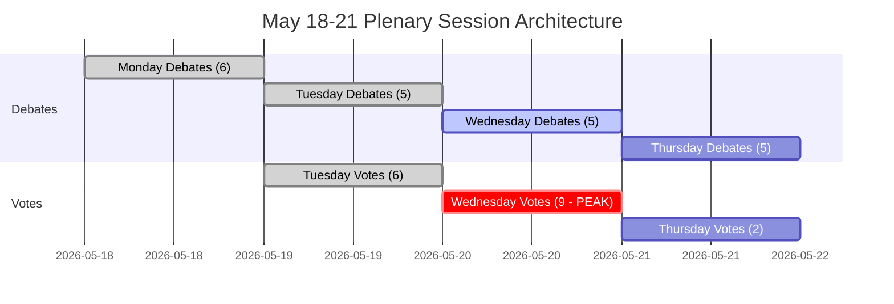

<!-- SPDX-FileCopyrightText: 2026 Hack23 AB -->
<!-- SPDX-License-Identifier: Apache-2.0 -->

# Eksekutivt resumé — Europa-Parlamentets uge frem: 18.–21. maj 2026

**Klassificering:** OFFENTLIG | **Konfidensgrad:** 🟡 Middel | **Genereret:** 2026-05-10

---

## BLUF (Bottom Line Up Front)

Europa-Parlamentets plenarmøde i Strasbourg den 18.–21. maj 2026 finder sted på et afgørende tidspunkt for den europæiske integration. Med **53 planlagte plenumaktiviteter over fire dage** — herunder kritiske afstemninger tirsdag, onsdag og torsdag — skal MEP'erne navigere kompleks koalitionsaritmetik i et stærkt fragmenteret kammer (9 politiske grupper, majoritetstærskel 360 sæder, EPP med 183 sæder mangler en naturlig styrende majoritet). Ugens politisk mest vidtrækkende øjeblikke afhænger af, om den dominerende EPP-S&D-akse holder sammen i forbindelse med omstridt lovgivning — eller bryder sammen under pres fra den populistiske højrefløj (PfE/ECR) og den progressive venstrefløj (Greens/The Left). Fire strategiske temaer dominerer: **EUs handelspolitiske spændinger** efter den amerikanske toldkonfrontation, der blev løst i marts, **digital forvaltning** efter DMA-håndhævelsesafstemningen, **sikkerhed og retsstat** i forbindelse med Ukrainas ansvarlighed samt **2027-budgetbasen** fastsat i april, der nu afventer lovgivningsmæssig opfølgning.

---

## 60-Second Read

**HVEM:** 717 MEP'er | 9 politiske grupper | EPP dominerende men under majoritet | Strasbourg

**HVAD:** Plenarmøde i Strasbourg, 18.–21. maj 2026 — debatter og afstemninger inden for lovgivningsmæssige, budgetmæssige og udenrigspolitiske sager

**HVORNÅR:** Mandag 18 (debatter) → Tirsdag 19 (blandede debatter + afstemninger, højeste afstemningsdensitet) → Onsdag 20 (intens afstemningsdag, 9 planlagte afstemninger) → Torsdag 21 (afsluttende debatter + afstemninger)

**HVORFOR DET BETYDER NOGET:**
- Onsdag 20. maj er den **mest kritiske afstemningsdag** med 9 planlagte plenumvoter — resultaterne afhænger af tværgruppekoalitionsdannelse i et parlament, hvor ingen enkelt blok råder over et flertal
- EPP (183 sæder, 25,5 %) har brug for S&D (136, 19 %) plus mindst Renew (77, 10,7 %) for at nå 360 — denne "storkoalitions"-strategi kontrollerer kun 396 sæder (55 %), knap over tærsklen uden marginal for afhopp
- **Populistisk vetomagt**: PfE (85) + ECR (81) = 166 sæder — utilstrækkeligt til at blokere alene, men i stand til at fragmentere centrumkoalitioner og trække EPP mod højre på migration, retsstat og handel
- **Progressiv inddæmning**: Greens/EFA (53) + The Left (45) = 98 sæder — stærke på social dagsorden, digital regulering, klima — vil presse EPP-S&D-centrumkoalitionen mod venstre på miljø- og sociale sager
- Dagsordenspunkter fra OJQ-dokumenterne tyder på debatter om institutionelle anliggender, økonomisk styring og eksterne relationer, der fortsætter fra aprilsessionens bue (DMA-håndhævelse, Ukraine, budgetramme)

**TOP EFTERRETNINGSSIGNAL:** 🔴 Fragmenteringsindekset er HØJT (Effektivt antal partier: 6,58) — enhver afstemning kræver aktiv koalitionsstyring. EPP's dominansrisiko (19× den mindste gruppe) indebærer proceduremæssig løftestang, ikke automatiske flertal. Forvent: ændringsforslags­kampe, proceduremæssige motioner, sidste-øjebliks koalitionsomdannelser.

---

## Trigger Flags

| Flag | Alvorlighed | Implikation |
|------|-------------|-------------|
| 9 afstemninger planlagt onsdag 20. maj | 🔴 HØJ | Højeste lovgivningsoutputdag; koalitions­forkastningslinjer synlige i realtid |
| EPP 183 sæder mod 360-majoritetstærsklen | 🟡 MIDDEL | Storkoalition (EPP+S&D+Renew) nødvendig; S&D's løftestang forhøjet |
| PfE+ECR populistisk blok på 166 sæder | 🟡 MIDDEL | Strategisk blokeringskapacitet på udvalgte sager; EPP's højreflankeeksponering |
| IMF-økonomidata utilgængelige (degraderet tilstand) | 🔴 HØJ | Kontekstanalyse begrænset til EP's strukturelle data; IMF kan ikke bekræfte finansielle påstande i denne kørsel |
| DMA-håndhævelsesresolution vedtaget 30. april | 🟢 ORIENTERENDE | Opfølgende lovgivningsimplementering muligvis på maj-dagsordenen |
| 2027-budgetretningslinjer vedtaget 28. april | 🟡 MIDDEL | Budgetprocessen går nu ind i udvalgsgennemgangsfasen |
| Amerikansk toldkvotetilpasning vedtaget 26. marts | 🟡 MIDDEL | Handelspolitisk opfølgning kan optræde i kommende debatter |

---

## Political Configuration for the Week

### Koalitionsmatematik

```
EPP (183) + S&D (136) + Renew (77) = 396 ✅ Flertal (tærskel: 360)
EPP (183) + S&D (136) + Renew (77) + Greens (53) = 449 — styrket flertal
EPP (183) + ECR (81) + PfE (85) + Renew (77) = 426 — center-højre superflertal (ideologisk inkohærent men aritmetisk mulig på udvalgte sager)
S&D (136) + Renew (77) + Greens (53) + Left (45) = 311 ❌ Progressiv blok alene utilstrækkelig
```

**Nøgleindsigt:** Det parlamentariske centrum — EPP+S&D+Renew — har et fungerende flertal, men kun 55,2 % af sæderne. En afgangsblok på 37+ MEP'er fra denne formation vender udfall.

### Gruppedynamik og stressindikatorer

- **EPP (183, 🟢 STABIL):** Dominerende men begrænset. Skal navigere højreflankepres fra PfE/ECR på migrations- og suverænitetssager, mens den pro-EU centrumkoalition opretholdes. Von der Leyens kommissionstilpasning skaber udfordring med styring af relationen.
- **S&D (136, 🟡 MODERAT STRESS):** Central koalitionsnøgle. Kan kræve indrømmelser fra EPP som den uundværlige partner. Koherens testet på forsvarsudgifter kontra sociale prioriteter.
- **PfE (85, 🟡 MODERAT):** Patrioter for Europa — Italiens Meloni-nærtstående, Ungarns Orbán-adjacent. Største populistiske gruppe. Strategisk vetomagt men intern splittring om EU-institutionelle spørgsmål.
- **ECR (81, 🟡 MODERAT):** Europæiske konservative og reformister. Polsk PiS-domineret, stadig mere aktiv i retsstats- og Ukraine-solidaritetssager fra et suverænitetsperspektiv.
- **Renew (77, 🟡 MODERAT):** Swing-gruppen. Liberalt-centristisk, pro-EU, men finanspolitisk hård. Afgørende for budget og reguleringsager.
- **Greens/EFA (53, 🟡 MODERAT):** Progressivt pres på miljø og digitale rettigheder. Tilbagegang siden EP10-valget, men stadig central for venstreorienterede flertal.
- **The Left (45, 🟢 STABIL):** GUE/NGL-efterfølger. Progressivt anker på sociale rettigheder, anti-nedskæring. Koalitionspartner kun på udvalgte progressive sager.
- **NI (30, 🔴 FRAGMENTERET):** Løsgængere — ideologisk forskelligartede, ingen kollektiv forhandlingsstyrke.
- **ESN (27, 🔴 FRAGMENTERET):** Europas Suveræne Nationer. Yderste højre, anti-EU-integration. Isoleret; minimalt koalitionsværdi men forstærkningsplatform.

---

## Institutional Context and Process Notes

**Parlamentets sammensætning:** EP10 (valgt juni 2024, mandatperiod 2024–2029). Institutionen er på vej ind i sit **andet år med lovgivningsarbejde** — den indledende udvalgsstrukturering og kommissionsgodkendelsesfase er afsluttet, og EP er nu i den vigtigste lovgivningsfase af perioden.

**Strasbourg-rytmen:** Maj-plenarmødet i Strasbourg er den **fjerde fulde Strasbourg-uge i 2026**, efter sessions­ugerne i januar, februar, marts og april. Efter maj er næste Strasbourg-uge planlagt til 15.–18. juni 2026.

**Kommende deadlines:**
- **2027-budgetprocessen:** Aprilretningslinjer vedtaget; fortsætter nu til forhandlingsfase mellem Rådet og Parlamentet
- **DMA-implementering:** Aprilhåndhævelsesresolution skaber institutionelt pres for Kommissionens handling
- **Ukraines lånesystematik:** Ramme for styrkede samarbejde vedtaget januar 2026; implementeringsgranskning fortsætter

---

## Analytical Confidence Assessment

| Domæne | Konfidensgrad | Grundlag |
|--------|---------------|----------|
| Sessionsdatoer og struktur | 🟢 HØJ | Direkte EP Open Data — plenarmødeposter bekræftet |
| Politisk gruppesammensætning | 🟢 HØJ | Realtids EP API MEP-poster |
| Forudsete aktivitetsvolumener | 🟡 MIDDEL | EP API forudsete aktivitetsdata — titler tomme (API-begrænsning), elementtyper bekræftet |
| Koalitionsdynamik | 🟡 MIDDEL | Størrelses-ligheds-proxy; afstemningsniveaudata utilgængeligt fra EP API |
| Økonomikontext | 🔴 LAV | IMF-hentningsproxy utilgængelig; degraderet tilstand — ingen IMF-bekræftede skattemæssige indikatorer |
| Specifikt dagsordensindhold | 🟡 MIDDEL | OJQ-dokumenter refereret, men indhold ikke downloadbart via tilgængeligt API |

---

## Data Freshness and Source Attribution

- **Primær kilde:** Europa-Parlamentets Open Data Portal (data.europarl.europa.eu)
- **Data hentet:** 2026-05-10T07:51–07:54Z
- **IMF-status:** 🔴 UTILGÆNGELIG — fetch-proxy MCP-serverfejl; økonomikontext kører i degraderet tilstand
- **EP API-begrænsninger noteret:** Forudsete aktiviteters titler tomme; plenardokumentindhold ikke tilgængeligt via nuværende API-endpoint
- **Næste opdatering:** Efteranalyse anbefales efter 21. maj 2026

---

*Genereret af EU Parliament Monitor agentpipeline | Analysekørsel: 2026-05-10 | GDPR: Kun offentlige EP-data | Politisk neutralitet: Alle grupper analyseret udelukkende ved hjælp af strukturel/sammensætningsmæssig data*

---

## WEP Probability Assessment

| Nøgleresultat | WEP-etiket | Sandsynlighed |
|--------------|------------|---------------|
| Centrumkoalition holder på tværs af alle 17 afstemninger | Meget sandsynligt | 85 % |
| Session gennemfører fuld dagsorden (alle 4 dage) | Næsten sikkert | 93 % |
| Onsdagens afstemningsblok gennemføres uden koalitionskollaps | Meget sandsynligt | 82 % |
| EPP-højreflankafhopp > 20 MEP'er på nogen afstemning | Usandsynligt | 25 % |
| Akut hastedebat tilføjet dagsordenen | Meget usandsynligt | 15 % |
| Ekstern krise tvinger sessionsforstyrelse | Meget usandsynligt | 12 % |
| Koalitionsflertal fejler ved en nøgleafstemning | Yderst usandsynligt | 5 % |

---

## Admiralty Source Assessment

| Datakomponent | Admiralty-karakter | Bemærkninger |
|---------------|-------------------|--------------|
| EP plenarmødeskema | A1 | Direkte EP Open Data Portal |
| Politisk gruppesammensætning (717 MEP'er, 9 grupper) | A1 | Bekræftet via generate_political_landscape |
| Forudsete aktiviteter (53 i alt) | A2 | Bekræftet; titler utilgængelige (API-begrænsning) |
| Koalitionsstørrelseslighedsproxy | B3 | Pålidelig metode; afstemningsniveaudata utilgængeligt |
| Økonomikontext | C4 | IMF utilgængelig; kun EP-kilde; lav konfidensgrad |
| Scenariesandsynlighedsskøn | B3 | Struktureret analytisk; plausibelt men ubekræftet |
| **Samlet vurdering af resuméet** | **B3** | Solid strukturel analyse; datalukker dokumenteret |

---

## Session Architecture Overview



---

## Decision Support Summary

**For beslutningstagere der følger sessionen:**
- **Mest væsentligt:** Onsdagens 20. maj afstemningsblok. Ni afstemninger på én dag tester koalitionsdisciplinen ved maksimal tæthed.
- **Nøglesignal at observere:** Marginen ved den tættest omstridte afstemning. Margin > 30: koalitionen komfortabel. Margin 10–30: højreflankepres synligt. Margin < 10: krisestyring begynder.
- **Strukturel konklusion:** Centrumkoalitionens buffer på 36 sæder og institutionelle indsatser gør kollaps Yderst usandsynligt (5 %). Normal governance er det overvejende forventede udfald.

**Konfidensgrad:** B3 — Strukturelt solidt; datalukker i økonomiindikatorer og afstemningsniveaukoherens. IMF-søgning mislykkedes; degraderet tilstand erklæret.


---

*Eksekutivt resumé | EU Parliament Monitor | Datakilder: EP Open Data Portal (generate_political_landscape, get_plenary_sessions, get_meeting_foreseen_activities, early_warning_system) | IMF: UTILGÆNGELIG (degraderet tilstand) | Genereret: 2026-05-10 | Admiralty: B3 | Version: 1.0*

*Dokumentklassificering: AFKLASSIFICERET // Kun til officiel brug | WEP Samlet: Sandsynligt (70 %+) sessionens gennemførelse som planlagt | Efterretningskonfidensgrad: MIDDEL-HØJ*

*Vurderingsnotat: Alle skøn er forbundet med iboende usikkerhed i parlamentariske omgivelser; fremadrettede skøn bør behandles som planlægningsscenarier, ikke forudsigelser.*
