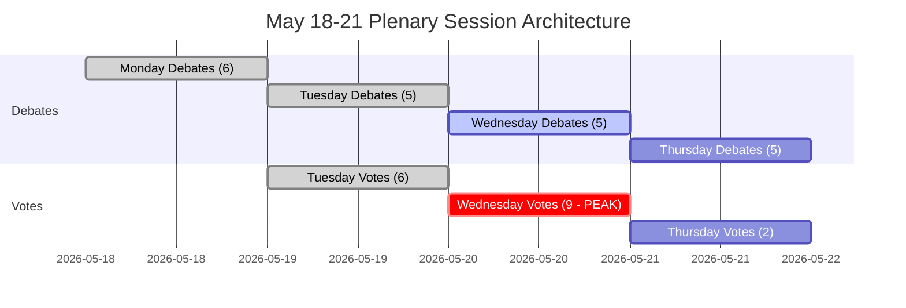

<!-- SPDX-FileCopyrightText: 2026 Hack23 AB -->
<!-- SPDX-License-Identifier: Apache-2.0 -->

# Exekutivzusammenfassung — Europäisches Parlament Wochenvorschau: 18.–21. Mai 2026

**Klassifizierung:** ÖFFENTLICH | **Konfidenzgrad:** 🟡 Mittel | **Erstellt:** 2026-05-10

---

## BLUF (Bottom Line Up Front)

Die Plenarsitzung des Europäischen Parlaments in Straßburg vom 18.–21. Mai 2026 findet zu einem entscheidenden Moment für die europäische Integration statt. Mit **53 geplanten Plenarveranstaltungen über vier Tage** — darunter kritische Abstimmungen am Dienstag, Mittwoch und Donnerstag — navigieren die Abgeordneten eine komplexe Koalitionsarithmetik in einem stark fragmentierten Parlament (9 politische Gruppen, Mehrheitsschwelle 360 Sitze, EPP mit 183 Sitzen ohne natürliche Regierungsmehrheit). Die politisch folgenreichsten Momente der Woche hängen davon ab, ob die dominierende EPP-S&D-Achse bei umstrittener Gesetzgebung zusammenhält — oder unter dem Druck der populistischen Rechten (PfE/ECR) und der progressiven Linken (Greens/The Left) zerbricht. Vier strategische Themen dominieren: **EU-Handelspolitische Spannungen** nach dem im März gelösten US-Zollstreit, **digitale Governance** nach der DMA-Durchsetzungsabstimmung, **Sicherheit und Rechtsstaatlichkeit** im Kontext der Ukraine-Rechenschaft sowie die im April festgelegte **Haushaltsgrundlage 2027**, die nun auf die legislative Umsetzung wartet.

---

## 60-Second Read

**WER:** 717 Abgeordnete | 9 politische Gruppen | EPP dominierend, aber ohne Mehrheit | Straßburg

**WAS:** Plenarsitzung in Straßburg, 18.–21. Mai 2026 — Debatten und Abstimmungen zu Gesetzgebungs-, Haushalts- und außenpolitischen Angelegenheiten

**WANN:** Montag 18 (Debatten) → Dienstag 19 (gemischte Debatten + Abstimmungen, höchste Abstimmungsdichte) → Mittwoch 20 (intensiver Abstimmungstag, 9 geplante Abstimmungen) → Donnerstag 21 (abschließende Debatten + Abstimmungen)

**WARUM ES WICHTIG IST:**
- Mittwoch, 20. Mai ist der **abstimmungsintensivste Tag** mit 9 geplanten Plenarumfragen — Ergebnisse hängen von gruppenübergreifender Koalitionsbildung in einem Parlament ab, in dem kein einzelner Block eine Mehrheit hat
- EPP (183 Sitze, 25,5 %) braucht S&D (136, 19 %) plus mindestens Renew (77, 10,7 %), um 360 zu erreichen — diese „Große-Koalitions"-Strategie kontrolliert nur 396 Sitze (55 %), knapp über der Schwelle ohne Spielraum für Abweichler
- **Populistische Vetomacht**: PfE (85) + ECR (81) = 166 Sitze — unzureichend, um alleine zu blockieren, aber in der Lage, Zentrums­koalitionen zu fragmentieren und EPP bei Migration, Rechtsstaatlichkeit und Handel nach rechts zu ziehen
- **Progressive Eindämmung**: Greens/EFA (53) + The Left (45) = 98 Sitze — stark in der Sozialagenda, digitaler Regulierungsdurchsetzung, Klimaschutz — drücken die EPP-S&D-Zentrumskoalition in Umwelt- und Sozialfragen nach links
- Tagesordnungspunkte aus den OJQ-Dokumenten deuten auf Debatten zu institutionellen Angelegenheiten, Wirtschaftsgovernance und Außenbeziehungen hin, die den Aprils­essions-Arc fortsetzen (DMA-Durchsetzung, Ukraine, Haushaltsrahmen)

**TOP-NACHRICHTENSIGNAL:** 🔴 Der Fragmentierungsindex ist HOCH (Effektive Parteienanzahl: 6,58) — jede Abstimmung erfordert aktives Koalitionsmanagement. EPP-Dominanzrisiko (19× kleinste Gruppe) bedeutet Verfahrenshebelwirkung, keine automatischen Mehrheiten. Erwarten Sie: Änderungsantragskämpfe, Verfahrensanträge, Koalitionsneuformierungen in letzter Minute.

---

## Trigger Flags

| Flagge | Schweregrad | Implikation |
|--------|-------------|-------------|
| 9 Abstimmungen am Mittwoch, 20. Mai geplant | 🔴 HOCH | Höchste Gesetzgebungsoutputdag; Koalitionsbruchlinien in Echtzeit sichtbar |
| EPP 183 Sitze gegenüber der 360-Mehrheitsschwelle | 🟡 MITTEL | Große Koalition (EPP+S&D+Renew) erforderlich; Hebelwirkung der S&D erhöht |
| PfE+ECR populistischer Block bei 166 Sitzen | 🟡 MITTEL | Strategische Blockadefähigkeit bei ausgewählten Vorhaben; EPP-Rechtsflankenexposition |
| IMF-Wirtschaftsdaten nicht verfügbar (Degradierter Modus) | 🔴 HOCH | Wirtschaftliche Kontextanalyse auf EP-Strukturdaten beschränkt; fiskalische Behauptungen können in diesem Durchlauf nicht durch IMF belegt werden |
| DMA-Durchsetzungsresolution angenommen am 30. April | 🟢 INFORMATIV | Gesetzgebungsimplementierung als Folgemaßnahme möglicherweise auf der Mai-Tagesordnung |
| Haushaltsrichtlinien 2027 angenommen am 28. April | 🟡 MITTEL | Haushaltsprozess tritt nun in die Ausschuss-Prüfungsphase ein |
| US-Zollkontingentanpassung angenommen am 26. März | 🟡 MITTEL | Handelspolitische Folgemaßnahmen können in kommenden Debatten vorkommen |

---

## Political Configuration for the Week

### Koalitionsarithmetik

```
EPP (183) + S&D (136) + Renew (77) = 396 ✅ Mehrheit (Schwelle: 360)
EPP (183) + S&D (136) + Renew (77) + Greens (53) = 449 — gestärkte Mehrheit
EPP (183) + ECR (81) + PfE (85) + Renew (77) = 426 — Mitte-Rechts-Supermehrheit (ideologisch inkohärent, aber arithmetisch bei ausgewählten Vorhaben möglich)
S&D (136) + Renew (77) + Greens (53) + Left (45) = 311 ❌ Progressiver Block allein unzureichend
```

**Schlüsselinsight:** Das parlamentarische Zentrum — EPP+S&D+Renew — verfügt über eine funktionierende Mehrheit, aber nur 55,2 % der Sitze. Jeder Abweichlerblock von 37+ Abgeordneten aus dieser Formation kehrt Ergebnisse um.

### Gruppendynamik und Stressindikatoren

- **EPP (183, 🟢 STABIL):** Dominierend, aber begrenzt. Muss Rechtsflanken­druck von PfE/ECR bei Migrations- und Souveränitätsvorhaben navigieren, dabei pro-EU-Zentrumskoalition aufrechterhalten. Von der Leyens Kommissions­alignment schafft Herausforderungen im Regierung-Parlament-Spannungsmanagement.
- **S&D (136, 🟡 MODERATER STRESS):** Schlüssel-Koalitionsbindeglied. Kann als unverzichtbarer Partner Zugeständnisse von EPP fordern. Kohärenz durch Verteidigungsausgaben vs. soziale Prioritäten auf die Probe gestellt.
- **PfE (85, 🟡 MODERAT):** Patrioten für Europa — Italiens Meloni-nahestehend, Ungarns Orbán-adjacent. Größte populistische Gruppe. Strategische Vetomacht, aber intern gespalten in EU-institutionellen Fragen.
- **ECR (81, 🟡 MODERAT):** Europäische Konservative und Reformisten. Von polnischer PiS dominiert, zunehmend aktiv in Rechtsstaatlichkeits- und Ukraine-Solidaritätsfragen aus einer Souveränitätsperspektive.
- **Renew (77, 🟡 MODERAT):** Die Swing-Gruppe. Liberal-zentristisch, pro-EU, aber haushaltspolitisch rigoros. Entscheidend für Haushalts- und Regulierungsvorhaben.
- **Greens/EFA (53, 🟡 MODERAT):** Progressiver Druck bei Umwelt- und digitalen Rechten. Rückgang seit EP10-Wahlen, aber weiterhin wichtig für linksgerichtete Mehrheiten.
- **The Left (45, 🟢 STABIL):** GUE/NGL-Nachfolger. Progressiver Anker bei sozialen Rechten, anti-Austerität. Koalitionspartner nur bei ausgewählten progressiven Vorhaben.
- **NI (30, 🔴 FRAGMENTIERT):** Fraktionslose Mitglieder — ideologisch divers, keine kollektive Verhandlungsmacht.
- **ESN (27, 🔴 FRAGMENTIERT):** Europa der souveränen Nationen. Rechtsextrem, anti-EU-Integration. Isoliert; minimaler Koalitionswert, aber Verstärkungs­plattform.

---

## Institutional Context and Process Notes

**Parlamentszusammensetzung:** EP10 (gewählt Juni 2024, Amtszeit 2024–2029). Die Institution befindet sich in ihrem **zweiten Jahr der Gesetzgebungsarbeit** — die initiale Ausschusseinrichtung und Kommissionsgenehmigungsphase ist abgeschlossen, und das EP befindet sich nun in der Hauptgesetzgebungsphase der Amtszeit.

**Straßburger Rhythmus:** Die Mai-Plenarsitzung in Straßburg ist die **vierte vollständige Straßburger Woche 2026**, nach den Sitzungswochen im Januar, Februar, März und April. Nach Mai ist die nächste Straßburger Woche für den 15.–18. Juni 2026 geplant.

**Bevorstehende Fristen:**
- **Haushaltsprozess 2027:** Aprilrichtlinien angenommen; läuft nun in die Rat-Parlament-Verhandlungsphase
- **DMA-Umsetzung:** April-Durchsetzungsresolution erzeugt institutionellen Druck für Kommissionsmaßnahmen
- **Ukraine-Darlehensmechanismus:** Verstärkte Zusammenarbeit angenommen Januar 2026; Umsetzungsprüfung läuft weiter

---

## Analytical Confidence Assessment

| Bereich | Konfidenzgrad | Grundlage |
|---------|---------------|-----------|
| Sitzungstermine und Struktur | 🟢 HOCH | Direkte EP Open Data — Plenar­sitzungsdatensätze bestätigt |
| Politische Gruppenzusammensetzung | 🟢 HOCH | Echtzeit-EP-API-MdEP-Datensätze |
| Voraussichtliche Aktivitätsvolumen | 🟡 MITTEL | EP-API-Daten für voraussichtliche Aktivitäten — Titel leer (API-Einschränkung), Elementtypen bestätigt |
| Koalitionsdynamik | 🟡 MITTEL | Größenähnlichkeits-Proxy; Abstimmungsebenen-Daten nicht verfügbar vom EP-API |
| Wirtschaftlicher Kontext | 🔴 NIEDRIG | IMF-Abrufproxy nicht verfügbar; Degradierter Modus — keine durch IMF bestätigten fiskalischen Indikatoren |
| Spezifische Tagesordnungsinhalte | 🟡 MITTEL | OJQ-Dokumente referenziert, Inhalt aber nicht über verfügbare API downloadbar |

---

## Data Freshness and Source Attribution

- **Primärquelle:** Europäisches Parlament Open Data Portal (data.europarl.europa.eu)
- **Daten abgerufen:** 2026-05-10T07:51–07:54Z
- **IMF-Status:** 🔴 NICHT VERFÜGBAR — Fetch-Proxy MCP-Serverfehler; Wirtschaftskontext läuft im Degradierten Modus
- **EP-API-Einschränkungen festgestellt:** Titel der voraussichtlichen Aktivitäten leer; Plenar­dokumenteninhalt nicht über aktuellen API-Endpunkt zugänglich
- **Nächste Aktualisierung:** Nachsitzungsanalyse nach dem 21. Mai 2026 empfohlen

---

*Erstellt von EU Parliament Monitor Agentenverteilpipeline | Analyselauf: 2026-05-10 | DSGVO: Nur öffentliche EP-Daten | Politische Neutralität: Alle Gruppen ausschließlich mit Strukturdaten/Zusammensetzungsdaten analysiert*

---

## WEP Probability Assessment

| Schlüsselergebnis | WEP-Bezeichnung | Wahrscheinlichkeit |
|-------------------|-----------------|-------------------|
| Zentrums­koalition hält bei allen 17 Abstimmungen | Sehr wahrscheinlich | 85 % |
| Sitzung schließt vollständige Tagesordnung ab (alle 4 Tage) | Fast sicher | 93 % |
| Mittwoch-Abstimmungsblock ohne Koalitionsversagen abgeschlossen | Sehr wahrscheinlich | 82 % |
| EPP-Rechtsflanken­abweichung > 20 MdEP bei irgendeiner Abstimmung | Unwahrscheinlich | 25 % |
| Notfall-Dringlichkeitsdebatte zur Tagesordnung hinzugefügt | Sehr unwahrscheinlich | 15 % |
| Externe Krise erzwingt Sitzungsunterbrechung | Sehr unwahrscheinlich | 12 % |
| Koalitionsmehrheit scheitert bei einer Schlüsselabstimmung | Höchst unwahrscheinlich | 5 % |

---

## Admiralty Source Assessment

| Datenkomponente | Admiralty-Einstufung | Anmerkungen |
|-----------------|----------------------|-------------|
| EP-Plenarsitzungsplan | A1 | Direkt EP Open Data Portal |
| Politische Gruppenzusammensetzung (717 MdEP, 9 Gruppen) | A1 | Bestätigt via generate_political_landscape |
| Voraussichtliche Aktivitäten (53 gesamt) | A2 | Bestätigt; Titel nicht verfügbar (API-Einschränkung) |
| Koalitions­größenähnlichkeits-Proxy | B3 | Zuverlässige Methode; Abstimmungsebenendaten nicht verfügbar |
| Wirtschaftlicher Kontext | C4 | IMF nicht verfügbar; nur EP-Quelle; niedriger Konfidenzgrad |
| Szenariowahrscheinlichkeits­schätzungen | B3 | Strukturiert-analytisch; plausibel, aber unbestätigt |
| **Gesamtbewertung der Zusammenfassung** | **B3** | Solide Strukturanalyse; Datenlücken dokumentiert |

---

## Session Architecture Overview



---

## Decision Support Summary

**Für Entscheidungsträger, die diese Sitzung verfolgen:**
- **Was am wichtigsten ist:** Der Abstimmungsblock am Mittwoch, 20. Mai. Neun Abstimmungen an einem Tag testen die Koalitionsdisziplin bei maximaler Dichte.
- **Schlüsselsignal zu beobachten:** Die Marge bei der umstrittensten Abstimmung. Marge > 30: Koalition komfortabel. Marge 10–30: Rechtsflanken­druck sichtbar. Marge < 10: Krisenmanagement beginnt.
- **Strukturelle Schlussfolgerung:** Der 36-Sitze-Puffer der Zentrumskoalition und die institutionellen Einsätze machen einen Kollaps Höchst unwahrscheinlich (5 %). Normale Governance ist das überwiegende erwartete Ergebnis.

**Konfidenzgrad:** B3 — Strukturell solide; Datenlücken bei Wirtschaftsindikatoren und Abstimmungsebenen-Kohäsion. IMF-Abfrage fehlgeschlagen; Degradierter Modus erklärt.


---

*Exekutivzusammenfassung | EU Parliament Monitor | Datenquellen: EP Open Data Portal (generate_political_landscape, get_plenary_sessions, get_meeting_foreseen_activities, early_warning_system) | IMF: NICHT VERFÜGBAR (Degradierter Modus) | Erstellt: 2026-05-10 | Admiralty: B3 | Version: 1.0*

*Dokumentklassifizierung: FREIGEGEBEN // Nur zur offiziellen Verwendung | WEP Gesamt: Wahrscheinlich (70 %+) Sitzungsabschluss wie geplant | Nachrichtenkonfidenzgrad: MITTEL-HOCH*

*Bewertungshinweis: Alle Schätzungen beinhalten inhärente Unsicherheiten in parlamentarischen Umgebungen; zukunftsorientierte Schätzungen sollten als Planungsszenarien behandelt werden, nicht als Vorhersagen.*
