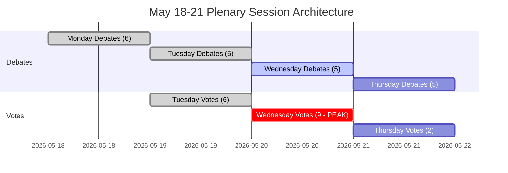

<!-- SPDX-FileCopyrightText: 2026 Hack23 AB -->
<!-- SPDX-License-Identifier: Apache-2.0 -->

# Resumen ejecutivo — Semana próxima en el Parlamento Europeo: 18–21 de mayo de 2026

**Clasificación:** PÚBLICO | **Nivel de confianza:** 🟡 Medio | **Generado:** 2026-05-10

---

## BLUF (Bottom Line Up Front)

El período parcial de sesiones del Parlamento Europeo en Estrasburgo del 18 al 21 de mayo de 2026 llega en un momento decisivo para la integración europea. Con **53 actividades plenarias programadas en cuatro días** — incluyendo votaciones críticas el martes, miércoles y jueves — los eurodiputados navegan una compleja aritmética de coalición en una cámara altamente fragmentada (9 grupos políticos, umbral de mayoría 360 escaños, el PPE con 183 escaños carece de una mayoría gobernante natural). Los momentos políticamente más consecuentes de la semana dependerán de si el eje dominante PPE-S&D se mantiene unido en la legislación controvertida — o se fractura bajo la presión de la derecha populista (PfE/ECR) y la izquierda progresista (Greens/The Left). Cuatro temas estratégicos dominan: **las tensiones en la política comercial de la UE** tras el enfrentamiento arancelario con EE.UU. resuelto en marzo, **la gobernanza digital** tras la votación de aplicación del DMA, **la seguridad y el Estado de derecho** en el contexto de la rendición de cuentas de Ucrania, y la **base presupuestaria 2027** establecida en abril que ahora aguarda el seguimiento legislativo.

---

## 60-Second Read

**QUIÉN:** 717 eurodiputados | 9 grupos políticos | PPE dominante pero sin mayoría | Estrasburgo

**QUÉ:** Período parcial de sesiones en Estrasburgo, 18–21 de mayo de 2026 — debates y votaciones sobre dossiers legislativos, presupuestarios y de política exterior

**CUÁNDO:** Lunes 18 (debates) → Martes 19 (debates mixtos + votaciones, mayor densidad de votación) → Miércoles 20 (jornada de votación intensa, 9 votaciones programadas) → Jueves 21 (debates de cierre + votaciones)

**POR QUÉ IMPORTA:**
- El miércoles 20 de mayo es el **día de votación más crítico** con 9 votaciones plenarias programadas — los resultados dependen de la formación de coaliciones entre grupos en un parlamento donde ningún bloque tiene mayoría
- El PPE (183 escaños, 25,5 %) necesita al S&D (136, 19 %) más al menos Renew (77, 10,7 %) para alcanzar 360 — este enfoque de «gran coalición» controla solo 396 escaños (55 %), apenas por encima del umbral sin margen para deserciones
- **Poder de veto populista**: PfE (85) + ECR (81) = 166 escaños — insuficiente para bloquear solos, pero capaz de fragmentar las coaliciones centristas y atraer al PPE hacia la derecha en migración, Estado de derecho y comercio
- **Contención progresista**: Greens/EFA (53) + The Left (45) = 98 escaños — fuertes en la agenda social, regulación digital, clima — empujarán a la coalición centrista PPE-S&D hacia la izquierda en dossiers medioambientales y sociales
- Los puntos del orden del día de los documentos OJQ sugieren debates sobre asuntos institucionales, gobernanza económica y relaciones exteriores continuando desde el arco de la sesión de abril (aplicación DMA, Ucrania, marco presupuestario)

**SEÑAL DE INTELIGENCIA PRINCIPAL:** 🔴 El índice de fragmentación es ALTO (Número efectivo de partidos: 6,58) — cada votación requiere una gestión activa de la coalición. El riesgo de dominancia del PPE (19× el grupo más pequeño) significa influencia procesal, no mayorías automáticas. Espere: batallas de enmiendas, mociones de procedimiento, recomposiciones de coalición de último momento.

---

## Trigger Flags

| Indicador | Gravedad | Implicación |
|-----------|----------|-------------|
| 9 votaciones previstas el miércoles 20 de mayo | 🔴 ALTA | Día de mayor producción legislativa; líneas de fractura de la coalición visibles en tiempo real |
| PPE 183 escaños frente al umbral de mayoría de 360 | 🟡 MEDIA | Gran coalición (PPE+S&D+Renew) necesaria; palanca del S&D elevada |
| Bloque populista PfE+ECR en 166 escaños | 🟡 MEDIA | Capacidad de bloqueo estratégico en dossiers seleccionados; exposición del flanco derecho del PPE |
| Datos económicos del IMF no disponibles (modo degradado) | 🔴 ALTA | El análisis del contexto económico se limita a datos estructurales del PE; las afirmaciones fiscales no pueden estar respaldadas por el IMF en esta ejecución |
| Resolución de aplicación del DMA adoptada el 30 de abril | 🟢 INFORMATIVO | La implementación legislativa de seguimiento puede aparecer en la agenda de mayo |
| Directrices presupuestarias 2027 adoptadas el 28 de abril | 🟡 MEDIA | El proceso presupuestario entra ahora en la fase de revisión en comisión |
| Ajuste de cuota arancelaria de EE.UU. adoptado el 26 de marzo | 🟡 MEDIA | El seguimiento de la política comercial puede aparecer en futuros debates |

---

## Political Configuration for the Week

### Aritmética de coalición

```
PPE (183) + S&D (136) + Renew (77) = 396 ✅ Mayoría (umbral: 360)
PPE (183) + S&D (136) + Renew (77) + Greens (53) = 449 — mayoría reforzada
PPE (183) + ECR (81) + PfE (85) + Renew (77) = 426 — supermayoría de centro-derecha (ideológicamente incoherente pero aritméticamente viable en dossiers seleccionados)
S&D (136) + Renew (77) + Greens (53) + Left (45) = 311 ❌ Bloque progresista solo insuficiente
```

**Conclusión clave:** El centro parlamentario — PPE+S&D+Renew — tiene una mayoría de trabajo, pero solo el 55,2 % de los escaños. Cualquier bloque desertor de 37+ eurodiputados de esta formación invierte los resultados.

### Dinámica de grupos e indicadores de tensión

- **PPE (183, 🟢 ESTABLE):** Dominante pero limitado. Debe navegar la presión del flanco derecho de PfE/ECR en dossiers de migración y soberanía mientras mantiene la coalición centrista pro-UE. El alineamiento con la Comisión Von der Leyen crea el desafío de gestionar las tensiones gobierno/parlamento.
- **S&D (136, 🟡 ESTRÉS MODERADO):** Eslabón clave de la coalición. Puede exigir concesiones al PPE como socio indispensable. Cohesión puesta a prueba por gastos de defensa vs. prioridades sociales.
- **PfE (85, 🟡 MODERADO):** Patriotas por Europa — alineado con Meloni en Italia, adyacente a Orbán en Hungría. Mayor grupo populista. Poder de veto estratégico pero fragmentado internamente en cuestiones institucionales de la UE.
- **ECR (81, 🟡 MODERADO):** Conservadores y Reformistas europeos. Dominado por el PiS polaco, cada vez más activo en dossiers de Estado de derecho y solidaridad con Ucrania desde una perspectiva de soberanía.
- **Renew (77, 🟡 MODERADO):** El grupo bisagra. Liberal-centrista, pro-UE, pero estricto en materia presupuestaria. Fundamental para dossiers de presupuesto y regulación.
- **Greens/EFA (53, 🟡 MODERADO):** Presión progresista en medioambiente y derechos digitales. En declive desde las elecciones EP10, pero aún fundamental para mayorías de izquierda.
- **The Left (45, 🟢 ESTABLE):** Sucesor del GUE/NGL. Ancla progresista en derechos sociales, anti-austeridad. Socio de coalición solo en dossiers progresistas seleccionados.
- **NI (30, 🔴 FRAGMENTADO):** No adscritos — ideológicamente diversos, sin poder de negociación colectivo.
- **ESN (27, 🔴 FRAGMENTADO):** Europa de las Naciones Soberanas. Extrema derecha, anti-integración europea. Aislado; valor de coalición mínimo, pero plataforma de amplificación.

---

## Institutional Context and Process Notes

**Composición del Parlamento:** EP10 (elegido en junio de 2024, mandato 2024-2029). La institución entra en su **segundo año de trabajo legislativo** — la fase inicial de configuración de comisiones y aprobación de la Comisión está completa, y el PE se encuentra ahora en la principal fase legislativa del mandato.

**Ritmo de Estrasburgo:** La sesión plenaria de mayo en Estrasburgo es la **cuarta semana completa en Estrasburgo de 2026**, tras las sesiones de enero, febrero, marzo y abril. Tras mayo, la próxima semana en Estrasburgo está programada para el 15–18 de junio de 2026.

**Próximos plazos:**
- **Proceso presupuestario 2027:** Directrices de abril adoptadas; pasa ahora a la fase de negociación Consejo-Parlamento
- **Implementación del DMA:** La resolución de aplicación de abril crea presión institucional para la acción de la Comisión
- **Mecanismo de préstamo a Ucrania:** Marco de cooperación reforzada adoptado en enero de 2026; el escrutinio de la implementación continúa

---

## Analytical Confidence Assessment

| Dominio | Nivel de confianza | Base |
|---------|-------------------|------|
| Fechas y estructura de la sesión | 🟢 ALTO | Datos EP Open Data directos — registros de sesión plenaria confirmados |
| Composición de los grupos políticos | 🟢 ALTO | Registros MEP de la API PE en tiempo real |
| Volúmenes de actividades previstas | 🟡 MEDIO | Datos de actividades previstas de la API PE — títulos vacíos (limitación API), tipos de elementos confirmados |
| Dinámica de coalición | 🟡 MEDIO | Proxy de similitud de tamaño; datos a nivel de votación no disponibles en la API PE |
| Contexto económico | 🔴 BAJO | Proxy de recuperación IMF no disponible; modo degradado — sin indicadores fiscales respaldados por el IMF |
| Contenido específico del orden del día | 🟡 MEDIO | Documentos OJQ referenciados, pero contenido no descargable a través de la API disponible |

---

## Data Freshness and Source Attribution

- **Fuente principal:** Portal de Datos Abiertos del Parlamento Europeo (data.europarl.europa.eu)
- **Datos recuperados:** 2026-05-10T07:51–07:54Z
- **Estado IMF:** 🔴 NO DISPONIBLE — fallo del servidor MCP fetch-proxy; el contexto económico opera en modo degradado
- **Limitaciones de la API PE señaladas:** Títulos de actividades previstas vacíos; contenido de documentos del pleno no accesible a través del endpoint API actual
- **Próxima actualización:** Se recomienda el análisis post-sesión tras el 21 de mayo de 2026

---

*Generado por el pipeline agentivo EU Parliament Monitor | Ejecución de análisis: 2026-05-10 | RGPD: Solo datos públicos del PE | Neutralidad política: Todos los grupos analizados únicamente con datos estructurales/composicionales*

---

## WEP Probability Assessment

| Resultado clave | Etiqueta WEP | Probabilidad |
|----------------|-------------|--------------|
| La coalición centrista se mantiene en las 17 votaciones | Muy probable | 85 % |
| La sesión completa el orden del día completo (4 días) | Casi seguro | 93 % |
| El bloque de votación del miércoles concluye sin fracaso de la coalición | Muy probable | 82 % |
| Deserción del flanco derecho del PPE > 20 eurodiputados en alguna votación | Poco probable | 25 % |
| Se añade debate de urgencia de emergencia al orden del día | Muy poco probable | 15 % |
| Crisis externa que obliga a interrupción de la sesión | Muy poco probable | 12 % |
| La mayoría de la coalición fracasa en alguna votación clave | Sumamente improbable | 5 % |

---

## Admiralty Source Assessment

| Componente de datos | Clasificación Almirante | Notas |
|---------------------|------------------------|-------|
| Calendario de la sesión plenaria del PE | A1 | Portal EP Open Data directo |
| Composición de grupos políticos (717 eurodiputados, 9 grupos) | A1 | Confirmado via generate_political_landscape |
| Actividades previstas (53 en total) | A2 | Confirmado; títulos no disponibles (limitación API) |
| Proxy de similitud de tamaño de coalición | B3 | Método fiable; datos a nivel de votación no disponibles |
| Contexto económico | C4 | IMF no disponible; solo fuente del PE; nivel de confianza bajo |
| Estimaciones de probabilidad de escenarios | B3 | Analítico estructurado; plausible pero no confirmado |
| **Evaluación general del resumen** | **B3** | Análisis estructural sólido; lagunas de datos documentadas |

---

## Session Architecture Overview



---

## Decision Support Summary

**Para los responsables de la toma de decisiones que siguen esta sesión:**
- **Lo que más importa:** El bloque de votación del miércoles 20 de mayo. Nueve votaciones en un día ponen a prueba la disciplina de la coalición a máxima densidad.
- **Señal clave a observar:** El margen en la votación más reñida. Margen > 30: coalición cómoda. Margen 10-30: presión del flanco derecho visible. Margen < 10: comienza la gestión de crisis.
- **Conclusión estructural:** El colchón de 36 escaños de la coalición centrista y las apuestas institucionales hacen que el colapso sea Sumamente improbable (5 %). La gobernanza normal es el resultado esperado con amplia diferencia.

**Nivel de confianza:** B3 — Estructuralmente sólido; lagunas de datos en indicadores económicos y cohesión a nivel de votación. La sonda IMF falló; modo degradado declarado.


---

*Resumen ejecutivo | EU Parliament Monitor | Fuentes de datos: Portal EP Open Data (generate_political_landscape, get_plenary_sessions, get_meeting_foreseen_activities, early_warning_system) | IMF: NO DISPONIBLE (modo degradado) | Generado: 2026-05-10 | Admiralty: B3 | Versión: 1.0*

*Clasificación del documento: NO CLASIFICADO // Solo para uso oficial | WEP General: Probable (70 %+) finalización de la sesión según lo previsto | Nivel de confianza de inteligencia: MEDIO-ALTO*

*Nota de evaluación: Todas las estimaciones conllevan incertidumbre inherente en entornos parlamentarios; las estimaciones prospectivas deben tratarse como escenarios de planificación, no como predicciones.*
