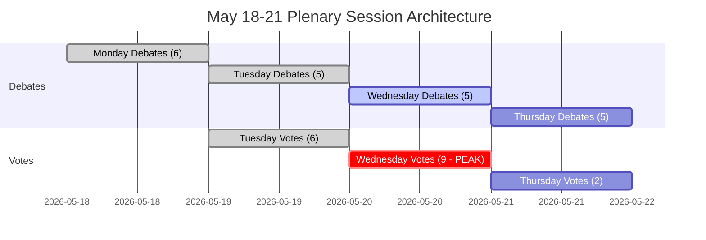

<!-- SPDX-FileCopyrightText: 2026 Hack23 AB -->
<!-- SPDX-License-Identifier: Apache-2.0 -->

# Toimeenpaneva tiivistelmä — Euroopan parlamentin tuleva viikko: 18.–21. toukokuuta 2026

**Luokittelu:** JULKINEN | **Luottamustaso:** 🟡 Keskitaso | **Luotu:** 2026-05-10

---

## BLUF (Bottom Line Up Front)

Euroopan parlamentin täysistunto Strasbourgissa 18.–21. toukokuuta 2026 osuu EU-integraation kannalta ratkaisevaan hetkeen. **53 suunnitelluilla täysistuntoasioilla neljän päivän aikana** — mukaan lukien kriittiset äänestykset tiistaina, keskiviikkona ja torstaina — parlamentin jäsenet navigoivat monimutkaista koalitioaritmetiikkaa voimakkaasti pirstoutuneessa kammarissa (9 poliittista ryhmää, enemmistökynnys 360 paikkaa, EPP:llä 183 paikkaa ilman luonnollista hallitsevaa enemmistöä). Viikon poliittisesti merkittävimmät hetket riippuvat siitä, pitääkö hallitseva EPP-S&D-akseli yhdessä kiistanalaisen lainsäädännön äärellä — vai murtuuko se populistisen oikeiston (PfE/ECR) ja progressiivisen vasemmiston (Greens/The Left) paineen alla. Neljä strategista teemaa hallitsee: **EU:n kauppapolitiikan jännitteet** maaliskuussa ratkaistujen Yhdysvaltain tullikiistojen jälkeen, **digitaalinen hallinto** DMA-täytäntöönpanoäänestyksen jälkeen, **turvallisuus ja oikeusvaltion periaate** Ukrainan vastuullisuuden yhteydessä, sekä **vuoden 2027 budjettipohja** huhtikuussa vahvistettuna, joka odottaa nyt lainsäädäntöseurantaa.

---

## 60-Second Read

**KUKA:** 717 parlamentin jäsentä | 9 poliittista ryhmää | EPP hallitseva mutta alle enemmistön | Strasbourg

**MITÄ:** Täysistunto Strasbourgissa, 18.–21. toukokuuta 2026 — debatteja ja äänestyksiä lainsäädäntö-, budjetti- ja ulkoasioissa

**MILLOIN:** Maanantai 18 (debatit) → Tiistai 19 (sekabebatteja + äänestyksiä, korkein äänestysdensiteetti) → Keskiviikko 20 (intensiivinen äänestyspäivä, 9 suunniteltua äänestystä) → Torstai 21 (päättävät debatit + äänestykset)

**MIKSI SE ON TÄRKEÄÄ:**
- Keskiviikko 20. toukokuuta on **kriittisin äänestyspäivä** 9:llä suunnitellulla täysistuntoäänestyksellä — tulokset riippuvat ryhmien välisestä koalitiomuodostuksesta parlamentissa, jossa yksikään lohko ei hallitse enemmistöä
- EPP (183 paikkaa, 25,5 %) tarvitsee S&D:tä (136, 19 %) sekä vähintään Renew'ta (77, 10,7 %) saavuttaakseen 360 — tämä "suurkoalitiostrategia" hallitsee vain 396 paikkaa (55 %), niukasti kynnyksen yläpuolella ilman katoamisvaraa
- **Populistinen veto-oikeus**: PfE (85) + ECR (81) = 166 paikkaa — riittämätön yksin estämiseen, mutta kykenee fragmentoimaan keskustakoalitioita ja vetämään EPP:tä oikealle muuttoliikkeen, oikeusvaltion ja kaupan alalla
- **Progressiivinen hillintä**: Greens/EFA (53) + The Left (45) = 98 paikkaa — vahvat sosiaalisessa agendassa, digitaalisessa sääntelyssä, ilmastossa — painavat EPP-S&D-keskustakoalition vasemmalle ympäristö- ja sosiaaliasioissa
- OJQ-dokumenttien perusteella agendakohteet viittaavat institutionaalisia asioita, talousohjausta ja ulkosuhteita koskeviin debatteihin, jotka jatkuvat huhtikuun istuntokaaren jälkeen (DMA-täytäntöönpano, Ukraina, budjettikehys)

**HUIPPUANALYYSISIGNAALI:** 🔴 Pirstoutumisindeksi on KORKEA (Puolueiden tehokas lukumäärä: 6,58) — jokainen äänestys vaatii aktiivista koalitiohallintaa. EPP:n hallintariski (19× pienin ryhmä) tarkoittaa menettelyllistä vipuvoimaa, ei automaattisia enemmistöjä. Odota: muutosesityskamppailuja, menettelyllisiä ehdotuksia, viime hetken koalitiomuodostuksia.

---

## Trigger Flags

| Lippu | Vakavuus | Merkitys |
|-------|----------|----------|
| 9 äänestystä suunniteltu keskiviikoksi 20. toukokuuta | 🔴 KORKEA | Korkein lainsäädäntötuotospäivä; koalition hajoamislinjat näkyvissä reaaliajassa |
| EPP:llä 183 paikkaa vs. 360 enemmistökynnys | 🟡 KESKI | Suurkoalitio (EPP+S&D+Renew) tarvitaan; S&D:n vipuvoima kohonnut |
| PfE+ECR populistinen lohko 166 paikalla | 🟡 KESKI | Strateginen estämiskyky tietyissä asioissa; EPP:n oikea sivustoaltistus |
| IMF:n taloudelliset tiedot saavuttamattomissa (heikentynyt tila) | 🔴 KORKEA | Taloudellinen kontekstianalyysi rajoittuu EP:n rakennetietoihin; taloudelliset väitteet eivät voi olla IMF:n tukemia tässä ajossa |
| DMA-täytäntöönpanopäätöslauselma hyväksytty 30. huhtikuuta | 🟢 INFORMATIIVINEN | Jatkolainsäädännön täytäntöönpano mahdollisesti toukokuun agendalla |
| Vuoden 2027 budjettisuuntaviivat hyväksytty 28. huhtikuuta | 🟡 KESKI | Budjettiprosessi siirtyy nyt valiokuntien tarkistusvaiheeseen |
| Yhdysvaltain tullikiintiömuutos hyväksytty 26. maaliskuuta | 🟡 KESKI | Kauppapolitiikan jatkoseuranta voi esiintyä tulevissa debateissa |

---

## Political Configuration for the Week

### Koalitioaritmetiikka

```
EPP (183) + S&D (136) + Renew (77) = 396 ✅ Enemmistö (kynnys: 360)
EPP (183) + S&D (136) + Renew (77) + Greens (53) = 449 — vahvistettu enemmistö
EPP (183) + ECR (81) + PfE (85) + Renew (77) = 426 — oikeistokeskustan superenemmistö (ideologisesti epäkoherentti mutta aritmeettisesti mahdollinen tietyissä asioissa)
S&D (136) + Renew (77) + Greens (53) + Left (45) = 311 ❌ Progressiivinen lohko yksin riittämätön
```

**Keskeinen havainto:** Parlamentaarinen keskusta — EPP+S&D+Renew — hallitsee toimivaa enemmistöä, mutta vain 55,2 % paikoista. Mikä tahansa tästä muodostelmasta poistuva lohko, jossa on 37+ parlamentin jäsentä, kääntää tulokset.

### Ryhmädynamiikka ja stressimittarit

- **EPP (183, 🟢 VAKAA):** Hallitseva mutta rajoitettu. Sen on navigoitava oikean sivuston paine PfE/ECR:ltä muuttoliike- ja suvereniteettikysymyksissä ylläpitäen samalla pro-EU-keskustakoalition. Von der Leyenin komissioyhteensovittaminen luo hallituksen/parlamentin jännitteenhallinnan haasteen.
- **S&D (136, 🟡 KOHTALAINEN STRESSI):** Keskeinen koalitionlenkki. Voi vaatia myönnytyksiä EPP:ltä korvaamattomana kumppanina. Koherenssi koetuksella puolustusmenojen vs. sosiaalisten prioriteettien osalta.
- **PfE (85, 🟡 KOHTALAINEN):** Patriootit Euroopan puolesta — Italian Meloni-läheinen, Unkarin Orbán-adjacen. Suurin populistinen ryhmä. Strateginen veto-oikeus mutta sisäinen hajanaisuus EU:n institutionaalisissa kysymyksissä.
- **ECR (81, 🟡 KOHTALAINEN):** Eurooppalaiset konservatiivit ja reformistit. Puolalainen PiS-dominoitu, yhä aktiivisempi oikeusvaltio- ja Ukraina-solidaarisuusasioissa suvereniteettinäkökulmasta.
- **Renew (77, 🟡 KOHTALAINEN):** Heiluraryhmä. Liberaali-sentristinen, pro-EU, mutta finanssipoliittisesti tarkka. Kriittinen budjetin ja sääntelyasioiden osalta.
- **Greens/EFA (53, 🟡 KOHTALAINEN):** Progressiivinen paine ympäristö- ja digitaalisten oikeuksien alalla. Laskussa EP10-vaaleista lähtien, mutta silti keskeinen vasemmistoenemmistöissä.
- **The Left (45, 🟢 VAKAA):** GUE/NGL:n seuraaja. Progressiivinen ankkuri sosiaalisissa oikeuksissa, vastakohtana austeriteetille. Koalitiopartneri vain tietyissä progressiivisissa asioissa.
- **NI (30, 🔴 PIRSTOUTUNUT):** Ryhmään kuulumattomat jäsenet — ideologisesti moninaisia, ei kollektiivista neuvotteluvoimaa.
- **ESN (27, 🔴 PIRSTOUTUNUT):** Euroopan suvereenien kansakuntien liitto. Äärioikeisto, EU-integraation vastainen. Eristetty; minimaalinen koalitioarvo mutta vahvistusalusta.

---

## Institutional Context and Process Notes

**Parlamentin kokoonpano:** EP10 (valittu kesäkuussa 2024, toimikausi 2024–2029). Instituutio on toisen **lainsäädäntötyön vuotensa** alussa — alkuperäinen valiokuntajärjestely ja komission hyväksymisvaiheen on saatu päätökseen, ja EP on nyt toimikauden pääasiallisessa lainsäädäntövaiheessa.

**Strasbourgin rytmi:** Toukokuun täysistunto Strasbourgissa on **vuoden 2026 neljäs täydellinen Strasbourgin viikko**, tammikuun, helmikuun, maaliskuun ja huhtikuun istuntojen jälkeen. Toukokuun jälkeen seuraava Strasbourgin viikko on suunniteltu 15.–18. kesäkuuta 2026.

**Lähestyvät määräajat:**
- **Vuoden 2027 budjettiprosessi:** Huhtikuun suuntaviivat hyväksytty; etenee nyt neuvoston ja parlamentin väliseen neuvotteluvaiheeseen
- **DMA-täytäntöönpano:** Huhtikuun täytäntöönpanopäätöslauselma luo institutionaalista painetta komission toimille
- **Ukrainan lainamekanismi:** Tiiviimmän yhteistyön kehys hyväksytty tammikuussa 2026; täytäntöönpanon tarkastelu jatkuu

---

## Analytical Confidence Assessment

| Alue | Luottamustaso | Perusta |
|------|---------------|---------|
| Istuntoajat ja rakenne | 🟢 KORKEA | Suora EP Open Data — täysistuntotietueet vahvistettu |
| Poliittinen ryhmäkoostumus | 🟢 KORKEA | Reaaliaikaiset EP API MEP-tietueet |
| Ennakoitujen aktiviteettimäärät | 🟡 KESKI | EP API:n ennakoidut aktiviteettitiedot — otsikot tyhjiä (API-rajoitus), kohteiden tyypit vahvistettu |
| Koalitiodynamiikka | 🟡 KESKI | Kokonpankki-proxy; äänestystason data ei saatavilla EP API:lta |
| Taloudellinen konteksti | 🔴 ALHAINEN | IMF-hakuproxy ei saatavilla; heikentynyt tila — ei IMF:n tukemia finanssi-indikaattoreita |
| Spesifinen agendasisältö | 🟡 KESKI | OJQ-dokumentit viitattu mutta sisältöä ei voi ladata käytettävissä olevan API:n kautta |

---

## Data Freshness and Source Attribution

- **Ensisijainen lähde:** Euroopan parlamentin Open Data Portal (data.europarl.europa.eu)
- **Data haettu:** 2026-05-10T07:51–07:54Z
- **IMF-tila:** 🔴 EI SAATAVILLA — fetch-proxy MCP-palvelinvirhe; taloudellinen konteksti toimii heikentyneessä tilassa
- **EP API-rajoitukset huomioitu:** Ennakoitujen aktiviteettien otsikot tyhjiä; täysistuntodokumenttien sisältö ei saatavilla nykyisen API-endpointin kautta
- **Seuraava päivitys:** Istunnon jälkeinen analyysi suositellaan 21. toukokuuta 2026 jälkeen

---

*Luotu EU Parliament Monitor -agenttiputkilinjalla | Analyysikerta: 2026-05-10 | GDPR: Vain julkiset EP-data | Poliittinen puolueettomuus: Kaikki ryhmät analysoitu pelkästään rakenteellisen/kokoonpanotietojen avulla*

---

## WEP Probability Assessment

| Keskeinen tulos | WEP-etiketti | Todennäköisyys |
|----------------|-------------|----------------|
| Keskustakoalitio pitää kaikissa 17 äänestyksessä | Erittäin todennäköinen | 85 % |
| Istunto suorittaa koko agendan (kaikki 4 päivää) | Lähes varma | 93 % |
| Keskiviikon äänestysblokki suoritetaan ilman koalition murtumista | Erittäin todennäköinen | 82 % |
| EPP:n oikean sivuston poistuminen > 20 jäsentä missä tahansa äänestyksessä | Epätodennäköinen | 25 % |
| Kiireellinen hätädebatti lisätty agendalle | Hyvin epätodennäköinen | 15 % |
| Ulkoinen kriisi pakottaa istunnon häiriöön | Hyvin epätodennäköinen | 12 % |
| Koalition enemmistö epäonnistuu keskeisessä äänestyksessä | Erittäin epätodennäköinen | 5 % |

---

## Admiralty Source Assessment

| Datakomponentti | Admiralty-luokitus | Huomiot |
|-----------------|-------------------|---------|
| EP:n täysistuntoaikataulu | A1 | Suora EP Open Data Portal |
| Poliittinen ryhmäkoostumus (717 jäsentä, 9 ryhmää) | A1 | Vahvistettu via generate_political_landscape |
| Ennakoidut aktiviteetit (53 yhteensä) | A2 | Vahvistettu; otsikot ei saatavilla (API-rajoitus) |
| Koalitiokokonaiskoko-proxy | B3 | Luotettava menetelmä; äänestystason data ei saatavilla |
| Taloudellinen konteksti | C4 | IMF ei saatavilla; vain EP-lähde; alhainen luottamustaso |
| Skenaarioiden todennäköisyysarviot | B3 | Strukturoitu analyyttinen; uskottava mutta vahvistamaton |
| **Tiivistelmän kokonaisarviointi** | **B3** | Solidi rakenteellinen analyysi; datapuutteet dokumentoitu |

---

## Session Architecture Overview



---

## Decision Support Summary

**Päätöksentekijöille, jotka seuraavat tätä istuntoa:**
- **Tärkeintä:** Keskiviikon 20. toukokuuta äänestysblokki. Yhdeksän äänestystä yhdessä päivässä testaa koalitiokuria maksimiteheyssä.
- **Keskeinen seurattava signaali:** Marginaali kiistanalaisimmassa äänestyksessä. Marginaali > 30: koalitio mukava. Marginaali 10–30: oikean sivuston paine näkyvissä. Marginaali < 10: kriisinhallinta alkaa.
- **Rakenteellinen johtopäätös:** Keskustakoalition 36 paikan puskuri ja institutionaaliset panokset tekevät romahtamisesta Erittäin epätodennäköisen (5 %). Normaali hallinta on ylivoimaisesti odotettu tulos.

**Luottamustaso:** B3 — Rakenteellisesti vankka; datapuutteet taloussiirrettimissä ja äänestystason koheesiossa. IMF-haku epäonnistui; heikentynyt tila julistettu.


---

*Toimeenpaneva tiivistelmä | EU Parliament Monitor | Datalähteet: EP Open Data Portal (generate_political_landscape, get_plenary_sessions, get_meeting_foreseen_activities, early_warning_system) | IMF: EI SAATAVILLA (heikentynyt tila) | Luotu: 2026-05-10 | Admiralty: B3 | Versio: 1.0*

*Asiakirjan luokittelu: SALAISIMMAKSI MERKITSEMÄTÖN // Vain viralliseen käyttöön | WEP Kokonaisuudessaan: Todennäköinen (70 %+) istunnon valmistuminen suunnitellusti | Analyysitiedon luottamustaso: KESKI-KORKEA*

*Arviointihuomio: Kaikilla arvioilla on luontainen epävarmuus parlamentaarisissa ympäristöissä; eteenpäin suuntautuvia arvioita tulisi käsitellä suunnitteluskenaarioina, ei ennustuksina.*
