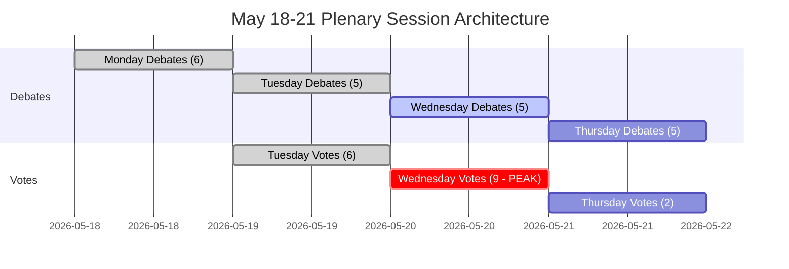

<!-- SPDX-FileCopyrightText: 2026 Hack23 AB -->
<!-- SPDX-License-Identifier: Apache-2.0 -->

# Résumé exécutif — Semaine à venir au Parlement européen : 18–21 mai 2026

**Classification :** PUBLIC | **Niveau de confiance :** 🟡 Moyen | **Généré :** 2026-05-10

---

## BLUF (Bottom Line Up Front)

La session plénière du Parlement européen à Strasbourg du 18 au 21 mai 2026 intervient à un moment décisif pour l'intégration européenne. Avec **53 activités plénières programmées sur quatre jours** — dont des votes décisifs mardi, mercredi et jeudi — les eurodéputés naviguent une arithmétique de coalition complexe dans une chambre fortement fragmentée (9 groupes politiques, seuil de majorité 360 sièges, le PPE avec 183 sièges sans majorité gouvernante naturelle). Les moments les plus politiquement conséquents de la semaine dépendront de la tenue ou de la rupture de l'axe dominant PPE-S&D sous la pression de la droite populiste (PfE/ECR) et de la gauche progressiste (Greens/The Left) sur la législation contestée. Quatre thèmes stratégiques dominent : **les tensions de la politique commerciale de l'UE** après le bras de fer tarifaire américain résolu en mars, **la gouvernance numérique** à la suite du vote sur l'application du DMA, **la sécurité et l'État de droit** dans le contexte de la responsabilité ukrainienne, et les **bases budgétaires 2027** établies en avril qui attendent désormais un suivi législatif.

---

## 60-Second Read

**QUI :** 717 eurodéputés | 9 groupes politiques | PPE dominant mais sans majorité | Strasbourg

**QUOI :** Session plénière à Strasbourg, 18–21 mai 2026 — débats et votes sur des dossiers législatifs, budgétaires et de politique étrangère

**QUAND :** Lundi 18 (débats) → Mardi 19 (débats mixtes + votes, densité de vote la plus élevée) → Mercredi 20 (journée de vote intense, 9 votes programmés) → Jeudi 21 (débats de clôture + votes)

**POURQUOI C'EST IMPORTANT :**
- Mercredi 20 mai est la **journée de vote la plus critique** avec 9 votes pléniers programmés — les résultats dépendent de la formation de coalitions entre groupes dans un parlement où aucun bloc ne détient la majorité
- Le PPE (183 sièges, 25,5 %) a besoin du S&D (136, 19 %) plus au moins Renew (77, 10,7 %) pour atteindre 360 — cette approche de « grande coalition » contrôle seulement 396 sièges (55 %), à peine au-dessus du seuil sans marge pour les défections
- **Pouvoir de veto populiste** : PfE (85) + ECR (81) = 166 sièges — insuffisant pour bloquer seul, mais capable de fragmenter les coalitions centristes et d'attirer le PPE vers la droite sur la migration, l'État de droit et le commerce
- **Containment progressiste** : Greens/EFA (53) + The Left (45) = 98 sièges — forts sur le programme social, la réglementation numérique, le climat — poussent la coalition centriste PPE-S&D vers la gauche sur les dossiers environnementaux et sociaux
- Les points de l'ordre du jour des documents OJQ suggèrent des débats sur les affaires institutionnelles, la gouvernance économique et les relations extérieures se poursuivant depuis l'arc de session d'avril (application DMA, Ukraine, cadre budgétaire)

**SIGNAL DE RENSEIGNEMENT PRINCIPAL :** 🔴 L'indice de fragmentation est ÉLEVÉ (Nombre effectif de partis : 6,58) — chaque vote nécessite une gestion active de la coalition. Le risque de dominance du PPE (19× le plus petit groupe) signifie un levier procédural, pas des majorités automatiques. Attendez-vous à : des batailles d'amendements, des motions de procédure, des recompositions de coalition de dernière minute.

---

## Trigger Flags

| Drapeau | Sévérité | Implication |
|---------|----------|-------------|
| 9 votes prévus mercredi 20 mai | 🔴 ÉLEVÉE | Journée de production législative la plus dense ; lignes de fracture de la coalition visibles en temps réel |
| PPE 183 sièges vs. seuil de majorité de 360 | 🟡 MOYEN | Grande coalition (PPE+S&D+Renew) requise ; levier du S&D rehaussé |
| Bloc populiste PfE+ECR à 166 sièges | 🟡 MOYEN | Capacité de blocage stratégique sur certains dossiers ; exposition du flanc droit du PPE |
| Données économiques du IMF indisponibles (mode dégradé) | 🔴 ÉLEVÉE | Analyse du contexte économique limitée aux données structurelles du PE ; les affirmations fiscales ne peuvent pas être soutenues par l'IMF dans cette exécution |
| Résolution sur l'application du DMA adoptée le 30 avril | 🟢 INFORMATIF | Mise en œuvre législative de suivi potentiellement à l'ordre du jour de mai |
| Lignes directrices budgétaires 2027 adoptées le 28 avril | 🟡 MOYEN | Le processus budgétaire entre maintenant en phase d'examen en commission |
| Ajustement du quota tarifaire américain adopté le 26 mars | 🟡 MOYEN | Le suivi de la politique commerciale peut figurer dans les prochains débats |

---

## Political Configuration for the Week

### Arithmétique de coalition

```
PPE (183) + S&D (136) + Renew (77) = 396 ✅ Majorité (seuil : 360)
PPE (183) + S&D (136) + Renew (77) + Greens (53) = 449 — majorité renforcée
PPE (183) + ECR (81) + PfE (85) + Renew (77) = 426 — super-majorité de centre-droit (idéologiquement incohérente mais arithmétiquement viable sur certains dossiers)
S&D (136) + Renew (77) + Greens (53) + Left (45) = 311 ❌ Bloc progressiste seul insuffisant
```

**Insight clé :** Le centre parlementaire — PPE+S&D+Renew — détient une majorité de travail, mais seulement 55,2 % des sièges. Tout bloc défecteur de 37+ eurodéputés de cette formation inverse les résultats.

### Dynamique des groupes et indicateurs de stress

- **PPE (183, 🟢 STABLE) :** Dominant mais contraint. Doit naviguer la pression du flanc droit de PfE/ECR sur les dossiers de migration et de souveraineté tout en maintenant la coalition centriste pro-UE. L'alignement avec la Commission Von der Leyen crée un défi de gestion des tensions gouvernement/parlement.
- **S&D (136, 🟡 STRESS MODÉRÉ) :** Maillon-clé de la coalition. Peut exiger des concessions du PPE en tant que partenaire indispensable. Cohérence testée sur les dépenses de défense vs. les priorités sociales.
- **PfE (85, 🟡 MODÉRÉ) :** Patriotes pour l'Europe — aligné sur Meloni en Italie, adjacent à Orbán en Hongrie. Plus grand groupe populiste. Pouvoir de veto stratégique mais fragmenté en interne sur les questions institutionnelles de l'UE.
- **ECR (81, 🟡 MODÉRÉ) :** Conservateurs et Réformistes européens. Dominé par le PiS polonais, de plus en plus actif sur les dossiers de l'État de droit et de la solidarité ukrainienne sous l'angle de la souveraineté.
- **Renew (77, 🟡 MODÉRÉ) :** Le groupe charnière. Libéral-centriste, pro-UE, mais rigoureux sur le plan budgétaire. Déterminant pour les dossiers budgétaires et réglementaires.
- **Greens/EFA (53, 🟡 MODÉRÉ) :** Pression progressiste sur l'environnement et les droits numériques. En déclin depuis les élections EP10, mais toujours central pour les majorités de gauche.
- **The Left (45, 🟢 STABLE) :** Successeur du GUE/NGL. Ancre progressiste sur les droits sociaux, anti-austérité. Partenaire de coalition uniquement sur certains dossiers progressistes.
- **NI (30, 🔴 FRAGMENTÉ) :** Non-inscrits — idéologiquement divers, aucun pouvoir de négociation collectif.
- **ESN (27, 🔴 FRAGMENTÉ) :** Europe des Nations Souveraines. Extrême droite, anti-intégration européenne. Isolé ; valeur de coalition minimale, mais plateforme d'amplification.

---

## Institutional Context and Process Notes

**Composition du Parlement :** EP10 (élu en juin 2024, mandat 2024-2029). L'institution entre dans sa **deuxième année de travail législatif** — la phase initiale de mise en place des commissions et d'approbation de la Commission est terminée, et le PE est maintenant dans la principale phase législative du mandat.

**Rythme strasbourgien :** La session plénière de mai à Strasbourg est la **quatrième semaine complète à Strasbourg de 2026**, après les sessions de janvier, février, mars et avril. Après mai, la prochaine semaine à Strasbourg est prévue du 15 au 18 juin 2026.

**Échéances à venir :**
- **Processus budgétaire 2027 :** Lignes directrices d'avril adoptées ; entre maintenant en phase de négociation Conseil-Parlement
- **Mise en œuvre du DMA :** La résolution d'application d'avril crée une pression institutionnelle pour l'action de la Commission
- **Mécanisme de prêt à l'Ukraine :** Cadre de coopération renforcée adopté en janvier 2026 ; examen de la mise en œuvre se poursuit

---

## Analytical Confidence Assessment

| Domaine | Niveau de confiance | Base |
|---------|--------------------|----|
| Dates et structure de la session | 🟢 ÉLEVÉE | Données EP Open Data directes — enregistrements de session plénière confirmés |
| Composition des groupes politiques | 🟢 ÉLEVÉE | Données API EP MEP en temps réel |
| Volumes d'activités prévues | 🟡 MOYEN | Données d'activités prévues API PE — titres vides (limitation API), types d'éléments confirmés |
| Dynamique de coalition | 🟡 MOYEN | Proxy de similarité de taille ; données au niveau des votes non disponibles dans l'API PE |
| Contexte économique | 🔴 FAIBLE | Proxy de récupération IMF indisponible ; mode dégradé — aucun indicateur fiscal IMF disponible |
| Contenu spécifique de l'ordre du jour | 🟡 MOYEN | Documents OJQ référencés, mais contenu non téléchargeable via l'API disponible |

---

## Data Freshness and Source Attribution

- **Source principale :** Portail Open Data du Parlement européen (data.europarl.europa.eu)
- **Données récupérées :** 2026-05-10T07:51–07:54Z
- **Statut IMF :** 🔴 INDISPONIBLE — échec du serveur MCP fetch-proxy ; le contexte économique fonctionne en mode dégradé
- **Limitations API PE notées :** Titres des activités prévues vides ; contenu des documents pléniers non accessible via l'endpoint API actuel
- **Prochaine mise à jour :** Analyse post-session recommandée après le 21 mai 2026

---

*Généré par le pipeline agentique EU Parliament Monitor | Exécution d'analyse : 2026-05-10 | RGPD : Données publiques PE uniquement | Neutralité politique : Tous les groupes analysés uniquement à l'aide de données structurelles/compositionnelles*

---

## WEP Probability Assessment

| Résultat clé | Étiquette WEP | Probabilité |
|-------------|--------------|-------------|
| La coalition centriste tient sur l'ensemble des 17 votes | Très probable | 85 % |
| La session remplit son ordre du jour complet (4 jours) | Quasi certaine | 93 % |
| Le bloc de vote du mercredi se termine sans échec de coalition | Très probable | 82 % |
| Défection du flanc droit du PPE > 20 eurodéputés lors d'un vote | Peu probable | 25 % |
| Débat d'urgence ajouté à l'ordre du jour | Très peu probable | 15 % |
| Crise externe forçant une perturbation de la session | Très peu probable | 12 % |
| La majorité de la coalition échoue lors d'un vote clé | Très peu probable | 5 % |

---

## Admiralty Source Assessment

| Composant de données | Classement Admiralty | Remarques |
|----------------------|---------------------|-----------|
| Calendrier de la session plénière PE | A1 | Portail EP Open Data direct |
| Composition des groupes politiques (717 eurodéputés, 9 groupes) | A1 | Confirmé via generate_political_landscape |
| Activités prévues (53 au total) | A2 | Confirmé ; titres non disponibles (limitation API) |
| Proxy de similarité de taille de coalition | B3 | Méthode fiable ; données au niveau des votes non disponibles |
| Contexte économique | C4 | IMF indisponible ; source PE uniquement ; faible niveau de confiance |
| Estimations de probabilité des scénarios | B3 | Analytique structuré ; plausible mais non confirmé |
| **Évaluation globale du résumé** | **B3** | Analyse structurelle solide ; lacunes dans les données documentées |

---

## Session Architecture Overview



---

## Decision Support Summary

**Pour les décideurs suivant cette session :**
- **Ce qui compte le plus :** Le bloc de vote du mercredi 20 mai. Neuf votes en une journée testent la discipline de coalition à densité maximale.
- **Signal clé à surveiller :** La marge au vote contesté le plus serré. Marge > 30 : coalition à l'aise. Marge 10-30 : pression du flanc droit visible. Marge < 10 : la gestion de crise commence.
- **Conclusion structurelle :** Le tampon de 36 sièges de la coalition centriste et les enjeux institutionnels rendent l'effondrement Très peu probable (5 %). La gouvernance normale est le résultat attendu écrasant.

**Niveau de confiance :** B3 — Structurellement solide ; lacunes dans les indicateurs économiques et la cohésion au niveau des votes. La sonde IMF a échoué ; mode dégradé déclaré.


---

*Résumé exécutif | EU Parliament Monitor | Sources de données : Portail EP Open Data (generate_political_landscape, get_plenary_sessions, get_meeting_foreseen_activities, early_warning_system) | IMF : INDISPONIBLE (mode dégradé) | Généré : 2026-05-10 | Admiralty : B3 | Version : 1.0*

*Classification du document : NON CLASSIFIÉ // À usage officiel uniquement | WEP global : Probable (70 %+) achèvement de la session comme prévu | Niveau de confiance du renseignement : MOYEN-ÉLEVÉ*

*Note d'évaluation : Toutes les estimations comportent une incertitude inhérente dans les contextes parlementaires ; les estimations prospectives doivent être traitées comme des scénarios de planification, et non comme des prédictions.*
