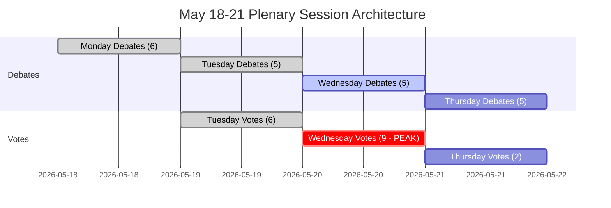

<!-- SPDX-FileCopyrightText: 2026 Hack23 AB -->
<!-- SPDX-License-Identifier: Apache-2.0 -->

# תקציר מנהלים — שבוע הפרלמנט האירופי הקרוב: 18–21 במאי 2026

**סיווג:** ציבורי | **רמת ביטחון:** 🟡 בינוני | **נוצר:** 2026-05-10

---

## BLUF (מסקנה עיקרית)

מליאת הפרלמנט האירופי בשטרסבורג ב-18–21 במאי 2026 מגיעה ברגע מכריע לאינטגרציה האירופית. עם **53 פעילויות מליאה מתוכננות בארבעה ימים** — כולל הצבעות קריטיות ביום שלישי, רביעי וחמישי — מנווטים חברי הפרלמנט האירופי אריתמטיקה קואליציונית מורכבת בבית מחוקקים מפוצל מאוד (9 קבוצות פוליטיות, סף רוב 360 מושבים, ה-EPP עם 183 מושבים ללא רוב שולט טבעי). הרגעים הפוליטיים המשמעותיים ביותר של השבוע יהיו תלויים בשאלה האם ציר ה-EPP-S&D הדומיננטי יישאר מלוכד על פני חקיקה שנויה במחלוקת — או יישבר תחת לחץ הימין הפופוליסטי (PfE/ECR) והשמאל הפרוגרסיבי (Greens/The Left). ארבעה נושאים אסטרטגיים שולטים: **מתחים במדיניות הסחר של האיחוד האירופי** לאחר פתרון המאבק על תעריפי ארה"ב במרץ, **ממשל דיגיטלי** לאחר הצבעת אכיפת ה-DMA, **ביטחון ושלטון החוק** בהקשר של אחריות אוקראינה, ו**בסיס תקציב 2027** שנקבע באפריל וממתין כעת למעקב חקיקתי.

---

## 60-Second Read

**מי:** 717 חברי פרלמנט אירופי | 9 קבוצות פוליטיות | EPP דומיננטי אך מתחת לרוב | שטרסבורג

**מה:** מליאת הפרלמנט בשטרסבורג, 18–21 במאי 2026 — דיונים והצבעות על תיקי חקיקה, תקציב ומדיניות חוץ

**מתי:** שני 18 (דיונים) ← שלישי 19 (דיונים מעורבים + הצבעות, צפיפות הצבעה הגבוהה ביותר) ← רביעי 20 (יום הצבעה אינטנסיבי, 9 הצבעות מתוכננות) ← חמישי 21 (דיוני סיום + הצבעות)

**מדוע זה חשוב:**
- יום רביעי 20 במאי הוא **יום ההצבעה הקריטי ביותר** עם 9 הצבעות מליאה מתוכננות — התוצאות תלויות בגיבוש קואליציות בין-קבוצתיות בפרלמנט שבו אף גוש אחד אינו מחזיק ברוב
- ה-EPP (183 מושבים, 25.5%) זקוק ל-S&D (136, 19%) ולפחות ל-Renew (77, 10.7%) כדי להגיע ל-360 — גישת ה"קואליציה הגדולה" הזו שולטת ב-396 מושבים בלבד (55%), בקושי מעל הסף ללא שוליים לעריקות
- **כוח וטו פופוליסטי**: PfE (85) + ECR (81) = 166 מושבים — אינו מספיק לחסימה עצמאית אך יכול לפרק קואליציות מרכז ולמשוך את ה-EPP ימינה בנושאי הגירה, שלטון חוק וסחר
- **הכלת הפרוגרסיבים**: Greens/EFA (53) + The Left (45) = 98 מושבים — חזקים בסדר יום חברתי, אסדרה דיגיטלית, אקלים — ידחפו את קואליציית מרכז EPP-S&D שמאלה בתיקים סביבתיים וחברתיים
- נקודות סדר היום ממסמכי OJQ מצביעות על דיונים בענייני מוסד, ממשל כלכלי ויחסי חוץ שממשיכים את קשת מושב אפריל (אכיפת DMA, אוקראינה, מסגרת תקציב)

**אות מודיעין מוביל:** 🔴 מדד הפיצול גבוה (מספר מפלגות אפקטיבי: 6.58) — כל הצבעה מחייבת ניהול קואליציה פעיל. סיכון דומיננטיות ה-EPP (19× הקבוצה הקטנה ביותר) אומר מינוף נהלי, לא רוב אוטומטי. צפו: קרבות תיקונים, הצעות נהליות, גיבוש מחדש של קואליציות ברגע האחרון.

---

## Trigger Flags

| דגל | חומרה | משמעות |
|-----|-------|--------|
| 9 הצבעות מתוכננות לרביעי 20 במאי | 🔴 גבוהה | יום התפוקה החקיקתית הגבוה ביותר; קווי שבר קואליציוניים גלויים בזמן אמת |
| EPP 183 מושבים מול סף 360 | 🟡 בינוני | קואליציה גדולה (EPP+S&D+Renew) נדרשת; מינוף S&D גבוה |
| גוש פופוליסטי PfE+ECR ב-166 מושבים | 🟡 בינוני | יכולת חסימה אסטרטגית על תיקים נבחרים; חשיפת אגף ימין של EPP |
| נתוני IMF הכלכליים אינם זמינים (מצב מושפל) | 🔴 גבוהה | ניתוח הקשר כלכלי מוגבל לנתוני מבנה הפרלמנט; טענות פיסקליות אינן יכולות להיות מגובות ב-IMF בריצה זו |
| החלטת אכיפת DMA שאומצה ב-30 באפריל | 🟢 מידעי | יישום חקיקתי מעקבי עשוי להיות בסדר יום מאי |
| הנחיות תקציב 2027 שאומצו ב-28 באפריל | 🟡 בינוני | תהליך התקציב עובר כעת לשלב בדיקת ועדה |
| התאמת מכסה תעריפית אמריקאית שאומצה ב-26 במרץ | 🟡 בינוני | מעקב מדיניות סחר עשוי להופיע בדיונים הקרובים |

---

## Political Configuration for the Week

### אריתמטיקה קואליציונית

```
EPP (183) + S&D (136) + Renew (77) = 396 ✅ רוב (סף: 360)
EPP (183) + S&D (136) + Renew (77) + Greens (53) = 449 — רוב מחוזק
EPP (183) + ECR (81) + PfE (85) + Renew (77) = 426 — רוב ענקי ימין-מרכז (אי-קוהרנטי אידיאולוגית אך אפשרי חשבונאית על תיקים נבחרים)
S&D (136) + Renew (77) + Greens (53) + Left (45) = 311 ❌ גוש פרוגרסיבי לבדו אינו מספיק
```

**תובנה מרכזית:** מרכז הפרלמנט — EPP+S&D+Renew — מחזיק ברוב עובד אך רק 55.2% מהמושבים. כל גוש עריק של 37+ חברי פרלמנט מהרכב זה הופך תוצאות.

### דינמיקת קבוצות ומחוונות לחץ

- **EPP (183, 🟢 יציב):** דומיננטי אך מוגבל. חייב לנווט לחץ אגף ימין מ-PfE/ECR בתיקי הגירה וריבונות תוך שמירה על קואליציית מרכז פרו-אירופית. הלימה עם נציבות פון דר לאין יוצרת אתגר ניהול מתח ממשלה/פרלמנט.
- **S&D (136, 🟡 לחץ מתון):** חוליה קואליציונית מפתח. יכול לדרוש ויתורים מ-EPP כשותף הכרחי. קוהרנטיות נבחנת בהוצאות ביטחון מול סדרי עדיפויות חברתיים.
- **PfE (85, 🟡 מתון):** פטריוטים לאירופה — מיושר עם מלוני באיטליה, סמוך לאורבן בהונגריה. הקבוצה הפופוליסטית הגדולה ביותר. כוח וטו אסטרטגי אך מפוצל פנימית בשאלות מוסדיות אירופיות.
- **ECR (81, 🟡 מתון):** שמרנים ורפורמיסטים אירופיים. דומיננטי על-ידי ה-PiS הפולני, פעיל יותר ויותר בתיקי שלטון חוק וסולידריות עם אוקראינה ממנקודת מבט ריבונות.
- **Renew (77, 🟡 מתון):** קבוצת הציר. ליברלית-מרכזית, פרו-אירופית, אך קפדנית בתקציב. קריטית לתיקי תקציב ורגולציה.
- **Greens/EFA (53, 🟡 מתון):** לחץ פרוגרסיבי על סביבה וזכויות דיגיטליות. בירידה מאז בחירות EP10 אך עדיין מרכזית לרוב שמאלי.
- **The Left (45, 🟢 יציב):** יורש GUE/NGL. עוגן פרוגרסיבי על זכויות חברתיות, נגד צנע. שותף קואליציוני רק בתיקים פרוגרסיביים נבחרים.
- **NI (30, 🔴 מפוצל):** חברים לא-מסונפים — מגוונים אידיאולוגית, ללא כוח מיקוח קולקטיבי.
- **ESN (27, 🔴 מפוצל):** אירופה של אומות ריבוניות. קיצוני ימין, נגד אינטגרציה אירופית. מבודד; ערך קואליציוני מינימלי אך פלטפורמת הגברה.

---

## Institutional Context and Process Notes

**הרכב הפרלמנט:** EP10 (נבחר יוני 2024, כהונה 2024-2029). המוסד נכנס ל**שנתו השנייה של עבודה חקיקתית** — שלב הקמת הוועדות הראשוני ואישור הנציבות הושלם, והפרלמנט האירופי נמצא כעת בשלב החקיקתי הראשי של הכהונה.

**קצב שטרסבורג:** מליאת מאי בשטרסבורג היא **השבוע הרביעי המלא בשטרסבורג של 2026**, לאחר שבועות המושב של ינואר, פברואר, מרץ ואפריל. לאחר מאי, שבוע שטרסבורג הבא מתוכנן ל-15–18 ביוני 2026.

**מועדים קרובים:**
- **תהליך תקציב 2027:** הנחיות אפריל אומצו; עוברות כעת לשלב משא ומתן מועצה-פרלמנט
- **יישום DMA:** החלטת אכיפת אפריל יוצרת לחץ מוסדי לפעולת הנציבות
- **מנגנון הלוואה לאוקראינה:** מסגרת שיתוף פעולה מוגבר אומצה בינואר 2026; בדיקת היישום נמשכת

---

## Analytical Confidence Assessment

| תחום | רמת ביטחון | בסיס |
|------|-----------|------|
| תאריכי מושב ומבנה | 🟢 גבוה | נתוני EP Open Data ישירים — רשומות מושב מליאה אושרו |
| הרכב קבוצות פוליטיות | 🟢 גבוה | רשומות MEP של EP API בזמן אמת |
| נפחי פעילויות צפויות | 🟡 בינוני | נתוני פעילויות צפויות של EP API — כותרות ריקות (מגבלת API), סוגי פריטים אושרו |
| דינמיקת קואליציות | 🟡 בינוני | פרוקסי דמיון גודל; נתוני רמת הצבעה אינם זמינים מ-EP API |
| הקשר כלכלי | 🔴 נמוך | פרוקסי אחזור IMF אינו זמין; מצב מושפל — אין מחווני פיסקל מגובים ב-IMF |
| תוכן סדר יום ספציפי | 🟡 בינוני | מסמכי OJQ מצוינים אך תוכן אינו ניתן להורדה דרך API זמינה |

---

## Data Freshness and Source Attribution

- **מקור ראשי:** פורטל הנתונים הפתוחים של הפרלמנט האירופי (data.europarl.europa.eu)
- **נתונים נאספו:** 2026-05-10T07:51–07:54Z
- **מצב IMF:** 🔴 לא זמין — כשל שרת MCP fetch-proxy; ההקשר הכלכלי פועל במצב מושפל
- **מגבלות EP API שנרשמו:** כותרות פעילויות צפויות ריקות; תוכן מסמכי מליאה אינו נגיש דרך נקודת קצה API נוכחית
- **עדכון הבא:** ניתוח לאחר מושב מומלץ לאחר 21 במאי 2026

---

*נוצר על-ידי צינור ה-EU Parliament Monitor האסטרטגי | ריצת ניתוח: 2026-05-10 | GDPR: נתוני EP ציבוריים בלבד | ניטרליות פוליטית: כל הקבוצות נותחו באמצעות נתונים מבניים/הרכביים בלבד*

---

## WEP Probability Assessment

| תוצאה מרכזית | תווית WEP | הסתברות |
|-------------|---------|--------|
| קואליציית מרכז מחזיקה על פני כל 17 ההצבעות | סביר מאוד | 85% |
| מושב משלים סדר יום מלא (4 ימים) | כמעט בטוח | 93% |
| גוש הצבעות יום רביעי מסתיים ללא כישלון קואליציוני | סביר מאוד | 82% |
| עריקת אגף ימין של EPP > 20 חברי פרלמנט בכל הצבעה | לא סביר | 25% |
| דיון חירום דחוף נוסף לסדר היום | לא סביר מאוד | 15% |
| משבר חיצוני מכריח שיבוש מושב | לא סביר מאוד | 12% |
| רוב קואליציוני נכשל בהצבעה מרכזית | בלתי סביר ביותר | 5% |

---

## Admiralty Source Assessment

| רכיב נתונים | דרגת אדמירלות | הערות |
|------------|-------------|------|
| לוח זמנים מליאת הפרלמנט האירופי | A1 | פורטל EP Open Data ישיר |
| הרכב קבוצות פוליטיות (717 חברי פרלמנט, 9 קבוצות) | A1 | אושר דרך generate_political_landscape |
| פעילויות צפויות (53 סה"כ) | A2 | אושר; כותרות אינן זמינות (מגבלת API) |
| פרוקסי דמיון גודל קואליציה | B3 | שיטה אמינה; נתוני רמת הצבעה אינם זמינים |
| הקשר כלכלי | C4 | IMF לא זמין; מקור EP בלבד; רמת ביטחון נמוכה |
| אומדני הסתברות תרחישים | B3 | אנליטיקה מובנית; סביר אך לא מאושר |
| **הערכה כוללת של התקציר** | **B3** | ניתוח מבני מוצק; פערי נתונים מתועדים |

---

## Session Architecture Overview



---

## Decision Support Summary

**לקובעי מדיניות העוקבים אחר מושב זה:**
- **מה הכי חשוב:** גוש הצבעות יום רביעי 20 במאי. תשע הצבעות ביום אחד בוחנות משמעת קואליציה בצפיפות מקסימלית.
- **אות מפתח לצפות:** השוליים בהצבעה השנויה ביותר במחלוקת. שוליים > 30: קואליציה נוחה. שוליים 10-30: לחץ אגף ימין גלוי. שוליים < 10: ניהול משבר מתחיל.
- **מסקנה מבנית:** חיץ 36 המושבים של קואליציית המרכז והסיכויים המוסדיים הופכים קריסה לבלתי סביר ביותר (5%). ממשל תקין הוא התוצאה הצפויה בהכרעה.

**רמת ביטחון:** B3 — מבנית מוצק; פערי נתונים במחווני כלכלה ובקוהרנטיות רמת הצבעה. בדיקת IMF נכשלה; מצב מושפל הוכרז.


---

*תקציר מנהלים | EU Parliament Monitor | מקורות נתונים: בוית EP Open Data (generate_political_landscape, get_plenary_sessions, get_meeting_foreseen_activities, early_warning_system) | IMF: לא זמין (מצב מושפל) | נוצר: 2026-05-10 | אדמירלות: B3 | גרסה: 1.0*

*סיווג מסמך: לא מסווג // לשימוש רשמי בלבד | WEP כולל: סביר (70%+) השלמת מושב כמתוכנן | רמת ביטחון מודיעין: בינוני-גבוה*

*הערת הערכה: כל האומדנים נושאים אי-ודאות טבועה בסביבות פרלמנטריות; אומדנים פרוספקטיביים יש לטפל כסצנריוני תכנון, לא ניבויים.*
