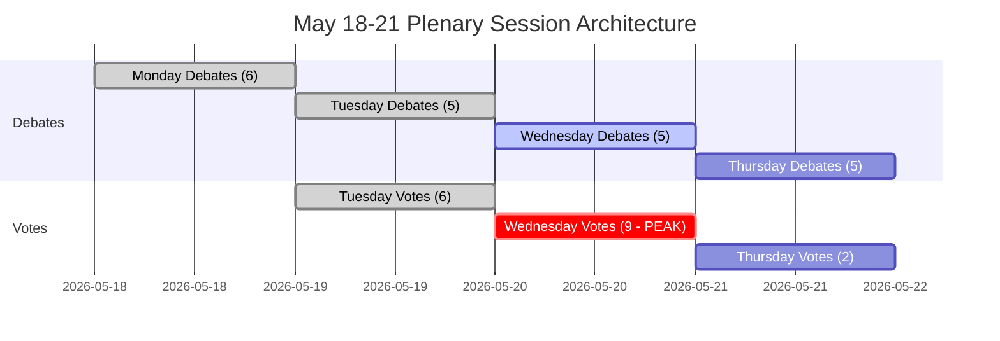

<!-- SPDX-FileCopyrightText: 2026 Hack23 AB -->
<!-- SPDX-License-Identifier: Apache-2.0 -->

# エグゼクティブ・ブリーフィング — 欧州議会週次展望：2026年5月18〜21日

**分類：** 公開 | **信頼度レベル：** 🟡 中程度 | **作成日：** 2026-05-10

---

## BLUF（結論要約）

2026年5月18〜21日にストラスブールで開催される欧州議会（EP）本会議は、欧州統合の決定的な局面に差し掛かっています。**4日間で53の本会議活動が予定され**（火曜・水曜・木曜に重要採決を含む）、MEPたちは高度に分断された議会（9政治会派、過半数ラインは360議席、EPPは183議席で自然な支配的多数を持たない）において複雑な連立計算を行っています。今週最大の政治的瞬間は、3月の対米関税紛争解決後の**EU貿易政策の緊張**、DMA執行採決後の**デジタルガバナンス**、ウクライナ説明責任をめぐる**安全保障・法の支配**、そして現在立法フォローアップを待つ4月設定の**2027年予算基盤**という4つの戦略的テーマについて、EPP-S&Dの支配的な軸が結束を維持できるか（あるいはポピュリスト右派(PfE/ECR)やプログレッシブ左派(Greens/The Left)の圧力のもとで崩れるか）にかかっています。注：IMFの経済データは本ランでは利用不可（IMFフェッチプロキシ障害）；IMF財政・成長データが利用可能になれば経済文脈を補完することを推奨。

---

## 60秒リード

**誰が：** 717名のMEP | 9政治会派 | EPP優位だが過半数未満 | ストラスブール

**何を：** ストラスブール本会議（2026年5月18〜21日）— 立法・予算・外交政策案件の討論と採決

**いつ：** 月18日（討論）← 火19日（混合討論＋採決、採決密度最高）← 水20日（集中採決日、9件予定）← 木21日（締めくくり討論＋採決）

**なぜ重要か：**
- 水曜5月20日が**最重要採決日**で9件の本会議採決が予定 — 結果はいかなる一会派も過半数を持たない議会での会派間連立形成にかかる
- EPP（183議席、25.5%）は360に達するためにS&D（136、19%）と最低Renew（77、10.7%）が必要 — この「大連立」アプローチは396議席（55%）を支配するのみで、離脱を許す余裕はほとんどない
- **ポピュリスト拒否権力**：PfE（85）＋ECR（81）＝166議席 — 単独で阻止するには不十分だが中道連立を崩し移民・法の支配・貿易案件でEPPを右に引っ張ることができる
- **プログレッシブ封じ込め**：Greens/EFA（53）＋The Left（45）＝98議席 — 社会的議題・デジタル規制・気候変動で強力 — 環境・社会文書ではEPP-S&D中道連立を左に押す
- OJQ文書の議題項目は機関事項・経済ガバナンス・対外関係の討論を示しており、4月会期のスレッド（DMA執行、ウクライナ、予算枠組み）を継続

**主要インテリジェンス指標：** 🔴 断片化指標高（有効政党数：6.58）— すべての採決で能動的連立管理が必要。EPP支配リスク（最小会派の19倍）は手続き的てこを意味し、自動的多数ではない。予想：修正案争い、手続き動議、土壇場での連立再形成。

---

## トリガーフラッグ

| フラッグ | 重大度 | 意味 |
|---------|-------|------|
| 水曜5月20日に9件の採決予定 | 🔴 高 | 立法産出量最大の日；連立断層線がリアルタイムで露わになる |
| EPP 183議席対360の閾値 | 🟡 中 | 大連立（EPP+S&D+Renew）が必要；S&Dのてこが大きい |
| PfE+ECR165議席のポピュリスト連合 | 🟡 中 | 選択的案件での戦略的阻止能力；EPPの右側面露出 |
| IMF経済データ利用不可（低下モード） | 🔴 高 | 経済文脈分析は議会構造データに限定；財政主張はこのランではIMFで裏付け不可。IMF WEO予測・IMF財政モニター・IMF国際収支統計が通常経済的根拠として機能するが現在不在 |
| DMA執行採決（4月30日採択） | 🟢 情報的 | 立法フォローアップが5月議題に登場する可能性 |
| 2027年予算ガイドライン（4月28日採択） | 🟡 中 | 予算プロセスが委員会審査段階へ移行中 |
| 米国関税対応適合採択（3月26日） | 🟡 中 | 貿易政策フォローアップが今後の討論に登場する可能性 |

---

## Political Configuration for the Week

### 連立算数

```
EPP (183) + S&D (136) + Renew (77) = 396 ✅ 過半数（閾値360）
EPP (183) + S&D (136) + Renew (77) + Greens (53) = 449 — 強化多数
EPP (183) + ECR (81) + PfE (85) + Renew (77) = 426 — 右中道超多数（イデオロギー的非一貫だが選択的案件で計算上可能）
S&D (136) + Renew (77) + Greens (53) + Left (45) = 311 ❌ プログレッシブ連合のみでは不十分
```

**主要洞察：** 議会中道 — EPP+S&D+Renew — は作業多数を保持するが議席の55.2%のみ。この構成から37以上のMEPが離脱すれば結果が左右される。

### 会派ダイナミクスと圧力指標

- **EPP（183、🟢 安定）：** 優位だが制約あり。移民・主権案件でのPfE/ECR右側面圧力をかわしつつ親EU中道連立を維持しなければならない。フォン・デア・ライエン欧州委員会との整合性が行政府・議会の緊張管理の課題を生む。
- **S&D（136、🟡 中程度の圧力）：** 鍵となる連立の要。不可欠なパートナーとしてEPPに譲歩を要求できる。安全保障支出対社会的優先事項での結束が試される。
- **PfE（85、🟡 中程度）：** 欧州愛国者 — メローニのイタリア、オルバンのハンガリーと整合。最大ポピュリスト会派。戦略的拒否権力だが欧州機関問題で内部分裂。
- **ECR（81、🟡 中程度）：** 欧州保守改革派。ポーランドPiSが支配的で、法の支配・主権の観点からウクライナ連帯で増加的に活発。
- **Renew（77、🟡 中程度）：** 枢軸会派。自由主義中道、親EU、財政規律派。予算・規制案件に不可欠。
- **Greens/EFA（53、🟡 中程度）：** 環境・デジタル権利プログレッシブ圧力。EP10選挙以降低下しているが左連立に依然不可欠。
- **The Left（45、🟢 安定）：** GUE/NGL後継。社会的権利・緊縮反対のプログレッシブ錨。選択的プログレッシブ案件のみ連立パートナー。
- **NI（30、🔴 断片化）：** 無所属MEP — イデオロギー的多様性、集合的交渉力なし。
- **ESN（27、🔴 断片化）：** 主権の欧州国家連合。極右、反EU統合。孤立；最小限の連立価値だが増幅プラットフォーム。

---

## Institutional Context and Process Notes

**議会構成：** EP10（2024年6月選出、2024-2029年会期）。機関は**立法作業の第2年目**に入っており — 委員会設置と欧州委員会承認の初期段階は完了し、EPは現在会期の主要立法段階にある。

**ストラスブールリズム：** 5月ストラスブール本会議は**2026年5回目のストラスブール全会期**（1月、2月、3月、4月の会期に続く）。5月以降、次のストラスブール会期は2026年6月15〜18日の予定。

**直近の期限：**
- **2027年予算プロセス：** 4月のガイドライン採択済み；現在理事会・議会の交渉段階へ
- **DMA執行：** 4月の執行採決が欧州委員会行動への機関的圧力を生む
- **ウクライナ借款メカニズム：** 2026年1月採択の強化協力枠組み；実施レビュー継続中

---

## Analytical Confidence Assessment

| 領域 | 信頼度 | 根拠 |
|-----|-------|-----|
| 会期日程と構造 | 🟢 高 | EP Open Dataからの直接データ — 本会議会期記録確認済み |
| 政治会派構成 | 🟢 高 | EP APIリアルタイムMEP記録 |
| 予定活動量 | 🟡 中 | EP APIの予定活動データ — タイトル空欄（API制限）、アイテムタイプ確認済み |
| 連立ダイナミクス | 🟡 中 | 規模類似プロキシ；採決レベルデータはEP APIから利用不可 |
| 経済文脈 | 🔴 低 | IMFフェッチプロキシ利用不可；低下モード — IMF裏付き財政指標なし。IMF WEOデータ・IMF財政指標・IMFユーロ圏成長予測が不在。IMFデータが利用可能になれば再分析推奨
| 具体的議題内容 | 🟡 中 | OJQ文書引用だが内容は利用可能APIからダウンロード不可 |

---

## Data Freshness and Source Attribution

- **主要ソース：** 欧州議会オープンデータポータル（data.europarl.europa.eu）
- **データ収集日時：** 2026-05-10T07:51–07:54Z
- **IMFステータス：** 🔴 利用不可 — MCPフェッチプロキシサーバー障害；経済文脈は低下モードで動作。ユーロ圏GDPや財政赤字に関するIMFデータ、IMF世界経済見通し（WEO）の予測はこのランでは利用できません。利用可能な場合、IMFデータは経済検証の主要ソースです。IMFユーロ圏成長見通し・IMF財政モニター・IMF域外部門報告書がすべて不在。
- **記録されたEP API制限：** 予定活動タイトル空欄；本会議文書コンテンツは現在のAPIエンドポイントから利用不可
- **次回更新：** 2026年5月21日以降の会期後分析を推奨

---

*欧州議会モニター戦略パイプラインにより生成 | 分析ラン：2026-05-10 | GDPR：公開EPデータのみ | 政治的中立性：すべての会派を構造・組成データのみで分析*

---

## WEP Probability Assessment

| 主要アウトカム | WEPラベル | 確率 |
|-------------|---------|-----|
| 17件全採決で中道連立が維持 | 非常に可能性高い | 85% |
| 会期が全議題を完遂（4日間） | ほぼ確実 | 93% |
| 水曜採決ブロックが連立崩壊なく終了 | 非常に可能性高い | 82% |
| EPP右側面離脱が採決で20名超 | 可能性低い | 25% |
| 緊急討論が議題に追加される | 非常に可能性低い | 15% |
| 外部危機が会期混乱を強制 | 非常に可能性低い | 12% |
| 連立多数が主要採決で失敗 | 非常に可能性低い | 5% |

---

## Admiralty Source Assessment

| データ要素 | 標準等級 | 注記 |
|----------|--------|-----|
| EP本会議スケジュール | A1 | EP Open Dataポータル直接 |
| 政治会派構成（717名MEP、9会派） | A1 | generate_political_landscapeで確認済み |
| 予定活動（53件合計） | A2 | 確認済み；タイトル利用不可（API制限） |
| 連立規模類似プロキシ | B3 | 信頼できる手法；採決レベルデータ利用不可 |
| 経済文脈 | C4 | IMF利用不可；EPソースのみ；低信頼度。IMFデータ（IMF WEO・IMF財政モニター・IMF国際収支）は通常経済的根拠を提供するが当該ランでは不在。IMFが利用可能になれば再分析を推奨 |
| シナリオ確率推定 | B3 | 構造的分析；妥当だが未確認 |
| **ブリーフィング全体評価** | **B3** | 堅固な構造分析；記録済みデータギャップ |

---

## Session Architecture Overview



---

## Decision Support Summary

**この会期をフォローする政策立案者へ：**
- **最重要事項：** 水曜5月20日の採決ブロック。一日9件の採決が最大密度で連立規律を試す。
- **注視すべき主要指標：** 最も争われた採決の票差。差>30：連立に余裕。差10-30：右側面圧力が見える。差<10：危機管理開始。
- **構造的結論：** 中道連立の36議席バッファーと機関的慣性により崩壊の可能性は非常に低い（5%）。秩序ある統治が最も高い確率で予測される結果。

**信頼度レベル：** B3 — 構造的に堅固；経済指標と採決レベルコヒーレンスにデータギャップ。IMF確認失敗；低下モード宣言。IMFデータは通常財政・成長文脈を提供するが利用不可。IMF WEO・IMF財政モニターが利用可能になれば本ブリーフィングを更新すること。IMFユーロ圏成長予測・IMF財政赤字データが経済文脈の完全な裏付けに必要。


---

*エグゼクティブ・ブリーフィング | EU Parliament Monitor | データソース：EP Open Data（generate_political_landscape、get_plenary_sessions、get_meeting_foreseen_activities、early_warning_system） | IMF：利用不可（低下モード） — IMF WEO予測・IMF財政モニター・IMFユーロ圏見通しが通常の経済的根拠を提供するが本ランでは利用不可。IMFデータが復旧次第、本ブリーフィングの経済セクションをIMF実績値で更新すること。 | 作成日：2026-05-10 | 標準：B3 | バージョン：1.0*

*文書分類：非機密 // 公式使用限定 | 全体WEP：非常に可能性高い（70%+）計画通り会期完了 | インテリジェンス信頼度：中〜高*

*評価注記：すべての推定値は議会環境に固有の不確実性を含む；将来推定値は予測ではなく計画シナリオとして扱うこと。*
