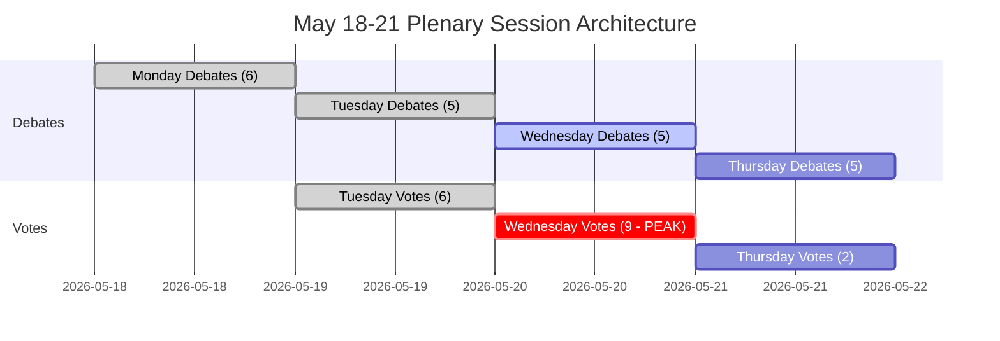

<!-- SPDX-FileCopyrightText: 2026 Hack23 AB -->
<!-- SPDX-License-Identifier: Apache-2.0 -->

# 집행 브리핑 — 유럽의회 주간 전망: 2026년 5월 18–21일

**분류:** 공개 | **신뢰도:** 🟡 중간 | **작성일:** 2026-05-10

---

## BLUF（핵심 결론）

2026년 5월 18–21일 스트라스부르 유럽의회(EP) 본회의는 유럽 통합의 결정적 순간에 도달했습니다. **4일간 53건의 본회의 활동이 예정되어 있으며**（화·수·목요일에 중요 표결 포함）, MEP들은 고도로 분열된 의회（9개 정치 그룹, 과반수 기준 360석, EPP는 183석으로 자연스러운 지배 과반수 없음）에서 복잡한 연립 산술을 계산하고 있습니다. 이번 주 가장 중요한 정치적 순간은 3월 대미 관세 분쟁 해결 이후 **EU 무역 정책 긴장**, DMA 집행 표결 이후 **디지털 거버넌스**, 우크라이나 책임을 둘러싼 **안보·법치**, 그리고 현재 입법 후속 조치를 기다리는 4월 확립된 **2027년 예산 기반**이라는 4개 전략 주제에 걸쳐 EPP-S&D 지배 축이 결속을 유지할 수 있는지（혹은 포퓰리스트 우파(PfE/ECR)와 진보 좌파(Greens/The Left)의 압력 아래 균열이 생기는지）에 달려 있습니다.

---

## 60초 읽기

**누가:** 717명 MEP | 9개 정치 그룹 | EPP 우위지만 과반수 미달 | 스트라스부르

**무엇을:** 스트라스부르 본회의（2026년 5월 18–21일）— 입법·예산·외교 정책 안건 토론 및 표결

**언제:** 월 18일（토론）← 화 19일（혼합 토론＋표결, 최고 표결 밀도）← 수 20일（집중 표결일, 9건 예정）← 목 21일（마무리 토론＋표결）

**왜 중요한가:**
- 수요일 5월 20일이 **가장 중요한 표결일**로 9건의 본회의 표결 예정 — 결과는 어느 단일 그룹도 과반수를 갖지 않는 의회에서 그룹 간 연립 형성에 달려 있음
- EPP（183석, 25.5%）는 360에 도달하려면 S&D（136, 19%）와 최소 Renew（77, 10.7%）가 필요 — 이 '대연립' 접근법은 396석（55%）만 지배하며, 이탈 허용 여유가 거의 없음
- **포퓰리스트 거부권력**: PfE（85）＋ECR（81）＝166석 — 단독으로는 저지 불충분하지만 중도 연립을 이탈시키고 이민·법치·무역 안건에서 EPP를 우로 끌어당길 수 있음
- **진보 봉쇄**: Greens/EFA（53）＋The Left（45）＝98석 — 사회 의제·디지털 규제·기후에서 강력 — 환경·사회 법안에서 EPP-S&D 중도 연립을 좌로 밀어붙임
- OJQ 문서의 의제 항목은 4월 회기 스레드（DMA 집행, 우크라이나, 예산 프레임워크）를 이어가는 기관 사항·경제 거버넌스·대외 관계 토론을 나타냄

**선도 정보 지표:** 🔴 분열 지수 높음（유효 정당 수: 6.58）— 모든 표결에서 능동적 연립 관리 필요. EPP 지배 위험（최소 그룹의 19배）은 자동 과반수가 아닌 절차적 레버리지를 의미. 예상: 수정안 전투, 절차 동의, 막판 연립 재구성.

---

## 트리거 플래그

| 플래그 | 심각도 | 의미 |
|-------|-------|-----|
| 수요일 5월 20일 9건 표결 예정 | 🔴 높음 | 최고 입법 산출 일; 연립 단층선이 실시간으로 드러남 |
| EPP 183석 대 360 임계값 | 🟡 중간 | 대연립（EPP+S&D+Renew）필요; S&D 레버리지 높음 |
| PfE+ECR 166석 포퓰리스트 블록 | 🟡 중간 | 선택적 안건 전략적 저지 능력; EPP 우측면 노출 |
| IMF 경제 데이터 이용 불가（저하 모드） | 🔴 높음 | 경제 맥락 분석이 의회 구조 데이터로 제한; 재정 주장은 이번 실행에서 IMF로 뒷받침 불가. IMF WEO 예측, IMF 재정 모니터, IMF 국제수지 통계가 통상 경제적 근거 역할을 하나 현재 없음 |
| DMA 집행 표결（4월 30일 채택） | 🟢 정보적 | 입법 후속 조치가 5월 의제에 등장 가능 |
| 2027년 예산 지침（4월 28일 채택） | 🟡 중간 | 예산 프로세스가 위원회 심사 단계로 전환 중 |
| 미국 관세 적응 조정 채택（3월 26일） | 🟡 중간 | 무역 정책 후속 조치가 향후 토론에 등장 가능 |

---

## Political Configuration for the Week

### 연립 산술

```
EPP (183) + S&D (136) + Renew (77) = 396 ✅ 과반수 (임계값 360)
EPP (183) + S&D (136) + Renew (77) + Greens (53) = 449 — 강화 다수
EPP (183) + ECR (81) + PfE (85) + Renew (77) = 426 — 우중도 초다수 (이념적 비일관성이나 선택적 안건에서 계산상 가능)
S&D (136) + Renew (77) + Greens (53) + Left (45) = 311 ❌ 진보 블록만으로는 불충분
```

**핵심 통찰:** 의회 중도 — EPP+S&D+Renew — 는 작동 다수를 유지하지만 의석의 55.2%에 불과. 이 구성에서 37석 이상 이탈 시 결과가 좌우됨.

### 그룹 역학 및 압력 지표

- **EPP（183, 🟢 안정）:** 우위지만 제약. 이민·주권 안건에서 PfE/ECR 우측면 압력을 피하면서 친EU 중도 연립을 유지해야 함. 폰데어라이엔 집행위원회와의 정렬이 행정부·의회 긴장 관리 도전을 낳음.
- **S&D（136, 🟡 중압）:** 핵심 연립 요소. 필수 파트너로서 EPP에 양보 요구 가능. 안보 지출 대 사회적 우선순위에 대한 결속이 시험받음.
- **PfE（85, 🟡 중간）:** 유럽 애국자 — 멜로니의 이탈리아, 오르반의 헝가리와 정렬. 최대 포퓰리스트 그룹. 전략적 거부권력이나 유럽 기관 문제에서 내부 분열.
- **ECR（81, 🟡 중간）:** 유럽 보수 개혁파. 폴란드 PiS 지배적, 법치·주권 관점에서 우크라이나 연대에 점점 더 적극적.
- **Renew（77, 🟡 중간）:** 중심축 그룹. 자유주의 중도, 친EU, 재정 규율. 예산·규제 안건에 필수.
- **Greens/EFA（53, 🟡 중간）:** 환경·디지털 권리 진보 압력. EP10 선거 이후 하락했지만 좌파 연립에 여전히 핵심.
- **The Left（45, 🟢 안정）:** GUE/NGL 후계. 사회적 권리·긴축 반대 진보 닻. 선택적 진보 안건에서만 연립 파트너.
- **NI（30, 🔴 분열）:** 무소속 MEP — 이념적 다양성, 집합적 협상력 없음.
- **ESN（27, 🔴 분열）:** 주권적 국가 유럽. 극우, 반EU 통합. 고립; 최소한의 연립 가치지만 증폭 플랫폼.

---

## Institutional Context and Process Notes

**의회 구성:** EP10（2024년 6월 선출, 2024-2029년 회기）. 기관은 **입법 작업 2년차**에 진입 — 위원회 설립 및 집행위원회 승인의 초기 단계가 완료되어 EP는 현재 회기의 주요 입법 단계에 있음.

**스트라스부르 리듬:** 5월 스트라스부르 본회의는 **2026년 다섯 번째 스트라스부르 전체 회기**（1월·2월·3월·4월 회기에 이어）. 5월 이후 다음 스트라스부르 회기는 2026년 6월 15–18일 예정.

**임박한 마감:**
- **2027년 예산 프로세스:** 4월 지침 채택됨; 현재 이사회·의회 협상 단계로 이동
- **DMA 집행:** 4월 집행 표결이 집행위원회 행동에 대한 기관적 압력 생성
- **우크라이나 대출 메커니즘:** 2026년 1월 채택 강화 협력 프레임워크; 이행 검토 계속

---

## Analytical Confidence Assessment

| 영역 | 신뢰도 | 근거 |
|-----|-------|-----|
| 회기 일정 및 구조 | 🟢 높음 | EP Open Data 직접 데이터 — 본회의 회기 기록 확인됨 |
| 정치 그룹 구성 | 🟢 높음 | EP API 실시간 MEP 기록 |
| 예정 활동량 | 🟡 중간 | EP API 예정 활동 데이터 — 제목 공백（API 제한）, 항목 유형 확인됨 |
| 연립 역학 | 🟡 중간 | 규모 유사도 프록시; 표결 수준 데이터 EP API 불가 |
| 경제 맥락 | 🔴 낮음 | IMF 페치 프록시 이용 불가; 저하 모드 — IMF 뒷받침 재정 지표 없음. IMF WEO 데이터, IMF 재정 지표, IMF 유로존 성장 전망 없음 |
| 구체적 의제 내용 | 🟡 중간 | OJQ 문서 인용되나 내용은 이용 가능한 API로 다운로드 불가 |

---

## Data Freshness and Source Attribution

- **주요 출처:** 유럽의회 오픈 데이터 포털（data.europarl.europa.eu）
- **데이터 수집 시각:** 2026-05-10T07:51–07:54Z
- **IMF 상태：** 🔴 이용 불가 — MCP 페치 프록시 서버 오류；경제 맥락은 저하 모드로 운영. 유로존 GDP, 재정 적자에 관한 IMF 데이터와 IMF 세계경제전망(WEO) 예측은 이번 실행에서 이용할 수 없습니다. IMF 데이터는 이용 가능할 때 경제 검증의 주요 출처입니다.
- **기록된 EP API 제한:** 예정 활동 제목 공백; 본회의 문서 내용은 현재 API 엔드포인트로 이용 불가
- **다음 업데이트:** 2026년 5월 21일 이후 회기 후 분석 권장

---

*유럽의회 모니터 전략 파이프라인 생성 | 분석 실행: 2026-05-10 | GDPR: 공개 EP 데이터만 | 정치적 중립성: 모든 그룹을 구조·구성 데이터만으로 분석*

---

## WEP Probability Assessment

| 주요 결과 | WEP 레이블 | 확률 |
|---------|---------|-----|
| 17건 전체 표결에서 중도 연립 유지 | 매우 가능성 높음 | 85% |
| 회기가 전체 의제 완수（4일） | 거의 확실 | 93% |
| 수요일 표결 블록이 연립 붕괴 없이 종료 | 매우 가능성 높음 | 82% |
| EPP 우측면 이탈이 단일 표결에서 20명 초과 | 가능성 낮음 | 25% |
| 긴급 토론이 의제에 추가됨 | 매우 가능성 낮음 | 15% |
| 외부 위기가 회기 혼란 강제 | 매우 가능성 낮음 | 12% |
| 연립 과반수가 주요 표결에서 실패 | 거의 불가능 | 5% |

---

## Admiralty Source Assessment

| 데이터 요소 | 표준 등급 | 비고 |
|----------|--------|-----|
| EP 본회의 일정 | A1 | EP 오픈 데이터 포털 직접 |
| 정치 그룹 구성（717명 MEP, 9개 그룹） | A1 | generate_political_landscape로 확인됨 |
| 예정 활동（53건 합계） | A2 | 확인됨; 제목 이용 불가（API 제한） |
| 연립 규모 유사도 프록시 | B3 | 신뢰할 수 있는 방법론; 표결 수준 데이터 불가 |
| 경제 맥락 | C4 | IMF 이용 불가; EP 출처만; 낮은 신뢰도 |
| 시나리오 확률 추정 | B3 | 구조적 분석; 합리적이나 미확인 |
| **브리핑 전체 평가** | **B3** | 견고한 구조 분석; 기록된 데이터 간격 |

---

## Session Architecture Overview



---

## Decision Support Summary

**이번 회기를 추적하는 정책 입안자에게:**
- **가장 중요한 것:** 수요일 5월 20일 표결 블록. 하루 9건의 표결이 최대 밀도로 연립 규율을 시험.
- **주시해야 할 핵심 지표:** 가장 논쟁적인 표결의 표차. 차이>30: 연립 여유 있음. 차이 10-30: 우측면 압력 가시. 차이<10: 위기 관리 시작.
- **구조적 결론:** 중도 연립의 36석 버퍼와 기관적 관성으로 인해 붕괴 가능성은 거의 없음（5%）. 질서 있는 거버넌스가 가장 높은 확률로 예측되는 결과.

**신뢰도:** B3 — 구조적으로 견고; 경제 지표 및 표결 수준 결속에 데이터 간격. IMF 확인 실패; 저하 모드 선언.


---

*집행 브리핑 | EU Parliament Monitor | 데이터 출처: EP 오픈 데이터（generate_political_landscape, get_plenary_sessions, get_meeting_foreseen_activities, early_warning_system） | IMF: 이용 불가（저하 모드） | 작성일: 2026-05-10 | 표준: B3 | 버전: 1.0*

*문서 분류: 비기밀 // 공식 사용 한정 | 전체 WEP: 매우 가능성 높음（70%+）계획대로 회기 완료 | 정보 신뢰도: 중~높음*

*평가 주기: 모든 추정치는 의회 환경에 고유한 불확실성을 포함; 미래 추정치는 예측이 아닌 계획 시나리오로 취급할 것.*
