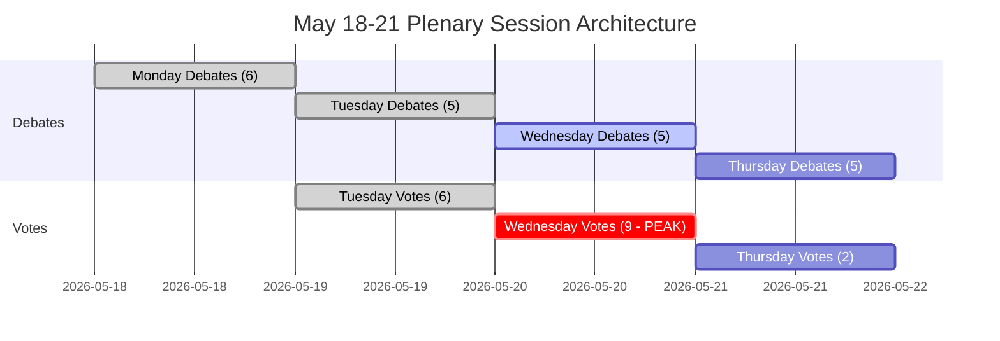

<!-- SPDX-FileCopyrightText: 2026 Hack23 AB -->
<!-- SPDX-License-Identifier: Apache-2.0 -->

# Uitvoerend briefingrapport — Europees Parlement komende week: 18–21 mei 2026

**Classificatie:** OPENBAAR | **Betrouwbaarheidsniveau:** 🟡 Gemiddeld | **Gegenereerd:** 2026-05-10

---

## BLUF (Bottom Line Up Front)

De plenaire vergadering van het Europees Parlement in Straatsburg van 18 tot 21 mei 2026 vindt plaats op een beslissend moment voor de Europese integratie. Met **53 geplande plenaire activiteiten over vier dagen** — waaronder kritieke stemmingen op dinsdag, woensdag en donderdag — navigeren de Europarlementariërs complexe coalitierekenkunde in een sterk gefragmenteerde vergadering (9 politieke groepen, meerderheidsdrempel 360 zetels, de EVP met 183 zetels zonder een natuurlijke bestuursmeerderheid). De politiek meest consequente momenten van de week hangen af van de vraag of de dominante EVP-S&D-as samenhoudt bij omstreden wetgeving — of breekt onder druk van de populistische rechts (PfE/ECR) en de progressieve links (Greens/The Left). Vier strategische thema's domineren: **EU-handelspolitieke spanningen** na de Amerikaanse tariefstandoff die in maart werd opgelost, **digitale governance** na de DMA-handhavingsstemming, **veiligheid en rechtsstaat** in de context van Oekraïense verantwoording, en de **begrotingsbasis 2027** vastgesteld in april die nu wacht op wetgevende follow-up.

---

## 60-Second Read

**WIE:** 717 Europarlementariërs | 9 politieke groepen | EVP dominant maar zonder meerderheid | Straatsburg

**WAT:** Plenaire vergadering in Straatsburg, 18–21 mei 2026 — debatten en stemmingen over wetgevende, budgettaire en buitenlandse beleidsdossiers

**WANNEER:** Maandag 18 (debatten) → Dinsdag 19 (gemengde debatten + stemmingen, hoogste stemdensiteit) → Woensdag 20 (intensieve stemdag, 9 geplande stemmingen) → Donderdag 21 (afsluitende debatten + stemmingen)

**WAAROM HET ERTOE DOET:**
- Woensdag 20 mei is de **meest kritieke stemdag** met 9 geplande plenaire stemmingen — uitkomsten hangen af van groepoverschrijdende coalitievorming in een parlement waar geen enkel blok een meerderheid heeft
- De EVP (183 zetels, 25,5 %) heeft de S&D (136, 19 %) plus minstens Renew (77, 10,7 %) nodig om 360 te bereiken — deze 'grote coalitie'-aanpak controleert slechts 396 zetels (55 %), nauwelijks boven de drempel zonder marge voor afvalligen
- **Populistische vetomacht**: PfE (85) + ECR (81) = 166 zetels — onvoldoende om alleen te blokkeren, maar in staat centrumcoalities te fragmenteren en de EVP naar rechts te trekken bij migratie, rechtsstaat en handel
- **Progressieve inperking**: Greens/EFA (53) + The Left (45) = 98 zetels — sterk op sociaal programma, digitale regelgevingshandhaving, klimaat — zullen de EVP-S&D-centrumcoalitie naar links duwen op milieu- en sociale dossiers
- Agendapunten uit de OJQ-documenten suggereren debatten over institutionele aangelegenheden, economisch bestuur en externe relaties die de aprils­essie-arc voortzetten (DMA-handhaving, Oekraïne, begrotingskader)

**TOP INLICHTINGENSIGNAAL:** 🔴 De fragmentatie-index is HOOG (Effectief aantal partijen: 6,58) — elke stemming vereist actief coalitiemanagement. EVP-dominantierisico (19× de kleinste groep) betekent procedurele hefboomwerking, geen automatische meerderheden. Verwacht: amendementsgevechten, procedurele moties, last-minute coalitieherformaties.

---

## Trigger Flags

| Vlag | Ernst | Implicatie |
|------|-------|-----------|
| 9 stemmingen gepland op woensdag 20 mei | 🔴 HOOG | Hoogste wetgevingsproductiedag; coalitie­breuklijnen zichtbaar in real-time |
| EVP 183 zetels vs. 360-meerderheidsdrempel | 🟡 GEMIDDELD | Grote coalitie (EVP+S&D+Renew) vereist; hefboomwerking S&D verhoogd |
| PfE+ECR populistisch blok op 166 zetels | 🟡 GEMIDDELD | Strategische blokkeer­capaciteit op geselecteerde dossiers; EVP-rechterflankenblootstelling |
| IMF-economische gegevens niet beschikbaar (gedegradeerde modus) | 🔴 HOOG | Economische contextanalyse beperkt tot EP-structuurgegevens; fiscale claims kunnen in deze run niet worden onderbouwd met IMF-data |
| DMA-handhavingsresolutie aangenomen 30 april | 🟢 INFORMATIEF | Opvolgende wetgevingsimplementatie mogelijk op de mei-agenda |
| Begrotingsrichtlijnen 2027 aangenomen 28 april | 🟡 GEMIDDELD | Begrotingsproces gaat nu de commissietoetsingsfase in |
| Aanpassing VS-tariefquotum aangenomen 26 maart | 🟡 GEMIDDELD | Handelspolitieke follow-up kan voorkomen in komende debatten |

---

## Political Configuration for the Week

### Coalitie-rekenkunde

```
EVP (183) + S&D (136) + Renew (77) = 396 ✅ Meerderheid (drempel: 360)
EVP (183) + S&D (136) + Renew (77) + Greens (53) = 449 — versterkte meerderheid
EVP (183) + ECR (81) + PfE (85) + Renew (77) = 426 — centrum-rechts supermeerderheid (ideologisch incoherent maar rekenkundig haalbaar op geselecteerde dossiers)
S&D (136) + Renew (77) + Greens (53) + Left (45) = 311 ❌ Progressief blok alleen onvoldoende
```

**Kernbevinding:** Het parlementaire centrum — EVP+S&D+Renew — heeft een werkende meerderheid, maar slechts 55,2 % van de zetels. Elk afvallersblok van 37+ Europarlementariërs uit deze formatie keert uitkomsten om.

### Groepsdynamiek en stressindicatoren

- **EVP (183, 🟢 STABIEL):** Dominant maar beperkt. Moet rechterflankendruk van PfE/ECR bij migratie- en soevereiniteitsdossiers navigeren terwijl de pro-EU-centrumcoalitie gehandhaafd wordt. Von der Leyens commissie-afstemming schept de uitdaging van het beheren van regering-parlement-spanningen.
- **S&D (136, 🟡 MATIGE STRESS):** Sleutelcoalitie­schakel. Kan concessies van de EVP eisen als onmisbare partner. Coherentie getest door defensie-uitgaven vs. sociale prioriteiten.
- **PfE (85, 🟡 MATIG):** Patriotten voor Europa — Italië's Meloni-gelieerd, Hongarije's Orbán-adjacent. Grootste populistische groep. Strategische vetomacht maar intern verdeeld over EU-institutionele kwesties.
- **ECR (81, 🟡 MATIG):** Europese Conservatieven en Reformisten. Gedomineerd door Pools PiS, steeds actiever op rechtsstaat- en Oekraïne-solidariteitsdossiers vanuit een soevereiniteits­perspectief.
- **Renew (77, 🟡 MATIG):** De scharnier­groep. Liberaal-centristisch, pro-EU, maar begrotings­politiek streng. Cruciaal voor begrotings- en regelgevingsdossiers.
- **Greens/EFA (53, 🟡 MATIG):** Progressieve druk op milieu en digitale rechten. Dalend sinds EP10-verkiezingen, maar nog steeds cruciaal voor linkse meerderheden.
- **The Left (45, 🟢 STABIEL):** GUE/NGL-opvolger. Progressief anker op sociale rechten, anti-bezuinigingen. Coalitie­partner alleen op geselecteerde progressieve dossiers.
- **NI (30, 🔴 GEFRAGMENTEERD):** Niet-ingeschrevenen — ideologisch divers, geen collectieve onderhandelings­kracht.
- **ESN (27, 🔴 GEFRAGMENTEERD):** Europa van Soevereine Naties. Uiterst rechts, anti-EU-integratie. Geïsoleerd; minimale coalitiewaarde maar versterkings­platform.

---

## Institutional Context and Process Notes

**Parlementssamenstelling:** EP10 (verkozen juni 2024, mandaat 2024-2029). De instelling is bezig aan haar **tweede jaar van wetgevend werk** — de initiële commissie-opzet en commissie-goedkeuringsfase is voltooid, en het EP bevindt zich nu in de voornaamste wetgevingsfase van het mandaat.

**Straatsburg-ritme:** De mei-plenaire vergadering in Straatsburg is de **vierde volledige Straatsburg-week van 2026**, na de sessieweken in januari, februari, maart en april. Na mei is de volgende Straatsburg-week gepland op 15–18 juni 2026.

**Komende deadlines:**
- **Begrotingsproces 2027:** Aprilrichtlijnen aangenomen; gaat nu naar de onderhandelingsfase Raad-Parlement
- **DMA-implementatie:** Aprilhandhavings­resolutie creëert institutionele druk voor Commissie-actie
- **Oekraïne-leenmechanisme:** Versterkte samenwerkingskader aangenomen januari 2026; implementatiescrutiny loopt door

---

## Analytical Confidence Assessment

| Domein | Betrouwbaarheidsniveau | Basis |
|--------|------------------------|-------|
| Sessiedata en structuur | 🟢 HOOG | Directe EP Open Data — plenaire sessierecords bevestigd |
| Politieke groepssamenstelling | 🟢 HOOG | Real-time EP API MEP-records |
| Verwachte activiteitsvolumes | 🟡 GEMIDDELD | EP API verwachte-activiteiten-data — titels leeg (API-beperking), itemtypen bevestigd |
| Coalitiedynamiek | 🟡 GEMIDDELD | Grootteovereenkomst-proxy; stemdataniveau niet beschikbaar in EP API |
| Economische context | 🔴 LAAG | IMF-ophaalproxy niet beschikbaar; gedegradeerde modus — geen IMF-ondersteunde fiscale indicatoren |
| Specifieke agendainhoud | 🟡 GEMIDDELD | OJQ-documenten aangehaald maar inhoud niet downloadbaar via beschikbare API |

---

## Data Freshness and Source Attribution

- **Primaire bron:** Europees Parlement Open Data Portal (data.europarl.europa.eu)
- **Data opgehaald:** 2026-05-10T07:51–07:54Z
- **IMF-status:** 🔴 NIET BESCHIKBAAR — fetch-proxy MCP-server­fout; economische context werkt in gedegradeerde modus
- **EP API-beperkingen opgemerkt:** Titels van verwachte activiteiten leeg; plenaire documenten­inhoud niet toegankelijk via huidige API-endpoint
- **Volgende update:** Post-sessie analyse aanbevolen na 21 mei 2026

---

*Gegenereerd door EU Parliament Monitor agentpijplijn | Analyserun: 2026-05-10 | AVG: Alleen openbare EP-gegevens | Politieke neutraliteit: Alle groepen geanalyseerd met uitsluitend structurele/samenstellings­gegevens*

---

## WEP Probability Assessment

| Kernresultaat | WEP-etiket | Kans |
|--------------|-----------|------|
| Centrumcoalitie houdt bij alle 17 stemmingen | Zeer waarschijnlijk | 85 % |
| Sessie voltooit volledige agenda (alle 4 dagen) | Vrijwel zeker | 93 % |
| Woensdag stemblok voltooid zonder coalitie­mislukking | Zeer waarschijnlijk | 82 % |
| EVP-rechterflanken­aftredingen > 20 Europarlementariërs bij enige stemming | Onwaarschijnlijk | 25 % |
| Nood­urgentiedebat toegevoegd aan agenda | Zeer onwaarschijnlijk | 15 % |
| Externe crisis dwingt sessie­verstoring | Zeer onwaarschijnlijk | 12 % |
| Coalitie­meerderheid mislukt bij een kernsteemstemming | Uiterst onwaarschijnlijk | 5 % |

---

## Admiralty Source Assessment

| Datacomponent | Admiralty-graad | Opmerkingen |
|---------------|-----------------|-------------|
| EP plenaire sessieagenda | A1 | Direct EP Open Data Portal |
| Politieke groepssamenstelling (717 Europarlementariërs, 9 groepen) | A1 | Bevestigd via generate_political_landscape |
| Verwachte activiteiten (53 totaal) | A2 | Bevestigd; titels niet beschikbaar (API-beperking) |
| Coalitie­grootteovereenkomst-proxy | B3 | Betrouwbare methode; stemdataniveau niet beschikbaar |
| Economische context | C4 | IMF niet beschikbaar; alleen EP-bron; laag betrouwbaarheidsniveau |
| Scenario­kans­schattingen | B3 | Gestructureerd analytisch; plausibel maar onbevestigd |
| **Algehele beoordeling van het briefingrapport** | **B3** | Solide structurele analyse; datalacunes gedocumenteerd |

---

## Session Architecture Overview



---

## Decision Support Summary

**Voor beleidsmakers die deze sessie volgen:**
- **Wat het meest belangrijk is:** Het stemblok op woensdag 20 mei. Negen stemmingen op één dag test coalitiediscipline bij maximale dichtheid.
- **Kernsignaal om te volgen:** De marge bij de meest omstreden stemming. Marge > 30: coalitie comfortabel. Marge 10-30: rechterflank­druk zichtbaar. Marge < 10: crisismanagement begint.
- **Structurele conclusie:** De 36-zetelsbuffer van de centrumcoalitie en de institutionele inzetten maken ineenstorting Uiterst onwaarschijnlijk (5 %). Normale governance is het overweldigende verwachte resultaat.

**Betrouwbaarheidsniveau:** B3 — Structureel solide; datalacunes in economische indicatoren en stemcoherentieniveau. IMF-sonde mislukt; gedegradeerde modus gedeclareerd.


---

*Uitvoerend briefingrapport | EU Parliament Monitor | Gegevensbronnen: EP Open Data Portal (generate_political_landscape, get_plenary_sessions, get_meeting_foreseen_activities, early_warning_system) | IMF: NIET BESCHIKBAAR (gedegradeerde modus) | Gegenereerd: 2026-05-10 | Admiralty: B3 | Versie: 1.0*

*Documentclassificatie: NIET GERUBRICEERD // Uitsluitend voor officieel gebruik | WEP Totaal: Waarschijnlijk (70 %+) sessievoltooiing zoals gepland | Inlichtingen­betrouwbaarheidsniveau: GEMIDDELD-HOOG*

*Beoordelingsopmerking: Alle schattingen dragen inherente onzekerheid in parlementaire omgevingen; toekomstgerichte schattingen moeten worden behandeld als planningsscenario's, niet als voorspellingen.*
