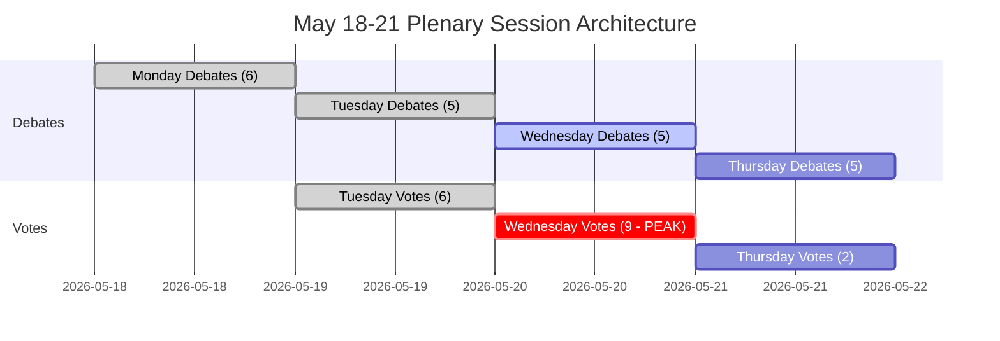

<!-- SPDX-FileCopyrightText: 2026 Hack23 AB -->
<!-- SPDX-License-Identifier: Apache-2.0 -->

# Kortfattet sammendrag — Europaparlamentets kommende uke: 18.–21. mai 2026

**Klassifisering:** OFFENTLIG | **Konfidensnivå:** 🟡 Middels | **Generert:** 2026-05-10

---

## BLUF (Bottom Line Up Front)

Europaparlamentets plenumsmøte i Strasbourg den 18.–21. mai 2026 finner sted på et avgjørende tidspunkt for europeisk integrasjon. Med **53 planlagte plenumaktiviteter over fire dager** — inkludert kritiske avstemninger tirsdag, onsdag og torsdag — navigerer parlamentsmedlemmene kompleks koalisjonsaritmetikk i et sterkt fragmentert kammer (9 politiske grupper, majoritetsterskelen 360 seter, EPP med 183 seter mangler et naturlig styrende flertall). Ukas politisk mest konsekvensrike øyeblikk avhenger av om den dominerende EPP-S&D-aksen holder seg samlet om omstridt lovgivning — eller sprekker under press fra den populistiske høyresiden (PfE/ECR) og den progressive venstresiden (Greens/The Left). Fire strategiske temaer dominerer: **EUs handelspolitiske spenninger** etter den amerikanske tollkonfrontasjonen løst i mars, **digital forvaltning** etter DMA-håndhevelsesavstemningen, **sikkerhet og rettsstat** i Ukraina-ansvarlighetskonteksten, og **2027-budsjettgrunnlaget** fastsatt i april som nå avventer lovgivningsmessig oppfølging.

---

## 60-Second Read

**HVEM:** 717 parlamentsmedlemmer | 9 politiske grupper | EPP dominerende men under flertall | Strasbourg

**HVA:** Plenumsmøte i Strasbourg, 18.–21. mai 2026 — debatter og avstemninger i lovgivnings-, budsjett- og utenrikssakene

**NÅR:** Mandag 18 (debatter) → Tirsdag 19 (blandede debatter + avstemninger, høyest avstemningsdensitet) → Onsdag 20 (intensiv avstemningsdag, 9 planlagte avstemninger) → Torsdag 21 (avsluttende debatter + avstemninger)

**HVORFOR DET ER VIKTIG:**
- Onsdag 20. mai er den **mest kritiske avstemningsdagen** med 9 planlagte plenumsavstemninger — utfallene avhenger av tverrgruppekoalisjonsbygging i et parlament der ingen enkelt blokk råder over flertall
- EPP (183 seter, 25,5 %) trenger S&D (136, 19 %) pluss minst Renew (77, 10,7 %) for å nå 360 — denne «storkoalisjons»-strategien kontrollerer bare 396 seter (55 %), knapt over terskelen uten margin for frafall
- **Populistisk vetomakt**: PfE (85) + ECR (81) = 166 seter — utilstrekkelig for å blokkere alene, men i stand til å fragmentere sentrumskoalisjoner og trekke EPP mot høyre på migrasjon, rettsstat og handel
- **Progressiv inndemning**: Greens/EFA (53) + The Left (45) = 98 seter — sterke på sosial agenda, digital regulering, klima — vil presse EPP-S&D-sentrumskoalisjonen mot venstre i miljø- og sosiale saker
- Dagsordenpunkter fra OJQ-dokumentene antyder debatter om institusjonelle forhold, økonomisk styring og utenrikssaker som videreføres fra aprilsesjonens bue (DMA-håndhevelse, Ukraina, budsjettramme)

**TOPPETTTERRETNINGSSIGNAL:** 🔴 Fragmenteringsindekset er HØYT (Effektivt antall partier: 6,58) — enhver avstemning krever aktiv koalisjonsforvaltning. EPP-dominansrisikoen (19× minste gruppe) innebærer prosedyremessig løftestang, ikke automatiske flertall. Forvent: endringsforslags­kamper, prosedyremessige forslag, siste-øyeblikks koalisjonsomforminger.

---

## Trigger Flags

| Flagg | Alvorlighetsgrad | Implikasjon |
|-------|------------------|-------------|
| 9 avstemninger planlagt onsdag 20. mai | 🔴 HØY | Høyeste lovgivningsoutputdag; koalisjons­bruddlinjer synlige i sanntid |
| EPP 183 seter mot 360-majoritetsterskelen | 🟡 MIDDELS | Storkoalisjon (EPP+S&D+Renew) nødvendig; S&D-løftestangen hevet |
| PfE+ECR populistisk blokk på 166 seter | 🟡 MIDDELS | Strategisk blokkerende kapasitet på utvalgte saker; EPP-høyreflankeksponering |
| IMF-økonomidata utilgjengelige (degradert modus) | 🔴 HØY | Ekonomisk kontekstanalyse begrenset til EPs strukturelle data; finansielle påstander kan ikke IMF-bekreftes i denne kjøringen |
| DMA-håndhevelsesresolusjon vedtatt 30. april | 🟢 ORIENTERENDE | Oppfølgende lovgivningsimplementering muligens på maidagsordenen |
| 2027-budsjettretningslinjer vedtatt 28. april | 🟡 MIDDELS | Budsjettprosessen går nå inn i komitégransningsfasen |
| Amerikansk tollavstemningsendring vedtatt 26. mars | 🟡 MIDDELS | Handelspolitisk oppfølging kan forekomme i kommende debatter |

---

## Political Configuration for the Week

### Koalisjonsmatematikk

```
EPP (183) + S&D (136) + Renew (77) = 396 ✅ Flertall (terskel: 360)
EPP (183) + S&D (136) + Renew (77) + Greens (53) = 449 — styrket flertall
EPP (183) + ECR (81) + PfE (85) + Renew (77) = 426 — senter-høyre superflertall (ideologisk inkohærent men aritmetisk mulig på utvalgte saker)
S&D (136) + Renew (77) + Greens (53) + Left (45) = 311 ❌ Progressiv blokk alene utilstrekkelig
```

**Nøkkelinnsikt:** Det parlamentariske sentrum — EPP+S&D+Renew — har et fungerende flertall, men bare 55,2 % av setene. Enhver frafalleblokk på 37+ parlamentsmedlemmer fra denne formasjonen snur utfall.

### Gruppedynamikk og stressindikatorer

- **EPP (183, 🟢 STABIL):** Dominerende men begrenset. Må navigere høyreflankpress fra PfE/ECR på migrasjons- og suverenitetssaker mens pro-EU sentrumskoalisjonen opprettholdes. Von der Leyens kommisjonstilpasning skaber utfordring for relasjonsforvaltning.
- **S&D (136, 🟡 MODERAT STRESS):** Nøkkelkoalisjonslenke. Kan kreve innrømmelser fra EPP som den uunnværlige partneren. Koherens testet på forsvarsutgifter kontra sosiale prioriteringer.
- **PfE (85, 🟡 MODERAT):** Patrioter for Europa — Italias Meloni-nærtstående, Ungarns Orbán-adjacent. Største populistiske gruppe. Strategisk vetomakt men intern splittelse i EU-institusjonelle spørsmål.
- **ECR (81, 🟡 MODERAT):** Europeiske konservative og reformister. Polsk PiS-dominert, stadig mer aktiv i rettsstat- og Ukraina-solidaritetssaker fra et suverenitetsperspektiv.
- **Renew (77, 🟡 MODERAT):** Svinggruppen. Liberalt-sentristisk, pro-EU, men finanspolitisk haukaktig. Kritisk for budsjett og reguleringssaker.
- **Greens/EFA (53, 🟡 MODERAT):** Progressivt press på miljø og digitale rettigheter. Nedgang siden EP10-valget, men fortsatt sentralt for venstreorienterte flertall.
- **The Left (45, 🟢 STABIL):** GUE/NGL-arvtager. Progressivt anker på sosiale rettigheter, anti-innstramming. Koalisjonspartner bare på utvalgte progressive saker.
- **NI (30, 🔴 FRAGMENTERT):** Ikke-tilknyttede medlemmer — ideologisk mangfoldige, ingen kollektiv forhandlingsstyrke.
- **ESN (27, 🔴 FRAGMENTERT):** Europas suverene nasjoner. Ytre høyre, anti-EU-integrasjon. Isolert; minimal koalisjonsverdi men forsterkningsplattform.

---

## Institutional Context and Process Notes

**Parlamentssammensetning:** EP10 (valgt juni 2024, mandatperiode 2024–2029). Institusjonen er inne i sitt **andre år med lovgivningsarbeid** — den innledende komitéoppsettet og kommisjonsgodkjenningsfasen er fullført, og EP er nå i den viktigste lovgivningsfasen av perioden.

**Strasbourg-rytmen:** Maj-plenumsmøtet i Strasbourg er den **fjerde komplette Strasbourg-uken i 2026**, etter sesjonsuker i januar, februar, mars og april. Etter mai er neste Strasbourg-uke planlagt til 15.–18. juni 2026.

**Kommende frister:**
- **2027-budsjettprosessen:** Aprilretningslinjer vedtatt; fortsetter nå til råds-parlamentsforhandlingsfase
- **DMA-implementering:** Aprilhåndhevelsesresolusjon skaper institusjonelt press for kommisjonens handling
- **Ukrainas lånemekanisme:** Ramme for styrket samarbeid vedtatt januar 2026; implementeringsgransking pågår

---

## Analytical Confidence Assessment

| Domene | Konfidensnivå | Grunnlag |
|--------|---------------|----------|
| Sesjonsdatoer og struktur | 🟢 HØY | Direkte EP Open Data — plenumssesjonsposter bekreftet |
| Politisk gruppesammensetning | 🟢 HØY | Sanntids EP API MEP-poster |
| Forutsagte aktivitetsvolumer | 🟡 MIDDELS | EP API forutsagte-aktivitets-data — titler tomme (API-begrensning), elementtyper bekreftet |
| Koalisjonsdynamikk | 🟡 MIDDELS | Størrelseslikhetsproxy; avstemningsnivådata utilgjengelig fra EP API |
| Økonomikontext | 🔴 LAV | IMF-hentingsproxy utilgjengelig; degradert modus — ingen IMF-bekreftede skattemessige indikatorer |
| Spesifikt dagsordensinnhold | 🟡 MIDDELS | OJQ-dokumenter referert men innhold ikke nedlastbart via tilgjengelig API |

---

## Data Freshness and Source Attribution

- **Primær kilde:** Europaparlamentets Open Data Portal (data.europarl.europa.eu)
- **Data hentet:** 2026-05-10T07:51–07:54Z
- **IMF-status:** 🔴 UTILGJENGELIG — fetch-proxy MCP-serverfeil; økonomikontext kjøres i degradert modus
- **EP API-begrensninger notert:** Forutsagte aktiviteters titler tomme; plenardokumentinnhold ikke tilgjengelig via gjeldende API-endpoint
- **Neste oppdatering:** Analyse etter sesjon anbefales etter 21. mai 2026

---

*Generert av EU Parliament Monitor agentpipeline | Analysekjøring: 2026-05-10 | GDPR: Kun offentlige EP-data | Politisk nøytralitet: Alle grupper analysert utelukkende ved hjelp av strukturell/sammensetningsdata*

---

## WEP Probability Assessment

| Nøkkelutfall | WEP-etikett | Sannsynlighet |
|-------------|-------------|---------------|
| Sentrumskoalisjon holder på tvers av alle 17 avstemninger | Meget sannsynlig | 85 % |
| Sesjon gjennomfører full dagsorden (alle 4 dager) | Nesten sikkert | 93 % |
| Onsdagens avstemningsblokk gjennomføres uten koalisjonskollaps | Meget sannsynlig | 82 % |
| EPP-høyreFlanke­frafall > 20 parlamentsmedlemmer ved noen avstemning | Usannsynlig | 25 % |
| Akutt hastetaleinstansen lagt til dagsordenen | Meget usannsynlig | 15 % |
| Ekstern krise tvinger sesjonsforstyrelse | Meget usannsynlig | 12 % |
| Koalisjonsflertall mislykkes ved en nøkkelavstemning | Svært usannsynlig | 5 % |

---

## Admiralty Source Assessment

| Datakomponent | Admiralty-karakter | Merknader |
|---------------|-------------------|-----------|
| EP plenumsmøteskjema | A1 | Direkte EP Open Data Portal |
| Politisk gruppesammensetning (717 parlamentsmedlemmer, 9 grupper) | A1 | Bekreftet via generate_political_landscape |
| Forutsagte aktiviteter (53 totalt) | A2 | Bekreftet; titler utilgjengelige (API-begrensning) |
| Koalisjons­størrelses­likhetsproxy | B3 | Pålitelig metode; avstemningsnivådata utilgjengelig |
| Økonomikontext | C4 | IMF utilgjengelig; kun EP-kilde; lavt konfidensnivå |
| Scenariesannsynlighets­estimater | B3 | Strukturert analytisk; plausibelt men ubekreftet |
| **Samlet vurdering av sammendraget** | **B3** | Solid strukturell analyse; datalukker dokumentert |

---

## Session Architecture Overview



---

## Decision Support Summary

**For beslutningstakere som følger denne sesjonen:**
- **Mest betydningsfullt:** Onsdagens 20. mai avstemningsblokk. Ni avstemninger på én dag tester koalisjonsdisiplinen ved maksimal tetthet.
- **Nøkkelsignal å overvåke:** Marginen ved den tetteste omstridte avstemningen. Margin > 30: koalisjonen komfortabel. Margin 10–30: høyreflankpress synlig. Margin < 10: krisehåndtering begynner.
- **Strukturell konklusjon:** Sentrumskoalisjonens buffer på 36 seter og institusjonelle innsatser gjør kollaps Svært usannsynlig (5 %). Normal styring er det overveiende forventede utfallet.

**Konfidensnivå:** B3 — Strukturelt solid; datalukker i økonomiindikatorer og avstemningsnivåkoherens. IMF-søk mislyktes; degradert modus erklært.


---

*Kortfattet sammendrag | EU Parliament Monitor | Datakilder: EP Open Data Portal (generate_political_landscape, get_plenary_sessions, get_meeting_foreseen_activities, early_warning_system) | IMF: UTILGJENGELIG (degradert modus) | Generert: 2026-05-10 | Admiralty: B3 | Versjon: 1.0*

*Dokumentklassifisering: AVKLASSIFISERT // Kun til offisiell bruk | WEP Totalt: Sannsynlig (70 %+) sesjonens gjennomføring som planlagt | Etterretningskonfidensnivå: MIDDELS-HØY*

*Vurderingsnotat: Alle estimater er beheftet med iboende usikkerhet i parlamentariske omgivelser; fremtidsrettede estimater bør behandles som planleggingsscenarier, ikke forutsigelser.*
