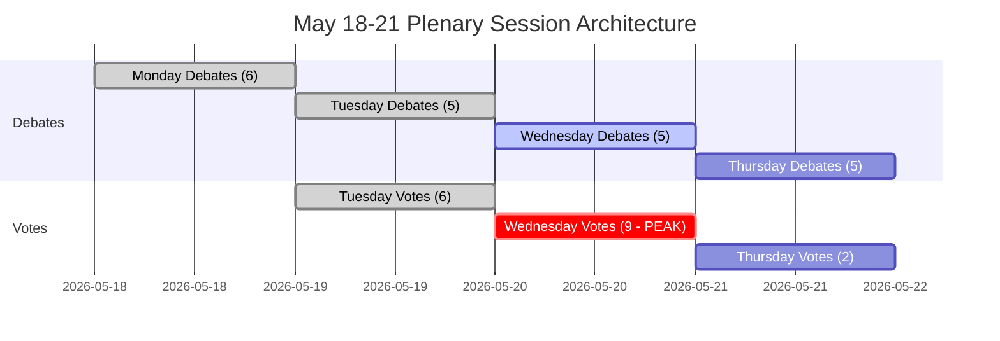

<!-- SPDX-FileCopyrightText: 2026 Hack23 AB -->
<!-- SPDX-License-Identifier: Apache-2.0 -->

# Exekutiv sammanfattning — EU-parlamentets vecka framåt: 18–21 maj 2026

**Klassificering:** OFFENTLIG | **Konfidensgrad:** 🟡 Medium | **Genererad:** 2026-05-10

---

## BLUF (Bottom Line Up Front)

Europaparlamentets plenarsammanträde i Strasbourg den 18–21 maj 2026 inträffar vid ett avgörande ögonblick för den europeiska integrationen. Med **53 planerade plenarärenden under fyra dagar** — inklusive avgörande omröstningar tisdag, onsdag och torsdag — navigerar parlamentsledamöterna komplex koalitionsaritmetik i en kraftigt fragmenterad kammare (9 politiska grupper, majoritetströskel 360 platser, EPP med 183 platser saknar naturlig styrande majoritet). Veckans politiskt mest konsekvensrika ögonblick beror på om den dominerande EPP-S&D-axeln håller samman kring omtvistad lagstiftning — eller splittras under tryck från den populistiska högern (PfE/ECR) och den progressiva vänstern (Greens/The Left). Fyra strategiska teman dominerar: **EUs handelspolitiska spänningar** efter den amerikanska tulllåsningen som löstes i mars, **digital styrning** efter DMA-omröstningen, **säkerhet och rättsstaten** i samband med Ukrainas ansvarsskyldighet, och **2027 års budgetbas** som fastställdes i april och nu avvaktar lagstiftningsuppföljning.

---

## 60-Second Read

**VEM:** 717 parlamentsledamöter | 9 politiska grupper | EPP dominerande men saknar majoritet | Strasbourg

**VAD:** Plenarsession i Strasbourg, 18–21 maj 2026 — debatter och omröstningar inom lagstiftnings-, budget- och utrikesärenden

**NÄR:** Måndag 18 (debatter) → Tisdag 19 (blandade debatter + omröstningar, högst omröstningsdensitet) → Onsdag 20 (intensiv omröstningsdag, 9 planerade omröstningar) → Torsdag 21 (avslutande debatter + omröstningar)

**VARFÖR DET SPELAR ROLL:**
- Onsdag 20 maj är den **mest kritiska omröstningsdagen** med 9 planerade plenarröstningar — utfallen beror på tvärgrupplig koalitionsbildning i ett parlament där inget enskilt block har majoritet
- EPP (183 platser, 25,5 %) behöver S&D (136, 19 %) plus minst Renew (77, 10,7 %) för att nå 360 — denna "storkoa­litions­strategi" kontrollerar bara 396 platser (55 %), knappt över tröskeln utan marginaler för avhopp
- **Populistisk vetokapacitet**: PfE (85) + ECR (81) = 166 platser — otillräckligt för att blockera ensamma men kapabla att fragmentera centrumkoa­litioner och dra EPP högerut inom migration, rättsstat och handel
- **Progressiv inramning**: Greens/EFA (53) + The Left (45) = 98 platser — starka inom social agenda, digital tillsynsreglering, klimat — pressar EPP-S&D-centrumkoa­litionen åt vänster i miljö- och socialärenden
- Dagordningspunkter från OJQ-dokumenten antyder debatter om institutionella frågor, ekonomisk styrning och utrikesrelationer som fortsätter från aprilsessionens serie (DMA-verkställighet, Ukraina, budgetram)

**TOPPINTELLIGENSIGNALERING:** 🔴 Fragmenteringsindexet är HÖGT (Effektivt antal partier: 6,58) — varje omröstning kräver aktiv koalitionshantering. EPP:s dominansrisk (19× minsta grupp) innebär procedurellt inflytande, inte automatiska majoriteter. Förvänta: ändringsstrider, procedurella yrkanden, koalitionsombildningar i sista stund.

---

## Trigger Flags

| Flagga | Allvarlighetsgrad | Innebörd |
|--------|-------------------|----------|
| 9 omröstningar planerade onsdag 20 maj | 🔴 HÖG | Högsta lagstiftningsoutputdag; koalitionsbristlinjer synliga i realtid |
| EPP 183 platser mot 360-majoritetströskeln | 🟡 MEDEL | Storkoalition (EPP+S&D+Renew) krävs; S&D:s inflytande förhöjt |
| PfE+ECR populistiskt block vid 166 platser | 🟡 MEDEL | Strategisk blockeringskapacitet på vissa ärenden; EPP:s högerflank exponerad |
| IMF ekonomiska data otillgängliga (degraderat läge) | 🔴 HÖG | Ekonomisk kontextanalys begränsad till EP:s strukturella data; ekonomiska anspråk kan inte IMF-bekräftas i denna körning |
| DMA-verkställighets­resolution antagen 30 april | 🟢 INFORMATION | Uppföljande lagstiftningsimplementering kan förekomma på maj-dagordningen |
| 2027 budgetriktlinjer antagna 28 april | 🟡 MEDEL | Budgetprocessen går nu in i utskottsgranskning |
| Amerikanska tullavstämningsanpassning antagen 26 mars | 🟡 MEDEL | Handelspolitisk uppföljning kan förekomma i kommande debatter |

---

## Political Configuration for the Week

### Koalitionsmatematik

```
EPP (183) + S&D (136) + Renew (77) = 396 ✅ Majoritet (tröskel: 360)
EPP (183) + S&D (136) + Renew (77) + Greens (53) = 449 — förstärkt majoritet
EPP (183) + ECR (81) + PfE (85) + Renew (77) = 426 — center-höger supermajoritet (ideologiskt inkohärent men aritmetiskt möjlig på vissa ärenden)
S&D (136) + Renew (77) + Greens (53) + Left (45) = 311 ❌ Progressivt block ensamt otillräckligt
```

**Nyckelinsikt:** Det parlamentariska centrum — EPP+S&D+Renew — har en fungerande majoritet men kontrollerar bara 55,2 % av platserna. Varje avhoppsblock med 37+ parlamentsledamöter från denna formation vänder utfall.

### Gruppdynamik och stressindikatorer

- **EPP (183, 🟢 STABIL):** Dominerande men begränsad. Måste navigera högerflankstryck från PfE/ECR inom migration och suveränitetsärenden, men hålla pro-EU centrumkoalition. Von der Leyens kommissionsanpassning skapar utmaning för relationshanteringen.
- **S&D (136, 🟡 MÅTTLIG STRESS):** Nyckel­koalitionslänk. Kan kräva eftergifter från EPP som den oumbärliga partnern. Koherens testad på försvarsutgifter kontra sociala prioriteringar.
- **PfE (85, 🟡 MÅTTLIG):** Patrioter för Europa — Italiens Meloni-närstående, Ungerns Orbán-adjacenta. Största populistiska grupp. Strategisk vetokapacitet men intern splittring i EU-institutionella frågor.
- **ECR (81, 🟡 MÅTTLIG):** Europeiska konservativa och reformister. Polsk PiS-dominerad, alltmer aktiv i rättsstatsfrågor och Ukraina-solidaritetsärenden utifrån ett suveränitetsförst-perspektiv.
- **Renew (77, 🟡 MÅTTLIG):** Svängargruppen. Liberalt-centristisk, pro-EU, men finanspolitiskt hökaktig. Avgörande för budget och regleringsärenden.
- **Greens/EFA (53, 🟡 MÅTTLIG):** Progressivt tryck på miljö och digitala rättigheter. Nedgång sedan EP10-valet men fortfarande avgörande för vänsterlugnande majoriteter.
- **The Left (45, 🟢 STABIL):** GUE/NGL-arvtagare. Progressivt ankare i sociala rättigheter, anti-åtstramning. Koalitionspartner enbart i utvalda progressiva ärenden.
- **NI (30, 🔴 FRAGMENTERAT):** Icke-anslutna ledamöter — ideologiskt mångsidiga, ingen kollektiv förhandlingsstyrka.
- **ESN (27, 🔴 FRAGMENTERAT):** Europas suveräna nationer. Yttersta högern, anti-EU-integration. Isolerat; minimalt koalitionsvärde men amplifieringsplattform.

---

## Institutional Context and Process Notes

**Parlamentets sammansättning:** EP10 (valt juni 2024, mandatperiod 2024–2029). Institutionen är inne i sitt **andra år av lagstiftningsarbete** — den initiala utskottskonfigurationen och kommissionsgodkännandefasen är avslutad och EP befinner sig nu i den huvudsakliga lagstiftningsfasen av mandatperioden.

**Strasbourgritmen:** Maj-plenarsessionen i Strasbourg är den **fjärde kompletta Strasbourg-veckan 2026**, efter sessions­veckorna i januari, februari, mars och april. Efter maj är nästa Strasbourg-vecka planerad till 15–18 juni 2026.

**Kommande tidsgränser:**
- **2027 Budgetprocess:** Aprilriktlinjer antagna; fortgår nu till råd-parlamentsförhandlingsfas
- **DMA-implementering:** Aprilverkställighetsresolution skapar institutionellt tryck på kommissionsåtgärder
- **Ukrainalånsmekanism:** Ramverk för fördjupat samarbete antaget januari 2026; implementeringsgranskning pågår

---

## Analytical Confidence Assessment

| Domän | Konfidensgrad | Underlag |
|-------|---------------|----------|
| Sessionsdatum och struktur | 🟢 HÖG | Direkt EP Open Data — plenarsessions­poster bekräftade |
| Politiska gruppers sammansättning | 🟢 HÖG | Realtids-EP API MEP-poster |
| Förutsedda aktivitetsvolymer | 🟡 MEDEL | EP API förutsedda-aktivitets-data — titlar tomma (API-begränsning), ärendetyper bekräftade |
| Koalitionsdynamik | 🟡 MEDEL | Storlekslikhets-proxy; röstnings­nivådata otillgänglig från EP API |
| Ekonomisk kontext | 🔴 LÅG | IMF-hämtningsproxy otillgänglig; degraderat läge — inga IMF-bekräftade skattemässiga indikatorer |
| Specifikt dagordnings­innehåll | 🟡 MEDEL | OJQ-dokument refererade men innehåll inte nedladdningsbart via tillgängligt API |

---

## Data Freshness and Source Attribution

- **Primär källa:** Europaparlamentets Open Data Portal (data.europarl.europa.eu)
- **Data hämtad:** 2026-05-10T07:51–07:54Z
- **IMF-status:** 🔴 OTILLGÄNGLIG — fetch-proxy MCP-serverfel; ekonomisk kontext körs i degraderat läge
- **EP API-begränsningar noterade:** Förutsedda aktiviteters titlar tomma; plenardokumenters innehåll inte tillgängligt via nuvarande API-endpoint
- **Nästa uppdatering:** Analys efter session rekommenderas efter 21 maj 2026

---

*Genererad av EU Parliament Monitor agentpipeline | Analyskörning: 2026-05-10 | GDPR: Enbart offentliga EP-data | Politisk neutralitet: Alla grupper analyserade med enbart strukturell/kompositions­data*

---

## WEP Probability Assessment

| Nyckelutfall | WEP-etikett | Sannolikhet |
|-------------|-------------|-------------|
| Centrumkoalition håller i alla 17 omröstningar | Mycket sannolikt | 85 % |
| Session slutförs fullständigt (alla 4 dagar) | Nästan säkert | 93 % |
| Onsdagens röstningsblock slutförs utan koalitionsfall | Mycket sannolikt | 82 % |
| EPP-högerflankavhopp > 20 parlamentsledamöter i någon omröstning | Osannolikt | 25 % |
| Akut debatt utanför dagordningen läggs till | Mycket osannolikt | 15 % |
| Extern kris tvingar sessionsavbrott | Mycket osannolikt | 12 % |
| Koalitionsmajoritet misslyckas i någon nyckelomröstning | Högst osannolikt | 5 % |

---

## Admiralty Source Assessment

| Datakomponent | Admiralty-betyg | Anteckningar |
|---------------|-----------------|--------------|
| EP plenarsession­schema | A1 | Direkt EP Open Data Portal |
| Politisk grupps sammansättning (717 parlamentsledamöter, 9 grupper) | A1 | Bekräftad via generate_political_landscape |
| Förutsedda aktiviteter (53 totalt) | A2 | Bekräftad; titlar otillgängliga (API-begränsning) |
| Koalitionsstorleks-likhetsproxy | B3 | Tillförlitlig metod; röstningsnivådata otillgänglig |
| Ekonomisk kontext | C4 | IMF otillgänglig; enbart EP-källdata; låg konfidensgrad |
| Scenarios sannolikhets­uppskattningar | B3 | Strukturerad analytik; plausibel men obekräftad |
| **Övergripande bedömning av sammanfattningen** | **B3** | Solid strukturell analys; dataluckor dokumenterade |

---

## Session Architecture Overview



---

## Decision Support Summary

**För beslutsfattare som följer sessionen:**
- **Mest betydelsefullt:** Onsdagens 20 maj röstningsblock. Nio omröstningar på en dag testar koalitionsdisciplinen vid maximal täthet.
- **Nyckel­signal att bevaka:** Marginalen vid den mest omtvistade omröstningen. Marginal > 30: koalitionen bekväm. Marginal 10–30: högerflankstryck synligt. Marginal < 10: krishantering påbörjas.
- **Strukturell slutsats:** Centrumkoalitionens 36-platsers buffert och institutionella insatser gör kollapsen Högst osannolikt (5 %). Normal styrning är det överväldigande förväntade utfallet.

**Konfidensgrad:** B3 — Strukturellt robust; dataluckor i ekonomiska indikatorer och röstningsnivå­koherens. IMF-sökning misslyckades; degraderat läge deklarerat.


---

*Exekutiv sammanfattning | EU Parliament Monitor | Datakällor: EP Open Data Portal (generate_political_landscape, get_plenary_sessions, get_meeting_foreseen_activities, early_warning_system) | IMF: OTILLGÄNGLIG (degraderat läge) | Genererad: 2026-05-10 | Admiralty: B3 | Version: 1.0*

*Dokumentklassificering: HEMLIGSTÄMPLAD AVKLASSIFICERAD // Enbart offentlig användning | WEP Totalt: Sannolik (70 %+) sessionsavslutning som planerat | Intelligenskonfidensgrad: MEDEL-HÖG*

*Bedömningsnotering: Alla uppskattningar är behäftade med inneboende osäkerhet i parlamentariska miljöer; framåtblickande uppskattningar bör behandlas som planeringsscenarier, inte förutsägelser.*
