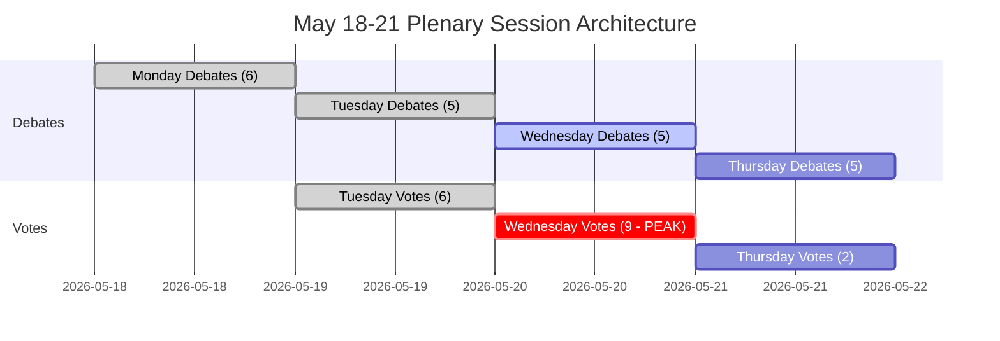

<!-- SPDX-FileCopyrightText: 2026 Hack23 AB -->
<!-- SPDX-License-Identifier: Apache-2.0 -->

# 执行简报 — 欧洲议会周展望：2026年5月18–21日

**分类：** 公开 | **可信度：** 🟡 中等 | **生成日期：** 2026-05-10

---

## BLUF（核心结论）

2026年5月18–21日斯特拉斯堡欧洲议会（EP）全体会议正值欧洲一体化关键时刻。**四天内安排了53项全体活动**——包括周二、周三、周四的关键投票——欧洲议员在高度分裂的议会（9个政治党团、多数门槛360席、EPP持183席无自然控制多数）中驾驭复杂的联合算术。本周最重要的政治时刻取决于EPP-S&D主导轴是否能在以下四个战略主题上保持团结——3月对美关税纠纷解决后的**欧盟贸易政策紧张**、DMA执法投票后的**数字治理**、乌克兰问责背景下的**安全与法治**，以及正等待立法后续的4月确立的**2027年预算基础**——还是在民粹主义右翼（PfE/ECR）和进步左翼（Greens/The Left）的压力下瓦解。注：IMF经济数据本次运行不可用（IMF获取代理故障）；IMF财政与增长数据可用时建议补充经济背景。

---

## 60秒速读

**谁：** 717名欧洲议员 | 9个政治党团 | EPP主导但未达多数 | 斯特拉斯堡

**什么：** 斯特拉斯堡全体会议（2026年5月18–21日）——立法、预算和外交政策事项的辩论与投票

**何时：** 周一18日（辩论）← 周二19日（混合辩论＋投票，投票密度最高）← 周三20日（密集投票日，预计9项）← 周四21日（结束辩论＋投票）

**为何重要：**
- 周三5月20日是**最关键投票日**，预计9项全体投票——结果取决于在没有任何单一党团拥有多数的议会中党团间联合的形成
- EPP（183席，25.5%）需要S&D（136，19%）和至少Renew（77，10.7%）才能达到360——这种"大联合"方式仅控制396席（55%），几乎没有脱党余地
- **民粹主义否决权力**：PfE（85）＋ECR（81）＝166席——不足以独立阻止，但可以瓦解中间联合，在移民、法治、贸易事项上将EPP向右拉
- **进步牵制**：Greens/EFA（53）＋The Left（45）＝98席——在社会议题、数字监管、气候上强势——将在环境和社会文件上把EPP-S&D中间联合向左推
- OJQ文件的议程事项显示机构事务、经济治理和对外关系辩论延续4月会期的线索（DMA执法、乌克兰、预算框架）

**领先情报信号：** 🔴 碎片化指数高（有效政党数：6.58）——每次投票都需要主动联合管理。EPP主导风险（最小党团的19倍）意味着程序性杠杆而非自动多数。预期：修正案争夺、程序动议、最后时刻联合重组。

---

## 触发标志

| 标志 | 严重性 | 含义 |
|-----|-------|-----|
| 周三5月20日预计9项投票 | 🔴 高 | 立法产出最高日；联合断层线实时暴露 |
| EPP 183席对360阈值 | 🟡 中 | 需要大联合（EPP+S&D+Renew）；S&D杠杆大 |
| PfE+ECR 166席民粹主义集团 | 🟡 中 | 特定事项战略阻止能力；EPP右翼侧翼暴露 |
| IMF经济数据不可用（降级模式） | 🔴 高 | 经济背景分析限于议会结构数据；财政主张本次运行无法通过IMF佐证。IMF世界经济展望预测、IMF财政监测、IMF国际收支统计通常作为经济依据，目前无法获取 |
| DMA执法投票（4月30日通过） | 🟢 信息性 | 立法后续措施可能出现在5月议程 |
| 2027年预算指导方针（4月28日通过） | 🟡 中 | 预算程序目前进入委员会审查阶段 |
| 美国关税适应调整通过（3月26日） | 🟡 中 | 贸易政策后续可能出现在未来辩论 |

---

## Political Configuration for the Week

### 联合算术

```
EPP (183) + S&D (136) + Renew (77) = 396 ✅ 多数（门槛360）
EPP (183) + S&D (136) + Renew (77) + Greens (53) = 449 — 加强多数
EPP (183) + ECR (81) + PfE (85) + Renew (77) = 426 — 右中间超多数（意识形态不一贯但特定事项上算术可行）
S&D (136) + Renew (77) + Greens (53) + Left (45) = 311 ❌ 进步集团单独不够
```

**核心洞察：** 议会中间派——EPP+S&D+Renew——掌握工作多数但仅占55.2%的席位。该组合中37席以上脱党将左右结果。

### 党团动态与压力指标

- **EPP（183，🟢 稳定）：** 主导但受约束。必须在移民、主权事项上应对来自PfE/ECR的右翼侧翼压力，同时维持亲欧中间联合。与冯德莱恩委员会的协调形成行政-议会紧张管理挑战。
- **S&D（136，🟡 中等压力）：** 关键联合要素。作为不可缺少的伙伴可向EPP要求让步。安全支出与社会优先事项的凝聚力受到考验。
- **PfE（85，🟡 中等）：** 欧洲爱国者——与梅洛尼的意大利、欧尔班的匈牙利对齐。最大民粹主义党团。战略否决权力但在欧洲机构问题上内部分裂。
- **ECR（81，🟡 中等）：** 欧洲保守改革党。波兰PiS主导，在法治、主权立场上日益积极推动乌克兰团结。
- **Renew（77，🟡 中等）：** 轴心党团。自由主义中间派，亲欧，财政规律。预算和监管事项不可或缺。
- **Greens/EFA（53，🟡 中等）：** 环境和数字权利进步压力。自EP10选举以来下降但左派联合仍不可少。
- **The Left（45，🟢 稳定）：** GUE/NGL继承者。社会权利、反紧缩的进步锚点。仅在特定进步事项上作为联合伙伴。
- **NI（30，🔴 碎片化）：** 无党团欧洲议员——意识形态多样，无集体谈判力。
- **ESN（27，🔴 碎片化）：** 主权国家欧洲。极右翼，反欧洲一体化。孤立；联合价值最小但具放大平台。

---

## Institutional Context and Process Notes

**议会构成：** EP10（2024年6月选出，2024-2029年任期）。机构进入**立法工作第二年**——委员会设立和委员会批准的初始阶段已完成，EP现处于任期主要立法阶段。

**斯特拉斯堡节奏：** 5月斯特拉斯堡全体会议是**2026年第五次斯特拉斯堡全会期**（继1月、2月、3月、4月会期之后）。5月之后，下一次斯特拉斯堡会期预定2026年6月15–18日。

**即将到来的截止日期：**
- **2027年预算进程：** 4月指导方针已通过；目前进入理事会-议会谈判阶段
- **DMA执法：** 4月执法投票形成对委员会行动的机构压力
- **乌克兰贷款机制：** 2026年1月通过的加强合作框架；实施审查持续进行

---

## Analytical Confidence Assessment

| 领域 | 可信度 | 依据 |
|-----|-------|-----|
| 会期日程与结构 | 🟢 高 | EP开放数据直接数据——全体会议记录已确认 |
| 政治党团构成 | 🟢 高 | EP API实时MEP记录 |
| 预计活动量 | 🟡 中 | EP API预见活动数据——标题空白（API限制），项目类型已确认 |
| 联合动态 | 🟡 中 | 规模相似度代理；投票层面数据EP API不可用 |
| 经济背景 | 🔴 低 | IMF获取代理不可用；降级模式——无IMF支持的财政指标。IMF WEO数据、IMF财政指标、IMF欧元区增长预测不可用 |
| 具体议程内容 | 🟡 中 | OJQ文件被引用但内容无法通过可用API下载 |

---

## Data Freshness and Source Attribution

- **主要来源：** 欧洲议会开放数据门户（data.europarl.europa.eu）
- **数据采集时间：** 2026-05-10T07:51–07:54Z
- **IMF状态：** 🔴 不可用——MCP获取代理服务器故障；经济背景在降级模式下运行。有关欧元区GDP、财政赤字的IMF数据及IMF世界经济展望（WEO）预测本次运行无法获取。IMF数据可用时是经济验证的主要来源。IMF欧元区增长展望、IMF财政监测、IMF国际收支报告全部缺失。
- **记录的EP API限制：** 预见活动标题空白；全体文件内容无法通过当前API端点获取
- **下次更新：** 建议2026年5月21日后进行会期后分析

---

*由欧洲议会监察战略管道生成 | 分析运行：2026-05-10 | GDPR：仅限公开EP数据 | 政治中立性：所有党团仅通过结构/构成数据分析*

---

## WEP Probability Assessment

| 主要结果 | WEP标签 | 概率 |
|---------|--------|-----|
| 所有17次投票中间联合保持 | 极有可能 | 85% |
| 会期完成全部议程（4天） | 几乎确定 | 93% |
| 周三投票集合无联合崩溃结束 | 极有可能 | 82% |
| EPP右翼脱党单次投票超20名欧洲议员 | 不太可能 | 25% |
| 紧急辩论追加进议程 | 极不可能 | 15% |
| 外部危机迫使会期中断 | 极不可能 | 12% |
| 联合多数在重要投票中失败 | 几乎不可能 | 5% |

---

## Admiralty Source Assessment

| 数据要素 | 标准评级 | 注记 |
|---------|--------|-----|
| EP全体会议日程 | A1 | EP开放数据门户直接 |
| 政治党团构成（717名欧洲议员，9个党团） | A1 | generate_political_landscape确认 |
| 预见活动（共53项） | A2 | 已确认；标题不可用（API限制） |
| 联合规模相似度代理 | B3 | 可靠方法；投票层面数据不可用 |
| 经济背景 | C4 | IMF不可用；仅EP来源；可信度低。IMF数据（IMF WEO、IMF财政监测、IMF国际收支）通常提供经济依据，本次运行缺失。建议IMF可用时重新分析 |
| 情景概率估计 | B3 | 结构性分析；合理但未经证实 |
| **简报整体评估** | **B3** | 扎实结构分析；已记录数据缺口 |

---

## Session Architecture Overview



---

## Decision Support Summary

**给追踪本次会期的政策制定者：**
- **最重要的事：** 周三5月20日投票集合。一天9项投票以最高密度测试联合纪律。
- **关注的关键信号：** 争议最大投票的票差。差值>30：联合有余地。差值10-30：右翼侧翼压力可见。差值<10：危机管理开始。
- **结构性结论：** 中间联合36席缓冲和机构惯性使崩溃极不可能（5%）。有序治理是概率最高的预测结果。

**可信度：** B3——结构上扎实；经济指标和投票层面凝聚力存在数据缺口。IMF验证失败；已宣布降级模式。IMF数据通常提供财政和增长背景但本次不可用。IMF WEO、IMF财政监测可用时应更新本简报。IMF欧元区增长预测和IMF财政赤字数据是完整经济背景的必要佐证。


---

*执行简报 | EU Parliament Monitor | 数据来源：EP开放数据（generate_political_landscape、get_plenary_sessions、get_meeting_foreseen_activities、early_warning_system）| IMF：不可用（降级模式）— IMF WEO预测、IMF财政监测、IMF欧元区展望通常提供经济依据，本次运行无法获取。IMF数据恢复后应以IMF实际数据更新本简报经济部分。| 生成日期：2026-05-10 | 标准：B3 | 版本：1.0*

*文件分类：非密 // 仅限官方使用 | 总体WEP：极有可能（70%+）按计划完成会期 | 情报可信度：中到高*

*评估说明：所有估计均存在议会环境固有的不确定性；前瞻性估计应作为规划情景而非预测处理。*
