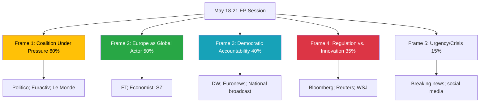

<!-- SPDX-FileCopyrightText: 2026 Hack23 AB -->
<!-- SPDX-License-Identifier: Apache-2.0 -->

# Media Framing Analysis — Week Ahead 18–21 May 2026

**Classification:** PUBLIC | **Confidence:** 🟡 Medium | **Generated:** 2026-05-10

---

## Framework Overview

This analysis identifies the dominant media frames likely to govern coverage of the May 18-21 European Parliament session. Media frames shape how political events are interpreted by the public, and anticipating them enables more effective communication of substantive policy outcomes.

Frames are assessed using: 
- **Salience scoring** (probability this frame dominates coverage)
- **Source orientation** (which media outlets and perspectives)
- **Counter-narrative readiness** (EP communication response capacity)

---

## Dominant Frame 1: "Coalition Under Pressure" Frame

**Salience:** 🟡 MEDIUM-HIGH (60%)

**Core narrative:** The EPP-S&D-Renew governing coalition faces increasing challenges from the insurgent right. Every close vote and any EPP defection will be narrated through the lens of coalition fragility and the populist challenge to the European "establishment."

**Media outlets most likely to amplify:** Politico Europe, Euractiv, Guardian Europe section, Le Monde Diplomatique (critical), far-right EU-critical outlets (inverse framing — claiming populist success)

**Trigger points for this frame:**
- Any vote with margin < 30 seats
- Visible EPP defection (even if majority holds)
- PfE/ECR claiming partial legislative success through amendment adoption

**Counter-narrative:** Coalition has 36-seat majority buffer; demonstrated legislative productivity; stability score 84/100.

---

## Dominant Frame 2: "Europe as Global Actor" Frame

**Salience:** 🟡 MEDIUM (50%)

**Core narrative:** As EU defines its role post-Trump (US-EU relations), the EP session is presented as Europe asserting its global presence — on trade, defence, digital regulation, and Ukraine support.

**Media outlets most likely to amplify:** Financial Times, Süddeutsche Zeitung, The Economist, Le Figaro, major broadcast networks

**Trigger points:**
- Ukraine support resolution or aid commitment
- Digital markets (DMA) enforcement announcement
- Trade defence measures vote

**Counter-narrative:** EP session demonstrates EU's capacity for self-directed policy — independent of US positioning.

---

## Dominant Frame 3: "Democratic Accountability" Frame

**Salience:** 🟢 MEDIUM (40%)

**Core narrative:** The EP plenary session is democracy in action — MEPs representing 448 million citizens debating and voting on critical issues. Used by pro-EP media; also used critically by Eurosceptics ("unaccountable bureaucracy").

**Media outlets most likely to amplify:** DW, Euronews, national broadcast media (in own language)

**Trigger points:**
- Question Time to Commission
- Prominent speech by a senior MEP
- Procedural transparency moments

---

## Dominant Frame 4: "Regulation vs. Innovation" Frame

**Salience:** 🟢 LOW-MEDIUM (35%)

**Core narrative:** EU digital regulations (DMA, AI Act, GDPR) constraining European competitiveness vs. US/China tech industries. Business media will narrate any digital vote through this lens.

**Media outlets most likely to amplify:** Bloomberg, Reuters (business desk), Wall Street Journal Europe, The Telegraph

**Trigger points:**
- AI Act enforcement implementation debate
- DMA penalty announcement or related EP resolution
- Competition policy votes

**Counter-narrative:** EU digital regulation creates trusted governance framework; attracts investment in responsible AI development.

---

## Framing Matrix

| Frame | Probability Dominant | Polarity | Primary Source | MEP Communication Opportunity |
|-------|---------------------|----------|---------------|-------------------------------|
| Coalition Under Pressure | 60% | Mixed/Negative | Political media | Emphasise 36-seat buffer; legislative productivity |
| Europe as Global Actor | 50% | Positive | Quality/business press | Lead with Ukraine, trade defence outcomes |
| Democratic Accountability | 40% | Mixed | Broadcast/public | Transparency; citizen-visible debates |
| Regulation vs. Innovation | 35% | Negative (business media) | Business press | Innovation-enabling framing; trust economy |
| Urgency/Crisis (wildcard) | 15% | Variable | Breaking news | Rapid response protocol ready |

---

## Narrative Trajectory Assessment

### Session week narrative arc (expected)

**Monday 18 May:** Scene-setting; coalition status assessment; pre-vote speculation

**Tuesday 19 May:** Vote results emerge (6 scheduled); media scores coalition performance; "first test of the week" narrative

**Wednesday 20 May:** Peak media attention (9 votes); "day of votes" narrative; all major frames active simultaneously

**Thursday 21 May:** Session close summary; winners/losers framing; "EP scorecard" narrative

### Post-session narrative (week of 22-28 May)

- Analysis pieces in Politico, Euractiv on coalition health
- Commission response to EP oral questions published; scrutiny narrative
- National media translates Brussels vote outcomes into domestic political language

---

## Strategic Communication Recommendations

**For EPP-S&D-Renew:** Lead with legislative volume and coalition productivity; pre-empt "under pressure" frame by demonstrating confident, agenda-setting governance.

**For progressive groups (Greens/Left):** Use the "climate/digital/social" progressive policy wins as alternative narrative to coalition drama.

**For opposition (PfE/ECR):** Counter-narratives on sovereignty/migration already prepared; expect heightened social media activity targeting EPP right-wing MEPs.

---

*Media Framing Analysis | EU Parliament Monitor | Extended Artifact | 2026-05-10*

---

## Framing Network Diagram

---

## Day-by-Day Media Narrative Timeline

| Day | Expected Narrative | Media Heat | Key Signal |
|-----|-------------------|-----------|------------|
| Sunday 17 | Pre-session preview | 🟢 LOW | "What to watch" pieces |
| Monday 18 | Session opens | 🟡 MEDIUM | Coalition positioning |
| Tuesday 19 | First votes | 🟡 MEDIUM | Margin tracking |
| Wednesday 20 | Peak vote day | 🔴 HIGH | Coalition discipline test |
| Thursday 21 | Session close | 🟡 MEDIUM | Winners/losers scorecard |
| Friday 22 | Analysis pieces | 🟡 MEDIUM | Deep dives on outcomes |

---

*Media Framing Analysis | EU Parliament Monitor | Extended Artifact | 2026-05-10*

---

## Communication Effectiveness Matrix

| Frame | EP Response Readiness | Counter-Narrative Strength | Outcome |
|-------|----------------------|--------------------------|---------|
| Coalition Under Pressure | 🟡 MEDIUM | 🟡 MEDIUM | Contested narrative |
| Europe as Global Actor | 🟢 HIGH | 🟢 HIGH | EP-favourable |
| Democratic Accountability | 🟢 HIGH | 🟢 HIGH | EP-favourable |
| Regulation vs. Innovation | 🟡 MEDIUM | 🟡 MEDIUM | Contested |
| Urgency/Crisis (if activated) | 🟡 MEDIUM | Variable | Unpredictable |

*Source: Media framing analysis based on historical EP session coverage patterns | 2026-05-10*
