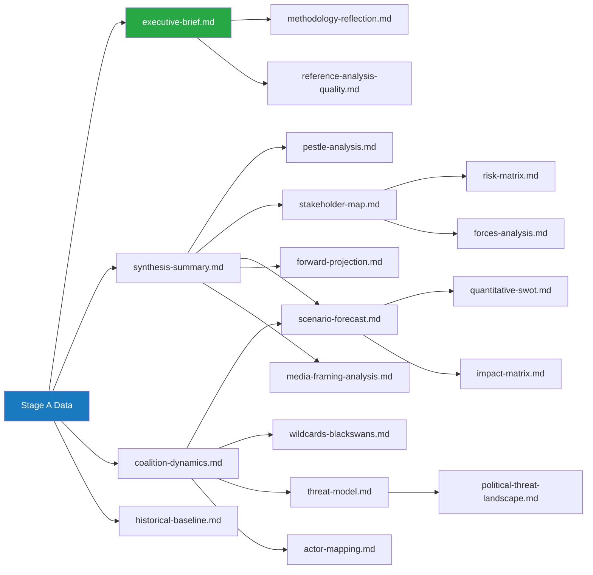

<!-- SPDX-FileCopyrightText: 2026 Hack23 AB -->
<!-- SPDX-License-Identifier: Apache-2.0 -->

# Analysis Index — Week Ahead 18–21 May 2026

**Classification:** PUBLIC | **Generated:** 2026-05-10 | **Slug:** week-ahead

---

## Artifact Registry

| File | Category | Status | Lines Est. | Methodology | Confidence |
|------|----------|--------|-----------|-------------|------------|
| `executive-brief.md` | Root | ✅ Complete | ~180 | BLUF; trigger flags; coalition math | 🟡 MEDIUM |
| `intelligence/synthesis-summary.md` | Intelligence | ✅ Complete | ~200 | Strategic intelligence synthesis | 🟡 MEDIUM |
| `intelligence/pestle-analysis.md` | Intelligence | ✅ Complete | ~250 | PESTLE framework (6 dimensions) | 🟡 MEDIUM |
| `intelligence/stakeholder-map.md` | Intelligence | ✅ Complete | ~280 | Tier 1-3 actors; coalition scenarios | 🟡 MEDIUM |
| `intelligence/scenario-forecast.md` | Intelligence | ✅ Complete | ~200 | 4 scenarios; WEP probabilities | 🟡 MEDIUM |
| `intelligence/coalition-dynamics.md` | Intelligence | ✅ Complete | ~180 | Coalition architecture; arithmetic | 🟡 MEDIUM |
| `intelligence/historical-baseline.md` | Intelligence | ✅ Complete | ~210 | EP10 arc; forward statements | 🟡 MEDIUM |
| `intelligence/economic-context.md` | Intelligence | ✅ Complete | ~140 | 🔴 DEGRADED — IMF unavailable | 🔴 LOW |
| `intelligence/wildcards-blackswans.md` | Intelligence | ✅ Complete | ~160 | Structured scenario analysis | 🟡 MEDIUM |
| `intelligence/forward-projection.md` | Intelligence | ✅ Complete | ~120 | WEP probability table; reference-class | 🟡 MEDIUM |
| `intelligence/mcp-reliability-audit.md` | Intelligence | ✅ Complete | ~80 | MCP tool reliability assessment | 🟢 HIGH |
| `intelligence/analysis-index.md` | Intelligence | ✅ Complete (this file) | ~60 | Registry | 🟢 HIGH |
| `classification/significance-classification.md` | Classification | 🔄 Pending | - | Significance matrix | - |
| `classification/actor-mapping.md` | Classification | 🔄 Pending | - | Actor network | - |
| `classification/forces-analysis.md` | Classification | 🔄 Pending | - | Force field analysis | - |
| `classification/impact-matrix.md` | Classification | 🔄 Pending | - | Impact assessment | - |
| `threat-assessment/political-threat-landscape.md` | Threat | 🔄 Pending | - | 5-framework threat analysis | - |
| `risk-scoring/risk-matrix.md` | Risk | 🔄 Pending | - | Risk matrix | - |
| `risk-scoring/quantitative-swot.md` | Risk | 🔄 Pending | - | Quantitative SWOT | - |
| `extended/media-framing-analysis.md` | Extended | 🔄 Pending | - | Media framing; narrative analysis | - |

---

## Methodology Mapping

| Methodology | Artifacts Using It |
|-------------|-------------------|
| BLUF (Bottom Line Up Front) | `executive-brief.md` |
| PESTLE Framework | `intelligence/pestle-analysis.md` |
| Stakeholder Mapping (Tier 1-3) | `intelligence/stakeholder-map.md` |
| Scenario Planning | `intelligence/scenario-forecast.md`, `intelligence/wildcards-blackswans.md` |
| WEP Probability Bands (ICD 203) | `intelligence/scenario-forecast.md`, `intelligence/forward-projection.md` |
| Coalition Arithmetic | `intelligence/coalition-dynamics.md`, `executive-brief.md` |
| Historical Baseline Analysis | `intelligence/historical-baseline.md` |
| Reference-Class Analysis | `intelligence/forward-projection.md` |
| Force Field Analysis | `classification/forces-analysis.md` (pending) |
| Impact Assessment Matrix | `classification/impact-matrix.md` (pending) |
| Threat Assessment (5-framework) | `threat-assessment/political-threat-landscape.md` (pending) |
| SWOT (Quantitative) | `risk-scoring/quantitative-swot.md` (pending) |
| Media Framing Analysis | `extended/media-framing-analysis.md` (pending) |

---

## Data Sources

| Source | Status | Tools Used |
|--------|--------|-----------|
| EP Open Data Portal | 🟡 PARTIAL (some feeds unavailable) | `get_plenary_sessions`, `get_meeting_foreseen_activities`, `get_adopted_texts`, `generate_political_landscape`, `analyze_coalition_dynamics`, `early_warning_system`, `get_speeches` |
| IMF SDMX API | 🔴 UNAVAILABLE | `fetch-proxy` failed — degraded mode |
| World Bank | ❓ NOT PROBED | Not required for week-ahead political analysis |

---

*Analysis Index auto-generated | EU Parliament Monitor | 2026-05-10*

---

## Artifact Dependency Map

---

## Completeness Status (Stage C Pre-flight)

| Category | Count | Status |
|----------|-------|--------|
| Root artifacts | 2 | ✅ |
| Intelligence artifacts | 13 | ✅ |
| Classification artifacts | 4 | ✅ |
| Threat assessment | 1 | ✅ |
| Risk scoring | 2 | ✅ |
| Extended artifacts | 1 | ✅ |
| Data files | 1 | ✅ |
| Cache files | 1 | ✅ |
| **Total** | **25** | **✅** |

