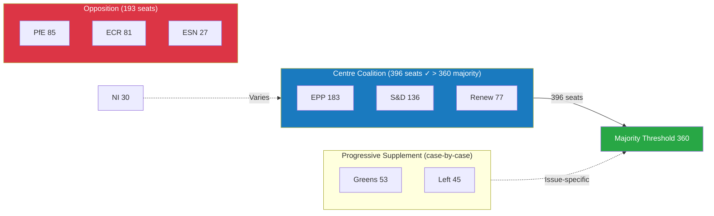

<!-- SPDX-FileCopyrightText: 2026 Hack23 AB -->
<!-- SPDX-License-Identifier: Apache-2.0 -->

# Intelligence: Coalition Dynamics — Week Ahead 18–21 May 2026

**Classification:** PUBLIC | **Confidence:** 🟡 Medium | **Generated:** 2026-05-10

---

## Coalition Landscape Overview

The European Parliament's May 2026 session occurs in an environment of **structured fragmentation**: nine political groups, no single group near majority, and a governing centre coalition that is arithmetically functional but ideologically contested. The Effective Number of Parties (6.58) is among the highest recorded in EP history, reflecting the ongoing fragmentation of European centre-right and centre-left party families.

---

## Current Coalition Architecture

### The Governing Centre Coalition: EPP + S&D + Renew

| Component | Seats | % |
|-----------|-------|---|
| EPP | 183 | 25.5% |
| S&D | 136 | 19.0% |
| Renew | 77 | 10.7% |
| **Total** | **396** | **55.2%** |
| Majority threshold | 360 | 50.2% |
| **Buffer** | **+36** | **+5%** |

**Analysis:** This coalition holds a working majority with a 36-seat buffer. However, this buffer is unevenly distributed — it requires all three groups to hold together. If any significant subset of EPP defects to a right-wing position, or S&D defects to a progressive-only position, the coalition loses its majority.

**Historical context:** The EPP-S&D-Renew "grand coalition" pattern emerged in EP9 (2019-2024) and has been reinforced in EP10 as the only reliable legislative majority formation. However, the EPP's right-wing competition from PfE and ECR creates continuous pressure to shift rightward on select dossiers.

---

## Opposition and Alternative Coalitions

### Populist Right Bloc: PfE + ECR

| Component | Seats | % |
|-----------|-------|---|
| PfE | 85 | 11.9% |
| ECR | 81 | 11.3% |
| **Total** | **166** | **23.2%** |

**Strategic assessment:** Cannot block or pass legislation alone. Functions primarily as a **pressure and narrative bloc** rather than a legislative majority formation. Key capabilities:
- Force roll-call votes to expose coalition discipline
- Submit amendments that pull EPP rightward on select dossiers
- Create domestic political pressure in EPP-adjacent national parties
- Occasional tactical alignment with EPP on deregulation or security items

**Internal divergence:** PfE and ECR are NOT monolithic. ECR (Poland-led) is strongly pro-Ukraine; PfE (Hungary/Italy-adjacent) is more ambiguous. This divergence limits joint legislative strategies on external affairs.

---

### Progressive Left Bloc: Greens/EFA + The Left

| Component | Seats | % |
|-----------|-------|---|
| Greens/EFA | 53 | 7.4% |
| The Left | 45 | 6.3% |
| **Total** | **98** | **13.7%** |

**Strategic assessment:** Too small to govern alone, but functions as an **agenda-conditioning bloc** on progressive dossiers. When joined by S&D (136), the progressive coalition reaches 234 seats — not a majority, but a significant blocking minority that can force EPP concessions if Renew is unwilling to provide EPP its needed majority from the right.

**Key leverage mechanism:** S&D can credibly threaten to vote with Greens and The Left against an EPP position if EPP does not accept S&D amendment demands. This three-way tension (EPP ↔ S&D ↔ Greens/Left) defines the negotiating space for most contested legislation.

---

## Coalition Pair Dynamics

Based on structural analysis (group size similarity as proxy for potential alignment; vote-level cohesion data unavailable):

### High-Proximity Pairs (size-similarity > 0.85)

| Pair | Size Similarity | Strategic Assessment |
|------|----------------|---------------------|
| Renew ↔ ECR | 0.95 | Ideologically divergent; size-similar; potential on specific deregulation or sovereignty dossiers |
| ECR ↔ PfE | 0.95 | Natural bloc; see above (Ukraine divergence limits scope) |
| Renew ↔ PfE | 0.91 | Very unlikely coalition; size similarity is coincidental |
| ESN ↔ NI | 0.90 | Tactical alignment on far-right fringe; minimal legislative impact |
| Greens/EFA ↔ The Left | 0.85 | Ideologically coherent; natural left progressive bloc |

### Governing Coalition Pairs

| Pair | Size Similarity | Strategic Significance |
|------|----------------|----------------------|
| EPP ↔ S&D | 0.74 | **Core coalition axis** — the EP's fundamental governing axis since EP7 (2009-2014) |
| S&D ↔ Renew | 0.57 | **Centre-left liberal axis** — decisive swing formation |
| EPP ↔ Renew | 0.42 | **Centre-right liberal axis** — economic legislation backbone |

---

## Fragmentation Index Assessment

**Parliamentary Fragmentation Index: HIGH**

The Effective Number of Parties (ENP) of 6.58 indicates that the EP behaves as if it had 6-7 equally sized parties, despite having only 2 very large groups (EPP, S&D) and 7 smaller ones. This creates:

1. **Negotiation complexity:** Every major vote requires active coalition management across multiple group consultations
2. **Amendment inflation:** More groups = more amendment proposals = longer procedural timelines
3. **Coalition drift:** Groups shift alignments issue-by-issue, making legislative outcomes harder to predict
4. **Accountability diffusion:** Voters struggle to hold specific groups accountable when coalitions are fluid

**Historical comparison:**
- EP7 (2009-2014): ENP ~4.8 — more stable two-bloc dynamic
- EP8 (2014-2019): ENP ~5.6 — fragmentation begins with far-right entry
- EP9 (2019-2024): ENP ~6.2 — COVID-era temporary solidarity
- EP10 (2024-present): ENP ~6.58 — peak fragmentation

---

## Coalition Mathematics for Wednesday 20 May (Critical Vote Day)

**9 votes scheduled — scenario analysis for majority formation:**

### Vote Type A: Technical/Administrative (expected majority)
- EPP+S&D+Renew: 396 ✅ Comfortable majority
- Pattern: Near-unanimous adoption with PfE/ECR potentially abstaining or in opposition on principle
- Expected: 400-450 FOR, 150-200 AGAINST

### Vote Type B: Contested Legislative Report
- Coalition at risk if EPP right-flank (estimated 15-25 MEPs) defects
- Effective coalition: ~371-381 ← still above 360 if defection limited
- Risk: If S&D also conditions support on amendments, effective coalition may drop to 340-360 range

### Vote Type C: External Affairs Resolution (Ukraine-type)
- Potential super-majority: EPP+S&D+Renew+Greens+ECR (on Ukraine) = 449+81 = 530
- High probability of near-consensus adoption on strong Ukraine/rule-of-law resolutions
- ECR exception (pro-Ukraine) makes external affairs resolutions more broadly supported than domestic legislation

---

## Wildcards and Uncertainty Factors

### Wildcard 1: Surprise Urgency Motion
Any of the three scheduled Friday urgency debate slots (if applicable) could disrupt the coalition calculus by forcing a snap position on an issue where coalition pre-negotiation has not occurred.

### Wildcard 2: National Electoral Calendar Impact
European political party dynamics are affected by approaching national elections in EU member states. MEPs from parties in pre-election phase may take more extreme positions for domestic signalling purposes.

### Wildcard 3: Commission-Parliament Friction
If the Commission makes a significant announcement that contradicts EP positions (e.g., DMA enforcement delay, budget revision), EP could respond with a unified critical resolution that reshapes the week's coalition mathematics.

---

## Intelligence Assessment: Coalition Stability for May Session

**Stability assessment:** 🟢 MODERATE-HIGH (Probability 75%)

The governing coalition is expected to hold on most legislation. However, at least one contested vote — likely on Wednesday — will produce a narrower margin than typical, revealing coalition fault-lines without collapsing the majority.

**Confidence:** 🟡 MEDIUM — Coalition analysis based on structural composition; voting cohesion data unavailable from EP API (degraded to size-similarity proxy).

---

*Sources: EP Open Data Portal political landscape data | Coalition analysis: CIA Coalition Analysis methodology | Fragmentation: Effective Number of Parties (Laakso-Taagepera index) | 2026-05-10*

---

## Coalition Architecture Diagram

