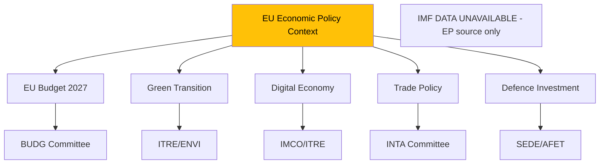

<!-- SPDX-FileCopyrightText: 2026 Hack23 AB -->
<!-- SPDX-License-Identifier: Apache-2.0 -->

# Intelligence: Economic Context — Week Ahead 18–21 May 2026

**Classification:** PUBLIC | **Confidence:** 🔴 Low (Degraded Mode) | **Generated:** 2026-05-10

---

## ⚠️ Data Freshness Warning

**IMF DATA UNAVAILABLE — DEGRADED MODE**

The IMF fetch-proxy MCP server was unavailable during this run (McpError -1: fetch failed). This means:

- **No IMF SDMX 3.0 indicators can be cited for this report** (GDP growth, inflation, deficit ratios, trade balances, etc.)
- Economic context is limited to structural/qualitative observations derived from EP adopted texts and institutional data
- Any claim normally backed by IMF World Economic Outlook or IMF DataMapper must be withheld
- The 🔴 LOW confidence rating applies to this entire section

IMF probe-summary.json documents this unavailability for audit purposes.

---

## Qualitative Economic Context (EP-Source Data Only)

### EU Budget and Fiscal Framework

The most significant economic signal available from EP data is the adoption on 28 April 2026 of the **2027 Budget Guidelines** (TA-10-2026-0112 — "Guidelines for the 2027 budget - Section III"). This is the Parliament's first formal position on EU spending priorities for 2027, operating within the 2021-2027 MFF (Multiannual Financial Framework).

**Key budget context:**
- The 2027 budget is the **final year of the current MFF** — creating year-end political dynamics around commitment/payment appropriation balance
- EP budget guidelines set the negotiating position for Council-Parliament dialogue through spring/summer 2026
- The guidelines reflect competing pressures: EPP fiscal discipline, S&D social investment, Greens climate financing, Renew innovation priorities
- Defence and security spending requests from ECR/PfE create additional pressure on a constrained budget envelope

**Assessment:** Budget process in May 2026 moves from guidelines phase to BUDG committee scrutiny and first trilogue contacts. No direct vote expected in May on the 2027 budget appropriations; committee-level work dominates.

---

### EU Investment and Lending Institutions

**EIB Financial Activities Report 2024** (TA-10-2026-0119, April 28): The Parliament's scrutiny of EIB lending activities in 2024 provides a proxy for EU investment policy priorities. Key known EIB 2024 priorities:
- Green transition lending (renewable energy, sustainable transport)
- SME support across EU member states
- Cohesion policy implementation in EU10+
- Ukraine reconstruction support (separate EIB Ukraine Support Fund)

**European Fund for Strategic Investments (InvestEU):** The EP maintains scrutiny of InvestEU performance through BUDG and ECON committees. No specific May 2026 vote expected on InvestEU, but monitoring ongoing.

---

### Trade and Economic Instruments

**US Tariff Adjustment (March 2026):** The adoption of tariff quota adjustments for US imports (TA-10-2026-0096) resolved a specific trade tension. The broader US-EU trade relationship remains under monitoring:
- EU's proportional trade response capability demonstrated
- INTA committee maintaining oversight of US trade policy developments
- No new trade emergency signals visible in May 2026 EP agenda

**EU-Mercosur Trade Agreement:** The CJEU opinion request (January 2026) on EU-Mercosur compatibility remains pending. If the CJEU determines the Agreement requires unanimity, it significantly raises the political threshold for ratification. Economic implications are substantial — Mercosur (Brazil, Argentina, Uruguay, Paraguay) represents a major agricultural market for both blocs, with sensitive implications for EU farmers.

---

### Labour Market and Adjustment Instruments

**European Globalisation Adjustment Fund (EGF):** The Tupperware Belgium case (March 2026) demonstrates active use of EGF mechanisms. The EGF provides support to workers affected by major structural changes resulting from globalisation. Activation indicates:
- Labour market disruption from global trade dynamics is politically visible
- S&D and The Left maintain successful pressure to fund EGF interventions
- Precedent for future EGF activations in other sectors (automotive transformation, e.g.)

---

### Key Economic Dossiers in Pipeline (May 2026 and Beyond)

| Dossier | Status | Economic Relevance | Committee |
|---------|--------|-------------------|-----------|
| 2027 Budget (Section III guidelines) | Guidelines adopted; now negotiations | MFF end-year; spending priorities | BUDG |
| EIB oversight | Annual report adopted | EU investment capacity | ECON/BUDG |
| AI Act implementation | Rolling enforcement | Innovation/competitiveness | ITRE/IMCO |
| DMA enforcement | Resolution adopted; Commission response pending | Digital market competition | IMCO |
| EU-Mercosur | CJEU proceedings | Agricultural trade, EU exports | INTA |
| Ukraine loan mechanism | Operational | Reconstruction, FX/financial flows | BUDG/AFET |
| EGF activations | Ongoing | Labour market resilience | EMPL |

---

## Economic Risk Indicators (Qualitative)

Without IMF data, qualitative risk indicators are drawn from EP institutional signals:

| Risk Area | Signal | Direction | Confidence |
|-----------|--------|-----------|------------|
| Fiscal space (2027 budget) | Guidelines adopted | Constrainted | 🔴 LOW (no IMF) |
| Investment (EIB) | Stable, green-focused | Positive | 🟡 MEDIUM |
| Trade (US/EU) | Stabilised after March adjustment | Stable | 🟡 MEDIUM |
| Trade (Mercosur) | Legal uncertainty pending | Uncertain | 🟡 MEDIUM |
| Labour market | EGF activation (sectoral stress) | Mixed | 🟡 MEDIUM |
| Digital economy | DMA enforcement (pro-competition) | Positive long-term | 🟡 MEDIUM |

---

## Limitation Statement

This economic context section operates entirely in **IMF-unavailable degraded mode**. The following information cannot be provided for this run and must not be inferred from agent knowledge:

- EU GDP growth rate (actual or forecast)
- EU/Eurozone inflation rate
- Member state deficit/surplus ratios
- Trade balance figures
- Exchange rate dynamics
- Interest rate and monetary policy indicators

Any economic analysis from this run that requires IMF-sourced macro data is explicitly marked 🔴 UNAVAILABLE.

---

*Data freshness: 🔴 DEGRADED — IMF unavailable | EP data: European Parliament Open Data Portal | Generated: 2026-05-10*

## Economic Policy Diagram (EP Lens)

**Note:** This diagram reflects the EP institutional lens on economic policy in the absence of IMF macroeconomic data. The 🔴 DEGRADED MODE declaration remains in effect for this run.

