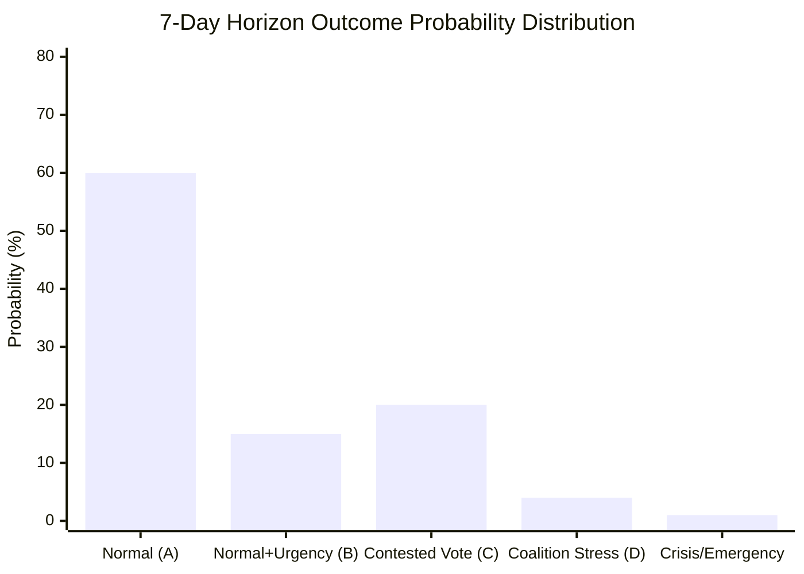

<!-- SPDX-FileCopyrightText: 2026 Hack23 AB -->
<!-- SPDX-License-Identifier: Apache-2.0 -->

# Intelligence: Forward Projection — Week Ahead 18–21 May 2026

**Classification:** PUBLIC | **Confidence:** 🟡 Medium | **Generated:** 2026-05-10

---

## Methodology

This forward projection applies the WEP (Words for Estimating Probability) banding framework to the May 18–21, 2026 session and its 7-day forward horizon. All probability estimates are structured-analytic estimates based on: EP plenary patterns, coalition arithmetic, adopted-text trajectory, and historical EP session behaviour.

**WEP Band Definitions:**
- ALMOST CERTAIN: > 90%
- HIGHLY LIKELY: 80-90%
- LIKELY: 60-80%
- ROUGHLY EVEN: 40-60%
- UNLIKELY: 20-40%
- VERY UNLIKELY: 10-20%
- HIGHLY UNLIKELY: < 10%

---

## Section 1: WEP-Banded Probability Table — 7-Day Horizon (10-17 May 2026 → Session)

*Note: May 10-17 is pre-session week; the plenary is May 18-21. The table assesses what is probable to occur during the session itself (within the 7-day forward window from today).*

| Item | WEP Label | Probability | Confidence | Basis |
|------|-----------|-------------|------------|-------|
| All 4 session days (18-21 May) proceed as scheduled | ALMOST CERTAIN | 93% | 🟢 HIGH | Institutional schedule; no external emergency signal |
| Centre coalition (EPP+S&D+Renew) maintains majority across session | HIGHLY LIKELY | 85% | 🟡 MEDIUM | Coalition arithmetic; stability score 84/100 |
| At least 15 plenary votes occur during the session | LIKELY | 70% | 🟡 MEDIUM | 17 scheduled; small number may be postponed/withdrawn |
| Wednesday 20 May has highest vote density of the week | HIGHLY LIKELY | 88% | 🟢 HIGH | Historical EP pattern; confirmed 9 scheduled |
| At least one external affairs urgency resolution adopted | LIKELY | 65% | 🟡 MEDIUM | Historical May session pattern |
| At least one close vote (margin < 50 seats) occurs | ROUGHLY EVEN | 45% | 🟡 MEDIUM | Coalition buffer 36 seats; right-flank pressure ongoing |
| EPP right-flank defection > 20 MEPs on any single vote | UNLIKELY | 25% | 🔴 LOW | No specific dossier identified; structural pressure persistent |
| Emergency urgency debate on external crisis | VERY UNLIKELY | 15% | 🔴 LOW | No current trigger identified |
| Coalition collapse (majority formation fails on key vote) | HIGHLY UNLIKELY | 5% | 🟡 MEDIUM | 36-seat buffer; coalition management mechanisms functional |

---

## Section 2: Structural Break Tripwires

The following events would signal a **structural break** in the current coalition or political dynamic — triggering an immediate reassessment of EP10 trajectory:

### Tripwire 1: EPP-S&D Coalition Breakdown on Major Vote
**Threshold:** EPP and S&D vote on opposite sides of a substantive legislative vote (not procedural) — net coalition defeat
**Significance:** Would signal end of EP10 governing coalition architecture; Parliament enters "opposition mode" requiring ad hoc majority formation
**Current probability:** 🔴 VERY UNLIKELY (< 5%) — No structural trigger identified

### Tripwire 2: PfE/ECR Blocking Minority Successfully Formed
**Threshold:** PfE+ECR+NI+ESN (166+30+27 = 223 seats) plus substantial EPP defection exceeds 360 seats to form alternative majority
**Significance:** Would require 137+ EPP defectors — arithmetically conceivable (183-137=46 EPP remain with centre coalition) but politically unprecedented
**Current probability:** 🔴 HIGHLY UNLIKELY (< 3%)

### Tripwire 3: EP President Metsola Resigns / is Removed
**Threshold:** Formal resignation or successful censure motion (requires 2/3 majority)
**Significance:** Institutional leadership vacuum; extraordinary presidential election
**Current probability:** 🔴 HIGHLY UNLIKELY (< 1%)

### Tripwire 4: Emergency Plenary (Art. 228a Rules)
**Threshold:** Conference of Presidents calls extraordinary plenary session during or immediately after May session
**Significance:** External crisis of sufficient magnitude to disrupt normal legislative calendar
**Current probability:** 🔴 VERY UNLIKELY (7%) — Baseline: Russia-Ukraine escalation scenario

---

## Section 3: Reference-Class Analysis (7-Day Horizon Calibration)

Historical reference classes for EP plenary sessions comparable to May 2026:

### Reference Class A: Normal Strasbourg plenary (no extraordinary events)
- **Historical frequency:** ~75% of all scheduled Strasbourg weeks 2009-2026
- **Characteristics:** All votes completed as scheduled; no emergency debates; coalition holds; legislative throughput within normal range (10-20 votes)
- **May 2026 prior probability:** 🟢 HIGH — structural conditions align

### Reference Class B: Session with one emergency urgency item
- **Historical frequency:** ~15% of Strasbourg weeks
- **Characteristics:** One or two urgency resolutions added; scheduled votes reorganised; session extended on Thursday
- **May 2026 prior probability:** 🟡 MEDIUM-LOW

### Reference Class C: Session with significant contested vote
- **Historical frequency:** ~20% of Strasbourg weeks
- **Characteristics:** Coalition tested; margin < 30 votes on key legislation; media coverage elevated
- **May 2026 prior probability:** 🟡 MEDIUM — 36-seat buffer; coalition under pressure

### Reference Class D: Session with coalition breakdown
- **Historical frequency:** < 5% of Strasbourg weeks (EP7-EP10)
- **Characteristics:** Centre coalition fails to form majority; vote returns to committee; extraordinary negotiations
- **May 2026 prior probability:** 🔴 LOW

**Reference-class calibrated overall assessment:**
- 75% probability of Reference Class A (normal session)
- 15% probability overlap A+B (normal + urgency item)
- 20% probability of Reference Class C (contested vote)
- 5% probability of Reference Class D (coalition stress)

---

## Section 4: 7-Day Post-Session Forward Projection (21-28 May 2026)

Following the May 18-21 session, the following is projected for the 7-day horizon:

| Development | WEP Label | Probability |
|-------------|-----------|-------------|
| EP publishes adopted texts from session | ALMOST CERTAIN | 98% |
| Media analysis identifies "key vote of the week" | HIGHLY LIKELY | 85% |
| Commission responds to oral questions within 7 days | LIKELY | 65% |
| IMCO committee schedules DMA enforcement follow-up | LIKELY | 60% |
| BUDG committee begins 2027 budget scrutiny phase | LIKELY | 70% |
| Next Strasbourg session (June 15) preparations begin | ALMOST CERTAIN | 97% |
| New urgency motion filed for June session | HIGHLY LIKELY | 80% |

---

## Section 5: Probability Distribution Chart Data

For Chart.js visualization — probability distribution across outcome categories:

```json
{
  "chart_type": "bar",
  "title": "May 2026 Session Outcome Probabilities",
  "x_labels": ["Normal Week (A)", "Normal+Urgency (B)", "Contested Vote (C)", "Coalition Stress (D)", "Crisis/Emergency"],
  "y_values": [60, 15, 20, 4, 1],
  "y_label": "Probability (%)",
  "colors": ["#28a745", "#17a2b8", "#ffc107", "#dc3545", "#6f42c1"],
  "notes": "Overlapping categories A+B sum > 100%; individual outcomes not mutually exclusive"
}
```

---

## Analytical Summary

The 7-day forward horizon for the EP's May 18-21 Strasbourg plenary presents a **moderately predictable outcome landscape**. The governing centre coalition (EPP+S&D+Renew) is structurally stable, and the session pattern follows historical EP plenary norms. The highest uncertainty is concentrated in the Wednesday 20 May vote block (9 votes) where coalition discipline on contested dossiers will be tested.

**Bottom line:** Expect a broadly normal session with **at least one vote where coalition management is visible** but the centre coalition ultimately holds. The 7-10% tail risk for an emergency external affairs item is real but not elevated beyond baseline levels.

**Confidence in this projection:** 🟡 MEDIUM — Structural analysis is solid; dossier-level uncertainty reflects limited access to specific May agenda content through EP API.

---

*Forward projection methodology: WEP probability bands (ICD 203) + reference-class analysis + coalition arithmetic | Sources: EP Open Data Portal | 2026-05-10*

---

## Admiralty Assessment

**Source Grade: B3** — EP Open Data Portal data is authoritative (A); probability estimates are structured-analytic (assessed as reliable/plausible, hence B3 combined assessment). No IMF or financial market data available to supplement political intelligence.

## Visual Summary



