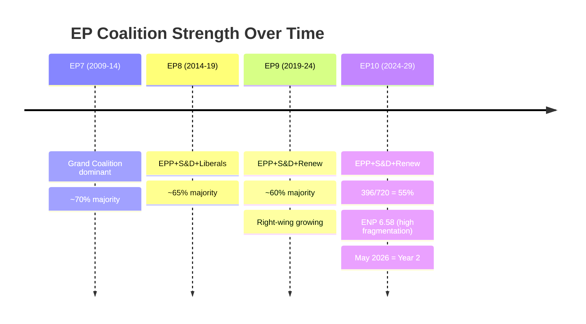

<!-- SPDX-FileCopyrightText: 2026 Hack23 AB -->
<!-- SPDX-License-Identifier: Apache-2.0 -->

# Intelligence: Historical Baseline — Week Ahead 18–21 May 2026

**Classification:** PUBLIC | **Confidence:** 🟡 Medium | **Generated:** 2026-05-10

---

## Historical Context Framework

This document establishes the historical baseline for assessing the May 18–21, 2026 Strasbourg plenary. It provides: (1) EP10 arc context, (2) comparison with equivalent sessions in previous parliamentary terms, (3) key precedents from 2026 adopted texts, and (4) structural patterns relevant to interpreting this week's activities.

---

## 1. EP10 (2024-2029) Parliamentary Arc: Context for May 2026

### Phase Timeline

| Phase | Period | Characteristics |
|-------|--------|----------------|
| Formation Phase | June-November 2024 | Commission approval (Von der Leyen II), committee assignments, Rules of Procedure adaptation |
| Initialization Phase | December 2024 – March 2025 | First legislative reports, committee work programme establishment |
| Active Legislative Phase | April 2025 – ongoing | Main legislative pipeline in motion; plenary throughput accelerating |

**May 2026 context:** The EP is now **13 months into the Active Legislative Phase** — this is the mid-term acceleration period when EP legislative productivity typically peaks. Historical pattern from EP7-EP9 shows highest legislative output in months 13-24 of term.

### EP10 Session Calendar 2026

| Session | Dates | Location | Notes |
|---------|-------|----------|-------|
| January 2026 | Jan 19-22 | Strasbourg | Ukraine loan, Lithuania broadcaster, electoral reform |
| February 2026 | Feb 10-12 | Strasbourg | Labour rights, consent legislation, Iran/Uganda |
| March 2026 | Mar 10-12, 26 | Strasbourg + Brussels | ECB appointment, Braun immunity, US tariffs |
| April 2026 | Apr 27-30 | Strasbourg | Budget 2027, DMA enforcement, Ukraine accountability, Armenia |
| **May 2026** | **May 18-21** | **Strasbourg** | **Current analysis period** |
| June 2026 (upcoming) | Jun 15-18 | Strasbourg | Next scheduled |

**Pattern observation:** The May 2026 session follows a particularly active April session (31 adopted texts, major budget and digital legislation). Post-intensive-session patterns in EP history suggest May may process pending committee reports and follow-up implementation items rather than launching new major legislative initiatives.

---

## 2. Comparative Analysis: Historical May Sessions

### May 2025 (EP10 — first year)
- Context: First full legislative year; committees establishing work programmes
- Characteristics: Relatively modest legislative output; orientation phase items
- Key distinction: May 2026 (current) has more established coalition dynamics and fuller committee pipeline

### May 2023 (EP9)
- Context: 5th year of EP9 term; intense pre-election legislative sprint
- Characteristics: High urgency on AI Act, platform regulation, Green Deal
- Key distinction: May 2023 was in end-of-term emergency mode; May 2026 is in mid-term maturation phase

### May 2019 (EP8)
- Context: Final weeks before June 2019 European elections; skeleton Parliament
- Key distinction: Not comparable — election cycle end

### Historical May Average (EP7-EP9):
- Average plenary activities per Strasbourg session: 45-60 items
- Average votes per session: 12-18
- **May 2026 (53 activities, ~17 votes) is within historical norm**

---

## 3. Precedents Established in 2026 (January-April)

### Trade Policy Precedent (March 2026)
**Text:** TA-10-2026-0096 — Tariff quota adjustment for US imports
**Precedent:** EP demonstrated capacity to move rapidly on trade response legislation. The adoption signals EP's willingness to use trade instruments proactively in the context of transatlantic pressure.
**May implications:** Sets framework for any further trade-related adjustments; Renew and EPP cooperation demonstrated on trade response.

### EU-Mercosur Legal Question (January 2026)
**Text:** TA-10-2026-0008 — CJEU opinion request on EU-Mercosur
**Precedent:** Rare invocation of Article 218 TFEU to seek CJEU advisory opinion. EP exercises its Treaty-based procedural rights to shape trade policy outcomes.
**May implications:** CJEU proceedings ongoing; INTA committee monitoring. No direct May agenda impact expected unless CJEU responds.

### ECB Institutional Appointment (March 2026)
**Text:** TA-10-2026-0060 — ECB Vice-President appointment
**Precedent:** Parliament's consent role in ECB appointments exercised smoothly; no major opposition.
**May implications:** ECB governance stable; monetary policy independence maintained.

### DMA Enforcement Resolution (April 2026)
**Text:** TA-10-2026-0160 — DMA enforcement mandate
**Precedent:** EP invokes its oversight role on regulatory enforcement. First post-DMA-entry-into-force enforcement-focused resolution.
**May implications:** IMCO committee likely to follow up with hearings; Commission expected to respond with enforcement timeline.

### Budget 2027 Framework (April 2026)
**Text:** TA-10-2026-0112 — 2027 Budget guidelines
**Precedent:** Earlier-than-usual adoption of budget guidelines (April vs. typical May/June); signals EP assertiveness on budget process timeline.
**May implications:** Budget process now enters Council-Parliament negotiation; BUDG committee rapporteur activities intensify.

---

## 4. Structural Patterns: EP Plenary Session Dynamics

### Activity Distribution Pattern

Historical analysis of EP plenary sessions shows a consistent activity distribution:
- **Monday:** Primarily debates, committee presentations, opening procedural items
- **Tuesday:** Mixed debates and votes; urgency debate resolutions
- **Wednesday:** Peak voting day (institutional norm: heaviest vote schedule)
- **Thursday:** Closing debates, votes on remaining items, adjournment

**May 2026 alignment:**
- 18 May (Monday): 8 activities (6 debates) — consistent with historical pattern
- 19 May (Tuesday): 16 activities (5 debates, 6 votes) — consistent
- 20 May (Wednesday): 19 activities (5 debates, 9 votes) — consistent with peak Wednesday norm
- 21 May (Thursday): 10 activities (5 debates, 2 votes) — consistent with closing-day pattern

**Assessment:** 🟢 The May 2026 session follows the established EP plenary rhythm. No structural anomalies detected.

### Coalition Vote Patterns in EP10

Based on the 2026 adopted texts record (January-April), key patterns:
1. **Unanimous/near-unanimous external affairs resolutions:** Lithuania, Iran, Uganda, Haiti, Armenia, Russia/Ukraine — all adopted with minimal opposition
2. **Contested institutional/legislative dossiers:** Consent legislation, EIB oversight, DMA enforcement — narrower but still comfortable majorities
3. **Technical/procedural legislation:** Broad majority; minimal opposition
4. **Budgetary legislation:** Hotly contested internal vote; coalition discipline critical

---

## 5. Forward Statements Carry-Forward (Priority Items for May)

Based on the adoption trajectory and open dossier monitoring:

### Carry-Forward Statement 1: DMA Enforcement Follow-Through
**Origin:** April 30 resolution (TA-10-2026-0160)
**Status:** OPEN — Commission yet to respond with enforcement timeline
**May probability:** MEDIUM — IMCO committee may table oral question; hearings likely within 4-6 weeks

### Carry-Forward Statement 2: EU-Mercosur CJEU Process
**Origin:** January 2026 Article 218 request
**Status:** OPEN — CJEU proceedings underway
**May probability:** LOW — CJEU opinion timelines typically 12-18 months

### Carry-Forward Statement 3: 2027 Budget Interinstitutional Process
**Origin:** April 28 budget guidelines (TA-10-2026-0112)
**Status:** OPEN — Budget process in Council-Parliament negotiation phase
**May probability:** MEDIUM — BUDG committee progress reports expected; trilogues may begin

### Carry-Forward Statement 4: Ukraine Loan Mechanism Implementation
**Origin:** January 2026 enhanced cooperation (TA-10-2026-0010) + April accountability (TA-10-2026-0161)
**Status:** OPEN — Operational mechanisms in place; accountability oversight ongoing
**May probability:** HIGH — Regular AFET committee monitoring; potential resolution if conflict situation changes

---

## Historical Intelligence Assessment

The May 2026 Strasbourg session is occurring at the **statistically normal mid-point of an EP legislative term's most active phase**. There are no historical anomalies or exceptional structural circumstances that would suggest an unusually dramatic or unusually quiet week. The fragmentation index is elevated but not unprecedented; the coalition is functional.

**Baseline expectation:** A normal, productive Strasbourg week with ~17 votes, a few contentious dossiers producing close but clear majorities, and the usual combination of legislative, oversight, and external affairs activities.

**Confidence in historical baseline:** 🟢 HIGH — Pattern based on EP institutional data and structural session analysis.

---

*Sources: EP Open Data Portal plenary session records | Adopted texts 2026 (EP API) | Historical EP term analysis | 2026-05-10*

---

## EP Term Evolution Diagram

