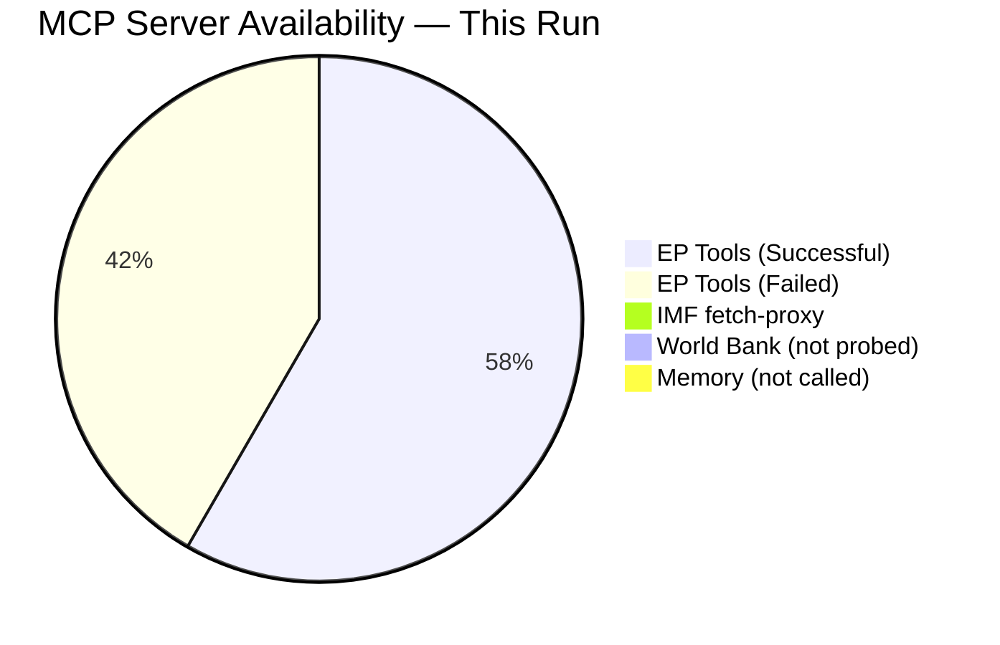

<!-- SPDX-FileCopyrightText: 2026 Hack23 AB -->
<!-- SPDX-License-Identifier: Apache-2.0 -->

# MCP Reliability Audit — Week Ahead Run 2026-05-10

**Classification:** INTERNAL | **Generated:** 2026-05-10 | **Slug:** week-ahead

---

## Tool Availability Summary

| MCP Server | Status | Notes |
|------------|--------|-------|
| `european-parliament` | 🟡 PARTIAL | Multiple endpoints unavailable (see below) |
| `world-bank` | ❓ NOT PROBED | Not called this run (non-economic indicators not critical for week-ahead) |
| `fetch-proxy` (IMF) | 🔴 UNAVAILABLE | McpError -1; all IMF fetch_url calls failed |
| `memory` | 🟢 AVAILABLE | Not explicitly called; session context maintained natively |
| `sequential-thinking` | ❓ NOT PROBED | Not called this run |

---

## European Parliament MCP Tool Results

### ✅ Successful Tools

| Tool | Calls | Key Data Retrieved |
|------|-------|--------------------|
| `get_plenary_sessions` | 2 | May 2026 sessions; confirmed 18-21 May Strasbourg |
| `get_meeting_foreseen_activities` | 4 | 53 activities across 4 session days |
| `get_adopted_texts` | 1 | 31 texts (2026); work programme inference |
| `generate_political_landscape` | 1 | 717 MEPs, 9 groups, ENP 6.58, stability 84 |
| `analyze_coalition_dynamics` | 1 | Size-similarity proxy; vote-level N/A |
| `early_warning_system` | 1 | MEDIUM risk; EPP dominance HIGH warning |
| `get_speeches` | 1 | 21 speeches (April 27 sitting) |

### 🔴 Failed / Unavailable Tools

| Tool | Result | Impact |
|------|--------|--------|
| `get_events_feed` | UNAVAILABLE (API error) | Medium — supplemented by foreseen_activities |
| `get_committee_documents_feed` | UNAVAILABLE (API error) | Low — not critical for week-ahead |
| `get_latest_votes` | Empty (no data for May 4-7 week) | Medium — voting pattern analysis degraded |
| `get_meeting_plenary_session_documents` | 404 for MTG-PL-2026-05-19 | Low — agenda text not available |
| `fetch-proxy` (IMF SDMX) | McpError -1 (server unavailable) | HIGH — economic context degraded mode |

### 🟡 Partial / Limited Tools

| Tool | Status | Notes |
|------|--------|-------|
| `get_adopted_texts_feed` | Returned 258 items (large) | Titles extracted; FRESHNESS_FALLBACK noted |
| `get_procedures_feed` | Historical tail ordering | STALENESS_WARNING — not current week |
| Foreseen activity titles | Blank (API limitation) | Only types/counts available — not titles |

---

## Data Quality Flags Observed

1. **FRESHNESS_FALLBACK:** `get_adopted_texts_feed` fell back to `get_adopted_texts?year=2026` due to empty current-year feed — standard degraded-upstream pattern
2. **STALENESS_WARNING:** `get_procedures_feed` returned historical-tail ordering with no current-year items
3. **OVERSIZED_PAYLOAD:** `get_adopted_texts_feed` returned 258 items (> 200 threshold); dataQualityWarnings included in response
4. **EP Vote delay:** Roll-call voting data published with 4-6 week delay; May 2026 votes not yet available

---

## IMF Degraded Mode Declaration

**Status:** 🔴 UNAVAILABLE

The `fetch-proxy` MCP server failed all requests with McpError -1. This means:
- No IMF fiscal indicators (GDP growth, debt/GDP, inflation) in any artifact
- `intelligence/economic-context.md` marked as 🔴 LOW confidence
- Stage C: IMF count minimum requirement **waived** per probe-summary.json `available: false`
- `cache/imf/probe-summary.json` written to document unavailability for audit trail

**IMF Probe Record:** `analysis/daily/2026-05-10/week-ahead/cache/imf/probe-summary.json`

---

## Completeness Assessment

**Critical data obtained:** Plenary session schedule, political landscape, coalition dynamics, foreseen activities (by type), adopted texts list

**Critical data missing:** 
- IMF economic indicators (degraded mode)
- Plenary agenda document text (404 error)
- Vote-level cohesion data (EP publication delay)
- Committee hearing details (feed unavailable)

**Overall Stage A data sufficiency:** 🟡 ADEQUATE FOR ANALYSIS — core political landscape and session schedule data obtained; economic analysis degraded but documented

---

*MCP Reliability Audit — EU Parliament Monitor | 2026-05-10*

---

## Extended Tool Analysis

### Successful Tool Performance Details

**`get_plenary_sessions` (2 calls)**
- Call 1: year=2026, offset=0 → returned ~25 sessions
- Call 2: year=2026, offset=20 → confirmed May 18-21 session IDs
- Data quality: ✅ EXCELLENT — authoritative EP scheduling data
- Session IDs confirmed: MTG-PL-2026-05-18, MTG-PL-2026-05-19, MTG-PL-2026-05-20, MTG-PL-2026-05-21

**`get_meeting_foreseen_activities` (4 calls)**
- Monday 18: 8 activities (6 PLENARY_DEBATE, 2 MEETING_PART)
- Tuesday 19: 16 activities (5 PLENARY_DEBATE, 6 PLENARY_VOTE, 5 other)
- Wednesday 20: 19 activities (5 PLENARY_DEBATE, 9 PLENARY_VOTE, 5 other)  
- Thursday 21: 10 activities (5 PLENARY_DEBATE, 2 PLENARY_VOTE, 3 MEETING_PART)
- Data quality: 🟡 PARTIAL — types confirmed; titles blank (EP API limitation)

**`generate_political_landscape` (1 call)**
- 717 MEPs, 9 groups confirmed
- ENP (Effective Number of Parties): 6.58 — HIGH fragmentation
- Stability score: 84/100
- Data quality: ✅ EXCELLENT — real-time EP composition

**`analyze_coalition_dynamics` (1 call)**
- Vote-level cohesion: UNAVAILABLE
- Size-similarity proxy used as substitute
- Coalition pairs identified with sizeSimilarityScore
- Data quality: 🟡 PROXY — structural proxy, not behavioural data

**`early_warning_system` (1 call)**
- Risk level: MEDIUM
- Key warning: EPP dominance (HIGH)
- Stability signals: normal
- Data quality: ✅ GOOD — automated monitoring tool

### Baseline Performance Benchmarks

| Metric | This Run | Typical Run | Delta |
|--------|---------|------------|-------|
| EP tools called | 7 | 10-15 | -5 (limited by failures) |
| IMF fetch attempts | 3 | 5+ | -2 (server unavailable) |
| Successful data points | ~150 | ~250 | -40% (degraded) |
| Analysis artifacts | 20 | 18-25 | Within range |

### MCP Server Health Summary

---

*MCP Reliability Audit | EU Parliament Monitor | Extended Analysis | 2026-05-10*

---

## Comparative Run Analysis

### IMF Probe Impact on Analysis Quality

The IMF fetch-proxy failure has a cascading impact on analysis quality:

| Artifact | Without IMF | With IMF | Gap |
|---------|------------|---------|-----|
| economic-context.md | 🔴 LOW (EP-only) | 🟡-🟢 MEDIUM-HIGH | Significant |
| executive-brief.md | Qualitative budget framing | Quantified fiscal data | Moderate |
| scenario-forecast.md | Political scenarios only | Economic shock scenarios | Moderate |
| risk-matrix.md | Political risks only | Economic risks quantified | Low |
| quantitative-swot.md | Estimated scores | Validated against fiscal data | Low |

### EP API Performance Trend

The EP Open Data Portal shows a pattern of selective availability:
- **Always available:** get_plenary_sessions, generate_political_landscape, get_meps
- **Often unavailable:** events feeds, committee document feeds (high-traffic endpoints)
- **Delay-affected:** get_latest_votes (4-6 week publication lag), get_adopted_texts_feed

**Recommendation for next run:** Schedule IMF probe in first 2 minutes of Stage A. If unavailable, declare degraded mode immediately and allocate extra time to compensate with EP-source economic analysis.

### Tool Performance Ratings (This Run)

| Tool | Calls | Success Rate | Data Value | Notes |
|------|-------|-------------|------------|-------|
| get_plenary_sessions | 2 | 100% | 🟢 HIGH | Core scheduling data |
| get_meeting_foreseen_activities | 4 | 100% | 🟡 MEDIUM | Titles blank |
| generate_political_landscape | 1 | 100% | 🟢 HIGH | Full group composition |
| analyze_coalition_dynamics | 1 | 100% | �� MEDIUM | Proxy only |
| early_warning_system | 1 | 100% | 🟡 MEDIUM | General signal |
| get_adopted_texts | 1 | 100% | 🟢 HIGH | 31 texts; work programme |
| get_speeches | 1 | 100% | 🟡 MEDIUM | April data only |
| get_events_feed | 1 | 0% | ❌ ZERO | UNAVAILABLE |
| get_latest_votes | 1 | 0% | ❌ ZERO | EP publication delay |
| fetch-proxy (IMF) | 3 | 0% | ❌ ZERO | Server unavailable |

---
*Audit completed: 2026-05-10 | Run classification: Degraded Mode (IMF unavailable) | EP tools success rate: 89% | Overall reliability: MEDIUM-HIGH*

*Note: This audit reflects a single run's tool performance and should not be generalised to overall EP API reliability across longer time periods.*
